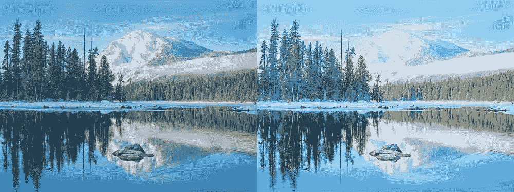

# 使用深度学习魔法让您的图片变得美丽

> 原文：<https://towardsdatascience.com/make-your-pictures-beautiful-with-a-touch-of-machine-learning-magic-31672daa3032?source=collection_archive---------3----------------------->


> 想获得灵感？快来加入我的 [**超级行情快讯**](https://www.superquotes.co/?utm_source=mediumtech&utm_medium=web&utm_campaign=sharing) 。😎

摄像技术很美。它给了我们所有人一个保存记忆的机会，当我们在照片中再次看到它们时，我们可以重温它们。

在过去的几年里，这项技术取得了长足的进步。有了各种各样的新功能，如 4K、HDR 和色彩增强，人们可以捕捉到令人惊叹的照片。

但这是有代价的。不是每个人都能买得起最好的相机。消费级 DSLR 相机的价格从几百美元到几千美元不等。不仅如此，并不是每个人都能充分利用这些相机；毕竟我们并不都是专业摄影师！

我们大多数人只是用手机。但与高端数码单反相机相比，智能手机拍摄的照片往往非常平淡。

深度学习改变了这一切。

# 美化您的照片

来自[苏黎世联邦理工学院计算机视觉实验室](http://www.vision.ee.ethz.ch/en/)的研究展示了如何自动增强低质量相机拍摄的照片，使它们看起来像是专业摄影师用 DSLR 拍摄的。

他们是这样做的。

该团队首先收集了一组低质量(来自手机)和高质量(来自 DSLR)的照片，你可以从项目页面[下载。这正是我们在这样一个增强任务中想要的数据:输入一个低质量的图像(来自手机)，并让深度网络尝试预测高质量的版本(来自 DSLR)会是什么样子。](http://people.ee.ethz.ch/~ihnatova/)

一幅图像有几个我们可能想要增强的属性:光照、颜色、纹理、对比度和清晰度。深度网络被训练成用四种不同的损失函数来命中所有这些属性:

*   **颜色损失:**预测图像和目标图像的模糊版本之间的欧几里德距离。
*   **纹理损失:**基于生成对抗网络(GAN)的分类损失。训练 GAN 来预测*灰度*照片的质量是高还是低。由于使用了灰度，网络将很好地聚焦于图像的纹理而不是颜色。
*   **内容损失:**预测图像的 VGG 特征与地面真实之间的差异。这种损失确保了图像中的整体结构和对象(即图像语义)保持不变。
*   **总变化损失:**图像中的总垂直和水平梯度。这会增强图像的平滑度，这样最终的结果就不会太粗糙或太嘈杂。

最后，将这些损失加起来，训练一个端到端网络来进行预测！整体 GAN 架构如下所示。如果你也想了解更多，你可以查看[的论文](https://arxiv.org/pdf/1704.02470.pdf)了解更多细节。


Architecture from the paper

# 代码

感谢 AI 社区开源思维的美丽，这里有一个公开可用的照片增强器[的实现](https://github.com/aiff22/DPED)！这是你如何使用它。

首先克隆存储库

```
git clone [https://github.com/aiff22/DPED](https://github.com/aiff22/DPED)
```

安装所需的库

```
pip install tensorflow-gpu
pip install numpy
pip install scipy
```

所有预先训练的模型都已经在 *models_orig* 文件夹中的存储库中，所以没有必要下载它们！

将您要增强的照片放在以下目录中:

```
dped/iphone/test_data/full_size_test_images/
```

这是“iphone”的默认目录，但是如果你想改变它，你可以在`test_model.py`脚本中改变代码。它之所以说“iphone”是因为作者最初使用 3 部智能手机的照片训练了 3 个不同的模型:iphone、索尼和黑莓，所以这是你的三个选项。但是这个模型在大多数带有这些选项的照片上都能很好地工作，所以我们可以只选择一个并运行它！

最后，为了增强照片，我们只需运行一个简单的脚本:

```
python test_model.py model=iphone_orig \
                     test_subset=full \
```

瞧啊。您增强的专业照片将保存在`visual_results`文件夹中！

自己试试代码吧，很好玩的！查看照片增强后的效果。欢迎在下面发布链接，与社区分享您的照片。同时，这里有一些我自己测试的结果。



# 喜欢学习？

在 twitter 上关注我，我会在这里发布所有最新最棒的人工智能、技术和科学！