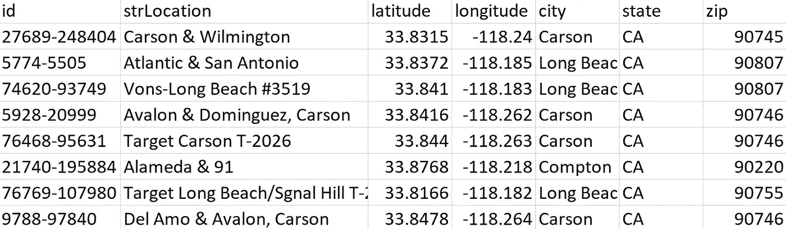
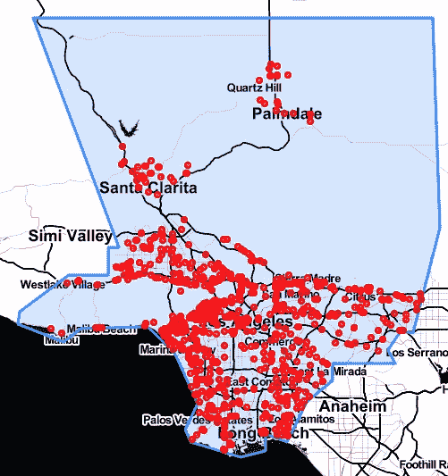
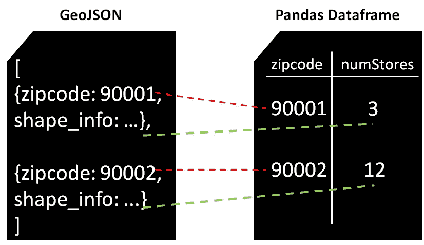
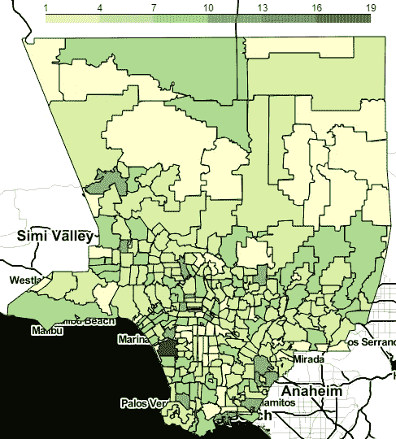
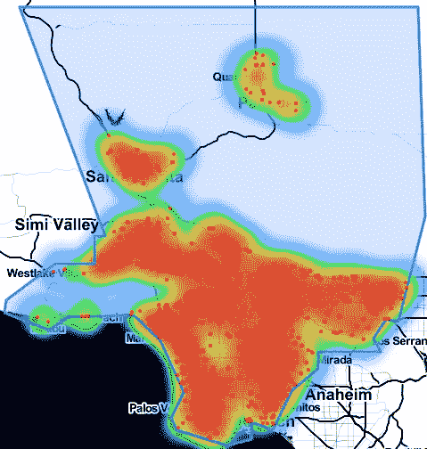
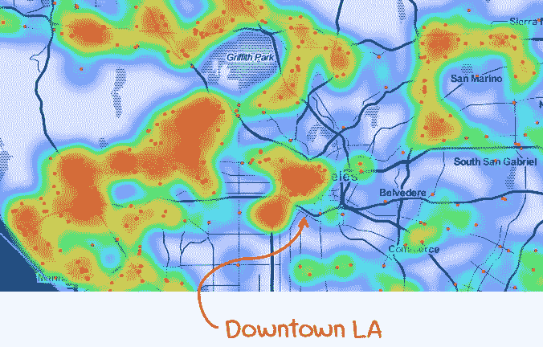

# 用 Python 制作 3 张简单的地图

> 原文：<https://towardsdatascience.com/making-3-easy-maps-with-python-fb7dfb1036?source=collection_archive---------6----------------------->

在处理地理空间数据时，我经常需要以最自然的方式将这些数据可视化:**一张地图。**如果我们能够使用 Python 快速、轻松地创建您的数据的交互式地图，岂不是很好？在本教程中，我们将使用洛杉矶县所有星巴克咖啡店的数据集。在这篇介绍性文章结束时，您将能够创建:

*   洛杉矶县所有星巴克店的基本**点地图**
*   一张 **choropleth 地图**根据每家星巴克包含多少家星巴克来区分洛杉矶县的邮政编码
*   一张**热图**，突出了洛杉矶县星巴克的“热点”

我们开始吧！

# 你将需要…

*   蟒蛇包**熊猫。**这是用来在 Python 中轻松操作数据的
*   蟒蛇包**叶子**。这是用来非常容易地创建地图
*   洛杉矶县星巴克的经纬度电子表格(在我的 GitHub 上 [**这里**](https://github.com/ritvikmath/StarbucksStoreScraping/blob/master/starbucksInLACounty.csv) )
*   一个洛杉矶县的 GeoJSON(基本上是描述复杂形状的 JSON)(此处为**)和一个洛杉矶县所有邮政编码的 geo JSON([**此处为**](https://github.com/ritvikmath/StarbucksStoreScraping/blob/master/laZips.geojson) )**

**为了熟悉数据，下面是前几行的快照:**

****

**对于这个分析，我们只需要关心纬度、经度和邮政编码字段。**

**以下是所需的 Python 导入、加载 Starbucks 数据和加载 LA County GeoJSON:**

# **基点地图**

**从我们的数据框架中的纬度/经度对创建洛杉矶县所有星巴克的基本点地图非常简单。**

**打开**laPointMap.html**，我们看到如下地图:**

****

**我们可以清楚地看到洛杉矶县所有的星巴克都是洛杉矶县区域内的小红点。当然，您可以自定义任何颜色和形状的点。**

# **等值区域图**

**在用 Python 玩地图之前，我实际上不知道什么是 choropleth 地图，但事实证明它们在可视化聚合地理空间数据方面非常有用。**

**我们的 choropleth 地图将回答这个问题:**“洛杉矶县哪个邮政编码有最多的星巴克？”**。choropleth 地图根据其他变量的值(在我们的例子中是星巴克店的数量)对每个邮政编码进行着色。**

**让我们先来看看创建一个所需的基本代码:**

**因为我个人发现要理解如何将 choropleth 的所有组件放置到位更加困难，所以让我们来看看一个单独的视觉效果，看看它是如何工作的。**

****

**choropleth 需要知道为邮政编码 **90001、**填充什么颜色。它检查由**数据**字段引用的熊猫数据帧，搜索邮政编码的 **key_on** 列，并找到在**列**中列出的另一列，即 *numStores* 。然后它知道它需要填充对应于邮政编码为 **90001** 的 **3 商店**的颜色。**

**然后，它在由 **geo_path** 字段引用的 GeoJSON 中查找，并找到邮政编码 **90001** 及其关联的**形状信息**，这告诉它在地图上为该邮政编码绘制哪个形状。通过这些链接，它拥有所有必要的信息。让我们看看 laChoropleth.html 由此产生的 choropleth！**

****

**我们看到它在顶部有一个漂亮的颜色条供参考。**

# **热图**

**在上面的 choropleth 地图中，我们看到洛杉矶南部地区似乎有更多的星巴克店，但我们能不能再具体一点？我们能不能找出附近哪里有很多星巴克店？基本上，让我们创建一个热图来突出显示洛杉矶县的星巴克“热点”。**

**热图中需要一些试错的主要参数是**半径**和**模糊**，前者控制每个星巴克店周围的圆圈有多大，后者控制圆圈“融合”在一起的程度。**

**较高的半径意味着任何给定的星巴克影响较宽的区域，而较高的模糊度意味着彼此相距较远的两个星巴克仍然可以对热点有所贡献。参数由你决定！**

**让我们看看 laHeatmap.html 的天气图。**

****

**嗯……很酷，但是看起来好像所有的东西都是红色的。如果放大，热图可能更有价值。让我们放大一点，看看我们是否能确定更具体的热点。**

****

**不错！从上面的地图可以很清楚地看出，我们有一些热点和一些非热点(notspots？)在地图里。一个突出的是在洛杉矶市中心的**(可以理解)。****

****也就这样了！我唯一的遗憾是，我还没有找到一种方法来嵌入这些地图的实际互动版本，所以我只能给你看截图。我**强烈鼓励**你通过这篇文章运行小代码来为自己玩交互式地图。这是一种完全不同的体验。****

****我希望这篇文章对你有所帮助，下一篇再见！****

****包含本分析中使用的所有代码的完整笔记本可以在我的 GitHub [这里](https://github.com/ritvikmath/StarbucksStoreScraping/blob/master/MakingLAMaps.ipynb)找到。****