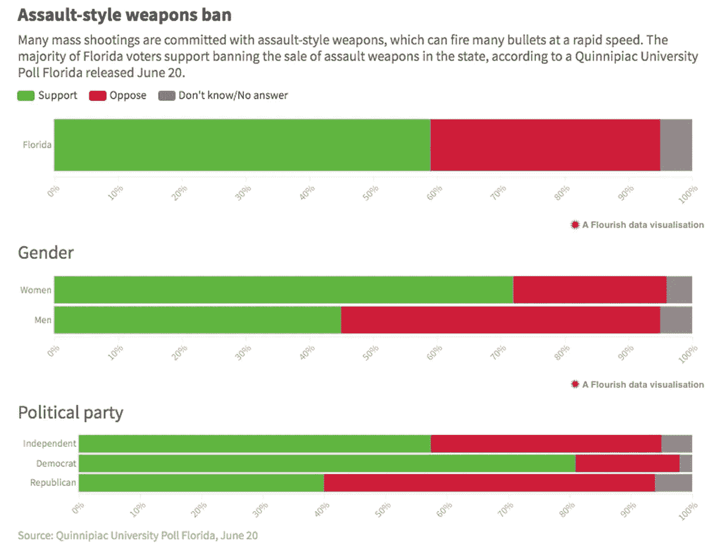
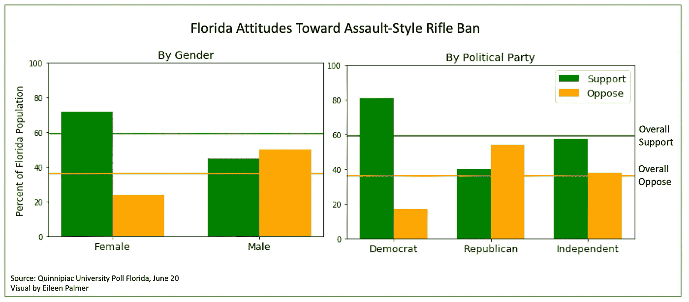

# 让糟糕的图表不那么糟糕

> 原文：<https://towardsdatascience.com/making-a-bad-graph-less-bad-b50653aff743?source=collection_archive---------38----------------------->

讲故事是人类相互交流的重要方式之一。为了讲述关于数据的故事，我们使用数据可视化，或者更简单地说，图表。

有一些可怕的图表，我们都见过。但是有更多的图表并不可怕，但仍然很糟糕。

前几天，在浏览我的脸书订阅时，我看到了《南佛罗里达州太阳哨兵报》的一篇关于枪支政治的[文章。领先的数据可视化吸引了我的眼球——但不是以一种好的方式。颜色令人讨厌，东西相距太远，无法进行视觉比较，图表的风格也不太理想。](https://www.sun-sentinel.com/news/politics/fl-ne-polls-gun-laws-people-want-change-20190918-urmpbrvcfjabfem6gkaqohbidu-story.html)

下图是:

Graphic from [article](https://www.sun-sentinel.com/news/politics/fl-ne-polls-gun-laws-people-want-change-20190918-urmpbrvcfjabfem6gkaqohbidu-story.html) in South Florida Sun Sentinel

让我们仔细看看是什么让这个图变得糟糕，看看我们是否可以让它变得不那么糟糕。

**颜色**

我注意到的关于视觉的第一件事是糟糕的颜色选择。虽然一开始用绿色表示“支持”和用红色表示“反对”可能有意义(就像交通灯的颜色)，但应该避免这种颜色组合——这是有充分理由的。众所周知，最常见的色盲类型是[红绿色盲](https://nei.nih.gov/learn-about-eye-health/eye-conditions-and-diseases/color-blindness/types-color-blindness)，即那些受影响的人不能(或有困难)区分红色和绿色。如果你不能区分这两种颜色，这个图形是没有用的，或者说是令人困惑的。12 个男人中有 1 个，200 个女人中有 1 个患有色盲，红绿组合是一个糟糕的选择。

我开始想象用其他颜色组合的图表会是什么样子。我的第一个想法是:蓝色和橙色怎么样？这是一个常用的数据可视化配对，主要是因为它看起来很简单。但是当我意识到蓝橙色不适合这个图表时，我失望地叹了口气。所代表的数据与攻击性武器禁令的支持程度有关，这是一个不可否认的政治话题。由于蓝色通常用于民主党，红色用于共和党，使用这两种颜色都不是一个好主意。虽然民主党人更可能是支持者，而共和党人更可能是反对者，但用颜色暗示这些事情总是形影不离并不是一个好主意。

所以如果我不能用红色或蓝色，还剩下什么？我可能想待在室内，因为室外的颜色有时会让人分心，所以让我们试试绿色和橙色。从美学角度来看，这不是我最喜欢的选择——但总比不好好。

**对比**

这个图形恳求观众进行视觉比较，但这并不总是容易做到的。在图中，有三个相关的图形。上面的图表显示了所有佛罗里达人支持和反对攻击性武器禁令的比例，以及不知道或没有答案的人的比例。这是另外两个图表的比较点，这两个图表按性别和政党显示了支持、反对和未决定的比例。但是我的眼睛很难比较。当我试图评估无党派人士的支持水平是高于还是低于所有佛罗里达人的支持水平时，我可以感觉到我的眼球上下跳动。这些项目需要更紧密地结合在一起，以使观众能够合理地做出这些判断。

我也发现比较每个小组中反对者的百分比很有挑战性。比较支持者的百分比要容易得多，因为所有这些棒线都从同一点开始，都是 0%。由于对立类别的棒线都是从稍微不同的点开始，比较它们的长度就更加困难了。支持数据比反对数据更容易比较，这一事实暗示着支持数据可能比反对数据更容易理解，我认为这是一个不公平的假设。

我看到了两种可能的选择，让对立群体之间的比较更容易理解。选项 1:切换每个条形的反对组和未决定组的顺序。该触发器将使观察者能够更快地比较相对条的长度，因为它们都是右对齐的。互换进一步改善了图表，将各组放在一个从积极到消极的尺度上，在支持和反对之间犹豫不决，因为它自然下降。

选项 2:构建一个分组条形图，而不是堆叠条形图。这种类型的图形可能会简化对立物之间的视觉比较，因为所有棒线都从 0%开始。在这个选项中，理解对立数据的重要性与理解支持数据的重要性是同等的。

**相同的数据，不同的视觉**

下一步是接受不好的事情，让它变得更好(嗯，至少让它变得不那么坏)。我试图改善颜色，让东西更容易比较。这是我的设想:

几个显著的变化:(1)绿色和橙色，而不是绿色和红色，以及(2)两个并排的分组条形图，用水平线显示总体比例，而不是三组堆叠的水平条形图。

我意识到在我的新视野中有些东西丢失了。从表面上看，我的版本不太圆滑。我是一名初露头角的数据科学家，在这一点上，我主要使用 [matplotlib](https://matplotlib.org/) 作为我的视觉效果。更实质性的是，关于未决定的群体的信息已经没有了。为了更清楚地比较支持者和反对者，我选择放弃强调每个群体的总和总是 100%。

请让我知道你的想法！我的目标是学习，我将非常感谢任何和所有的反馈。