# 用 Python 制作一个让孩子学习英语并从中获得乐趣的游戏

> 原文：<https://towardsdatascience.com/making-a-game-for-kids-to-learn-english-and-have-fun-with-python-d6b54af792ec?source=collection_archive---------21----------------------->

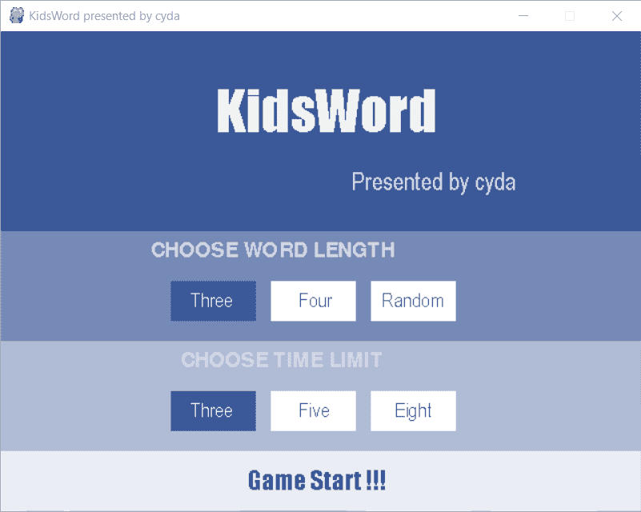

# 目标

为 2-6 岁的孩子建立一个互动游戏，学习英语词汇并从中获得乐趣。*(GitHub 链接这里是*[](https://github.com/cydalytics/KidsWord)**)。)**

# *这样做的原因*

*女朋友的姐姐有一个可爱的儿子，是幼儿园的孩子。他喜欢玩，而且精力充沛。像往常一样，就像其他孩子一样，他不喜欢阅读，更不用说说英语了。基于此，我想到为他制作一个游戏，练习他的记忆技巧，教他词汇，最重要的是，享受学习的过程。*

# *游戏流程理念突破*

*好吧，这是游戏计划。*

1.  *一个单词会显示几秒钟，孩子必须记住这个单词。假设这个词汇是“狗”。*
2.  *将生成六个英文字符，并以随机顺序排列。例如，“A”、“C”、“G”、“D”、“P”和“O”。*
3.  *孩子必须选择所显示的单词的正确顺序。*
4.  *将显示 vocab 的图像并播放发音。*

*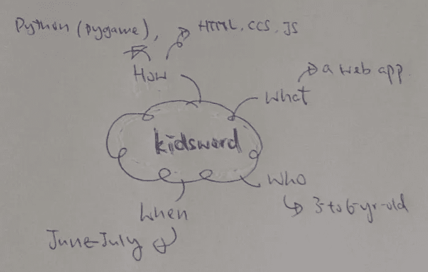**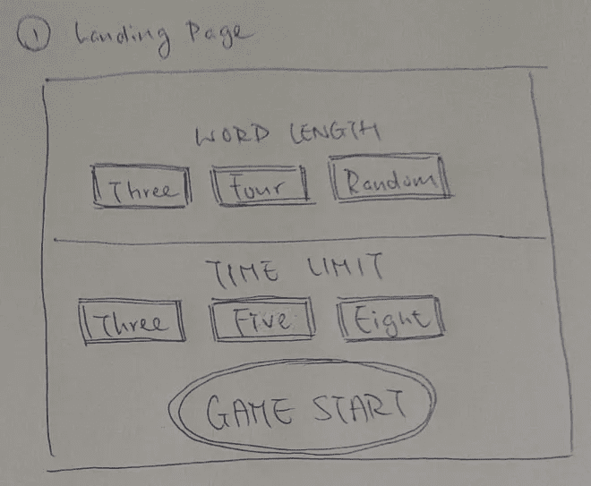**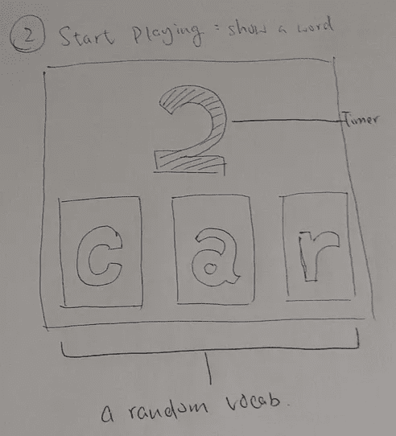**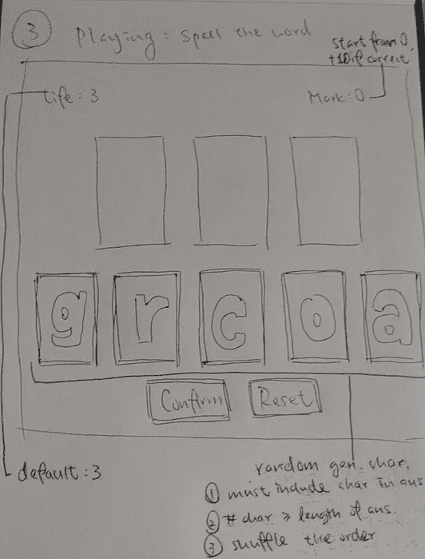**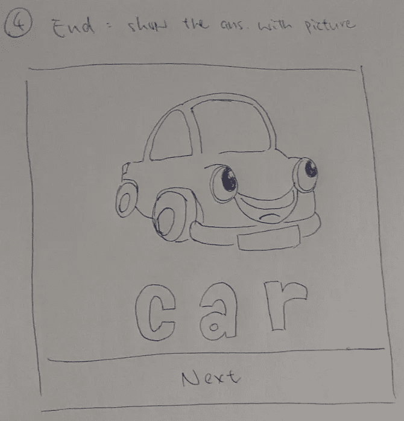**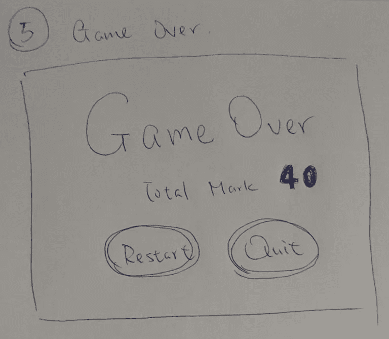*

*Game Design Paper Prototype*

# *第一步——英语词汇列表*

*老话说，核桃和梨是你为你的继承人种下的。要制作这个游戏，一系列的英语词汇是必须的。除了自己从牛津词典中搜集资料，我们还可以利用他人的成果。所有的荣誉归于 [gokhanyavas](https://github.com/gokhanyavas) 。我们可以直接从 [**这里**](https://raw.githubusercontent.com/gokhanyavas/Oxford-3000-Word-List/master/Oxford%203000%20Word%20List.txt) 下载词表。*

```
*from urllib.request import urlopen
with urlopen('[https://raw.githubusercontent.com/gokhanyavas/Oxford-3000-Word-List/master/Oxford%203000%20Word%20List.txt'](https://raw.githubusercontent.com/gokhanyavas/Oxford-3000-Word-List/master/Oxford%203000%20Word%20List.txt')) as f:
    word_list = [x.decode('utf-8') for x in f.read().splitlines()]*
```

*导入词表后，还要做一些预处理工作。*

> *删除带有符号和空格的单词*

```
*import re
# Substitute Symbols with Spaces
word_list= [re.sub('[-.]',' ',word) for word in word_list]# Remove Words with Spaces
word_list= list(filter(lambda x: ' ' not in x, word_list))*
```

> *把单词改成小写*

```
*# Change to Lower Cases
word_list= [word.lower() for word in word_list]*
```

> *保留 3 到 4 个字符的单词(因为这个游戏是给孩子玩的，我们不能让单词太长，对吗？)*

```
*# Keep the Words with 3 or 4 Characters
word_list = list(filter(lambda x: len(x) in [3, 4], word_list))*
```

> *检查单词的词性。我们只保留以下:
> CD(基数)/ JJ(形容词)/ NN(名词)/ VB(动词)*

```
*import nltk
# List of Part-of-Speech
pos_list = [nltk.pos_tag([word])[0][1] for word in word_list]
# List of Word Length
len_list = [len(word) for word in word_list]import pandas as pd
# Data Frame
word_df = pd.DataFrame({'Word': word_list, 
                        'POS':pos_list, 
                        'Len': len_list})# Keep CD / JJ / NN / VB
word_df = word_df[word_df['POS'].isin(['CD','JJ','NN','VB'])]*
```

*最终，我们可以得到这样一个数据框:*

*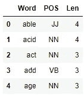*

*word_df*

# *第二步——词汇发音*

*有了单词列表后，我们需要词汇发音 mp3 文件，这样游戏就可以教孩子们正确地发音。简单地说，我们将充分利用谷歌文本到语音包。*

```
*from gtts import gTTS
import os.path
if not(os.path.isdir('Audio')):
    os.mkdir('Audio')
    print('Audio is downloading. It may take a few minutes.')
    for word in list(word_df['Word']):
        audio_save_path = 'Audio/'+ word + '.mp3'
        gTTS(text=word, lang='en', slow=False).save(audio_save_path)*
```

*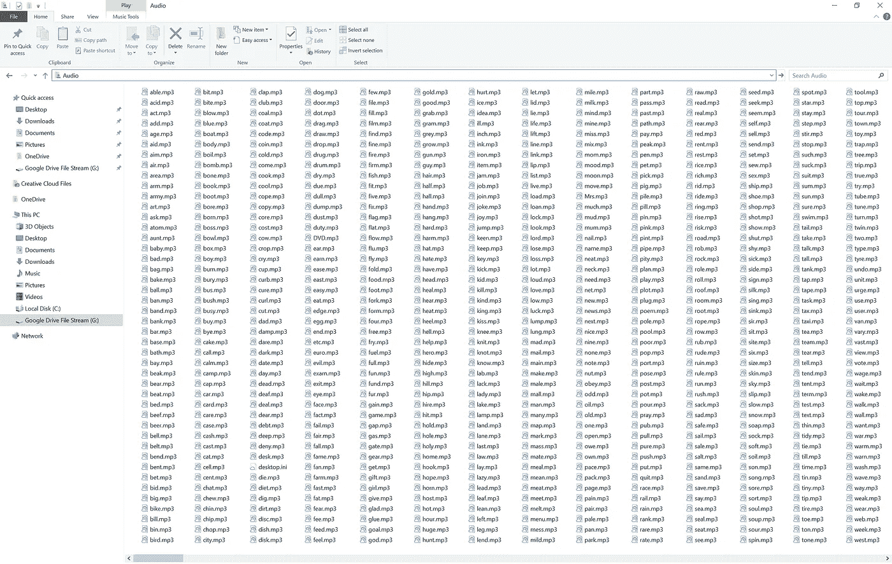*

*English Words Audio Files*

# *第三步——词汇卡通图片*

*除了声音之外，图像对于留下深刻印象和吸引孩子也至关重要。在这个游戏中，我使用从谷歌下载的图片。您也可以使用 Unsplash 或其他图像源。*

```
*from google_images_download import google_images_download
from shutil import copyfile
from os import listdir
import shutil
if not(os.path.isdir('Image')):
    os.mkdir('Image')
    print('Audio is downloading. It may take a few minutes.')
    for word in list(word_df['Word']):
        response = google_images_download.googleimagesdownload()
        response.download({"keywords": word,
                           "limit": 1,
                           "output_directory":'Temp_Image',
                           "suffix_keywords":'cartoon image'})
    img_dir_list = listdir('Temp_Image')
    for img_dir in img_dir_list:
        initial_path = os.path.join('Temp_Image', img_dir)
        file_name = listdir(initial_path)
        if len(file_name) != 0:
            file_path = os.path.join(initial_path, file_name[0])
            final_path = os.path.join('Image', img_dir[:4].rstrip() + os.path.splitext(file_name[0])[1])
            copyfile(file_path, final_path)
    shutil.rmtree('Temp_Image')*
```

*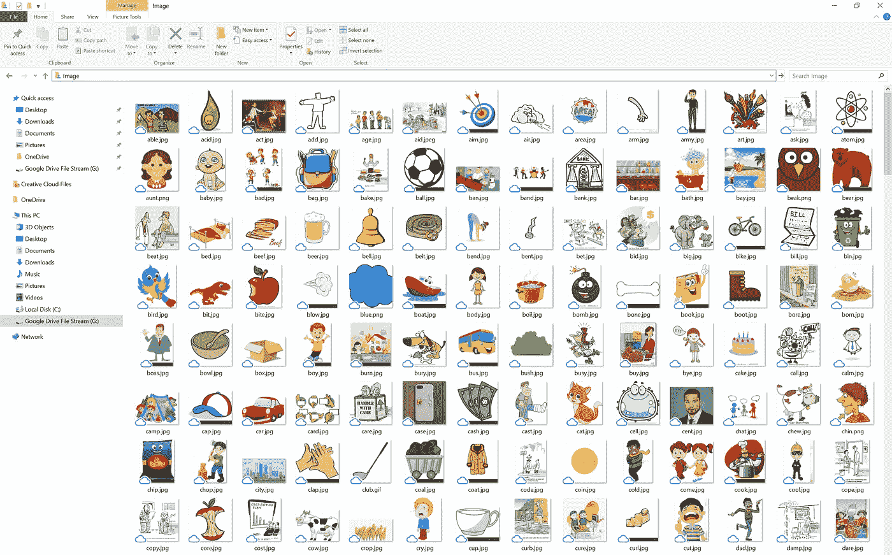*

*English Words Image Files*

> *感谢上帝！所有的准备工作都完成了，接下来是最激动人心的部分——制作游戏。*

# *第四步——智力游戏*

*在这个例子中，我使用 PyGame 来制作游戏。Pygame 是一套跨平台的 Python 模块，设计用于编写视频游戏。它包括设计用于 Python 编程语言的计算机图形和声音库。*

**

*有一些技巧，然后你可以学习和创造自己的游戏。*

> *游戏初始化*

```
*import pygame# Game Init
pygame.init()
win = pygame.display.set_mode((640, 480))
pygame.display.set_caption("KidsWord presented by cyda")run = True
while run:
    pygame.time.delay(100)
    for event in pygame.event.get():
        if event.type == pygame.QUIT:
            run = False
    pygame.display.update()
pygame.quit()*
```

*要开始游戏，我们需要一个游戏窗口。有两件事情需要设置。*

1.  *窗口大小-示例:(640，480)*
2.  *窗口显示名称-示例:“cyda 提供的童剑”*

*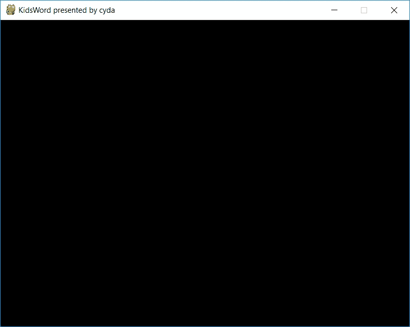*

> *添加背景颜色*

```
*win.fill((59, 89, 152))*
```

*RGB 颜色-示例:(59，89，152)*

*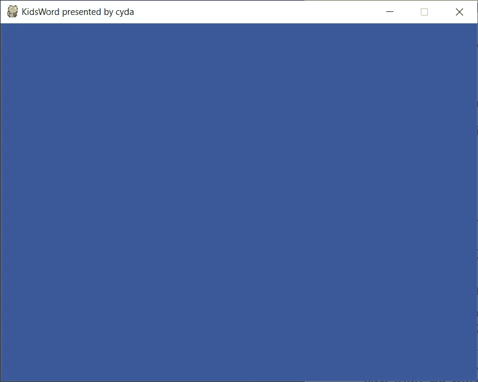*

> *添加文本*

```
*font_1 = pygame.font.SysFont('impact', 55)
font_2 = pygame.font.SysFont('Arial', 25)
win.blit(font_1.render('KidsWord', False,(242, 242, 242)),(215, 45))
win.blit(font_2.render('Presented by cyda', False, (212, 216, 232)), (350, 135))*
```

*要添加文本，您必须指定以下参数。*

1.  *字体样式-示例:“影响”*
2.  *字体大小-示例:55*
3.  *字体颜色-示例:(242，242，242)*
4.  *字体位置-示例:(215，45)*

*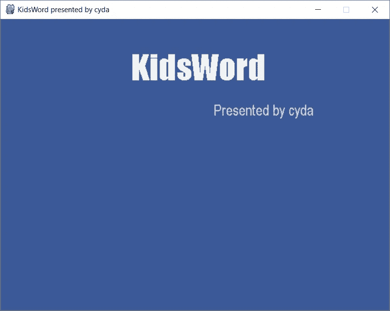*

> *添加几何形状*

```
*pygame.draw.rect(win, (255, 255, 255), (270, 250, 85, 40))*
```

*以画矩形为例，我们必须指定*

1.  *形状颜色-示例:(255，255，255)*
2.  *形状位置-示例:(x_upperleft，y_upper_left，x_bottomright，y_bottom_right)= (270，250，85，40)*

*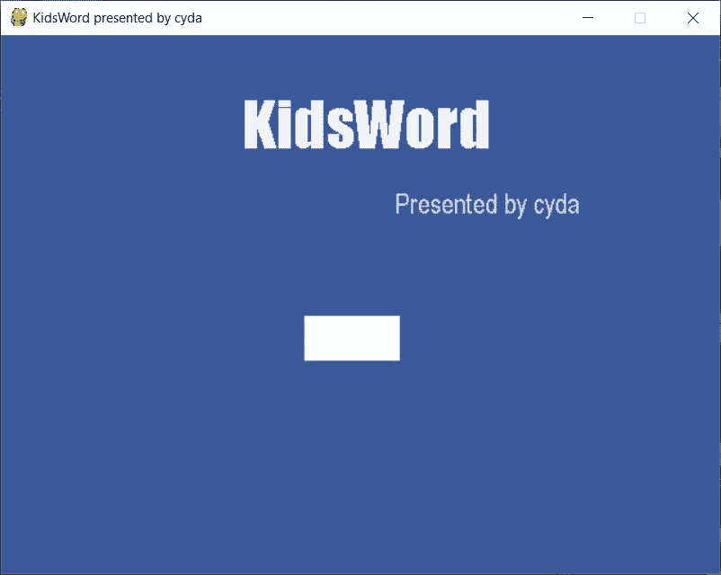*

> *添加可点击按钮*

*事实上，没有正式的或官方的功能让你创建一个按钮。因此，我们必须以一种巧妙的方式来做这件事。*

*1.定义可点击的按钮区域*

```
*button_area = pygame.Rect(270, 250, 85, 40)*
```

*2.定义触发功能*

```
*def button_pressed():
    win.fill((255, 255, 255))
    win.blit(font_1.render('Page 2', False, (0, 0, 0)), (230, 240))*
```

*3.添加鼠标点击事件*

```
*if event.type == pygame.MOUSEBUTTONDOWN:
    mouse_pos = event.pos
    if (button_area.collidepoint(mouse_pos)):
        button_pressed()*
```

*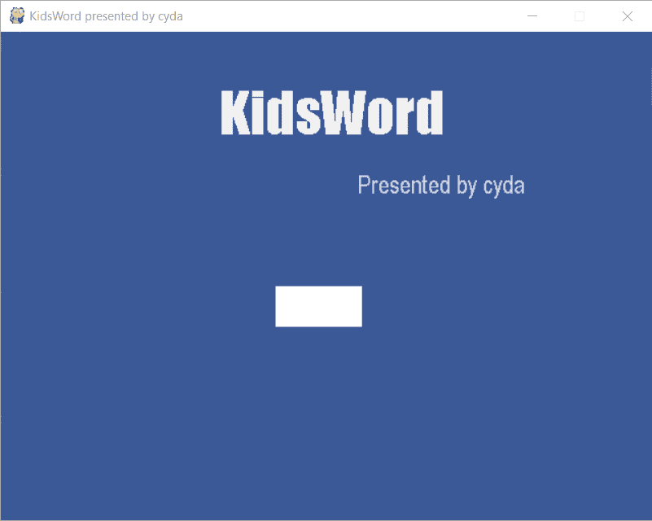*

> *添加计时器*

*在一个游戏中，计时器是你没有机会摆脱的必要元素。例如，如果玩家不能在一定时间内完成任务，他/她可能会输掉游戏。在我的情况下，我会在时间结束后切换页面。*

*要设置定时器，请遵循以下步骤:*

*1.初始化时间参数*

```
*font_3 = pygame.font.SysFont('impact', 120)
clock = pygame.time.Clock()
pygame.time.set_timer(pygame.USEREVENT, 1000)
page = 0
time_limit = 3*
```

*2.更改鼠标点击事件*

```
*if event.type == pygame.MOUSEBUTTONDOWN:
    mouse_pos = event.pos
    if (button_area.collidepoint(mouse_pos)):
        time_count = time_limit
        page = 1
        button_pressed()
if page == 1:
    if event.type == pygame.USEREVENT:
        time_count -= 1
    time_text = int(time_count)
    if time_text > time_limit:
        time_text = time_limit
    pygame.draw.rect(win, (59, 89, 152), (420, 50, 100, 160))
    win.blit(font_3.render(str(time_text), True, (242, 242, 242)), (440, 50))
    pygame.display.flip()
    clock.tick(60)
    if time_count < 0:
        win.fill((255, 255, 255))
        win.blit(font_1.render('Page 2', False, (0,0,0)), (230,240))*
```

*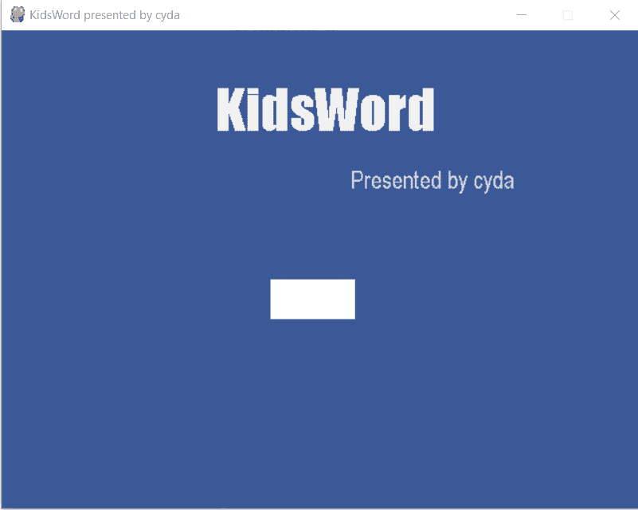*

> *添加图像*

```
*image = pygame.image.load('car.png')
image = pygame.transform.scale(image, (600, 300))
win.blit(image, (25, 150))*
```

*PyGame 有一个直接加载图片的功能。但是，你要提醒两件事。*

1.  *不允许使用动画图像。*
2.  *你最好转换图像比例，以便更好地适应你的窗口大小。*

*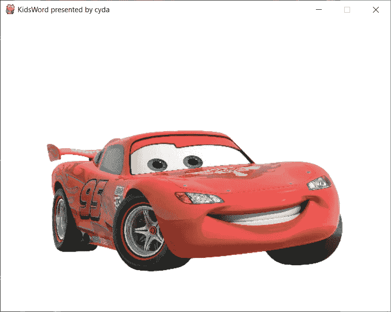*

> *播放音频*

*可以导入 PyGame 支持的混音器模块来播放音频文件。*

```
*from pygame import mixer
mixer.init()
mixer.music.load('car.mp3')
mixer.music.play()*
```

*这些都是我用来建造这个奇妙游戏的技术。而现在，女朋友的表妹愿意坐下来，也爱学英语。*

# *编辑的话*

*写一篇教程文章并不容易，而且费时。如果你喜欢阅读它，并且觉得它很有用，请分享给你的朋友。将来，我们会发布一系列的教程文章，敬请关注！=)*

*还有，如果你有兴趣了解更多的窍门和技巧，欢迎你浏览我们的网站:【https://cydalytics.blogspot.com/*

***领英:***

*杨皇-[https://www.linkedin.com/in/yeungwong/](https://www.linkedin.com/in/yeungwong/)*

*罗嘉丽-[https://www.linkedin.com/in/carrielsc/](https://www.linkedin.com/in/carrielsc/)*

# *其他文章*

1.  *[数据可视化技巧(Power BI) —将分类变量转换为虚拟变量](/data-visualization-tips-power-bi-convert-categorical-variables-to-dummy-variables-a53f20cdb4e?source=friends_link&sk=64aeb5d2d5c7b1f9aa34b4adcc052694)*
2.  *[中文异状字云(Python)](https://medium.com/@yeung_cyda/written-in-chinese-step-by-step-chinese-word-cloud-with-python-53f57f65be69?source=friends_link&sk=5194e7fadf63033934fae9111ef76a98)*
3.  *[数据科学基础(R):从 Excel 导入数据— readxl](/data-science-fundamentals-r-import-data-from-excel-readxl-380ef47216d5?source=friends_link&sk=c8992f7ab1cdc18d1e67353215d95097)*
4.  *[数据科学基础(R):从文本文件导入数据— textreadr & readtext](https://medium.com/analytics-vidhya/data-science-fundamentals-r-import-data-from-text-files-textreadr-readtext-c5058c3bd0d6?source=friends_link&sk=dc3c4a22b2c02e66ceac70ad31001d0f)*
5.  *[数据科学基础(R):导入&导出 Excel 中的数据— xlsx](/data-science-fundamentals-r-import-export-data-in-excel-xlsx-bdb12a588735?source=friends_link&sk=15d135b8d3544f5a63f688ff309c159f)*