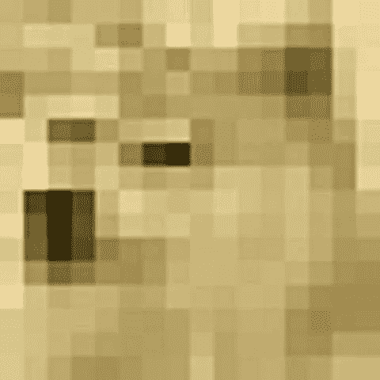
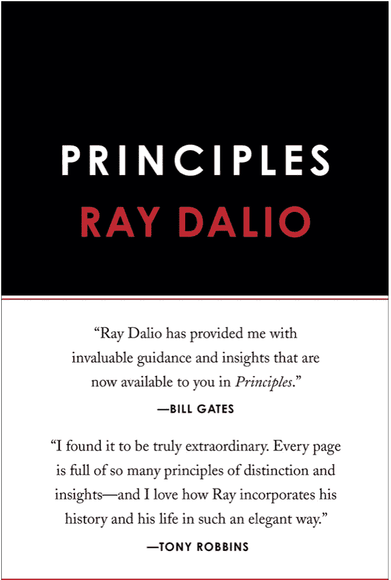
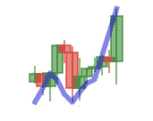
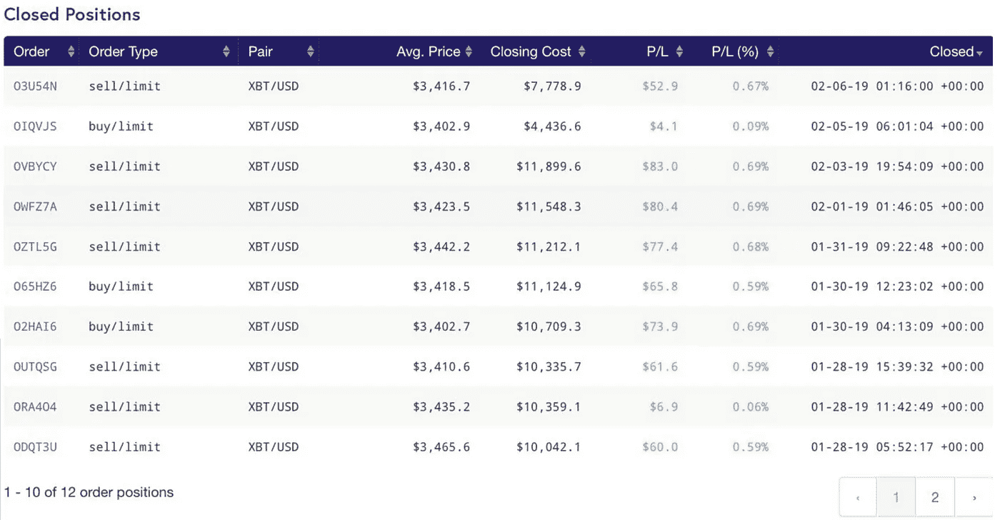
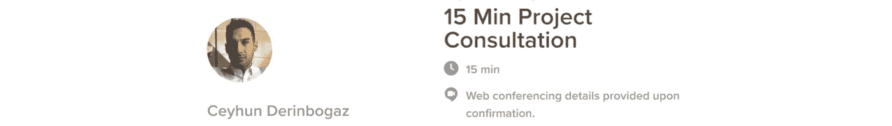

# 如何制作一个可以查看交易图表的人工智能(并用于交易)

> 原文：<https://towardsdatascience.com/making-a-i-that-looks-into-trade-charts-62e7d51edcba?source=collection_archive---------0----------------------->


Photo by [Rick Tap](https://unsplash.com/@ricktap?utm_source=medium&utm_medium=referral) on [Unsplash](https://unsplash.com?utm_source=medium&utm_medium=referral)

我们生活在一个大多数事情越来越依赖于计算机视觉和深度学习的世界。从自动标记你夏天的照片到安全摄像头的面部检测，感觉我们生活在一个反乌托邦的未来。

虽然人工智能革命仍在我们身边发生，但对我来说，2019 年的春天是有趣的时刻。在完成一门深度学习课程后，我开始修补深度学习的许多不同用例，如图像分类到自然语言处理(NLP)。在花了几个小时使用 Python 和 Keras 库之后，我训练了一个简单的卷积神经网络(CNN ),它能够区分猫和狗的图像。听起来很简单，几年前这是一个巨大的任务，我很难相信简单的神经网络如何解决一个复杂的问题！通常，如果你想使用 CV 库进行图像识别，你必须进行特征工程，开发你自己的过滤器，并将许多特征硬编码到代码中。即使经过多次尝试，你也只能得到一个大约 60-70%准确的算法，这与我们今天用机器学习所能做到的相差甚远。



Deep Learning Methods Looks into Pictures as Matrices

我完全被深度学习的简单性惊呆了。首先，我定义了一个非常简单的 CNN 架构，然后用猫和狗的图像标记我的数据集。之后开始训练，观察训练精度和验证精度的上升，直到达到令人满意的指标。就是这样！！接下来，加载您的模型和权重文件，然后使用您想要预测的文件运行 model.predict 命令。结果是正确的分数！

深度学习的简单性和准确性简直太棒了！

大约在同一时间，我对经济学和当日交易产生了兴趣。我开始阅读雷伊·达里奥的 [*生活和工作原则。*](https://amzn.to/2ZgOLHy) (如果你还没看，我只能推荐)

[](https://amzn.to/2ZgOLHy)

Principles by Ray Dalio

在他的书中，他谈到了他的公司如何创造出专有的算法，做出财务决策来管理他的对冲基金，并成为世界上最成功的基金之一。虽然这个故事非常鼓舞人心，但它让我开始思考，我们不要教计算机任何东西，让它自己解决问题怎么样。与过去计算机视觉的特征工程不同，深度学习还可以用于创建算法，这些算法决定何时买卖股票、外汇、石油以及你能想到的任何东西。

如果数据中有一个模式，你不需要自己去发现，它**会**被深度学习发现，这就是 **Inpredo** 项目的开始。


Charts, more charts!

# 第一步。创建培训数据:

所以在我们进去创造一个赚钱机器之前(小心我过于乐观的评论。)我们需要训练数据。很多！

感谢上帝，这不会很难，因为我们已经从上面的链接访问 CSV 数据。我们需要做的只是创建一个算法，该算法能够查看历史数据，并创建图表，然后根据工具(例如欧元/美元)价格在未来是上涨还是下跌对其进行分类。因为我们有历史数据，我们知道在数据时间范围内的任何给定时间价格发生了什么，所以很容易对生成的图表图像进行分类。

创建图表是容易的部分，我们需要几个库和我为此创建的函数，这个函数叫做 graphwerk.py(发电厂乐团，有人知道吗？)

所以 graphwerk 非常简单，你只需要以**列表**格式插入所选乐器的历史数据。我们将印刷覆盖 12 小时/蜡烛的图表**。**所以你的列表长度必须是 12。如果你想覆盖更大的时间范围，那么你需要增加你的列表长度。关于粒度，您可以选择每小时、每天甚至每分钟的数据。如果你想用更多的蜡烛来打印图表，这是完全没问题的，但是我不想在训练数据中引入太多的噪音。

```
import matplotlib.pyplot as plt
import mpl_finance
import numpy as npdef graphwerk(open, high, low, close, instrument):
    # Create Prefixes for correct data
    if instrument == 'XAU/USD':
        prefix = 'xau'
    elif instrument == 'USOil':
        prefix = 'USOil'
    elif instrument == 'XAGUSD':
        prefix = 'xag'
    else:
        print('Instrument prefix is not defined in graphwerk')
        return

    fig = plt.figure(num=1, figsize=(3, 3), dpi=50, facecolor='w', edgecolor='k')
    dx = fig.add_subplot(111)
    mpl_finance.candlestick2_ochl(dx, open, close, high, low, width=1.5, colorup='g', colordown='r', alpha=0.5)
    plt.autoscale()
    # Create a moving average overlay

    sma = convolve_sma(close, 3)
    smb = list(sma)
    diff = sma[-1] - sma[-2]

    for x in range(len(close) - len(smb)):
        smb.append(smb[-1] + diff)

    dx2 = dx.twinx()
    dx2.plot(smb, color="blue", linewidth=8, alpha=0.5)
    dx2.axis('off')
    dx.axis('off')

    timestamp = int(time.time())
    file_name = realtime_data + str(prefix) +str(timestamp) + '.jpg'
    plt.savefig(file_name, bbox_inches='tight')
    #Uncomment this line to see the plot right after script runs.
    #plt.show
    plt.close()
    return file_name
```

**运行该脚本后，它将创建如下所示的图表:**



XAU/USD Chart with the past 12 hours data.

我知道图像尺寸很小，但对于深度学习，你不需要 4K**分辨率的照片或图表。对于大多数人工智能深度学习应用程序来说，大约 200x200 像素已经足够了。事实上，使用较小尺寸的图像是一件好事，因为为深度学习提供 4K 图像最终将需要一个超级昂贵的 GPU 集群，如新的英伟达 DGX，价格约为 2 万美元。**深度学习的酷之处在于，如果你很聪明，你可以使用分辨率较低的图像来大幅降低处理能力，而这些图像仍然携带相同数量的信息:)

如果你也可能注意到了，**酒吧看起来并不像现实生活中的样子**。原因是我故意操纵它们，在蜡烛之间嵌入额外的信息，降低它们的透明度。这就产生了重叠的蜡烛，这些蜡烛也可以在蜡烛重叠区域的混合颜色中携带信息。

在这个半透明蜡烛的顶部有一个简单的移动平均线(SMA ),当它穿过蜡烛时，透明度也会降低，以创建附加信息。您可以随意改变形状、大小和透明度，以创建完美的训练数据集。

**步骤 2:为训练数据集创建 10000 幅图像**

所以上面的脚本对于创建单个图像来说是很棒的，但是我们需要更多来训练一个神经网络**。**我说的是这里有几千个。所以作为开发人员，我们不只是点击按钮一千次，对不对？我们需要自动以滚动时间窗口的方式检查整个 csv 文件，并自动将图表图像放置在正确的文件夹中，如“购买”和“出售”。逻辑非常简单，定义时间窗口 12，(这意味着每小时 csv 文件中的 12 小时窗口)，并在 for 循环中的每个循环中将窗口向前移动 1 小时。通过这种方式，我们将能够根据历史数据的大小创建足够数量的样本。

为了能够创建足够数量的训练数据，您只需要以下格式的干净 csv 数据，然后剩下的只是等待脚本完成对数据的完整循环。您将需要为此创建 2 个文件夹，最终将填充 2 种类型的数据:购买和出售。当最后一根蜡烛线的收盘价低于下一根蜡烛线的收盘价时，创建的图表将被保存到“买入”文件夹中。换句话说，如果最后一根蜡烛线的收盘价高于下一根蜡烛线的收盘价，那么“卖出”文件夹将包含图表图像。

**第三步:训练一个简单的卷积神经网络**

在创建数据集之后，我们需要定义一个神经网络架构，然后输入训练数据来训练神经网络，以区分可能的买入或卖出信号之间的差异。

如果你已经注意到，我不是在谈论任何一种策略或某种算法设计来找出这些模式。人工智能的神奇之处在于，它会自己找出模式。

目前，有许多不同种类的卷积网络架构设计用于图像分类。Xception 是获奖产品之一，但我们不会使用目前先进的产品。

我们的模型将是一个基本的卷积网络，具有丢弃层和全连接层，如下所示:

```
model = Sequential()
model.add(Convolution2D(nb_filters1, conv1_size, conv1_size, border_mode ='same', input_shape=(img_height, img_width , 3)))
model.add(Activation('relu'))
model.add(MaxPooling2D(pool_size=(pool_size, pool_size)))

model.add(Convolution2D(nb_filters2, conv2_size, conv2_size, border_mode ="same"))
model.add(Activation('relu'))
model.add(MaxPooling2D(pool_size=(pool_size, pool_size), dim_ordering='th'))

model.add(Convolution2D(nb_filters3, conv3_size, conv3_size, border_mode ='same'))
model.add(Activation('relu'))
model.add(MaxPooling2D(pool_size=(pool_size, pool_size), dim_ordering='th'))

model.add(Flatten())
model.add(Dense(1024))
model.add(Activation('relu'))
model.add(Dropout(0.5))
model.add(Dense(classes_num, activation='softmax'))

model.summary()
model.compile(loss='categorical_crossentropy',
                      optimizer=optimizers.rmsprop(),
                      metrics=['accuracy'])
```

# 结果

经过无数个小时摆弄参数和创建，减少，过滤训练数据，人工智能模型能够在 2 年的数据集内以 63%的准确率进行“猜测”！

就像所有正常人会做的那样，我把这个人工智能模型插入了 kraken 的实时交易引擎，进行 BTC 对美元的交易，希望能赚些钱，讲述暴富的故事。顺便说一下，如果你想进入 API 交易，我只能推荐北海巨妖。它们是受监管的交易所，拥有安全稳定的 API。

[](https://calendly.com/ceyhun-derinbogaz/15-min-consulting)

Have an idea regarding to AI and Machine Learning? Book a time with me and let’s see what we can do together!

非常有趣的是，它真的赚了钱**在这个时间段内连续 10 天达到了%5.34 的涨幅。与此同时，BTC 兑美元下跌了%3.29！**

所以最酷的是，不管市场是涨是跌。它只是根据情况来缩短或拉长乐器。因此，即使在市场上所有东西都在贬值的情况下，这种模式仍然能够赚钱。



Holy sh.t, it works moment

由于 digitalocean 的超级易用的虚拟机部署，在创建此类模型以持续运行 bot 后，我每月的总支出约为 15 美元。你也可以试试下面的[促销代码](https://m.do.co/c/147b0cf51801)并获得 **100 美元的信用点数**来启动一台虚拟机。这相当于 3 个月的免费使用。只需选择一个一键部署的 ubuntu 部署，并使用我在文章末尾附上的 github repo。

所以我写这篇文章的原因是想告诉你还有很多事情需要去做。预测一只股票是涨是跌只是故事的一半。如果你不知道股票上涨或下跌的百分比是多少，这不会有多大帮助，因为你不知道何时兑现你的收益。

所以显然这个人工智能模型需要随着时间的推移而改进。考虑到人工智能模型需要定期更新以适应不断变化的市场条件也是很好的。

***来自《走向数据科学》编辑的提示:*** *虽然我们允许独立作者根据我们的* [*规则和指导方针*](/questions-96667b06af5) *发表文章，但我们并不认可每个作者的贡献。你不应该在没有寻求专业建议的情况下依赖一个作者的作品。详见我们的* [*读者术语*](/readers-terms-b5d780a700a4) *。*

**如果你想自己运行代码，看看结果，看看 github 页面:**[https://github.com/cderinbogaz/inpredo](https://github.com/cderinbogaz/inpredo)

[](https://calendly.com/ceyhun-derinbogaz/15-min-consulting)

Have a project idea to discuss? You can book a time with me using the link above.

## 查看我在 Medium 上的其他项目和文章:

*   [使用 GPT-2 的 AI 域名生成器](/how-i-fine-tuned-gpt-2-to-generate-creative-domain-names-a56d59d55aca)
*   [创建自己的服务器来收集加密货币数据](https://becominghuman.ai/create-your-own-python-server-to-gather-high-granularity-market-data-for-cryptocurrencies-and-use-8a4b2f46e04c)
*   [如何破解你的情感固件并停止拖延](https://medium.com/@cderinbogaz/how-to-hack-your-emotional-firmware-and-stop-procrastinating-168ee2b51561)
*   [学习斯多葛主义如何在焦虑的年代帮助我](https://medium.com/@cderinbogaz/how-learning-stoicism-helped-me-in-the-age-of-anxiety-4bb0b784e429)

**免责声明:**如果你用我的代码用自己的钱在市场上交易，我不对你的损失负责。注意安全，不要去冒自己没有完全理解的风险。