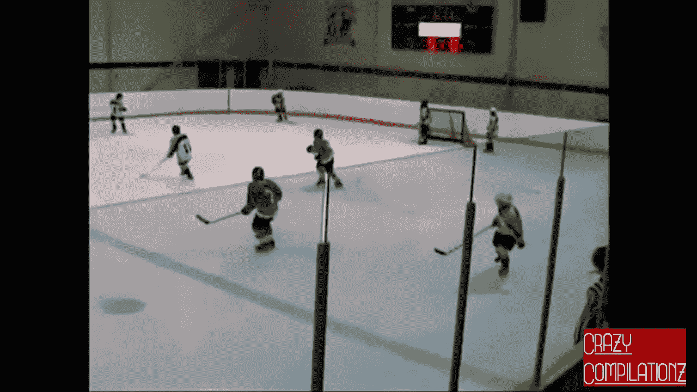

# 从 Youtube 视频制作影像数据集

> 原文：<https://towardsdatascience.com/making-an-image-dataset-from-youtube-videos-5116252d20a3?source=collection_archive---------11----------------------->

## 如何用逼真的图像改善你的深度学习数据集？

深度学习模型的好坏取决于你提供给它的数据。这就是为什么花足够的时间收集大量的好数据是非常重要的。我所说的“好”是根据手头的问题而变化的。确定你的数据是否合适的一个有用的技巧是考虑用户的输入会是什么样子。这是一个重要的问题，尤其是在处理图像时。光线、对比度、方向、图像质量和视角可能会有很大差异，不考虑这些差异会在预测中产生巨大的误差。例如，如果你想使用你的模型制作一个手机应用程序，不要只在专业相机拍摄的图像上训练它。尝试减少对训练数据的这种偏向的一组好的技术是数据扩充，但是我在这里不详细说明。

**编辑(2021 年 2 月)** : Youtube 更改了他们网站的源代码，因此`get_urls`功能不再工作。其余的代码工作正常(最新版本在我的 github 上),所以唯一的问题是获得一个视频 URL 列表。以下是一些建议:

*   手动收集一个 URL 列表，用它代替`get_urls`的结果。这样做可能很烦人，但肯定有效。
*   用 Selenium 刮 Youtube，得到一些网址。考虑到网站现在的编码方式，这可能会很复杂，但应该是可行的。
*   使用 Youtube API 获取给定关键字的视频列表。这个 API 非常容易使用。唯一复杂的步骤是使用谷歌账户设置凭证。

如果您需要这些建议的帮助，请联系我:)

# 抓取图像

这篇长长的介绍说明了数据收集的重要性，并且存在许多工具和数据来源。在这篇文章中，我把重点放在图像上，因为我最熟悉这个话题。当试图收集特定主题的图像时，首先想到的是使用 Beautifulsoup 和 Selenium 等库来抓取谷歌图像。其实我写了这样一个刮刀，你可以在这里找到[。然而，在谷歌上可以找到的图片数量是有限的，而且它们通常有相似的风格，如果这种风格不是你感兴趣的风格，这可能是一个问题。](https://github.com/yangobeil/google-images-scraping)

Amateur image of hockey players (left) vs pros (right)

第二个较少被讨论和使用的数据来源是 Youtube。当我从斯坦福大学的人们那里找到一个很好的数据集时，我被激励去研究这个主题，这个数据集可以在这里找到。这是一个超过 100 万个 Youtube 视频链接的集合，涉及近 500 项运动。这在正确的时间落到了我身上，因为我正在研究一个体育分类器，它是根据从谷歌上搜集的图像进行训练的。这个模型有上面提到的问题，它在干净和专业的图片上工作得很好，但在业余爱好者的图片上工作得很差。

因此，这篇文章的想法是描述我如何使用 python 从 Youtube 视频中收集图像。主要步骤是在 Youtube 上搜索一个查询，并收集一部分结果视频作为链接。然后程序下载视频(这可能需要很多时间和数据，取决于你的互联网连接)并保存在本地。然后，在删除视频之前，每个视频被用来提取一定数量的帧，这些帧被保存。这种技术让我能够收集到更真实的图像，但当然，之后还要进行一些手动过滤，因为视频包含了很多额外的视觉效果。显然，这种数据来源更受限制，但它应该对许多主题有用。

# 代码

这个程序的代码实际上很简单，是由我从互联网上收集的一些小片段组成的。然而，我找不到一个从头到尾都能做我想做的事情的程序，所以我不得不自己连接这些步骤。完整的代码可以在我的 [github](https://github.com/yangobeil/youtube-downloader) 上找到并下载。

第一步是导入运行代码所需的所有库。

大部分都是相当标准的，都是 python 自带的。只需使用 pip 就可以获得需要安装的额外组件。分别是:BeautifulSoup 抓取 Youtube 网站并提取链接，pytube 下载视频，OpenCV 从视频中提取图片。

完成后，下一步是创建第一个函数，它在 Youtube 上搜索一个单词或短语，并返回视频的 URL。

构建它的第一步是将查询词/短语转换成 url，以防它包含空格或重音符号之类的东西。Youtube 搜索是通过在 url 中包含查询来完成的，使用 urllib 和 BeautifulSoup 从结果页面中提取 html。后者再次用于查找视频的链接，并将它们添加到列表中，直到达到该函数所请求的最大数量，以便返回该列表。关于 BeautifulSoup 是如何工作的，请看[这篇文章](/introduction-to-web-scraping-with-beautifulsoup-e87a06c2b857)。

收集完视频的 URL 后，下一个函数将它们下载到本地系统。再次请注意，这可能会占用你的下载限制很多，如果你有一个。

这是 pytube 库的一个简单应用(参见[文档](https://python-pytube.readthedocs.io/en/latest/))。该代码只下载特定长度的视频和. mp4。视频的长度隐藏在返回的深处，所以我必须挖掘才能找到它。有很多方法可以获得这类信息，但它们对我不起作用。视频被下载到指定位置或当前工作目录。最后，所有代码都嵌入在 try 语句中，因为有许多视频在被请求时会导致错误。在这种情况下，脚本只是不下载视频并打印错误消息。

一旦视频下载完毕，就可以使用 OpenCV 提取图像了。这是一个相当大的图像处理库，可以做很多事情，但我只用它来做一个非常基本的任务。关于这个强大工具的更多细节，我推荐这个[系列教程](https://pythonprogramming.net/loading-images-python-opencv-tutorial/)。

这将 mp4 文件的路径和保存图像的文件夹作为输入，如果还不存在的话就创建一个。使用 OpenCV 打开视频，捕捉图像并保存到正确的位置。通过尝试打开文件进行测试，只是为了确保图像没有损坏，在这种情况下，它会被删除。然后，视频快进指定的时间量，并且该过程继续，直到拍摄了最大数量的图像或视频结束。

图像根据输入中的名称进行标记，起始编号由一个自制函数确定。这是一个非常简单的函数，可以找到像“name_##”这样命名的文件的最大标签。jpg”以便不覆盖现有的图像。代码可以在 github repo 上找到。

该程序的最后一步显然是将所有内容合并到一个函数中，该函数接受一个查询词或短语，并最终将提取的图像保存在一个漂亮的文件夹中。

该函数查找 URL 并将视频下载到当前工作目录。然后，它会检查目录中的所有. mp4 视频，并从每个视频中提取正确数量的图像。使用过的视频之后会被删除，以避免重复使用和浪费磁盘空间。为了达到这篇文章的目的，唯一需要使用的函数是 extract_images_from_word。

Example of image scraped from Youtube about hockey