# 用网络摄像头制作艺术品

> 原文：<https://towardsdatascience.com/making-art-with-your-webcam-ac6d0f5504f4?source=collection_archive---------15----------------------->

## 一个风格转移的实现和解释，慢和快。

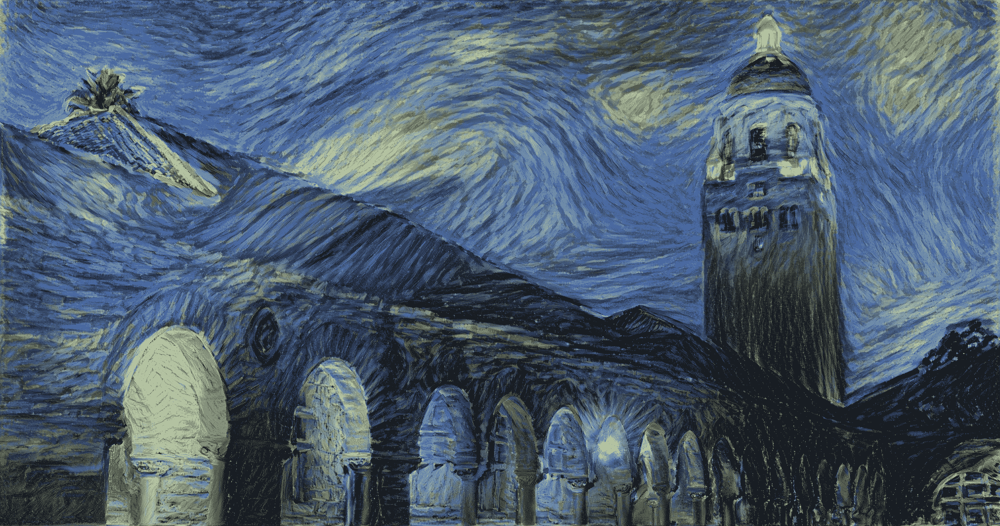

Starry Stanford

几千年来，人类文化的一个真正重要的特征是我们的艺术。没有其他物种能够创造出甚至有点像利奥·达芬奇或梵高的画的东西。甚至许多人在创作这种质量的艺术时都有困难。直到最近，随着**神经风格转移**的引入，我们能够获取一幅图像的**风格**，然后将其应用于另一幅图像的**内容**。这使得计算机有能力创建如上图所示的图像，这是一张由梵高绘制的斯坦福大学胡佛大楼的照片，以星夜为风格。在这篇文章中，我将谈论神经风格转移，然后是快速风格转移。

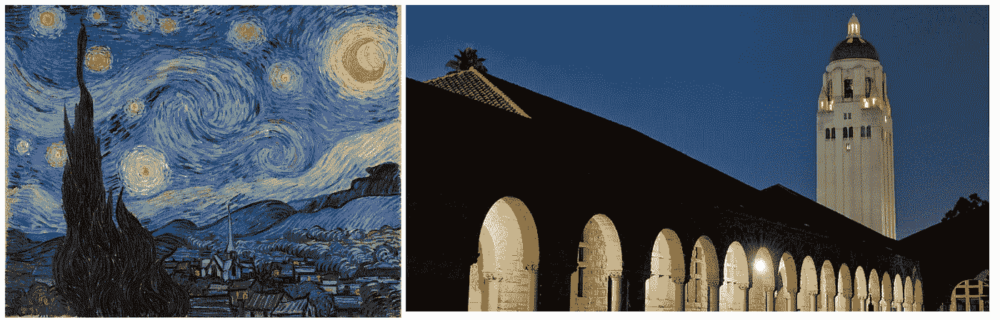

(Left: Starry Night by Van Gogh) — (Right: Hoover Tower)

## 内部运作

在计算机视觉领域，卷积神经网络一直用于从自动驾驶汽车到医疗诊断的各种应用。如果你想了解更多关于它们是如何工作的，请查看我写的关于我如何建立一个皮肤损伤分类工具的文章，[这里](/classifying-skin-lesions-with-convolutional-neural-networks-fc1302c60d54)。一旦你读过这些，你就会知道 CNN 由卷积层(检测图像中的模式和对象)和最终的全连接层(预测)组成。我们在这里真正寻找的是通过卷积层捕获的信息。

在预先训练的 CNN(如 VGG19 网络)中，前 16 层是卷积层，用于捕获特征。

Conv1_1 until Conv5_4 are all used for feature extraction. [Source](https://www.researchgate.net/figure/llustration-of-the-network-architecture-of-VGG-19-model-conv-means-convolution-FC-means_fig2_325137356).

最后一对层(FC1、FC2、softmax)仅用于返回图像中存在的不同对象的概率。我们实际上不需要这些图层来进行风格转换，因为我们不会对图像进行分类。靠近网络起点的层可以学习诸如边缘和拐角之类的真正低级的特征。在网络中向上移动，我们得到诸如形状的特征，直到我们最终达到高级特征，这些高级特征是整个对象，例如人的脸或动物的形状。

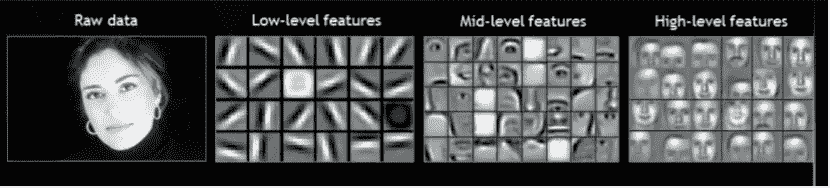

Features at different levels in a CNN. [Source](https://dzone.com/articles/deep-learning-vs-machine-learning-the-hottest-topi).

我们这里的目标是将某个图像的风格，以及某个图像的内容，转移到一个新的图像*风格化的*图像。为了实现这种双重优化，我们需要计算两次损失。一次为风格，一次为内容。

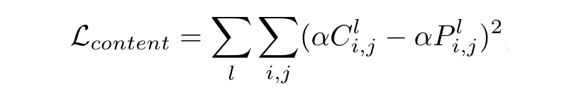

Content Loss Function

内容损失是通过测量 CNN 的输出图像与地面真实图像的相似性(欧几里德距离)来计算的，地面真实图像是它试图达到的目标。由于 CNN 中的特征地图只是一大串数字，所以它们可以用高维向量空间来表示。这意味着计算网络输出向量与地面真实向量之间的距离非常简单。我们可以从预先训练的网络(如 VGG16 网络)中检索该特征图。根据我们从网络的哪个部分获取特征地图，输出图像看起来会有所不同。如果我们选择一个真正在网络深处的层，很有可能，我们会得到一个看起来更抽象的输出图像。

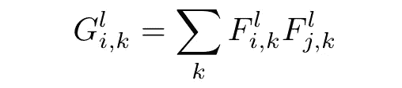

Gram Matrix

风格损失依赖于一个叫做 Gram 矩阵的数学对象。Gram 矩阵是一个向量的所有可能内积的矩阵，它非常擅长捕捉非本地化信息。因此，它从图层中的要素地图获取所有信息，并去除该信息在图像中的空间位置。基本上，这是用来提取一个图像的风格。然后，通过再次测量输出图像的 gram 矩阵与风格目标之间的相似性来计算风格损失。

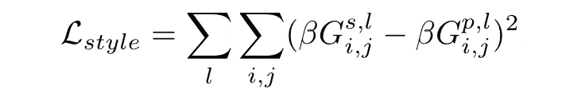

Style Loss Function

我们可以改变风格和内容重建的权重，以获得风格不同的图像。

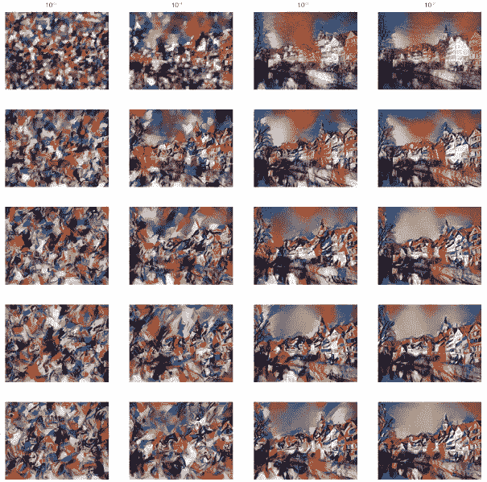

Changes in weights reflecting on output.

## 现在快点

很好，现在我们有了一个风格转换的方法，但是速度的问题仍然是一个问题。这是由于模型的架构，减少损失是一个缓慢的迭代过程，无法实时应用。在约翰逊等人的论文中提出了一个解决这个问题的非常聪明的方法。他们没有获得一个图像并将其优化为风格化，而是创建了一个神经网络，可以直接输出风格化的图像。这个流程在几个方面有所不同。不是输入两个图像(内容、风格)并获得风格化图像的迭代输出，而是使用快速风格转换，根据网络的训练内容，输入一个图像并获得预定风格的快速输出。当然，这意味着你仍然要训练一个网络，但是对于你想使用的每一种风格只训练一次。该网络的结构如下图所示。

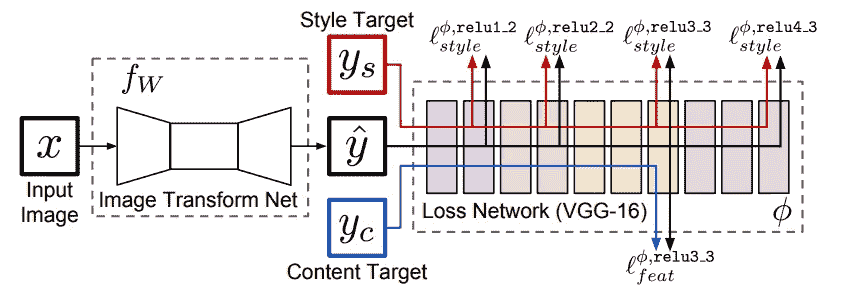

The architecture of the network.

这里，我们从特定层(3)计算生成的图像和风格化图像之间的内容损失。然后我们计算每个特征图的风格损失。然后，我们将这两个损失结合起来，形成一个整体损失。我们现在可以使用梯度下降来训练这个网络，以最小化这种全局损失。这是一个非常简单的过程，但你可以从中获得一些真正令人惊叹的艺术作品！它还将图像生成过程的速度提高了 1000 倍，同时生成了与标准神经类型转移非常相似的定性结果。你可能已经注意到这个网络有两部分，图像转换网络和损耗网络。

## 图像变换网络

这是一个简单的 CNN，具有用于网络内下采样和上采样的[残差块](/residual-blocks-building-blocks-of-resnet-fd90ca15d6ec)和[步进卷积](/types-of-convolutions-in-deep-learning-717013397f4d)。这导致输出与输入大小相同。用特征重构感知损失而不是每像素损失来训练该网络。等等…什么是知觉丧失？与更传统的每像素损失相比，它基于从预训练网络中提取的高级图像特征表示之间的差异，而不是图像中单个像素的差异。当我们试图重建图像时，每像素损失有两个问题，它们真的很慢，即使一张照片在视觉上可能与地面真相非常相似，但在数学上它们可能相差很远。这导致在试图修复这些不可见的更改时浪费了大量资源。

## 损耗网络

这只是一个权重被冻结的亏损网络。我之前解释过了。这个网络基于 VGG16 loss 网络，在[微软的 COCO 数据集](http://cocodataset.org/)上训练，该数据集是日常生活中成千上万个常见物体的集合。

如果你想深入了解这一切是如何运作的，你应该阅读提出这个想法的原始研究论文。

**这个新网络让我们风格化、实时化。**

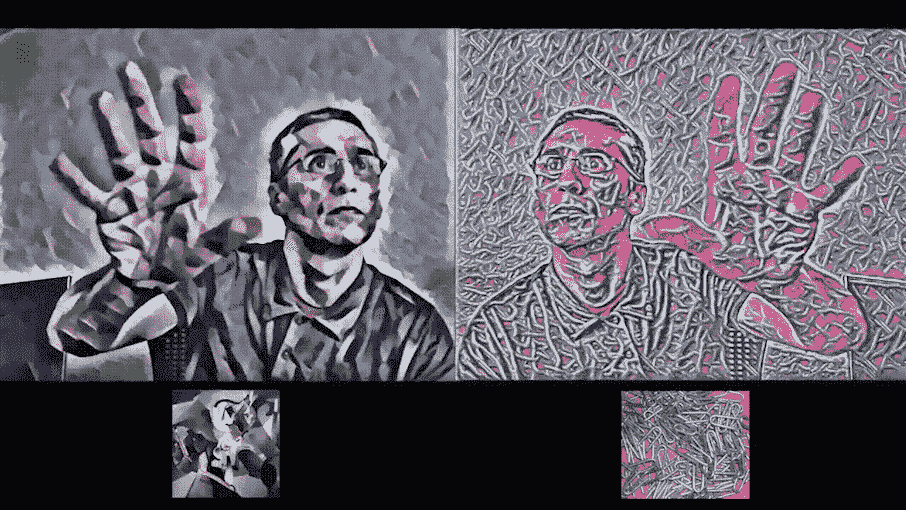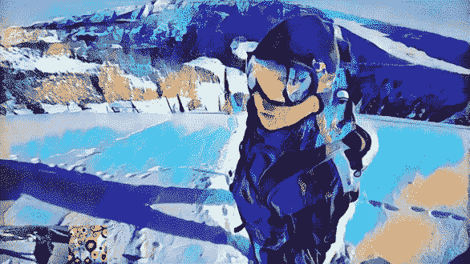

你可以在我的网站上玩这个游戏。整个事情的代码可以在我的 [Github repo](https://github.com/aryanmisra/faststyletransfer) 上找到，是用 [ML5JS 的风格转换文档](https://ml5js.org/docs/StyleTransfer)制作的，也是基于 [deeplearnjs](https://github.com/reiinakano/fast-style-transfer-deeplearnjs) 的。

另一个非常酷的演示是 NVIDIA 的快速照片风格算法，它可以创建照片般逼真的图像，**这是风格化的**。你可以查看它的源代码，[这里](https://github.com/NVIDIA/FastPhotoStyle)。

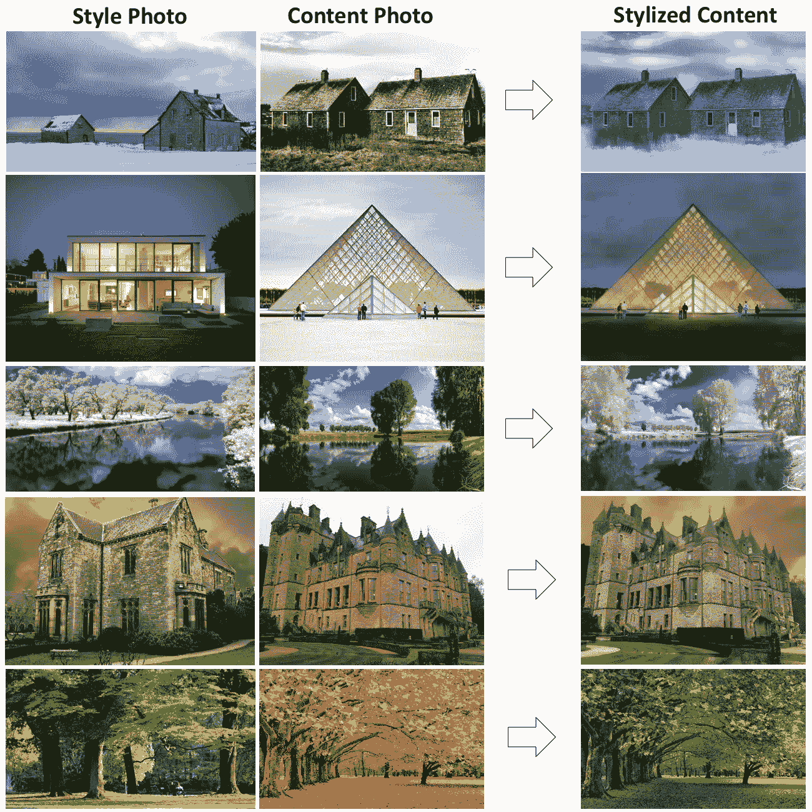

NVIDIA’s Fast Photo Style Algorithm

## 后续步骤

虽然这种技术已经很好地工作了，但在我们可以用它做什么方面仍然有一些缺点。仍然没有算法可以接受两幅输入图像并对它们进行风格转换。像这样的技术可能会导致 AR 技术领域的一些疯狂的发展，并可能成为艺术家的宝贵工具！

**如果你喜欢我的文章或者学到了新东西，请务必:**

*   在 [LinkedIn](https://www.linkedin.com/in/aryan-misra/) 上与我联系。
*   给我发一些反馈和评论(aryanmisra@outlook.com)。
*   看看这篇文章所基于的两篇论文(这里是[这里是](https://arxiv.org/pdf/1508.06576.pdf)，这里是[这里是](https://arxiv.org/pdf/1603.08155.pdf))。
*   去我的[网站](https://aryanmisra.com/styletransfer/)上玩一个快速风格转换的现场演示吧。