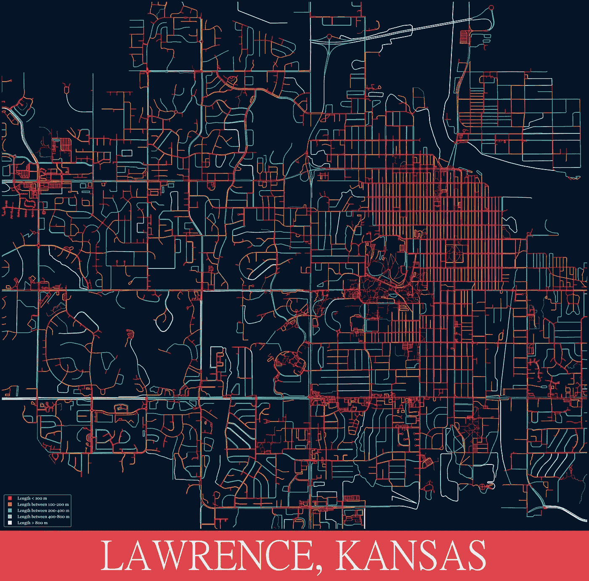
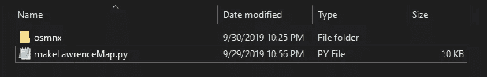
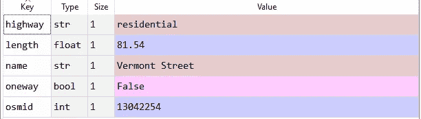
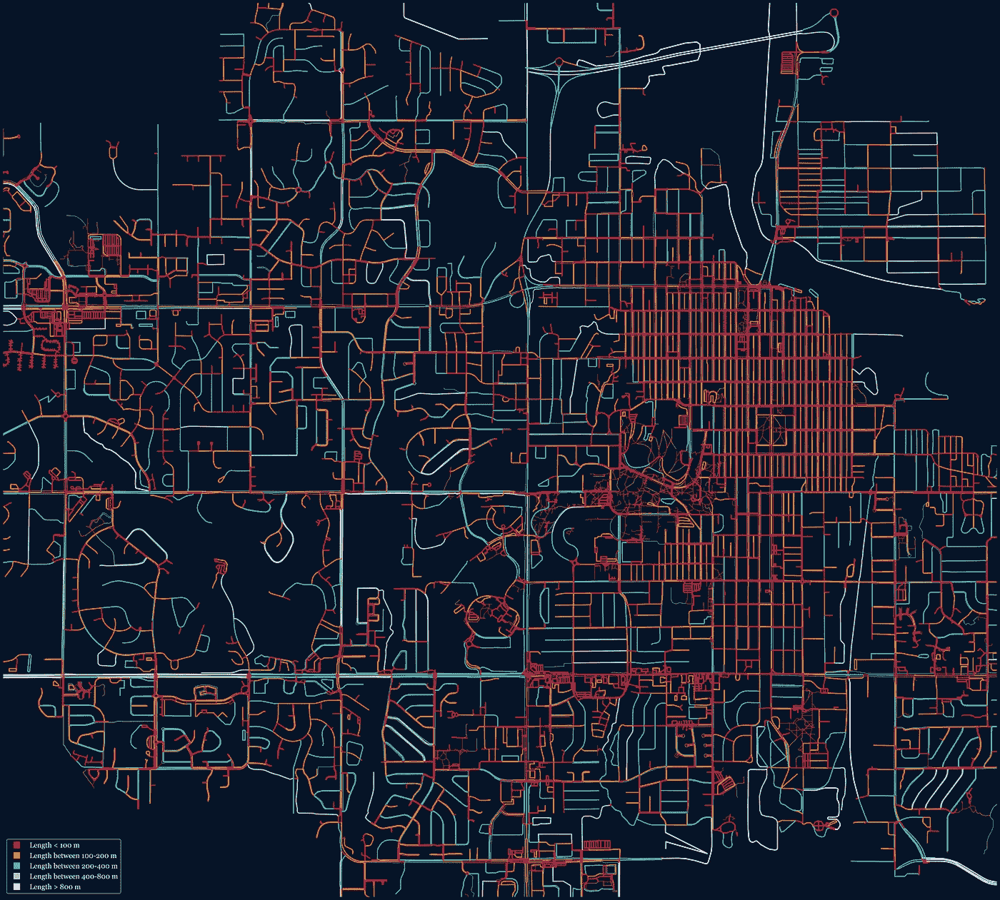
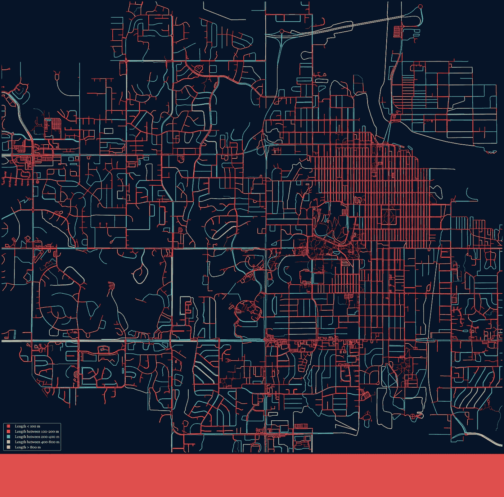
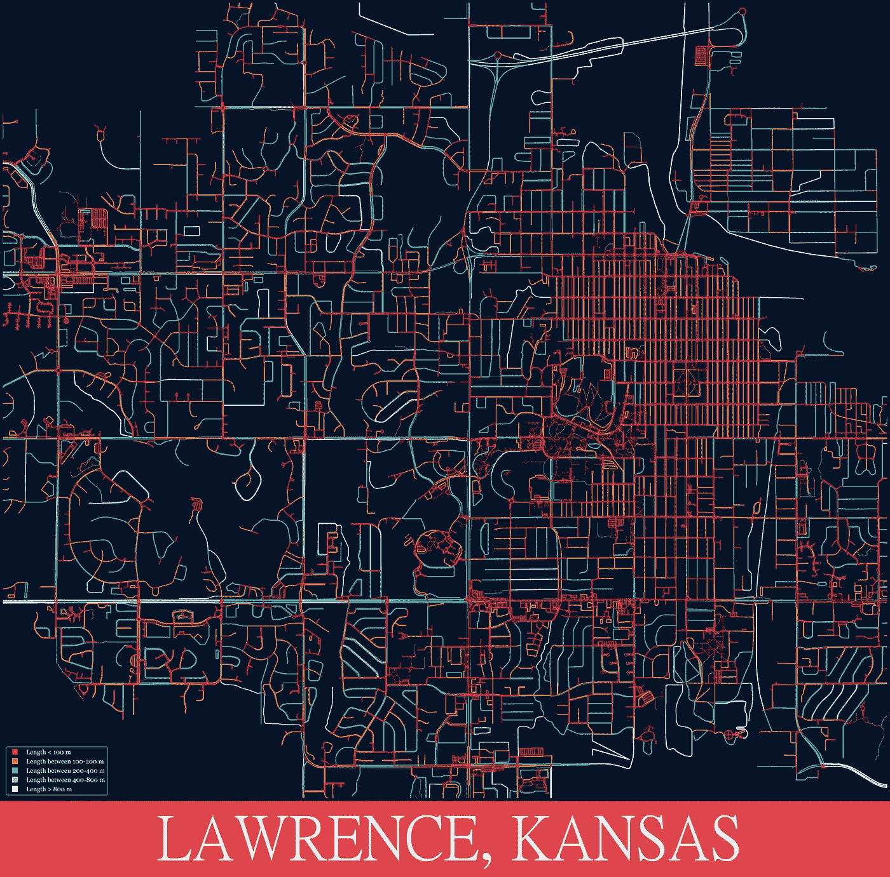

# 用 Python 制作艺术地图

> 原文：<https://towardsdatascience.com/making-artistic-maps-with-python-9d37f5ea8af0?source=collection_archive---------8----------------------->

## PYTHON 地图

## 岩石粉笔 Jayhawk！



Streets of Lawrence, Kansas colored by their length.

**目的:**我们将学习如何使用来自 [OpenStreetMap](http://download.geofabrik.de/) 的数据用 Python 构建地图。

**材料和方法:**为了获取我们的数据，我们将使用 [OSMNX](https://github.com/gboeing/osmnx) Python 包。然后，我们将对检索到的数据进行解包，并根据街道的长度为每条街道分配一种颜色。然后使用 OSMNX 功能将数据可视化。最后，我们应用某些调整，使地图美观。

**注意:**如果你是从零开始，我会建议你按照这篇[文章](https://medium.com/i-want-to-be-the-very-best/installing-keras-tensorflow-using-anaconda-for-machine-learning-44ab28ff39cb)安装所有必要的库。这篇文章的全部内容可以在我的 [GitHub](https://github.com/frank-ceballos/MakingArtisticMapsWithPython) 上找到。欢迎你来叉它。最后，为了更好地理解这篇文章，请在 PC 或 Mac 上用大显示器查看，这样你就可以看到地图的细节。


# 作者的一句话

[OSMNX](https://github.com/gboeing/osmnx) Python 包由 Geoff Boeing 编写，可用于从 [OpenStreetMap](http://download.geofabrik.de/) 中检索、建模、分析和可视化街道网络和其他空间数据。

您可以尝试使用 Anaconda 安装 OSMNX 包，但是，您最终可能会获得一个旧版本的 OSMNX，并且本文中的所有代码都将无法工作。我建议你访问 Geoff Boeing Github [这里](https://github.com/gboeing/osmnx)并下载这个包的最新版本到你的机器上。完成后，将 OSMNX 文件夹放在工作目录中。您的工作目录应该如下所示:



**Figure 1** — Working directory with the OSMNX package.

如果你比我聪明，并且能够使用 conda 或 pip 命令安装 OS mnx 0.11 版，请发表评论。我想把这一步从流程中去掉。


# 导入库

让我们从导入我们需要的所有库开始。

**Script 1** — Importing libraries.

如果你有任何问题，让我们用 Anaconda 安装缺失的包来解决。我将只讨论不常用的包，因为很可能你已经安装了 Pandas、Matplotlib 和其他广泛使用的包。

打开 Anaconda 提示符并导航到所需的 conda 环境。

要安装用于创建、操作和研究复杂网络的网络，请运行:

`conda install -c anaconda networkx`

要安装 [GeoPandas](http://geopandas.org/) 这是一个开源包，它通过允许对几何类型运行空间操作来扩展 Pandas 数据框的功能:

`conda install geopandas`

安装 [PIL](https://pillow.readthedocs.io/en/stable/) 一个用于图像处理的 Python 包:

`conda install -c anaconda pillow`

应该可以了。在我们继续之前，让我们运行一个健全性检查，以确保我们使用的是相同版本的包:

**Scrip 2** — Checking version of packages.

**脚本 2** 的输出为:

```
The NetworkX package is version 2.3
The OSMNX package is version 0.11dev
The Request package is version 2.22.0
The PIL package is version 6.1.0
```

您可能使用这些包的不同版本而逃脱，但是如果您稍后得到一个讨厌的错误，罪魁祸首可能是您正在使用的不同的包。


# 获取我们的数据

我们将为堪萨斯州的劳伦斯市制作一张地图——一个我所热爱的城市。

为了制作地图，我们需要一些空间数据。您可以通过访问此[站点](http://download.geofabrik.de/)下载 OpenStreetMap 数据。然而，我发现的最简单的方法是使用 OSMNX 包。让我告诉你这有多简单:

**Script 3** — Grabbing spatial data.

因此，通过两行代码，您可以提取任何城市的网络。`network_type`变量用来描述你要抓取的网络类型。在**脚本 3** 中，我们将`network_type`变量设置为“全部”。这意味着我们将获取人行道、街道、高速公路等的数据。为了获取可行驶街道的相关数据，将**脚本 3** 第 8 行的`network_type`变量设置为“行驶”。如果您想获取人行道的数据，请将`network_type`设置为“步行”。

**旁白**:如果您想提取德克萨斯州达拉斯和德克萨斯州阿灵顿的数据，您可以运行以下脚本:

**Script 3**a— Grabbing spatial data for two cities.

脚本 3a 可能需要一些时间来运行，因为达拉斯地区很大。如果您想要更多城市的数据，只需将它们添加到`places`列表中。我建议您访问 OSMNX [示例 Jupyter 笔记本](https://github.com/gboeing/osmnx-examples/tree/master/notebooks)来了解关于这个包的更多功能——在本文中我几乎没有展示它的功能。


# 拆开我们的数据

`ox.graph_from_place()`方法返回的`G`是来自 NetworkX 类的一个`MultiDiGraph`对象。我们可以使用`ox.plot_graph()`方法来制作地图，但首先让我们打开它，这样我们就可以为网络中的每条线段分配颜色和宽度。

**Script 4** — Unpacks the data from the G MultiDiGraph object.

**纸条 4** 拆包`G`。我们感兴趣的是保存在名为`data`的列表中。`data`中的每个元素都包含一个字典，该字典指定了一个段的属性，例如唯一 id、街道名称、最大速度、段的长度以及其他规范。下面是存储在`data`中的第一个字典的例子:



**Figure 2** — The first element of the list named data.

你可以看到第一段是一条名为佛蒙特街的住宅双向街，长 81.54 米。当路段类型为人行道/小道时，公路关键字的值将为“人行道”。人行道类型的线段可能没有名称。


# 为网络中的每个线段指定颜色和线宽

在我们制作地图之前，我们将为每一段指定一种颜色。为此，我们将遍历`data`的元素。对于每个元素/片段，我们将根据其长度指定一种颜色。然后我们将这个颜色添加到一个名为`roadColors`的列表中，这个列表稍后将作为变量传递给制作地图的方法。

**Script 5 —** Assigning colors to each segment based on their length. The length is in meters.

这里是你发挥创造力的地方。例如，您可以更改颜色，添加更多 if 语句，更改每个 if 语句的条件，根据段名或速度限制分配颜色。

最后，我们还将创建一个列表，用于定义每个线段的线条粗细。为此，我们将遍历`data`的每个元素。数据中的项目是包含“高速公路”关键字的字典。我们将使用它来确定我们拥有的细分市场的类型。如果“highway”关键字的值是“footway ”,这意味着该线段用于步行，因此我们将为该元素指定线宽 1。任何不是“人行道”的部分，我们将指定 2.5 的线宽。根据你的地图的大小，你需要使用这个值来创建一个好看的地图。

**Script 6** — Assign each segment a line width.


# 制作地图

我们终于准备好制作地图了。

**Script 7** —Making a map for Lawrence, Kansas.

制作这张地图似乎需要做很多工作，但让我来解释一下**脚本 7** 中发生了什么:

**第 4–6 行**:这里我们指定堪萨斯州劳伦斯市的纬度和经度。这是地图的中心。你可以把地图放在任何你想要的纬度和经度的中心。

**第 8–12 行**:这里我们决定了地图的边界。您应该使用这条线来控制在地图上显示什么。例如，您可以通过向第 4–6 行中定义的纬度和经度分配较小的偏移量来关注城市中较小的区域，如市中心。

**第 14–18 行**:这里我们使用 OSMNX 包的`ox.plot_graph()`方法制作地图。我建议您阅读 OSMNX 软件包文档，查看所有可用的输入。我将只讨论我在这里使用的。

`G`:这是我们在**脚本 3** 中执行的`ox.graph_from_place()`方法的输出。

`bbox`:这是一个设置地图边界的元组。下面应该是语法(北界，南界，东界，西界)。

`fig_height`和`fig_width`:图形的高度和宽度，单位为英寸。

`dpi`:每英寸点数。

`bgcolor`:用于地图的背景色。默认为白色。

`save`:布尔型。如果是，将图形作为图像文件保存到磁盘。我们将此设置为 false，因为我们还没有准备好保存该数字。

`edge_colors`:线段的颜色。我们把这个设为等于`roadColors`。你也可以只传递你想要的颜色的字符串。

`edge_linewidth`:各线段的粗细。我们将其设为等于`roadWidths`。你也可以只传递一个你想要的线条粗细的浮点数。

**第 21–47 行**:这些行组成一个自定义图例。如果你熟悉 Matplotlib，你应该不会感到陌生。

**第 49–50 行**:我们在这里保存图形。

如果您为堪萨斯州的劳伦斯市制作一张地图，其中每条线段的长度都用颜色进行了编码，那么您应该会看到以下内容:



Figure 3 — Map of Lawrence, Kansas where each segment is colored by length.

结果真的很酷。诀窍是选择正确的颜色、线条粗细、地图边界和背景色来制作一幅好看的地图。


# 向地图添加边框和文本

我们基本上完成了地图。然而，我想添加一个边界和一些文字地图，使它看起来更艺术一点。我们将首先定义一些我在 StackOverflow 中发现的助手函数:

**Script 8** — Helper functions to add border to map.

我们现在准备给图像添加一个边框。我们将只添加一个底部边框图像，但如果你愿意，你可以选择在顶部、左侧、右侧和底部添加边框。阅读 helper 函数的 docstring 以获得更多关于如何做的细节。

**Script 9**— Adding border to map.



**Figure 4** — Map of Lawrence, Kansas with a bottom border.

那看起来真的很好；).

最后，让我们添加一些文本到图像的底部边框。为此，我们首先需要下载字体。游览[ShareFonts.net](https://www.wfonts.com/font/microsoft-sans-serif)，搜索“PMINGLIU”。下载字体并将其内容解压缩到您的工作目录中。

Script 10 — Add text to the map. The font type and size are define in line 9\. The position, the text, font color, and type of font are define in line 12.



Figure 5 — Map of Lawrence, Kansas.

我们到此为止。)


# 结束语

为你的家乡制作地图，修改**剧本 3** 中的第 5 行和**剧本 7** 中的**第 5 行和第 6 行。为了给你的城市创建一个好看的地图，你必须调整地图的边界和线条的粗细。如果你不喜欢我用的颜色，欢迎你更换。我很想看看你制作的任何地图。这里是我的 GitHub 的链接，这样你就可以获得这篇文章的全部内容。**

欢迎您在 LinkedIn 上与联系。直到下一次，每天编码！