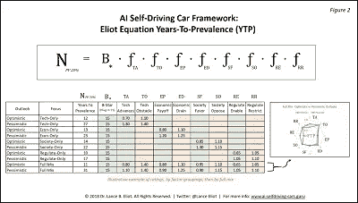

# 打赌:预测人工智能自动驾驶汽车何时会流行

> 原文：<https://towardsdatascience.com/making-bets-predicting-when-ai-self-driving-cars-will-be-prevalent-10a7ccfc0ea9?source=collection_archive---------14----------------------->

## *无人驾驶汽车问世的基本方程式*

Defining an equation for predicting when AI self-driving cars will be prevalent

我们都喜欢一个好的等式。你引用或看过多少次爱因斯坦关于物质和能量的著名方程式？

最著名的概率公式之一是著名的德雷克方程，它是由弗兰克·德雷克在 20 世纪 60 年代设计的，旨在帮助激起关于我们银河系其他地方存在生命以及我们可能能够与之交流的可能性的讨论和辩论。

在这些努力中，一个特别有争议的因素是，我们是否应该对可能存在于别处的智慧生命进行被动搜索还是更主动的搜索。被动搜索包括简单地试图捕捉任何信号的行为，然后在地球上得到内部警报，也许有什么东西在那里。主动搜索包括发出信号，让地球之外的听众知道我们在这里，我们这样做是希望引起回应。当然，引起回应对我们来说可能是好的也可能是坏的，著名的斯蒂芬·霍金曾预先警告说，我们可能会捅马蜂窝，最终导致我们自己的毁灭和灭亡。

你可能会想，除了地球以外，在我们银河系的某个地方有智慧生命的可能性有多大？

让我们首先同意，我们主要对智慧生命感兴趣，这意味着如果某个地方存在某种原始生命，而它或它们无法通过任何现代手段进行交流，我们会把这些放在一边，认为不值得去寻找。

据推测，一种智慧生命形式会发出各种各样的电磁辐射，就像我们在地球上所做的那样。20 世纪 50 年代末，天文学家弗兰克·德雷克一直在西弗吉尼亚使用大型射电天文设备扫描从我们星球反射回来的无线电波。

**一亿个世界可能可以维持生命**

科学家和天文学家不断猜测数字，特别是宇宙中可能有 1 亿个星球可以维持我们所知的生命。一亿这个数字是怎么得出来的？它是基于这样一种信念，即可能有 1000 亿个太阳，这些太阳中可能有百万分之一的太阳有各种各样的行星围绕太阳旋转，这些行星中可能有百万分之一的行星由孕育生命所需的方面组成。如果你把它相乘，你会得到一亿颗理论上可能有生命存在的行星。

弗兰克·德雷克选择组织一个小型会议，召集那些对智能生命的严肃追求非常感兴趣的人，并希望展开热烈的讨论。在为会议做准备时，他决定记下一种方法来预测我们银河系中存在智慧生命的可能性。

弗兰克提出的方程从那以后成为了著名的德雷克方程，这是对他推导出该方程的肯定。多年来，有许多人指出，这个等式没有包括许多其他因素，而这些因素本来应该包括在内。这很好，这不是弗兰克的断言，他的方程是最终的一切。

弗兰克·德雷克的方程式包括试图得出一个数字 N，这个数字据称是我们银河系中可能展示智慧并有可能与之交流的文明的数量。

德雷克方程是这样的:N = R-star x 因子 p x 因子 ne x 因子 1 x 因子 i x 因子 c x 因子 L

本质上，您将七个关键因素相乘，就会得到数字 n。每个因素在逻辑上都是合理的，因为您在进行这种估计时会考虑这些因素。这些因素倾向于相互建立，以考虑一种饼的方式来做，其中你可以分割一个饼，以递增的方式做，直到你得到最后一片。

我希望你能明白，德雷克方程其实很简单，很容易理解。我这样说并不是在贬低这个公式。事实上，我为这个等式易于理解而喝彩。

如果这个公式是神秘的，我怀疑它会获得如此广泛的兴趣和流行。

**乘以因子得到 N**

另一个有趣的方面是，这些因素都是相乘的。同样，这意味着简单。

这些因素看起来很简单，方程看起来也很简单，这使得它非常适合使用和讨论。与此同时，让我们都同意，得出这些因素的数字有点更具挑战性。事实上，关于德雷克方程的大多数争论并不是方程本身，而是人们可能插入方程中的因素的估计。

德雷克和他的同事在 1961 年根据他的公式得出的 N 是多少？这个小组决定用一个范围来表示 N 更谨慎，他们通常得出一个介于 1000 到 100000000 之间的值。

在为估计范围辩护时，你可以说他们得出了一个大于零的数字，它也小于一些真正大的数字，如估计数十亿。

德雷克方程有点像一个有用的锚。有一个主持人就像种一棵树，然后你可以看着更多的话语围绕着它生长。

这和 AI 自动驾驶汽车有什么关系？

在控制论人工智能自动驾驶汽车研究所，我们正在开发自动驾驶汽车的人工智能软件。最直言不讳的国家和世界范围内的辩论之一涉及人工智能自动驾驶汽车何时可以投入使用。这个问题不断地在会议上出现，不断地被这个领域内的人提出，也不断地被公众、监管者和许多其他利益相关者提出。

我建议我们推导出一种德雷克方程来帮助辩论。请允许我详细说明。

我想首先澄清和介绍一个概念，即人工智能自动驾驶汽车有不同的级别。最顶层被认为是第 5 层。5 级自动驾驶汽车是由人工智能驾驶的汽车，没有人类驾驶员参与。

对于低于 5 级的自动驾驶汽车，必须有一名人类驾驶员在场。人类司机目前被认为是汽车行为的责任方。人工智能和人类司机共同分担驾驶任务。

人工智能自动驾驶汽车的另一个关键方面是，它们也将在人类驾驶的汽车中行驶在我们的道路上。

**预测方程的特征**

回到预测人工智能自动驾驶汽车到来的话题，让我们考虑一个等式的特征，它可能有助于如此重要的努力。

首先，考虑谁对人工智能自动驾驶汽车的到来做出预测。

有各种各样的技术专家提供他们对人工智能自动驾驶汽车的看法，并提出我们何时能在街道上看到这些车辆。技术专家的一个好处是，他们有望精通技术，并能够判断人工智能和自主能力进展的有效性。

让我们也考虑一下，那些真正精通人工智能自动驾驶汽车并做出预测的技术专家可能会在没有任何有形的韵律或理由的情况下这样做。有时他们会发表“直觉”或本能宣言。

纵观科技的历史，我们肯定看到了相当多过于乐观的预测，但在规定的时间内都没有实现。这是一个容易落入的陷阱。

我们还需要澄清的是，人工智能自动驾驶汽车的技术可以双管齐下，提供实现自主的能力，但也因为缺乏迄今为止已知的方法、技术和计算工具而抑制了自主。因此，我发现考虑技术进步和它们是如何形成的是有用的，同时也考虑已知的技术障碍甚至是未知的，并将在未来的道路上被发现。

许多做出预测的技术专家通常不包括其他看似与技术无关的因素，这些因素可能会极大地影响技术的发展速度。有人可能会说，这是一种疏忽。

什么样的因素会影响 AI 自动驾驶汽车的问世？

**目前，投资和监管有利于人工智能自动驾驶汽车的发展**

有些经济因素要么会鼓励在人工智能自动驾驶汽车开发上的支出，要么可能会抑制和破坏这种支出，如果这些支出被抽走并用于其他目的的话。

另一个关键因素是社会和社会对人工智能自动驾驶汽车的接受或抵制。人工智能自动驾驶汽车的进展可能会面临一个艰难的选择，即让它们进入我们的公共道路，同时让它们卷入致命的车祸。

考虑监管环境以及它如何影响人工智能自动驾驶汽车的到来也至关重要。目前，关于在公共道路上使用人工智能自动驾驶汽车的法规相对宽松，并鼓励这种萌芽的创新。如果监管机构突然受到压力，要对人工智能自动驾驶汽车采取一些措施，例如当自动驾驶汽车在道路上行驶时发生死亡或受伤时，它可能会迅速转向更严格的监管环境。

**不能仅仅依靠技术专家的观点**

我相信你现在已经确信，任何试图预测人工智能自动驾驶汽车到来的等式都不应该仅仅依赖于技术专家的观点。我们希望包括经济视角、社会视角和监管视角。这提供了一个混合的视角，当只使用一个单一的因素时，将有望避免被意外地抓住或被暗算。

这些因素中的每一个都不一定相互独立。事实上，它们很可能会一起朝着同一个方向摆动，尽管有时会有延迟。

在探索一系列因素时，你可能会认为每个因素最终都可能成为人工智能自动驾驶汽车的支持者和推动者，或者每个因素都可能成为反对者，往往会对人工智能自动驾驶汽车的到来造成阻力或抑制。这是一种推拉式的紧张。至关重要的是将这种张力包含在用于做出这种预测的等式中的因素中。

除了核心因素之外，还有其他问题需要考虑。为了这个新方程的目的，让我们假设我们正在试图预测真正的人工智能自动驾驶汽车在公认标准的第 5 级的到来。

我还想提一下，我们需要就某个事物的出现意味着什么达成共识。如果你可以制造一辆 5 级的人工智能自动驾驶汽车，你是否已经达到了该项目的“降临”？不，我不这么认为。尽管你可能做得很好，达到了 5 级实例，但在我们有一些人工智能自动驾驶汽车在周围行驶之前，说它们已经出现似乎是有问题的。

有多少是降临？如果有几十辆真正的人工智能自动驾驶汽车在我们的街道上行驶，那将是一个降临，还是我们需要更多，比如数百辆，或者数千辆。真正的人工智能自动驾驶汽车的普及程度是多少？

有各种方法来衡量流行程度。我将使事情简单化，并建议我们用当时在用汽车的百分比来衡量。正如前面提到的，我们将逐渐看到向人工智能自动驾驶汽车的切换，这将看到传统汽车的退役和人工智能自动驾驶汽车的不断增加。

在所有汽车的总人口中，我们可能会同意，一旦某个百分比成为真正的人工智能自动驾驶汽车，我们就达到了普及。假设你愿意接受这个前提，那么我们可以讨论它是 1%，10%，20%，30%，40%，50%，60%，70%，80%，90%，甚至可能是 100%，然后你会把它称为流行率(我使用了十进制的整数，但它当然可以是 1%到 100%之间的任何数字)。

**让我们设定 20%为普遍意义**

我现在要用 20%。为什么？在各种研究领域，20%经常被用来表示流行程度。这来自于环境和生物学领域的研究。这似乎是一个足够大的百分比，它不是微不足道的，但也没有大到似乎有些不可能达到。

在美国现有的传统汽车数量(如上所述约为 2.5 亿辆)的情况下，人工智能自动驾驶汽车的出现将占 20%，这是一个相当令人生畏的 5000 万辆这样的汽车。这是一个令人望而生畏的数字，因为想想达到这个数字可能需要多长时间。换句话说，即使人工智能自动驾驶汽车明天就准备好了，生产那么多自动驾驶汽车也需要一段时间，这些人工智能自动驾驶汽车也需要一段时间才能购买并投入使用。

我之前预测过，一旦我们实现了真正的人工智能自动驾驶汽车，很可能会有一个相当快的采用率。我这么说是因为那些真正的人工智能自动驾驶汽车将会赚钱。当有钱可赚的时候，需求就会猛增。这不仅仅是汽车车队，正如我所说，将会有一个由个人消费者组成的完整的家庭手工业，他们将购买人工智能自动驾驶汽车，以利用这些车辆作为个人用途和赚钱。

我现在已经为建立一个方程奠定了基础，这个方程可以用来预测人工智能自动驾驶汽车的到来。

这个谜题的最后一部分是关于基督降临的基础。通过使用一个基数，然后你可以用它乘以各种因子，看看得到的 N 是等于、大于还是小于稻草人基数。我将把基地称为 B 星。

请看图 1。

我们正在尝试求解 n。有一个基本的 B 星，然后乘以八个因子。

出于定义目的:

*   n 是流行年数(YTP)，使用插入式 20%作为 PV(流行)因子
*   b 星是基本年数，然后根据每个因素进行调整

关键因素包括:

*   因子 TA: **T** 技术 **A** 进步，估计的分数
*   因素到: **T** 技术**O**b 障碍，估计的小数
*   因子 EP:**E**economic**P**ayoff，估计的小数金额
*   因素 ED: **E** 经济 **D** 雨，估计的一小部分量
*   因素 SF:**S**o 其他 **F** 偏好，估计的分数
*   因数 SO:**S**OCI etal**O**p position，估计的小数金额
*   因素 RE: **R** 调节**E**n 平衡，估计的小数金额
*   因子 RR: **R** 调节 **R** 限制，估计的小数

该等式由以下内容组成:

*   N (PV 为 20%)= B-star x TA x TO x EP x ED x SF x SO x RE x RR

根据我之前的讨论，有四个主要因素涉及技术、经济、社会和监管问题。对于每个因素，都有推-拉因素，这意味着每个因素都可以被解释为促进和推动人工智能自动驾驶汽车问世的一个因素，还有一个伴随因素是拉人工智能自动驾驶汽车问世的拉力。这是四个关键因素，考虑到推拉效应，总共有八个关键因素。

类似于前面关于方程可用性的评论，我将这个方程保持为 9 个元素，这与流行的神奇数字 7 加或减 2 的经验法则相当。这些因素都很容易理解。这个等式很容易理解。

它无意成为终极目标。它旨在提供一种讨论和辩论的基础。如果没有一个支点，关于这个问题的争论和讨论往往是空洞和迂回的。

请看图 2。

如图所示，我填充了一个电子表格来利用这个等式。

首先，我选择展示如果你只考虑单一因素的观点会发生什么。例如，您可能仅使用技术专家的视角，因此这些因素是唯一填充的因素(其余因素被假设为不在等式中，而不是说值为零，这当然会消除计算)。同样，我展示了一个单独的经济视角，然后一个单独的社会视角，一个单独的监管视角。

在电子表格的最后两行，我提供了一个完整的组合。

我还选择展示乐观主义者的观点和悲观主义者的观点，对每个单因素实例和全混合实例都这样做。这与试图得出一个范围的值，而不是一个单独的值是一致的。乐观观点和悲观观点分别提供了估计的下限和估计的上限。

对于基本的 B 星，问题是使用什么数字。因为有许多专家似乎在 15 年左右浮动，所以我在这个说明性的例子中使用了这个数字。我们可以用 5 年、10 年、20 年、25 年或 30 年，所有这些都在媒体上流传。据推测，无论你选择哪一个基数，这些因素最终都会“修正”它，使其趋向于“实际”预测。

我们正在实施德尔菲法，以达到实质性的下限和上限。德尔菲法是一种成熟的预测方法，通常被称为 ETE(估计-谈话-估计)。在这种情况下，一组人工智能自动驾驶汽车领域的专家已经参与了一系列的德尔福轮次。在每一轮中，被选中的专家可以看到其他专家的指示，并在他们认为合适的时候调整他们自己的估计。

虽然德尔菲法通常受到高度重视，但它可能因群体思维的潜力而受到批评，有时也会因过度的共识而被削弱。尽管如此，这很有启发性，也是引发关于这个话题的有益讨论的另一种方式。

**结论**

什么时候会有 AI 自动驾驶汽车的问世？一些人通过模糊的预感来回答这个问题。通过使用这里提出的等式，希望可以进行更具体和更有条理的讨论和辩论。

你可能不喜欢所用的因子，或者你可能想添加额外的因子，但至少不管怎样，这个等式让树栽下来了。在降临问题上，从这些根将会期待一个广泛复杂的事业。

一些批评人工智能自动驾驶汽车的人说，我们永远不会有真正的人工智能自动驾驶汽车。如果是这样的话，我想 N 的数字要么是零(我们将定义为它永远不会发生)，要么可能是无穷大。我想我会更乐观，会断言 N 有一个数，它既不是零，也不是无穷大，更接近于一个小于 100 的值，很可能小于 50。

方程式，我们喜欢它们，但有时我们讨厌它们(比如在考试或测验时记忆它们)。看看我提出的方程，看看你怎么想。插入一些值。仔细考虑将来可能发生的事情。虽然不是水晶球，但它是一种如何思考未来和真正的人工智能自动驾驶汽车出现的剧本。

关于这个故事的免费播客，请访问:[http://ai-selfdriving-cars.libsyn.com/website](http://ai-selfdriving-cars.libsyn.com/website)

这些播客也可以在 Spotify、iTunes、iHeartRadio 等网站上下载。

更多关于人工智能自动驾驶汽车的信息，请参见:[www . AI-self-driving-cars . guru](http://www.ai-selfdriving-cars.guru)

*版权所有 2019 兰斯·艾略特博士*