# 教计算机理解推文的情感

> 原文：<https://towardsdatascience.com/making-computers-understand-the-sentiment-of-tweets-1271ab270bc7?source=collection_archive---------16----------------------->

## 因为我们真的不想读唐纳德·特朗普写的所有东西

Donald Trump is well-known for many things, like his extensive use of Twitter and changing opinions faster than he breathes. What if we could get computers to read his tweets and understand his and his followers opinions towards a given topic? Photo credit: NICHOLAS KAMM/AFP/Getty Images

理解一条推文是正面的还是负面的是人类很少会遇到的问题。然而，对于计算机来说，这是一个完全不同的故事——复杂的句子结构、讽刺、比喻性的语言等等。让计算机很难判断一句话的意思和情绪。然而，自动评估一条推文的情绪将允许人们对各种问题进行大规模的意见挖掘，并有助于理解为什么某些群体持有某些观点。

在更基本的层面上，理解文本的情感是自然语言理解的关键部分，因此，如果我们希望计算机能够与我们有效地交流，这是一项必须解决的任务。

在这篇博文中，我将展示一个小型研究项目的成果，该项目是谢菲尔德大学 [SoBigData](http://sobigdata.eu/index) 项目的一部分。我们测试了处理文本的不同方法，并分析了它们能够提取多少情感。请继续阅读，全面了解该项目及其成果！

# 介绍

该项目的目的是测试计算机使用机器学习能够在多大程度上理解文本的情感。为了做到这一点，我们给电脑输入了大量的推文，每条推文都被人类标记为积极、中立或消极的情绪。每条推文也有一个相关的主题，这一点很重要，因为根据讨论的主题，一个句子可以有非常不同的情感。例如，如果我们谈论质量，“高”这个词是肯定的，但如果我们谈论价格，这个词就是否定的。“绿色”在讨论环境问题时是积极的，但在讨论艺术时可能是中性的。现在，计算机的任务是预测给定推文和相关主题的情绪。

## 计算机如何阅读文本？

如果你没有机器学习的经验，这可能看起来是一个奇怪的问题。但机器学习是基于统计的，所以机器学习系统要处理的任何东西都必须用数字来表示。将文本转换成数字发生在所谓的 [*嵌入模型*](https://en.wikipedia.org/wiki/Word_embedding) 中，开发这些本身就是一个主要的研究领域。嵌入模型将一个单词或一个句子变成一个向量，这个向量在训练过程中不断调整，使得具有相似含义的单词和句子以相似的向量结束。理想情况下，向量应该捕捉含义、上下文、情感等。但是这并不是一件容易的事情，这也是为什么许多不同的嵌入模型被开发出来的原因。一般来说，新型号性能更好，但它们也可能针对特定任务进行调整。

成熟的机器学习系统能够在情感分析方面达到最先进的水平，这是一种野兽。它们由多个组件组成，文本嵌入只是其中之一，而且通常很难评估系统的哪些部分是性能瓶颈。由于任何文本都需要表示为一个向量，以便机器学习系统能够处理它，所以任何分析，包括预测推文的情绪，都严重依赖于所选择的嵌入模型。但这并不是说系统的其他部分可能同样重要。

为了使文本嵌入的作用和贡献更加透明，我们开始用一个设计为最小模糊的系统来测试它们预测情感的性能。

## 我们如何预测情绪？

我们预测情感的方法非常简单，并且受到了协同过滤的启发。每条推文都有一个相关的主题，根据主题评估情绪是非常重要的(因为一个陈述很容易对一个方面持肯定态度，而对另一个方面持否定态度)。因为 tweet 和相应的主题都由相同维度的向量表示，所以我们可以取两者的内积，给我们一个表示情感的数字。没有理由认为这应该与“原始”嵌入一起工作，所以在取内积之前，我们学习并应用一个*变换*(稍后将详细描述)到主题向量空间。这样，即使之前没有看过题目，也能得到感悟。

我们希望能够预测三种不同的情绪(积极、中立、消极)，所以我们实际上学习了*话题空间的三种*不同变换:一种预测积极情绪，一种预测中立情绪，一种预测消极情绪。当将推文与三个转换后的主题向量中的每一个进行内积时，我们会得到三个数字，可以理解为模型对每一种情绪的押注——数字越高，模型越相信这就是推文的情绪。

## 项目摘要

我们想测试不同的单词嵌入为一条推文的情感带来了多少信息。为了预测情绪，我们训练了一个模型，该模型学习主题向量的三种转换，使得推文和三个主题向量中的每一个的内积将是模型对三个情绪中的每一个的投票。

我们有几个不同的选择。首先，我们必须选择要测试的嵌入模型。其次，我们需要决定如何转换主题向量。第三，我们需要一个已经被人类贴上情感标签的推特数据集，这样我们就有东西来训练和测试这个模型。

# 决定设置

## 数据集

我们使用了为 [SemEval-2017 任务 4](http://alt.qcri.org/semeval2017/task4/) 提供的英语数据集。这由大约 26k 条不同主题的推文组成，所有推文都被人工标注了情绪。我们保持任务组织者定义的划分，大约 20k tweets 用于训练，6k tweets 用于测试。

## 嵌入模型

我们选择测试以下四种嵌入模型:

1.  【2003 年的神经网络语言模型 (NNLM)，这是用神经网络学习单词嵌入的最早尝试之一。该模型构建了 128 维的单词向量，并将作为一种单词嵌入基线，这是更高级的模型应该明显胜过的。
2.  如上所述的神经网络语言模型，但现在使用了标准化的单词向量，这有时会产生更好的结果。
3.  [来自 2018 年初的语言模型](https://arxiv.org/abs/1802.05365) (ELMo)的嵌入，已被证明在许多不同的任务中实现了最先进的结果。构建 1024 维单词向量。
4.  [通用句子编码器](https://arxiv.org/abs/1803.11175)(使用)来自 2018 年初，一个经过训练的模型，可以在许多任务中找到有用的单词嵌入。构建 512 维单词向量。

所有四种嵌入模型都可从 [TensorFlow Hub](https://tfhub.dev/) 方便地获得。

## 转换模型

选择转换主题向量空间的模型是很棘手的。一方面，我们希望尽可能保持原始向量空间不变。另一方面，我们希望转换足够灵活，使得单词嵌入中的信息实际上可以用于预测情感。因此，我们决定测试两种不同的转换模型:

*   一个简单的仿射变换。这种转换只能表示最基本的转换，如缩放、旋转、剪切和平移，因此，在某种意义上，这将测试“原始”嵌入捕获了多少信息。
*   由神经网络表示的更复杂的转换。我们使用具有两个隐藏层的神经网络，每个隐藏层具有 8 倍的嵌入维数、ReLU 激活函数和丢失。网络将主题向量作为输入，并输出转换后的主题向量。这种变换可以以高度非线性的方式扭曲主题空间，因此应该能够获得更高的精度。然而，它将更难训练，并且可能更容易过度适应训练集。

最终的模型将学习上述每种类型的三种转换，对应于我们想要预测的三种情绪。

# 纠正数据集中的不平衡

处理真实数据总是具有挑战性。特别是，如果单个情绪或主题被过度表达，模型可能会在训练过程中完全专注于此，这将使其他情绪或使用其他主题的预测远离。相反，我们希望确保该模型对所有主题和观点给予同等的权重，无论它们出现的频率如何。做出这些修正的效果是相当戏剧化的，也是值得记住的一课，所以让我们花几分钟来讨论这个问题。

## 数据集中的不平衡

绘制每个情绪的推文数量，数据集显示了巨大的阶级不平衡。

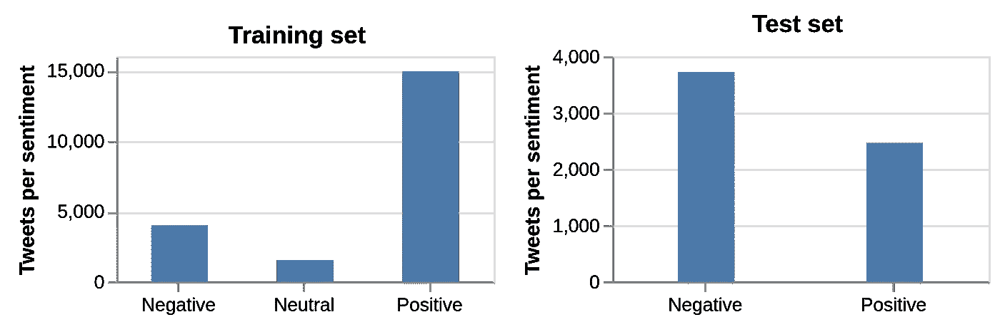

Distribution of sentiment classes for both the training and the test set.

特别是积极的情绪在训练数据中表现得非常突出——事实上，几乎 73%的训练推特都有积极的情绪。这意味着该模型将从学习预测积极情绪中比其他任何模型受益更多。另一方面，中性情绪与不到 10%的推文相关，如果有助于预测积极情绪，模型可能会简单地学会忽略这种情绪。

测试集中的分布明显不同。负面情绪比正面情绪更丰富，没有一条推文有中性情绪。这使得让模型平等地对待所有情绪变得更加重要。

事实上，对 NNLM 的仿射变换模型的测试表明，由于积极情绪在训练数据中普遍存在，训练的模型明显倾向于积极情绪。在这个测试中，训练数据中的主题被分成分别包含 90%和 10%主题的训练集和评估集。

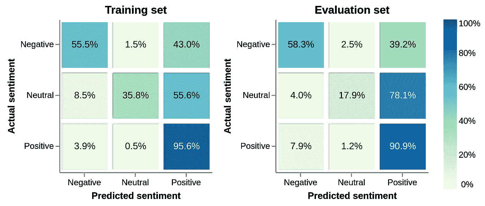

A [confusion matrix](https://en.wikipedia.org/wiki/Confusion_matrix) showing the actual sentiment of the tweets versus what the model predicted. The percentages show how often a specific, actual sentiment was predicted to be any of the three sentiments by the model. A perfect model would have 100% along the diagonal, meaning that the predictions are always correct. Here, however, it is seen that the model often chooses to predict positive sentiment, regardless of what the actual sentiment is.

该图示出了情绪预测的[混淆矩阵](https://en.wikipedia.org/wiki/Confusion_matrix)，其中每一列对应于一个预测的情绪。每一行都显示了实际的情绪，对于每一行，每个矩阵元素的数量和颜色显示了具有这种实际情绪的推文的百分比，这些推文被预测为具有列中显示的情绪。

理想情况下，对角线应该接近 100%，这意味着预测的情绪对于几乎所有的推文都是正确的，但即使对于训练集来说，也有大量的非对角线元素。这意味着，即使模型知道正确的情绪，它也更倾向于默认预测积极的情绪。43%的负面情绪推文和超过 55%的中性情绪推文被预测为正面情绪。这对于分别为 39%和 78%的评估集来说更糟糕。

然而，在训练集和测试集中，每个主题的 tweets 数量也有很大差异。

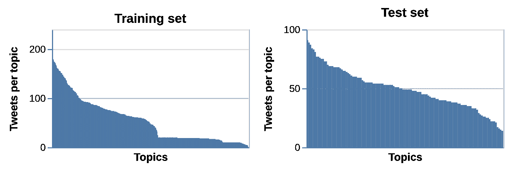

Number of tweets associated with each topic for both the training and the test set. The topics have been sorted from left to right based on the amount of associated tweets and the their names have been omitted for clarity.

特别是对于训练集，我们看到每个主题的推文数量有明显的差异-一些主题有超过 100 条推文，而大约一半的主题只有大约 20 条或更少。

回到仿射模型的测试，查看给定主题的推文的情绪预测的平均准确性，显示推文越多的主题通常准确性越高。

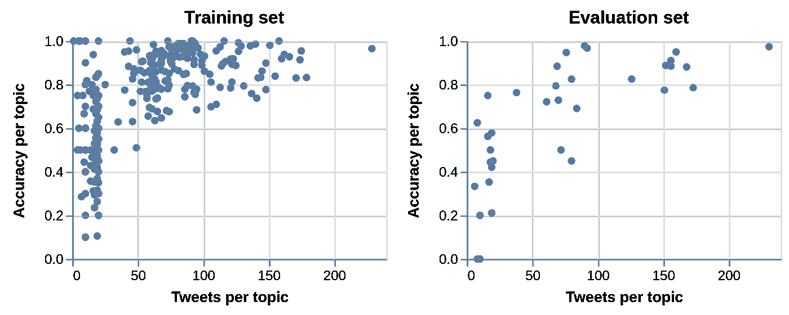

The average accuracy of sentiment prediction for tweets in a given topic. There is a clear tendency in that topics with more associated tweets generally achieve a higher average accuracy.

这种趋势是有道理的:模型更多地受益于学习一种转换，这种转换对于有更多 tweets 的主题很有效。但这实际上并不是我们想要的，因为这意味着模型可能无法*很好地概括*。我们希望模型即使在看不见的主题上也能表现良好，在这方面过度适应几个主题可能没有帮助。

处理此类类别不平衡的一种方法是通过类别频率的倒数来衡量模型因错误预测而受到的惩罚。这意味着，对于频率较低的数据，模型会收到较大的误差，因此会更加关注这些数据。让我们看看这对模型的训练有什么影响。

## 纠正情绪失衡

仅用情感频率的倒数来重新训练模型和惩罚错误，我们已经获得了一个好得多的模型。

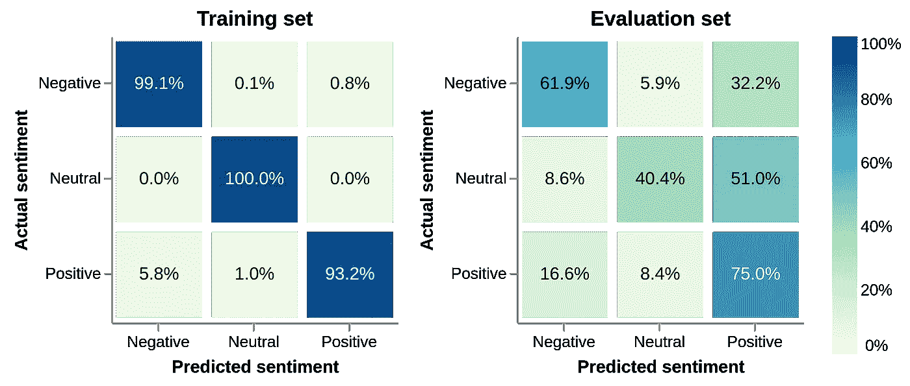

Confusion matrices for the affine model on NNML, correcting for sentiment imbalances in the training set.

对于训练集，所有情感的对角线接近 100%。评估集上的预测也有所改进，尽管还有很大的改进空间。

我们还看到训练集的每个主题的准确性有所提高，尽管这不是明确鼓励的。

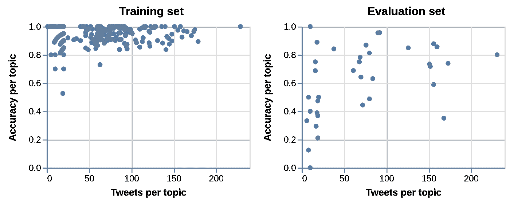

Average topic accuracy for the affine model on NNML, correcting for sentiment imbalances in the training set.

有趣的是，评估集上的性能似乎有所下降。一种解释可能是，评估集中的大多数推文都有积极的情绪，因此该模型现在牺牲了一些准确性，以更好地表现消极和中性的情绪。

## 纠正主题不平衡

接下来，让我们看看当只使用话题频率的倒数来惩罚错误时会发生什么。这也导致了对训练集更好的情绪预测，这可能是因为不管与主题相关的推文数量如何，对主题进行同等加权会使模型暴露于更多种多样的情绪。

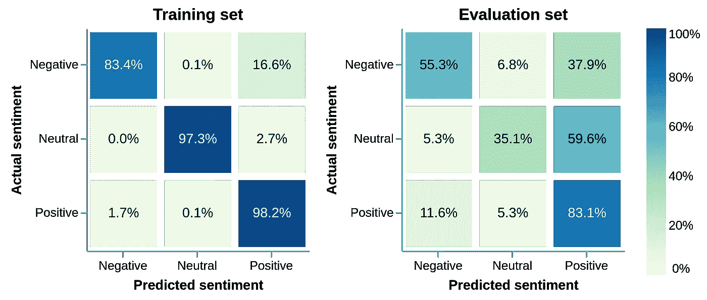

Confusion matrices for the affine model on NNML, correcting for topic imbalances in the training set.

但是真正的效果是在查看每个主题的准确性时看到的。对于训练集来说，准确率现在基本上与一个主题中的推文数量无关，大多数主题都接近 1。

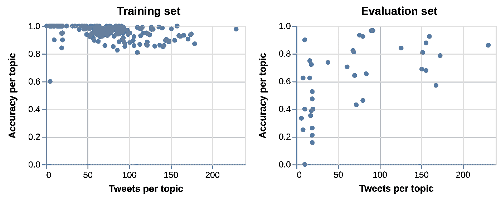

Average topic accuracy for the affine model on NNML, correcting for topic imbalances in the training set.

## 修正情绪和主题的不平衡

最终的模型将基于情绪和主题的频率来衡量错误预测的惩罚。这是通过简单地将主题频率和情感频率的倒数相乘，并使用结果数量作为权重来完成的。这应该鼓励模型在训练期间平等地对待所有情绪和所有主题。

由此产生的模型确实看起来是情感和主题不平衡之间的一个很好的权衡。情绪预测相当准确，在评估集上的性能没有受到影响。

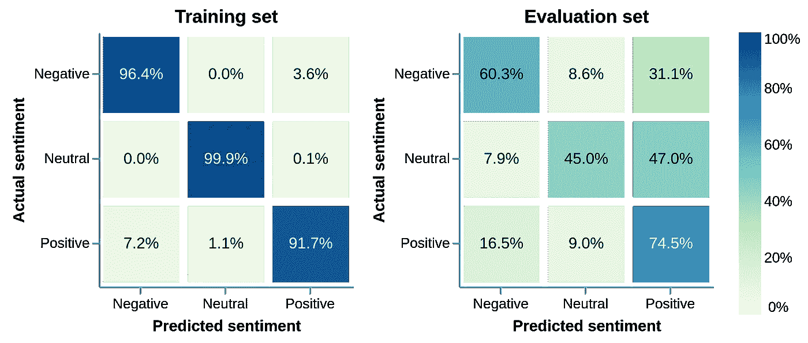

Confusion matrices for the affine model on NNML, correcting for both imbalances in the training set.

每个主题的平均准确率再次独立于与该主题相关的 tweets 的数量。

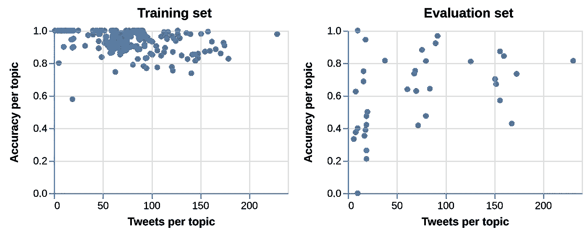

Average topic accuracy for the affine model on NNML, correcting for both imbalances in the training set.

虽然校正类不平衡对训练集明显有帮助，但在评估集上的性能仍然没有明显变化。该模型似乎不能很好地推广到新的主题，这可能意味着仿射变换限制性太强，或者训练集不能很好地代表评估集。当我们看最后的实验时，我们将回到这一点。

# 把所有的放在一起

现在，已经考虑了数据集中的类别不平衡，并且已经决定了嵌入和转换模型，我们准备测试模型，并且查看单词嵌入已经能够拾取多少情感信息。

设置遵循标准的机器学习方法:我们使用 10 折[交叉验证](https://en.wikipedia.org/wiki/Cross-validation_(statistics)) (CV)训练模型，并在测试集上评估每个折的最佳模型。这为我们提供了一种方法，当在(稍微)不同的数据集上训练时，我们可以预期模型的性能会有多大的变化。

包含一些基线实验总是一个好主意。这些应该是你能想象到的最简单的方法，如果你的高级模型不能战胜它们，你就知道有问题了。我们选择了两个简单的基线:1)使用来自训练集的最频繁的情感(这将是“积极的”)作为任何推文的预测，以及 2)使用来自训练集的随机情感作为预测。

下图显示了对所有八个模型和两个基线进行训练以及对未知测试集进行评估的结果。穿过数据点的垂直线表示穿过 10 个 CV 倍的一个标准偏差。

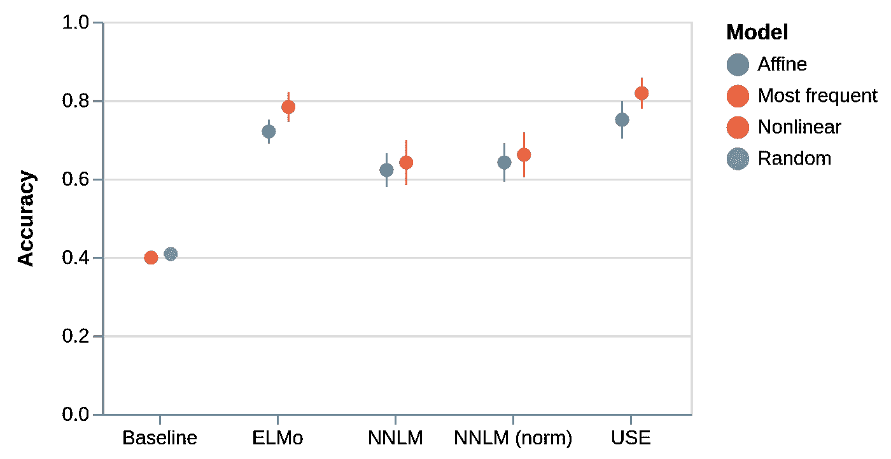

这里有许多有趣的观察要做。首先，任何嵌入模型都比基线有很大的改进。因此，正如预期的那样，单词嵌入捕捉到了可用于推导推文情感的信息。其次，转向 NNLM 嵌入，与仿射模型相比，当使用非线性模型时，似乎没有任何改进。这是有趣的，因为它表明嵌入空间足够简单，以至于仿射模型能够使用嵌入中可用的所有情感信息。这与较新的嵌入(ELMo 和 USE)形成对比，在 ELMo 和 USE 中，当使用非线性模型时，我们确实观察到改进，这表明这些模型学习的嵌入空间更复杂。对于 NNLM 来说，标准化的向量确实有比非标准化的向量表现更好的趋势，但在我们的实验中，这种影响并不显著。最后，虽然 ELMo 和 USE 都包含比 NNLM 嵌入更多的信息，但它们在这些实验中的表现非常相似。USE 包含的信息似乎比 ELMo 稍多，但并不多。然而，这仍然是有趣的，因为使用嵌入空间的维数比 ELMo 空间低得多，因此，模型的训练要快得多。

# 我们到了吗？

不，绝对不行。关于单词嵌入的信息内容，有许多有趣的问题需要回答。

例如，我们用三分制(消极、中立、积极)来处理情绪。扩展到更细粒度的情感，比如五分制，将需要更多的嵌入。嵌入包含这么多信息吗？

询问巨大的嵌入空间是否必要也是合理的。ELMo 嵌入是 1024 维的，但是信息可能嵌入在更低维的空间中。嵌入空间的维数减少如何影响情感的预测？

当测试主题空间的两种不同转换时，我们发现只有较新的嵌入需要非线性转换。扩展转换的类型，包括创建一些更复杂的神经网络，以及测试哪些嵌入受益于哪些转换，这将是很有趣的。这可能会让我们深入了解不同嵌入空间的复杂性。

# 外卖

在这个项目中，我们想测试不同的单词嵌入携带了多少关于推文情感的信息。我们通过构建两个模型来预测尽可能无干扰的情感，使我们能够看到原始单词嵌入包含多少情感信息。

结果显示，新旧单词嵌入确实携带了情感信息，并且新的嵌入比旧的嵌入包含更多信息，这并不奇怪。结果还表明，对于较新的嵌入，主题向量的非线性变换比仿射变换表现得好得多，这表明这些空间比较旧的嵌入更复杂。

总之，单词嵌入通常包含很多关于推文情感的信息，新的嵌入包含更多的信息。虽然并不令人意外，但它强调了高级嵌入模型对预测推文情绪的重要性。

# 承认

该项目是谢菲尔德大学计算机科学系 [SoBigData 2017 短期科学任务(STSM)](http://sobigdata.eu/content/open-call-sobigdata-funded-transnational-access) 的一部分，与 [Diana Maynard](https://twitter.com/dianamaynard) 博士合作完成。非常感谢 [Isabelle Augenstein](https://twitter.com/IAugenstein) 博士在整个项目过程中提供的大量讨论和建议。