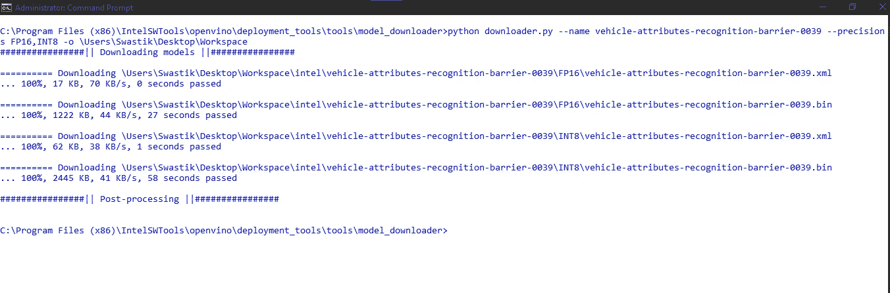
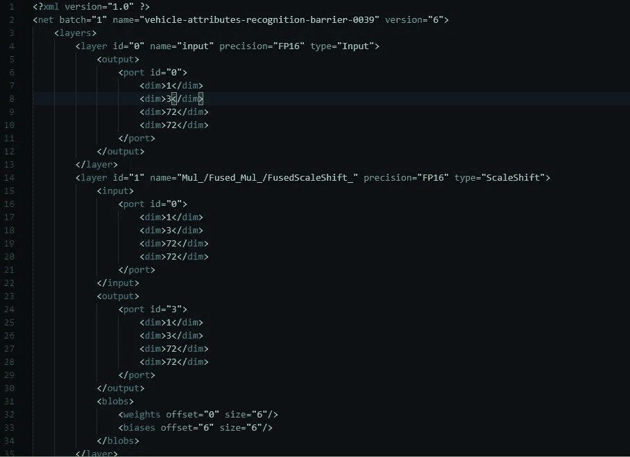
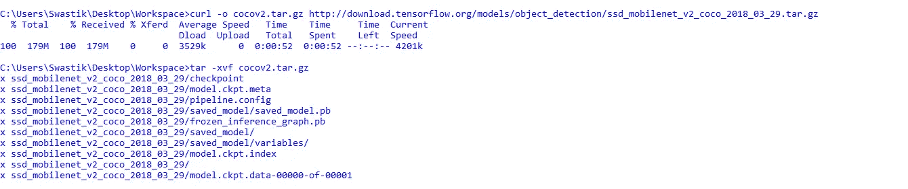
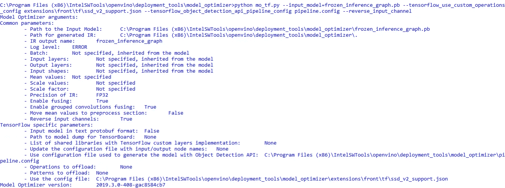
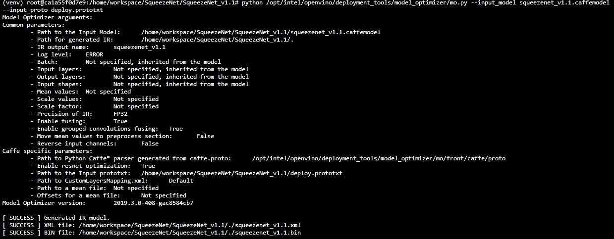

# 利用 OpenVINO toolkit，让深度学习模型为最坏的情况做好准备，并为跨平台做好准备。

> 原文：<https://towardsdatascience.com/making-deep-learning-models-ready-for-the-worst-case-scenario-and-cross-platform-ready-with-c62284f87808?source=collection_archive---------29----------------------->


Photo by [Fatos Bytyqi](https://unsplash.com/@fatosi?utm_source=medium&utm_medium=referral) on [Unsplash](https://unsplash.com?utm_source=medium&utm_medium=referral)

随着 2020 年的到来，深度学习专家和爱好者社区期待着该领域创新的重要一年。随着世界各地每天都在构建越来越多的深度学习模型，人类对云和网络(尤其是 TCP)的依赖日益扩大。你可能会想，云依赖有什么问题吗？

## 最坏的情况:

估计你家里有一个面部检测锁，但建造不当，因为开发人员将模型安装在云上，设备必须使用云服务进行推理。现在，突然有一天，当你面对一个非常糟糕的网络连接，并且没有配置任何安全覆盖方法时，你将成为你的安全系统的受害者。

这种情况的另一个真实例子是位于印度奥里萨邦 Bhuvneshwar 的一家著名多专业医院的故事。他们训练有素地拥有一个深度学习网络，经过适当的训练和领域专业知识的调整，但它的实现方式是，它必须通过 TCP 将患者每秒的心率作为流发送到 web 服务器，以确定心肌梗死。在一场毁灭性的飓风袭击了沿海的奥里萨邦后，这个系统就没用了，因为根本没有手机连接。

如果不采取适当的步骤来部署在任何时刻做出关键决策所需的深度学习模型，该模型可能会面临最糟糕的考验。随着深度学习模型在关键决策操作中的快速发展，如果不考虑边缘情况进行配置，它可能会面临相同的抖振情况。如果安全监控或医疗保健系统突然失灵，可能会发生巨大的问题。

为了使这些模型免受这些问题的影响，我们需要以这样一种方式实现这些模型，即这些模型可以执行实时决策，而不需要连接到任何其他云服务或互联网。事实证明，这种方法更加安全，因为部署的模型在互联网范围之外，因此需要最高安全级别的工作负载可以直接在设备中实施。爱好者称这些 AI 模型为 Edge AI。在这个方案中，模型被直接放置在设备中，并且它们不需要网络连接来进行推理。我们现在将了解这是如何实现的。

## 中间代表:

我们使用 Tensorflow、Caffe、Pytorch、ONNX 等不同框架构建和训练的模型。可能非常大、资源匮乏，也可能依赖于架构，例如受限于特定平台或 CPU/GPU 内核。为了使这些模型能够成功地从任何设备或任何地方提供推理，我们需要将模型转换为中间表示格式，这包括模型在。xml 格式以及。bin 格式。

## 使用 OpenVINO toolkit 获取不同的模型并将其转换为 IR 格式:

OpenVino Toolkit ( *开放视觉推理和神经网络优化工具包* ) 是**OpenCV 团队最初开发的一个开源深度学习工具包，包括不同的工具，使用**模型优化器**工具将不同的深度学习模型转换成 IR 格式。在转换由不同框架组成的模型的过程中，模型优化器工具只是作为一个翻译器，它实际上只是翻译经常使用的深度学习操作，如我们看到的 Tensorflow、Conv2D、Conv3D、Dropout、Dense、BatchNormalization 等。对于 Caffe，我们使用卷积、dropout_layer 等。并使用来自训练模型的相关权重和偏差来调整它们。英特尔发布的 OpenVINO toolkit 在以下网站上提供了大量不同的预训练模型，您可以将其部署到不同的设备上。这些预先训练好的模型可以通过**模型下载器**工具直接下载。使用模型下载器工具下载的预训练模型已经以具有不同精度级别的中间表示格式出现。这些精度水平实际上是模型的保存的权重和偏差的精度水平。不同的精度级别包括 FP32(32 位浮点)、FP16(16 位浮点)、INT16(16 位整数)、INT8(8 位整数，仅适用于预训练模型)等等。这些精度级别实际上很重要，因为它们易于部署到不同的平台上。精度越低，结果越不准确，但模型运行所需的资源少得多，因此可以完全部署到边缘设备中，而不会严重影响设备和模型的性能。让我们看看如何使用模型下载器从英特尔 OpenVINO toolkit 网站下载预先训练好的模型，以及如何使用它们对给定输入进行推断。**

**以下是预训练模型的链接，包含在输入模型之前对输入进行预处理的文档。**

**[](https://docs.openvinotoolkit.org/latest/_models_intel_vehicle_attributes_recognition_barrier_0039_description_vehicle_attributes_recognition_barrier_0039.html) [## 车辆-属性-识别-障碍-0039-open vino 工具包

### 该模型提出了一种用于交通分析场景的车辆属性分类算法。颜色平均…

docs.openvinotoolkit.org](https://docs.openvinotoolkit.org/latest/_models_intel_vehicle_attributes_recognition_barrier_0039_description_vehicle_attributes_recognition_barrier_0039.html) 

假设在您的本地机器上安装并正确配置了 OpenVINO toolkit，那么让我们直接进入下载上述模型的过程。转到您的 OpenVINO 安装目录，使用管理员权限打开终端或命令提示符。现在，要下载上述模型，发出以下命令:

```
python C:/<OPENVINO_INSTALLATION_DIRECTORY>/openvino/deployment_tools/tools/model_downloader/downloader.py --name vehicle-attributes-recognition-barrier-0039 --progress_format=json --precisions FP16,INT8 -o \Users\<USER_ID>\Desktop
```

上述命令使用 downloader.py python 程序来解析命令行参数:

1.  — name:用于提供模型名称(如果用“— all”代替— name，将下载所有可用的预训练模型)。
2.  —精度:用于提供不同的精度级别(如果没有提供，将下载模型的所有可用精度级别)
3.  — progress_format=json:将进度报告的格式设置为 json 格式，程序可以对其进行分析。



Downloading pre-trained models from OpenVINO toolkit already in Intermediate Representation format.

中检查上述模型的中间表示。它是模型的架构模式。bin 文件包含权重和偏差。在。xml 文件，你可以在 XML 标签之间看到深度学习模型的不同层和属性可以在上面的格式中感知。

```
<layers>
............
<layer >  .......... </layer>
<layer> ...........</layer></layers>
```



.xml file of the pre-trained model

## 使用中间表示进行推理:

使用 IR 模型格式进行推理非常简单。对于上面的这个模型，我们需要根据输入尺寸对图像进行预处理，并恢复颜色通道。对于推理网络，我们需要使用。load_model()函数与模型。xml 文件

```
from inference import Network
inference_network = Network()
inference_network.load_model("/<MODEL_DOWNLOAD_FOLDER>/vehicle-attributes-recognition-barrier-0039.xml","CPU",   "/<OPENVINO_INSTALL_DIRECTORY>/openvino/deployment_tools/inference_engine/lib/intel64/libcpu_extension_sse4.so")
inference_network.sync_inference(preprocessed_image)
output = inference_network.extract_output()
```

现在需要处理推理网络的输出，并且需要使用 argmax 函数选择最大值。因此，我们需要以下面的方式处理输出，以确定汽车的类型及其颜色，并将文本叠加到输入图像上，作为推断的结果。

```
def handle_car(output, input_shape):
    color = output["color"]
    color_class = np.argmax(color)
    car_type = output["type"]
    type_class = np.argmax(car_type)
    return color_class, type_class
```


Input Image in the left. After the inference, the output is printed on top of the image.

## 将张量流模型转换为中间表示；

为了将 Tensorflow 模型转换为 IR 格式，我们需要获取保存在中的 Tensorflow 中训练的模型。pb 格式。剩下的非常非常简单，很容易实现。为了使用 OpenVINO 模型优化器将模型转换为 IR 格式，需要冻结张量流图。冻结 Tensorflow 模型意味着删除模型的预处理和训练相关元数据，以减小模型的大小，从而更容易部署。Tensorflow 提供了冻结和解冻深度学习图的内置功能。*.ckpt 文件包含冻结张量流模型的元图。

```
from tensorflow.python.tools import freeze_graph
freeze_graph.freeze_graph('Model.pbtxt', "", False,                           './Model.ckpt', "output/softmax",                           "save/restore_all", "save/Const:0",                           'Model.pb', True, "")
```

由于模型现在被冻结，所以它现在可以被直接转换成中间表示。以管理员权限进入终端或命令提示符，键入以下命令:

```
python C:/<OPENVINO_INSTALL_DIRECTORY>/openvino/deployment_tools/model_optimizer/mo_tf.py --input_model= /<MODEL_DOWNLOAD_DIRECTORY>.pb --tensorflow_use_custom_operations_config C:/<OPENVINO_INSTALL_DIRECTORY>/openvino/deployment_tools/model_optimizer/extensions/front/tf/ssd_v2_support.json --tensorflow_object_detection_api_pipeline_config /<MODEL_DOWNLOAD_DIRECTORY>/pipeline.config --reverse_input_channels
```

我们将使用***reverse _ input _ channels****到*反转颜色通道顺序，因为 OpenCV 使用 BGR 通道而不是 RGB 格式。为了调用对象检测 API 管道，我们需要将 pipeline.config 文件作为命令行参数传递给标志***tensor flow _ object _ detection _ API _ pipeline _ config***，以便正确配置模型的 IR。在上面和下面的示例中，我们将使用一个实际上是单次多盒检测器(SSD)的模型，因此我们需要使用***tensor flow _ use _ custom _ operations _ config***参数进一步指定命令，并传入一个 JSON 格式的配置文件。我们指定模型的。pb 文件使用 ***input_model*** 自变量。根据网络的深度，转换过程需要很长时间。

例如，我们使用 curl 下载一个预训练的 Tensorflow 模型，并使用`tar -xvf`提取 tarball



The Details of the Conversion Procedure can be seen in the image above.


On successful execution, the file location of the Intermediate representation of the Tensorflow model can be seen above.

## 将 Caffe 模型转换为中间表示:

为了将 Caffe 模型转换为 IR 格式，我们不需要像在 TensorFlow 模型中那样通过冻结它们来进行任何特殊类型的预处理。要转换成 IR，我们只需要在*中指定模型文件的位置。caffemodel 使用 ***input_model*** 参数，如果它包含一个名称与模型名称不同的 protobuf 文本文件，我们需要使用 ***input_proto*** 参数指定它的位置。

对于这个例子，下面我们将 GitHub 中的一个预先训练好的 Caffe 模型下载到我们的 Linux 机器中。并发出了以下命令:

```
python <OPENVINO_INSTALL_DIRECTORY>/openvino/deployment_tools/model_optimizer/mo.py --input_model <NAME_OF_MODEL>.caffemodel --input_proto <NAME_OF_DEPLOYMENT_PROTOBUF_TEXT>.prototxt
```



Conversion Procedure into IR from a model trained in Caffe.

因此，在上文中，我们讨论了如何通过 OpenVINO toolkit 的帮助，使用直接部署到设备中，以简单的方式将大型资源饥渴的深度学习模型转换为小型自治系统。在这种部署方式下，模型的数据流变得更加安全、快速和轻便。我们可以轻松降低在云系统的服务器上处理敏感信息的成本，我们可以通过每台设备提供超级敏捷的人工智能体验。

祝大家新年快乐！

> 真理可以有一千种不同的表达方式，但每一种都可能是真实的~斯瓦米·维威卡难达。**