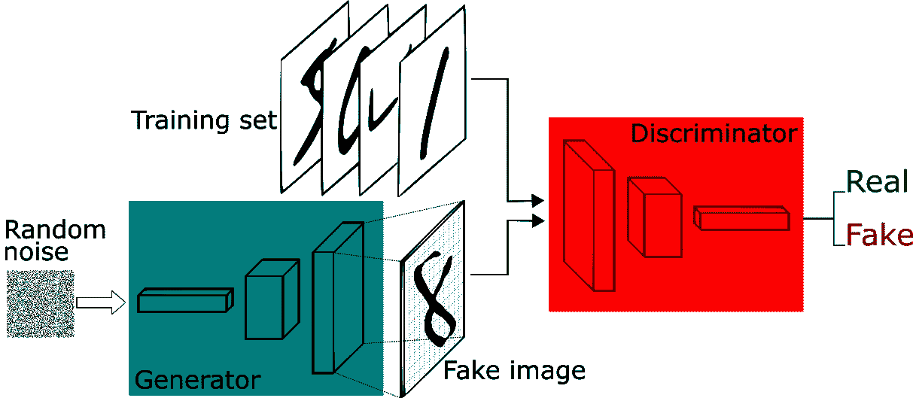
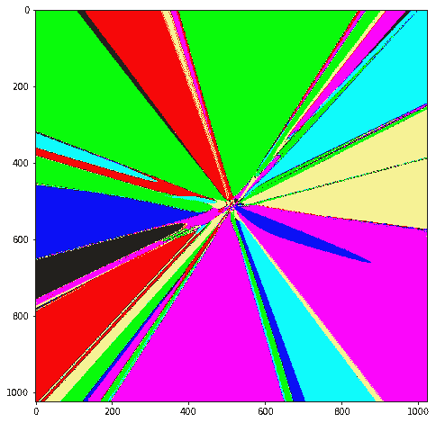
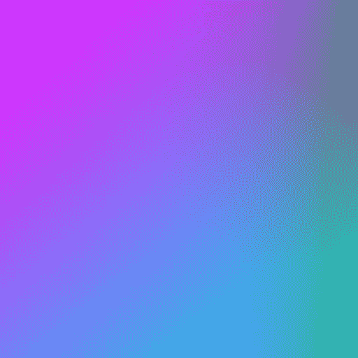
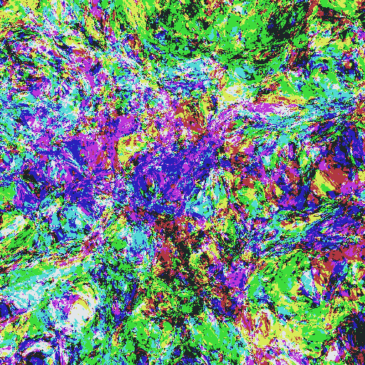

# 让深度神经网络绘画来理解它们是如何工作的

> 原文：<https://towardsdatascience.com/making-deep-neural-networks-paint-to-understand-how-they-work-4be0901582ee?source=collection_archive---------12----------------------->

深度学习的效果如此之好，这是一个谜。尽管有一些关于[为什么深度神经网络如此有效的暗示](https://www.reddit.com/r/MachineLearning/comments/abj1mc/d_notes_on_why_deep_neural_networks_are_able_to/)，但事实是没有人完全确定，对深度学习的理论理解是一个非常活跃的研究领域。

在本教程中，我们将以一种不寻常的方式触及问题的一个微小方面。我们将让神经网络为我们描绘抽象的图像，然后我们将解释这些图像，以发展对引擎盖下可能发生的事情的更好的直觉。另外，作为奖励，在本教程结束时，您将能够生成如下图像(所有内容都少于 100 行 PyTorch 代码。点击查看[陪同朱庇特的笔记本:](https://github.com/paraschopra/abstract-art-neural-network)

My neural network wants to be a painter when it grows up.

## 这个图像是怎么产生的？

这张图片是由一个叫做[组合模式产生网络](https://en.wikipedia.org/wiki/Compositional_pattern-producing_network) (CPPN)的简单架构生成的，我是通过[这篇博文](http://blog.otoro.net/2015/06/19/neural-network-generative-art/)了解到这个架构的。在那篇博文中，作者通过用 JavaScript 编写的神经网络生成了抽象图像。我的代码在 PyTorch 中实现了它们。

通过神经网络生成图像的一种方法是让它们一次输出完整的图像，比如说类似下面的内容，其中称为“生成器”的神经网络将随机噪声作为输入，并在输出层中生成完整的图像(宽度*高度)。

Image via [A Short Introduction to Generative Adversarial Networks](https://sthalles.github.io/intro-to-gans/)

与输出整个图像相反，CPPNs(我们将要探索的架构)输出给定位置像素的颜色(作为输入提供给它)。

Image via [Generating Abstract Patterns with TensorFlow](http://blog.otoro.net/2016/03/25/generating-abstract-patterns-with-tensorflow/)

忽略上图中的 z 和 r，注意网络正在接收像素的 **x** ， **y** 坐标，并输出该像素应该是什么颜色(由 **c** 表示)。这种网络的 PyTorch 模型如下所示:

注意，它有 2 个输入，3 个输出(像素的 RGB 值)。生成整个图像的方法是输入所需图像(特定大小)的所有 x，y 位置，并将这些 x，y 位置的颜色设置为网络输出的颜色。

# 神经网络实验

我第一次尝试运行你在上面看到的神经网络时，我最终生成了这些图像。

If I had buyers for this art, I’d sell it in a jiffy.

我花了好几个小时挠头，想知道为什么网络输出的是灰色，而不管我输入的是什么 x，y 位置。理想情况下，这是不应该发生的，因为对于这样一个深度网络。改变输入值*应该改变输出值*。我还知道，每次初始化神经网络时，它都有可能生成一个全新的图像，因为它的参数(权重和偏差)是随机初始化的。但是很明显，即使经过几次尝试，我从我的神经网络得到的只是这种灰色的粘性物质。为什么？

我的怀疑集中在所使用的特定激活功能上: *tanh* 。也许后续层中的多个 *tanh* 序列将所有输入数字压缩到接近 0.5。在输出层(代表灰色)。然而，我关注的博客帖子也使用了 *tanh。我所做的只是把用 JavaScript 编写的博客神经网络转换成 PyTorch，没有任何改动。*

我终于找到了罪魁祸首。这就是 PyTorch 在初始化新的神经网络时初始化权重的方式。[根据他们的用户论坛](https://discuss.pytorch.org/t/how-are-layer-weights-and-biases-initialized-by-default/13073)，他们用一个从-1/sqrt(N)到+1/sqrt(N)范围内随机抽取的数字初始化权重，其中 N 是一层中输入连接的数量。因此，如果隐藏层的 N=16，权重将从-1/4 到+1/4 初始化。我的假设是为什么这会导致一种灰色的粘性物质，因为重量来自一个很小的范围，并且变化不大。

如果网络中的所有权重都在-1/4 到+1/4 之间，当乘以任何输入并加在一起时，也许会发生类似于[中心极限定理](https://en.wikipedia.org/wiki/Central_limit_theorem)的效应。

> 中心极限定理(CLT)证明，在某些情况下，添加独立的随机变量时，即使原始变量本身不是正态分布的，它们的正态和也趋向于正态分布(非正式的“钟形曲线”)

回想一下后续图层上的值是如何计算的。

Image via [For Dummies — The Introduction to Neural Networks we all need !](https://medium.com/technologymadeeasy/for-dummies-the-introduction-to-neural-networks-we-all-need-c50f6012d5eb)

在我们的例子中，第一个输入层有 2 个值(x，y ),第二个隐藏层有 16 个神经元。因此，第二层上的每个神经元得到 2 个乘以从-1/4 到+1/4 的权重的值。这些值相加，然后在它从激活函数 *tanh* 出来后，变成新值，传递给第三层。

现在，从第二层开始，有 16 个输入要传递给第三层中 16 个神经元的每个。假设这些值中的每一个都由 **z.** 表示，那么第三层中每个神经元的值是:

这里我们再做一个猜测。因为权重的方差更小(-1/4 到+1/4)，z 的值(输入 x，y 乘以权重，然后通过 *tanh* 函数)也不会有很大变化(因此会很相似)。因此，该等式可以被视为:

并且对于每个神经元，从-0.25 到+0.25 抽取的 16 个权重之和的最有可能的值是零。即使在第一层，总和不接近零，网络的八层给了上述等式足够的机会最终产生接近零的值。因此，不管输入值(x，y)如何，进入激活函数的**总值(权重之和*输入)总是接近零值**，其 tanh 映射为零(因此，所有后续层中的值保持为零)。

X-axis is inputs to TanH, and Y-axis is output. Note that 0 is mapped to 0.

颜色灰暗是什么原因？这是因为 sigmoid(最后一层的激活函数)将这个传入值 0 映射到 0.5(表示灰色，0 表示黑色，1 表示白色)。

Note how Sigmoid maps 0 input value to 0.5

## 灰色粘稠物怎么修？

因为罪魁祸首是重量的小偏差，我的下一步是增加它。我更改了默认的初始化函数，将权重从-100 分配到+100(而不是-1/4 到+1/4)。现在运行神经网络，这是我得到的:

Voila! Grey goo is now some blobs of color.

这是一个进步。我的假设是正确的。

但是生成的图像仍然没有太多的结构。太简单化了。

这个神经网络正在做的是将输入乘以权重，推动它们通过 *tanh* 并最终通过 sigmoid 输出颜色。既然我固定了权重，我可以固定输入以使输出图像更有趣吗？嗯。

请注意，上面的图像是在我输入 X，Y 作为原始像素坐标时生成的，从 0，0 开始，到 128，128 结束(这是图像的大小)。这意味着我的网络从未将负数视为输入，而且由于这些数字很大(比如 X，Y 可能是 100，100)， *tanh* 要么得到一个非常大的数字(它挤压成+1)，要么得到一个非常小的数字(它挤压成-1)。这就是为什么我看到原色的简单组合(例如，0，1，1 的 R，G，B 输出代表你在上面的图像中看到的青色)。

## 如何让图像更有趣？

就像在最初的博文中一样(这是我一直在关注的)，我决定将 X 和 y 归一化，所以我将输入(X/image_size)-0.5，而不是输入 X。这意味着 X 和 Y 的值将在-0.5 到+0.5 的范围内(与图像大小无关)。这样做，我得到了下面的图像:

Some more progress!

有趣的是，在前面的图像中，线条在右下方增长(因为 X，Y 值在增加)。在这里，由于 X，Y 值是归一化的，并且现在包括负数，所以线条均匀地向外增长。

但是，图像仍然不够漂亮。

## 如何让图像更加有趣？

如果你仔细观察，你会发现在图像的中间，似乎比边缘有更多的结构。这是数学之神给我们的暗示，我们应该放大那里去发现美。

有三种向图像中心放大的方法:

*   产生大图像。由于像素坐标是归一化的，我们可以简单地运行神经网络来产生更大的图像。之后，我们可以通过图像编辑工具放大中间，看看我们发现了什么。
*   将 X 和 Y 输入乘以一个小数值(缩放因子)，这将有效地实现与前面的方法相同的事情(并避免我们在其余不感兴趣的区域上运行浪费的计算)
*   由于输出是由输入*权重决定的，我们也可以通过将权重值从-100、+100 减少到+3、-3(记住不要减少太多)来缩放，而不是减少输入值。还记得重量在-0.25 到+0.25 之间时出现的灰色粘性物质吗？)

当我采用第二种方法，将 X 和 Y 乘以 0.01 时，我得到的结果如下:

I call it the Neural-Mondrian!

当我采用第三种方法并将权重初始化为-3 到+3 之间时，我得到了下面的图像。

Is your mind blown yet?

## 更多实验

我将权重初始化更改为正态分布(平均值为 0，标准偏差为 1)，并生成了多个图像(来自随机初始化)。

当我删除所有隐藏层(只是输入到输出映射):

0 hidden layers

当我只保留一个隐藏层(而不是默认的 8 个隐藏层)时:

1 hidden layer

当我将隐藏层的数量增加到 16 层时:

16 hidden layers, 16 neurons per hidden layer

正如你所想象的，随着我增加隐藏层的数量，图像变得越来越复杂。我想知道，如果不是将层数增加一倍，而是保持层数不变(8)，但每层的神经元数量增加一倍(从 16 到 32)，会发生什么情况。这是我得到的:

8 hidden layers, 32 neurons per hidden layer

注意，尽管在上述两种情况下，网络中的总权重数是相似的，但是具有双层的网络比每层具有双层神经元的网络更加像素化。像素表明，在这些区域中，函数急剧变化，因此如果我们进一步放大，就会发现更多的结构。而对于具有原始层数但每层神经元加倍的网络，函数相当平滑，因此“可缩放性”较低。

当然，所有这些都是深度使神经网络更具表现力的另一种说法。正如关于深度神经网络表达能力的[论文](https://arxiv.org/abs/1606.05336)所建议的:

> 计算函数的复杂度随着深度呈指数增长

这正是我们所看到的。[通用逼近定理](https://en.wikipedia.org/wiki/Universal_approximation_theorem)说理论上，一个足够大的神经网络，即使只有一个隐层，也可以表示任何函数。但是，在实践中，网络越深，输入- >输出映射就越复杂，这是能够表现出来的。

## 毫无意义的实验，但是很有趣

如果我们将每层的神经元数量从 8 个增加到 128 个(一个数量级的增加)会怎么样。

Neuro-pollock!

如果我们从每个隐藏层 128 个神经元开始，但在每个后续层中逐渐减半，如下所示。

这是我得到的:

This one looks more “natural” than others.

还有***吨*** 更多的实验可以做，并获得有趣的图像，所以我会把它留在这里给你玩[的代码](https://github.com/paraschopra/abstract-art-neural-network) (Jupyter 笔记本)。尝试更多的架构、激活和层。如果你有什么有趣的东西，在 Twitter 上给我加标签，或者在 Medium 上评论，我会在我的网络上分享。

或者你可以把神经网络生成的图像与[神经网络生成的哲学](/generating-new-ideas-for-machine-learning-projects-through-machine-learning-ce3fee50ec2)结合起来，做出这样的东西:

My neural network is a stoic.

就是这样。希望你有兴趣生成漂亮的图像。

## 喜欢这个教程吗？也看看我以前的作品:

*   [让你的神经网络说“我不知道”——贝叶斯神经网络使用 Pyro 和 PyTorch](/making-your-neural-network-say-i-dont-know-bayesian-nns-using-pyro-and-pytorch-b1c24e6ab8cd) 。在 MNIST 数据集上编写贝叶斯图像分类器的教程+代码。
*   [通过机器学习为机器学习项目产生新的想法](/generating-new-ideas-for-machine-learning-projects-through-machine-learning-ce3fee50ec2)。使用预先训练的语言模型从 2.5k 句子的小型语料库中生成风格特定的文本。PyTorch 代码
*   [无梯度强化学习:使用遗传算法进化智能体](/reinforcement-learning-without-gradients-evolving-agents-using-genetic-algorithms-8685817d84f)。在 PyTorch 中实现深度神经进化为 CartPole 进化一个 agent 代码+教程]

## 在 Twitter 上关注我

我定期发关于人工智能、深度学习、创业公司、科学和哲学的推特。跟着我上[https://twitter.com/paraschopra](https://twitter.com/paraschopra)

 [## Paras Chopra (@paraschopra) |推特

### Paras Chopra 的最新推文(@paraschopra)。@Wingify |的创始人兼董事长写道…

twitter.com](https://twitter.com/paraschopra)