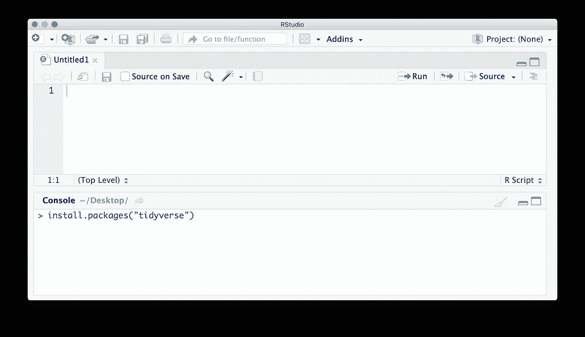
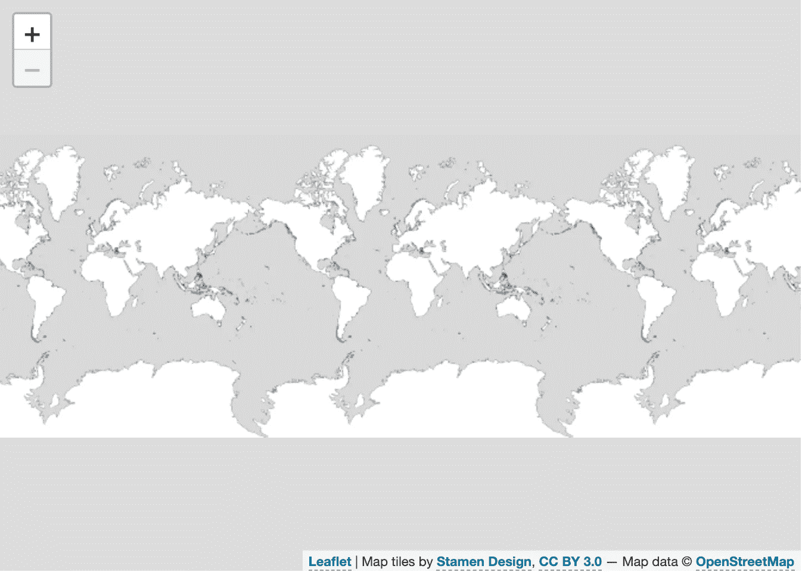
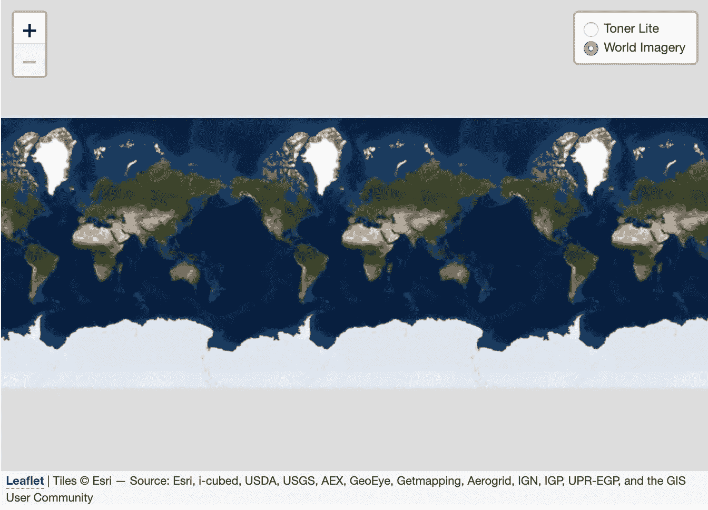
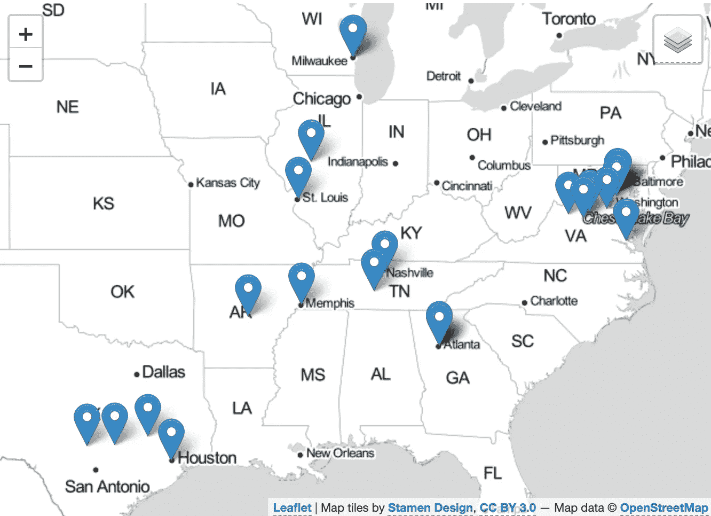
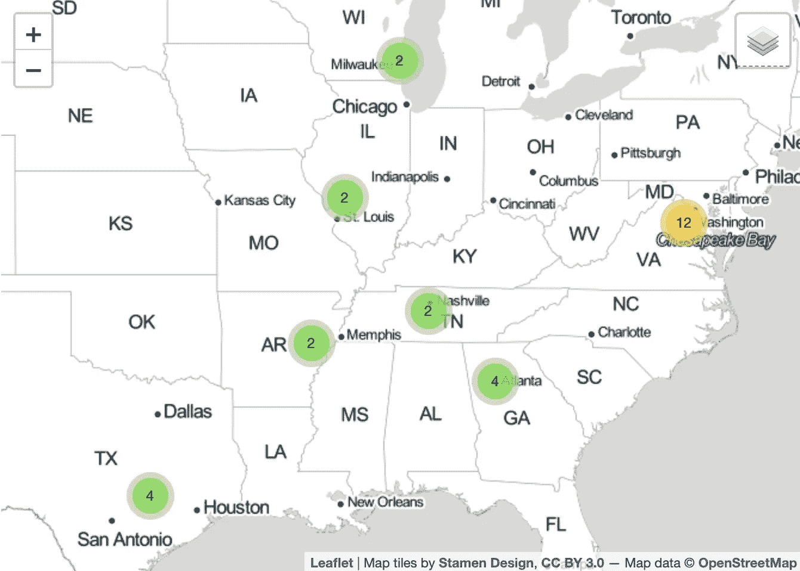
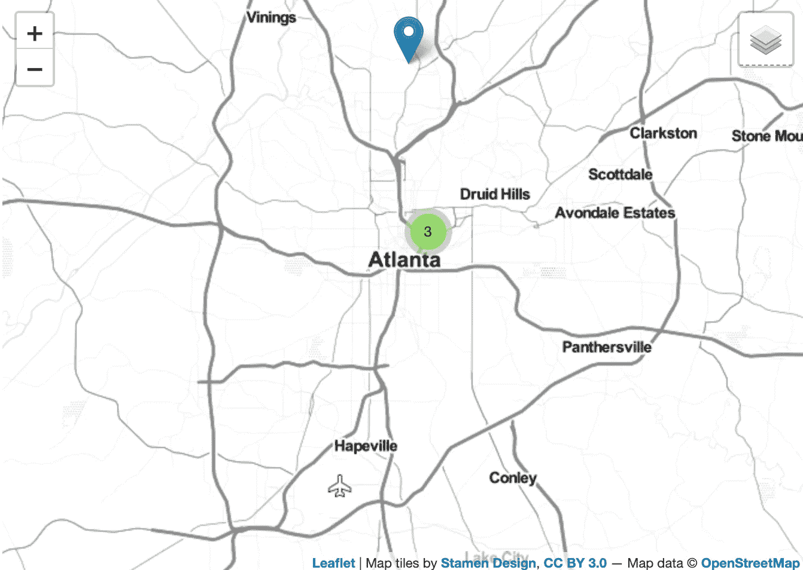
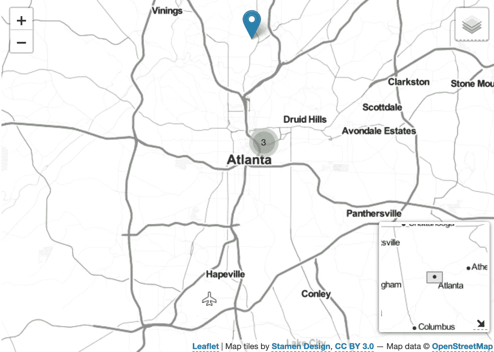

# 用不到 15 行代码在 R 语言中制作交互式地图

> 原文：<https://towardsdatascience.com/making-interactive-maps-in-r-with-less-than-15-lines-of-code-bfd81f587e12?source=collection_archive---------3----------------------->

如果你有地理数据，你会想把它显示在地图上。只用几行简单的代码，我们就可以用 r 语言制作一个漂亮的地图。我假设你的电脑上已经安装了 R and R 工作室。

我强烈建议您在自己的计算机上跟随。我在这个项目中使用的数据可以在[这个链接](https://drive.google.com/open?id=1aG7zpEmBlHwlspzTszOXJRazbet-SZVk)获得，它显示了我在过去几年中参观过的所有博物馆。我建议要么下载它，要么找到你自己的地理空间数据来玩。你应该查看我的数据，虽然检查我在做什么。

我还将在 R 中使用管道操作符，这有时会令人困惑，看起来像这样%>%。管道运算符将左边的对象作为右边函数的第一个参数。因此，以下几行 R 代码是等价的:

```
print(sum(c(1,2,3,4,5)))c(1,2,3,4,5) %>% sum() %>% print()
```

我们将使用 2 个外包装，传单和 tidyverse。传单构建在 JavaScript 之上，对映射很有用(使用它不需要 JavaScript 知识)。tidyverse 是一个超级包，包含许多其他包，用于读取、组织和清理数据。知道 tidyverse 有很高的投资回报，我建议学习它。

# 步骤 1:安装软件包

我们在 R Studio 的控制台中运行这些代码行来安装所需的包。

```
install.packages("tidyverse")install.packages("leaflet")
```



# 步骤 2:加载包

从现在开始，我们将在一个新的脚本文件中运行我们的代码。我们现在用 library()函数加载包。

```
library("tidyverse")
library("leaflet")
```

# 步骤 3:加载数据

接下来，我们使用 tidyverse 中的 read_csv()函数读入数据。您可能需要在 read_csv()函数中更改 csv 的文件路径。

```
library("tidyverse")
library("leaflet")museum <- read_csv("museum.csv")
```

# 步骤 4:添加瓷砖

步骤 4A:首先，我们必须使用管道将数据传递给传单函数。光靠这个是做不出地图的。
第 4B 步:在这个[链接](https://leaflet-extras.github.io/leaflet-providers/preview/)处挑选出图块(地图的样子)。
步骤 4C:将传单函数的输出传递给 addProviderTiles()函数，唯一的参数是您在步骤 4B 中选择的图块。我选了雄蕊。

```
library("tidyverse")
library("leaflet")museum <- read_csv("museum.csv")museum %>% 
leaflet() %>%
addProviderTiles(providers$Stamen.TonerLite)
```



从现在开始，我建议在每一步结束时运行所有代码，看看地图是否合你的意。

# 步骤 5:添加多个图块

步骤 5A:选择另一组要添加的图块。
步骤 5B:使用组参数为每个切片命名，我选择了 ESRI . world imagery。
步骤 5C:添加图层控制(这使您可以看到两个切片)。您可以在右上角选择想要查看的互动程序

```
library("tidyverse")
library("leaflet")museum <- read_csv("museum.csv")museum %>% 
leaflet() %>%
addProviderTiles(providers$Esri.WorldImagery, group = "World Imagery") %>%
addProviderTiles(providers$Stamen.TonerLite, group = "Toner Lite") %>%
addLayersControl(baseGroups = c("Toner Lite", "World Imagery"))
```



# 步骤 6:使用数据向地图添加标记

步骤 6A:使用 addMarkers()函数，如果你的数据集有纬度和经度(或它们的缩写)，你不需要填写纬度和液化天然气的参数。
步骤 6B:您可以选择设置标签和弹出参数，以便当您将鼠标悬停在标记上或单击它时显示信息。

```
library("tidyverse")
library("leaflet")museum <- read_csv("museum.csv")museum %>% 
leaflet() %>%
addProviderTiles(providers$Esri.WorldImagery, group = "World Imagery") %>%
addProviderTiles(providers$Stamen.TonerLite, group = "Toner Lite") %>%
addLayersControl(baseGroups = c("Toner Lite", "World Imagery")) %>%
addMarkers(label = museum$museum, 
           popup = ifelse(museum$`Presidential Library`=="Yes",
                          "A Presidential Library", # Value if True
                          "Not a Presidential Library")) # Val False
```



# 步骤 7:添加集群

如果你有很多很多的数据点，这是一件很好的事情，这样你的地图就不会被淹没。如果你们有非常接近的点，这也很好。我们需要做的就是用 clusterOptions 参数更新我们的 addMarkers()函数。

```
library("tidyverse")
library("leaflet")museum <- read_csv("museum.csv")museum %>%
leaflet() %>%
addProviderTiles(providers$Esri.WorldImagery, group = "World Imagery") %>%
addProviderTiles(providers$Stamen.TonerLite, group = "Toner Lite") %>%
addLayersControl(baseGroups = c("Toner Lite", "World Imagery")) %>%
addMarkers(label = museum$museum,
           clusterOptions = markerClusterOptions(),
           popup = ifelse(museum$`Presidential Library`=="Yes",
                          "A Presidential Library",
                          "Not a Presidential Library"))
```



# 步骤 8:设置开始缩放

这一步并不是必需的，但是如果您想将地图集中在一个特定的位置，您可以使用 setView()函数。我会关注亚特兰大。

```
library("tidyverse")
library("leaflet")museum <- read_csv("museum.csv")museum %>%
leaflet() %>%
addProviderTiles(providers$Esri.WorldImagery, group = "World Imagery") %>%
addProviderTiles(providers$Stamen.TonerLite, group = "Toner Lite") %>%
addLayersControl(baseGroups = c("Toner Lite", "World Imagery")) %>%
addMarkers(label = museum$museum,
           clusterOptions = markerClusterOptions(),
           popup = ifelse(museum$`Presidential Library`=="Yes",
                          "A Presidential Library",
                          "Not a Presidential Library")) %>%
setView(lat = 33.736309, lng = -84.388298, zoom = 11)
```



# 步骤 9:添加小地图

要添加一个小地图到我们的地图，我们只需要使用 addMiniMap()函数。您可以使用 addMiniMap()调整的两个参数是更改图块(这允许您更改地图背景，就像在主视图中一样)和 toggleDisplay(这允许您隐藏地图)。

```
library("tidyverse")
library("leaflet")museum <- read_csv("museum.csv")museum %>%
leaflet() %>%
addProviderTiles(providers$Esri.WorldImagery, group = "World Imagery") %>%
addProviderTiles(providers$Stamen.TonerLite, group = "Toner Lite") %>%
addLayersControl(baseGroups = c("Toner Lite", "World Imagery")) %>%
addMarkers(label = museum$museum,
           clusterOptions = markerClusterOptions(),
           popup = ifelse(museum$`Presidential Library`=="Yes",
                          "A Presidential Library",
                          "Not a Presidential Library")) %>%
setView(lat = 33.736309, lng = -84.388298, zoom = 11) %>%
addMiniMap(
    toggleDisplay = TRUE,
    tiles = providers$Stamen.TonerLite
    )
```



我们完了！您可能已经注意到这比 15 行稍微多一点，我选择通过将函数分成多行来优化可读性。祝你所有的地理空间工作好运！