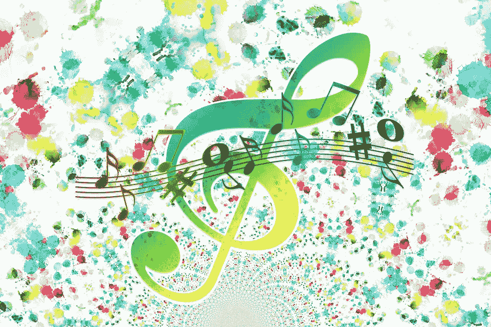

# 用机器学习制作音乐

> 原文：<https://towardsdatascience.com/making-music-with-machine-learning-908ff1b57636?source=collection_archive---------4----------------------->



Image from [https://www.maxpixel.net/Circle-Structure-Music-Points-Clef-Pattern-Heart-1790837](https://www.maxpixel.net/Circle-Structure-Music-Points-Clef-Pattern-Heart-1790837)

音乐不仅仅是一门艺术，音乐是人类状态的一种表达。当一个艺术家创作一首歌的时候，你经常可以听到他们在那一刻的情感、经历和能量。音乐将世界各地的人们联系在一起，并在不同文化间共享。所以计算机不可能和它竞争，对吗？这是我和我的小组在为我们的机器学习课选择学期项目时问的问题。我们的目标是创造一些东西，让听众相信他们正在听的东西是由人类创造的。我认为我们个人取得了成功，但我会让你来评判(见本文底部的结果)。

# 方法

为了创作音乐，我们需要某种方法来学习现有歌曲的模式和行为，以便我们能够再现听起来像真实音乐的东西。我们所有人都对深度学习感兴趣，所以我们认为这是探索这项技术的绝佳机会。首先，我们研究了这个问题的现有解决方案，发现了来自[sigur skúLi](https://towardsdatascience.com/@sigurdurssigurg)的关于[如何使用 Keras](/how-to-generate-music-using-a-lstm-neural-network-in-keras-68786834d4c5) 生成音乐的精彩教程。读完他们的教程后，我们对自己想做的事情有了一个很好的想法。

文件格式很重要，因为它将决定我们如何处理这个问题。教程使用了 midi 文件，所以我们照着做了，并决定也使用它们，因为它们很容易解析和学习(你可以在这里[了解更多)。使用 midi 文件给了我们几个好处，因为我们可以很容易地检测音符的音高和持续时间。但是在我们一头扎进去，开始建立我们的网络之前，我们需要更多的关于音乐是如何构成的以及需要考虑的模式的信息。为此，我们去找了我的好朋友米奇·伯迪克。他帮助我们确定了一些关于我们方法的事情，并给我们上了一堂简单音乐理论的速成课。](https://www.lifewire.com/midi-file-2621979)

在我们的谈话之后，我们意识到时间步长和序列长度将是我们网络的两个重要因素。时间步长决定了我们何时分析和产生每个音符，而序列长度决定了我们如何学习歌曲中的模式。对于我们的解决方案，我们选择 0.25 秒的时间步长和每个时间步长 8 个音符。这相当于 4/4 的拍号，对我们来说意味着 4 个音符的 8 个不同序列。通过学习这些序列并重复它们，我们可以生成一个听起来像真正音乐的模式，并以此为基础进行构建。作为起点，我们使用了 Skúli 的教程中提到的代码，但是最终我们的实现在几个方面与最初的有所不同:

*   网络体系结构
*   仅限于单键
*   可变长度音符和休止符的使用
*   歌曲结构/模式的使用

# 网络体系结构

对于我们的架构，我们决定主要依靠双向长短期记忆(BLSTM)层。下面是我们使用的 Keras 代码:

```
model = Sequential()
model.add(
    Bidirectional(
        LSTM(512, return_sequences=True),
        input_shape=(
            network_input.shape[1], network_input.shape[2]),
    )
)
model.add(Dropout(0.3))
model.add(Bidirectional(LSTM(512)))
model.add(Dense(n_vocab))
model.add(Activation("softmax"))
model.compile(loss="categorical_crossentropy", optimizer="rmsprop")
```

我们的想法是，通过使用歌曲中特定位置前后的音符，我们可以生成听起来像人类的旋律。通常在听音乐的时候，之前的音乐有助于听者预测接下来的音乐。有很多次，当我在听一首歌的时候，我可以随着特定的节拍摇摆，因为我可以预测接下来会发生什么。这正是在一首歌中逐渐形成一个落差时会发生的情况。这首歌变得越来越强烈，这使得听众在期待下降时产生紧张感，并在最终下降时产生解脱和兴奋的时刻。通过利用这一点，我们能够产生听起来自然的节拍，并带来我们已经习惯于在现代音乐中期待的同样的情感。

对于 BLSTM 层中的节点数量，我们选择 512，因为这是 Skúli 使用的数量。然而，我们确实对此做了一点试验，但是由于时间限制，我们最终坚持使用原来的数字。30%的辍学率也是如此(点击阅读更多关于辍学率的信息[)。对于激活函数，我们选择了 softmax，对于损失函数，我们选择了分类交叉熵，因为它们很适合多类分类问题，如音符预测(你可以在这里](https://medium.com/@amarbudhiraja/https-medium-com-amarbudhiraja-learning-less-to-learn-better-dropout-in-deep-machine-learning-74334da4bfc5)[阅读更多关于它们的信息](https://gombru.github.io/2018/05/23/cross_entropy_loss/))。最后，我们选择 RMSprop 作为我们的优化器，因为这是 Keras 为 RNNs 推荐的。

# 关键限制

我们做的一个重要假设是，我们将只使用来自同一个调的歌曲:c 大调/A 小调。这样做的原因是，通过让我们制作的每首歌曲都保持同一个调，我们的输出听起来会更像歌曲，因为网络永远不会学习会导致歌曲跑调的音符。为了做到这一点，我们使用了一个脚本，我们发现[在这里](http://nickkellyresearch.com/python-script-transpose-midi-files-c-minor/)从[尼克凯利](http://nickkellyresearch.com/)。这部分真的很简单，但给我们的结果带来了巨大的改善。

# 可变长度音符和休止符

音乐的一个重要部分是动态和创造性地使用可变长度的音符和休止符。吉他手敲击的一个长音符，随后是一个平静的停顿，当我们听到演奏者的心和灵魂向这个世界溢出时，这可以向听者发出情感的波动。为了抓住这一点，我们研究了引入长音符、短音符和休止符的方法，这样我们就可以在整首歌中创造不同的情感。

为了实现这一点，我们研究了一个音符的音高和持续时间，并将其作为一个独立的值输入到我们的网络中。这意味着播放 0.5 秒的 C#和播放 1 秒的 C#将被网络视为不同的值。这使我们能够了解哪些音高比其他音高演奏得长或短，并使我们能够结合音符来制作一些听起来自然且适合歌曲该部分的东西。

当然，休止符是不能被遗忘的，因为它们对于引导听众进入期待或兴奋的状态至关重要。一个缓慢的音符和一个停顿，然后是一连串快速的音符，可以创造出一种不同于几个长音符之间长时间停顿的情感。我们认为这一点很重要，这样才能复制听众在听一首轻松的周日下午歌曲或周五晚上的派对歌曲时的体验。

为了实现这些目标，我们必须关注我们的预处理。这里，我们再次从 Skúli 教程中的代码开始，并根据我们的需要进行了修改。

```
for element in notes_to_parse:
    if (isinstance(element, note.Note) or
        isinstance(element, chord.Chord
    ):
        duration = element.duration.quarterLength
        if isinstance(element, note.Note):
            name = element.pitch
        elif isinstance(element, chord.Chord):
            name = ".".join(str(n) for n in element.normalOrder)
        notes.append(f"{name}${duration}") rest_notes = int((element.offset - prev_offset) / TIMESTEP - 1)
    for _ in range(0, rest_notes):
        notes.append("NULL") prev_offset = element.offset
```

为了详细说明上面的代码，我们通过将音符的音高和持续时间与一个“$”相结合来创建音符，以馈入我们的网络。例如“A$1.0”、“A$0.75”、“B$0.25”等。都将被单独编码以供我们的网络使用(通过将每个唯一的音符/持续时间映射到一个整数，然后将所有的整数除以唯一组合的数量，从而将每个编码为 0 和 1 之间的浮点数，来对输入进行编码)。更有趣的部分是计算插入多少休止符。我们查看当前音符的偏移，并将其与我们查看的上一个音符的偏移进行比较。我们用这个间隙除以我们的时间步长来计算我们可以容纳多少个休止符(减 1，因为这实际上是计算间隙中可以容纳多少个音符，但其中一个是我们实际的下一个音符，所以我们不想重复计算)。例如，如果一个音符从 0.5 秒开始，而下一个音符直到 1.0 秒才开始。时间步长为 0.25(每个音符以 0.25 秒的间隔播放)，这意味着我们需要一个休止符来填补空白。

# 歌曲结构

最后，写一首歌最重要的部分之一是结构，这是我们发现现有解决方案中缺乏的东西之一。据我所见，大多数研究人员都希望他们的网络能够自己了解这一点，我不认为这是一种被误导的方法。然而，我认为这增加了问题的复杂性，并导致进一步的困难。这可能是我们解决方案的一个改进来源，尽管我们对此采取了更多的手动方法，并假设了一个恒定的模式。

我们做出的一个关键假设是，我们将只制作遵循特定模式 ABCBDB 的歌曲，其中:

*   a 是第一节
*   b 是合唱
*   c 是第二节
*   D 是桥

最初，我们尝试了 ABABCB，但这感觉太公式化。为了解决这个问题，我们决定引入第二节，它不同于第一节，但仍然相关。我们从一个随机的音符中生成了第一节，然后在第一节的基础上生成了第二节。实际上，这是生成一个两倍长的单个部分，并将其一分为二。这里的思考过程是，如果我们创作一首诗，第二首应该仍然符合同样的氛围，通过使用第一首作为参考，我们可以实现这一点。

```
def generate_notes(self, model, network_input, pitchnames, n_vocab):
    """ Generate notes from the neural network based on a sequence 
        of notes """
    int_to_note = dict(
        (
            number + 1,
            note
         ) for number, note in enumerate(pitchnames)
    )
    int_to_note[0] = "NULL"def get_start():
    # pick a random sequence from the input as a starting point for 
    # the prediction
    start = numpy.random.randint(0, len(network_input) - 1)
    pattern = network_input[start]
    prediction_output = []
    return pattern, prediction_output# generate verse 1
verse1_pattern, verse1_prediction_output = get_start()
for note_index in range(4 * SEQUENCE_LEN):
    prediction_input = numpy.reshape(
        verse1_pattern, (1, len(verse1_pattern), 1)
    )
    prediction_input = prediction_input / float(n_vocab) prediction = model.predict(prediction_input, verbose=0) index = numpy.argmax(prediction)
    result = int_to_note[index]
    verse1_prediction_output.append(result) verse1_pattern.append(index)
    verse1_pattern = verse1_pattern[1 : len(verse1_pattern)]# generate verse 2
verse2_pattern = verse1_pattern
verse2_prediction_output = []
for note_index in range(4 * SEQUENCE_LEN):
    prediction_input = numpy.reshape(
        verse2_pattern, (1, len(verse2_pattern), 1)
    )
    prediction_input = prediction_input / float(n_vocab) prediction = model.predict(prediction_input, verbose=0) index = numpy.argmax(prediction)
    result = int_to_note[index]
    verse2_prediction_output.append(result) verse2_pattern.append(index)
    verse2_pattern = verse2_pattern[1 : len(verse2_pattern)]# generate chorus
chorus_pattern, chorus_prediction_output = get_start()
for note_index in range(4 * SEQUENCE_LEN):
    prediction_input = numpy.reshape(
        chorus_pattern, (1, len(chorus_pattern), 1)
    )
    prediction_input = prediction_input / float(n_vocab) prediction = model.predict(prediction_input, verbose=0) index = numpy.argmax(prediction)
    result = int_to_note[index]
    chorus_prediction_output.append(result) chorus_pattern.append(index)
    chorus_pattern = chorus_pattern[1 : len(chorus_pattern)]# generate bridge
bridge_pattern, bridge_prediction_output = get_start()
for note_index in range(4 * SEQUENCE_LEN):
    prediction_input = numpy.reshape(
        bridge_pattern, (1, len(bridge_pattern), 1)
    )
    prediction_input = prediction_input / float(n_vocab) prediction = model.predict(prediction_input, verbose=0) index = numpy.argmax(prediction)
    result = int_to_note[index]
    bridge_prediction_output.append(result) bridge_pattern.append(index)
    bridge_pattern = bridge_pattern[1 : len(bridge_pattern)] return (
        verse1_prediction_output
        + chorus_prediction_output
        + verse2_prediction_output
        + chorus_prediction_output
        + bridge_prediction_output
        + chorus_prediction_output
    )
```

# 结果

我们能够通过这种方法获得令人惊讶的结果。我们可以始终如一地创作独特的歌曲，这些歌曲属于我们训练各自网络的适当流派。以下是我们各种网络的一些示例输出。

Ragtime

Christmas

Rap

# 结论

机器生成音乐确实是可能的。它比人类创作的音乐更好还是可能更好？只有时间能证明一切。从这些结果来看，我认为这是完全可能的。

# 未来的工作

可以进行一些改进，使之更接近真正的音乐。一些可能的想法/实验包括:

*   学习歌曲中的模式，而不是手动拼凑部分
*   将音符持续时间作为网络的单独输入，而不是单独处理每个音高/持续时间
*   扩展到多种仪器
*   远离 midi 文件，制作/学习真正的 MP3
*   学习时间步长、序列长度和拍号
*   引入随机性来模拟“人为错误/实验”
*   允许多个键
*   学习如何使用介绍和结尾

# 感谢

我要感谢我的队友 Izaak Sulka 和 Jeff Greene 对这个项目的帮助，以及我的朋友 Mitch Burdick 对音乐的专业知识，使我们能够取得这些伟大的成果。当然，我们要感谢 sigur ur skúLi 的指导，因为它为我们提供了一个很好的起点和一些参考。最后但同样重要的是，我要感谢尼克·凯利的剧本，他把歌曲转到了 c 大调。

这个项目的代码可以在这里找到:[https://github.com/tylerdoll/music-generator](https://github.com/tylerdoll/music-generator)

声明:我们项目中使用的音乐不属于我们，来自各种公共网站。