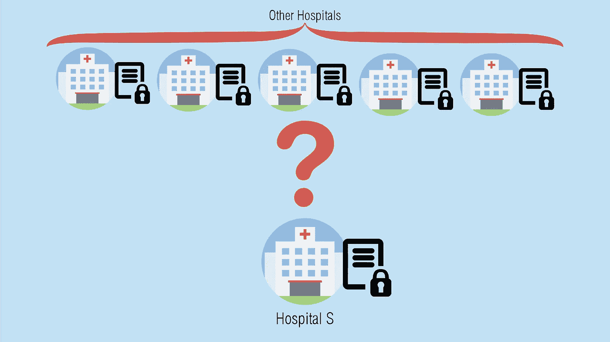
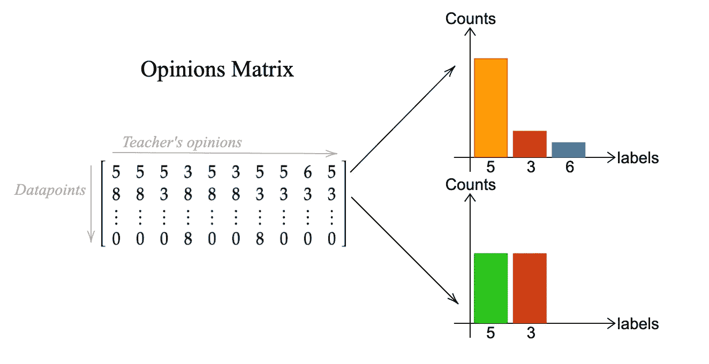
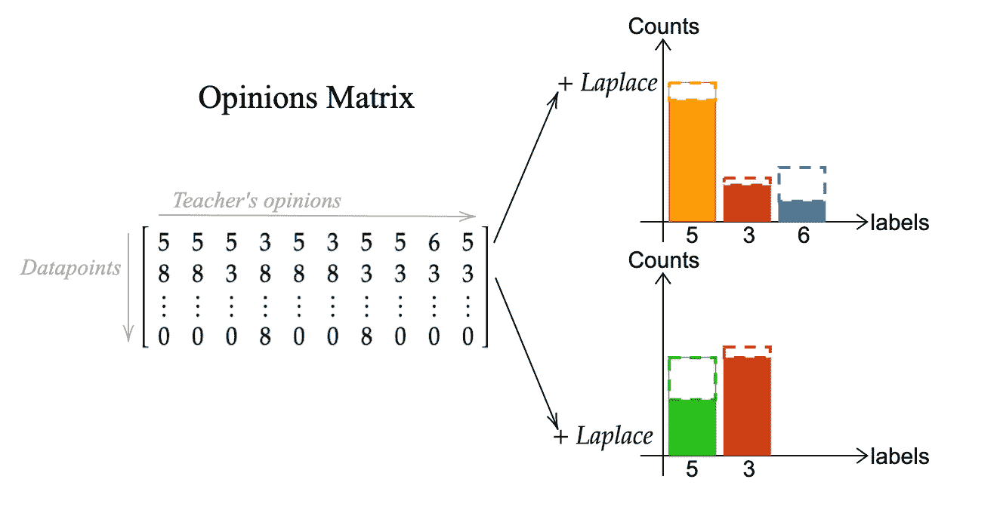
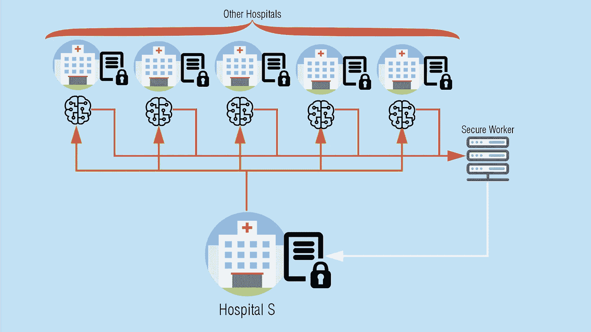

# 使 PATE 双向私有

> 原文：<https://towardsdatascience.com/making-pate-bidirectionally-private-6d060f039227?source=collection_archive---------19----------------------->

Photo by [Dayne Topkin](https://unsplash.com/@dtopkin1?utm_source=medium&utm_medium=referral) on [Unsplash](https://unsplash.com?utm_source=medium&utm_medium=referral)

PATE，即教师集合的私有聚合，是 Papernot 等人在论文 [*中提出的一种机器学习框架，用于从私有训练数据*](https://arxiv.org/pdf/1610.05755.pdf) *进行深度学习的半监督知识转移。*该框架允许使用私有数据进行半监督学习，同时保留直观和强大的隐私保证。

PATE 基于这样一种思想，即如果在不相交的数据上训练的多个模型同意一个输入，那么关于它们的训练示例的私有数据不会泄露，因为所有模型都得出了相同的结论。通过只检索不同*“教师”*模型之间有很大相关性的输出，我们提供了直观的隐私。另一方面，当没有达成共识时，检索随机化的输出提供了强有力的隐私保证。这种随机选择可以通过噪声的聚集来获得，因此可以通过这种方式实现(ε，δ)-差分隐私。

此外，PATE 框架包含一个额外的步骤，以确保不会对教师的私人数据进行攻击，无论是通过多次查询还是通过模型的参数检查。为此，添加了一个*“student”*模型，该模型根据教师之前标记的公共数据进行学习。这样做消除了教师在后续查询中的需要，并确保学生模型只学习教师提供的概括。

该框架已经显示出实现了最先进的隐私/效用权衡，同时还具有灵活且广泛适用的实现。然而，在某些情况下，PATE 会陷入困境。这是指无法访问公共数据，或者学生的数据必然是私有的。PATE 要求学生与所有教师共享其数据，因此在此过程中无法保证隐私。这种情况的一个例子是，当一家医院想要训练一个神经网络进行诊断，并使用其他医院作为“老师”来标记其数据集。在这种情况下，PATE 可能是不可行的，因为“学生”医院可能有义务(在道德上或法律上)保持其数据集的私密性。

因此，提出了一个额外的步骤，其中教师集合被视为*“机器学习即服务”(MLaaS)* ，并且添加了加密来为学生的数据集提供保密性。在这里，我们将探讨如何应用这些变化，以及它如何影响 PATE 框架程序。

# 用 Pytorch 和 Pysyft 实现 PATE

本指南基于[本回购](https://github.com/aristizabal95/Making-PATE-Bidirectionally-Private)。为了文章的可读性，代码的某些部分将被跳过或修改。

## 初始设置

首先，我们需要导入必要的库。本指南假定所有库都已安装在本地。

We’re declaring the necessary libraries and hooking Syft with Torch.

为了演示 PATE 的工作原理，我们将构建如下所示的示例:

Diagram of the scenario.

一家医院 *S* 拥有一些关于其患者的未标记数据，并希望使用这些数据来训练一个分类器。由于它的数据是无标签的，所以不足以训练一个学习算法。为了解决这个问题，医院*的*考虑使用来自其他医院的标记数据来训练一个学习算法，并使用该算法来标记其数据。尽管其他医院愿意提供帮助，但出于隐私考虑，他们无权与第三方分享自己的数据。

让我们应用 PATE 框架。我们会把 S 医院当做我们的*学生*，把其他医院当做我们的*老师*。教师被要求使用他们的私人数据集来训练他们的学习算法。

## 1.宣布每个医院的工作人员

Syft 利用工人来识别和连接其他设备。在我们的情况下，我们有学生的机器(我们将认为是本地工作人员)和其他医院的设备(将被称为教师)。

Declaring the workers. The local worker is automatically declared when hooking Syft.

在本例中，我们仅使用了 10 名教师，但请记住，使用教师的数量在技术上没有限制，最好使用更大的团队[。](https://arxiv.org/pdf/1610.05755.pdf#subsection.4.1)

## 2.为教师定义和加载模型

PATE 框架的众多优势之一是它是模型不可知的，这意味着它不局限于特定的学习算法家族。尽管我们对所有教师使用相同的模型架构，但请记住这不是必需的。

This is the model for all the teachers.

本指南假设所有教师的模型都已经过培训。我们只需要加载它们并把它们发送到它们的机器上。在现实生活中，学生在这个过程中没有角色；相反，每个老师将负责实例化他们的模型。

Creating the models, loading them and sending them to each worker.

## 3.准备学生数据

现在所有的老师都准备好了，让我们从学生那里加载未标记的数据集。对于这个例子，我们使用 MNIST 测试集作为未标记数据集。

Load MNIST’s test dataset. This dataset will be used as the student’s unlabeled data.

在本例中使用已经标记的数据集的优点是，我们可以稍后将结果标签与真实标签进行比较。

至此，我们已经具备了 PATE 框架的所有要求。我们有一个未标记的数据集和多个模型，这些模型先前是在私有的、不相交的数据上训练的。现在，我们只需要将所有教师的意见汇总在一起，就可以得到数据集的标签。

## 4.将数据发送给每位教师进行分析

作为学生，我们希望从老师那里获得许多关于数据集中每个数据点的意见。从教师的角度来看，为了保护隐私，学生不能访问他们的模型。相反，它必须将其数据发送给每个老师，并等待分析。

Create a secure worker and send the unlabeled data for analysis.

注意，我们已经创建了另一个名为`secure_worker` *的工作者。* PATE 要求所有的意见都可以在一个点上获得，以生成投票最多的标签。因为我们不希望任何老师或学生看到原始意见，所以我们添加了第三方来负责汇总过程。

一旦完成，`secure_worker`将有一个形状为`(data_size, num_teachers`的矩阵。该矩阵包含来自数据集中数据点的所有教师的所有预测标签。

## 5.汇总意见

让我们考虑一下意见矩阵现在是什么样子。对于数据集的每一行，我们都有一些可能的标签，这些标签是由每个老师分配的。

An example of how the opinions matrix may look like. In some cases, there’s a clear consensus, while others require further processing.

通过为每个数据点选择投票最多的标签，我们获得了数据的广义分类。然而，如果存在没有明显标签的情况，那么我们就有选择一个由于过度拟合而被错误分类的标签的风险。这是一个隐私问题，为了减轻它，我们在所有投票计数中添加了一个仔细测量的拉普拉斯噪声。这样，我们增加了似是而非的可否认性，同时也保持了高准确性。

Previous scenario but with added noise. A high correlation between teachers leads to higher accuracy, while a low consensus with added noise leads to stronger privacy guarantees.

让我们来定义这个函数，我们将称之为*“嘈杂的 Argmax 机制”。*该函数将接收意见矩阵和ε值。这样，我们可以控制添加的噪声量。

Implementation of the noisy argmax mechanism.

记住意见矩阵在*安全工作者*的机器里。正因为如此，我们还必须发送要添加的噪声。

## 6.获得结果标签

既然定义了聚合查询，我们就可以获得结果并与真正的标签进行比较。

Getting the labels and comparing them to the true labels from the MNIST test set.

请注意，当将生成的标签与 MNIST 数据集中分配的标签进行比较时，我们获得了 90%的准确率。考虑到我们使用的ε的数量，这是一个很高的精度。这是迄今为止所做工作的完整图表。

Diagram of the implementation. Orange: unlabeled data sent. Red: predictions obtained. White: noisy labels returned.

在这一点上，学生可以利用这个数据集来训练他们的学习算法，并且没有从教师的私人数据中泄露隐私。

现在已经解释了 PATE 框架，让我们来看看为什么它不适合这个场景，以及应该做哪些改变。

# 使 PATE 双向私有

仔细观察前面的图表以及 PATE 实现，很明显学生的数据必须发送给所有教师进行分析。当这些数据公开时，这不是问题。但是，在某些情况下可能并非如此。我们医院的例子就是其中之一。在这种情况下，如果教师能够在不直接访问数据的情况下分析数据，那将是更好的。为了实现这一点，我们可以使用 [*附加秘密共享*](https://mortendahl.github.io/2017/06/04/secret-sharing-part1/#additive-sharing) 对未标记数据集和教师模型进行加密。这意味着一些额外的步骤，并增加了对 PATE 框架的某些要求。

## 1.确保教师模型是可加密的

添加加密层意味着对数据进行的所有操作都必须兼容(并且安全)。在撰写本文时，仍有许多操作尚未在 PySyft 的库上实现。最重要的是，`log_softmax()`目前不兼容。这意味着每一个在最终层使用它的模型都必须被修改以允许加密。幸运的是，这种改变不需要重新训练模型。

Adapted model for encryption compatibility. Note that only one line changed.

## 2.加密模型

既然模型与附加秘密共享兼容，它们就可以被加密。这种加密需要多方共享数据。尽管我们可以使用这个例子中已经初始化的任何一个工人，我们还是要添加两个工人，分别叫做`alice`和`bob`。他们唯一的工作就是保存所有的加密值。

create alice and bob

由于附加秘密共享只适用于整数，我们必须将权重和偏差转换为固定的精度值。另外，从 PySyft 0.1.23a1 开始，似乎有一个 bug 在试图加密远程模型的模型参数时会引发异常。这里有一个解决方法。

Encrypting the long way.

## 3.加密数据集并获取意见

理想情况下，我们只需加密整个数据集，并执行与之前相同的程序来获得预测。遗憾的是，加密计算需要很长时间，而且计算量很大，所以我们必须批量处理。这个想法是，我们从我们的数据集中取出一小批，加密后发给所有老师进行分析。产生的标签被发送到`secure_worker`进行解密。一旦它们被解密，noisy _ argmax 机制就会被使用，并且生成的一批标签会被发送给学生。最后，学生将每一批连接在一起，以获得所有的标签。

Obtaining noisy labels with an encryption layer.

这个过程需要很长时间才能完成。在我的例子中，获得整个数据集需要大约 7 个小时。这是一个主要缺点，如果要使用这种技术，必须考虑到这一点。

现在我们可以用真正的标签做同样的比较。

Checking the accuracy of our noisy labels obtained through encryption of PATE.

得到的精度与没有加密时一样。现在，学生可以使用这些数据来训练其神经网络，因为他们知道数据集在这个过程中没有受到损害。

# 结论

PATE 是一个令人惊叹的框架，它提供了良好的结果，同时实现了高隐私保证。然而，在没有公共数据的情况下，传统的 PATE 可能是不可行的。当这种情况发生时，可以添加一层加密，允许数据在不损害其隐私的情况下被处理。尽管如此，实现这一点所需的额外复杂性和时间使它对于日常场景来说是一种不合理的方法。此外，由于学生模型是用私有数据训练的，它仍然容易受到攻击，这些攻击可能会泄露有关数据集的更多信息。因此，当学生数据集的隐私不相关或不必要时，应首选传统 PATE。

## 附加注释

这篇文章是 Udacity 的[安全和私人人工智能纳米学位项目](https://www.udacity.com/course/secure-and-private-ai--ud185)的一部分。这篇文章的目的是呈现和解释我在这门课的期末专题，它应该被视为如此。

# 文献学

*   n .帕伯诺特，m .阿巴迪，厄林松，ú，& Talwar，K. (2016 年)。基于私有训练数据的深度学习半监督知识转移。 *ArXiv* ， *1610* (05755)。从 https://arxiv.org/abs/1610.05755[取回](https://arxiv.org/abs/1610.05755)
*   n . paper not & good fellow，I. (2018 年 4 月 29 日)。隐私和机器学习:两个意想不到的盟友？检索自[http://www . clever Hans . io/privacy/2018/04/29/privacy-and-machine-learning . html](http://www.cleverhans.io/privacy/2018/04/29/privacy-and-machine-learning.html)
*   安全和私人的人工智能纳米学位项目。从[https://www.udacity.com/course/secure-and-private-ai-ud 185](https://www.udacity.com/course/secure-and-private-ai--ud185)检索
*   [名词项目](https://thenounproject.com/saccaro)中 Rogério Saccaro 的私人文件。
*   [医院图标取自 PNGio.com](https://pngio.com/images/png-51961.html)
*   [人工智能图标取自免费图标库。](https://icon-library.net/icon/icon-artificial-intelligence-29.html)
*   [服务器图标取自 icons8.com](https://icons8.com/icon/65371/server)