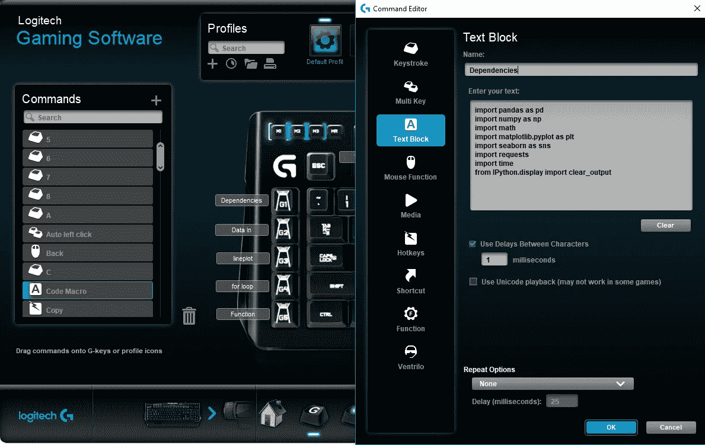
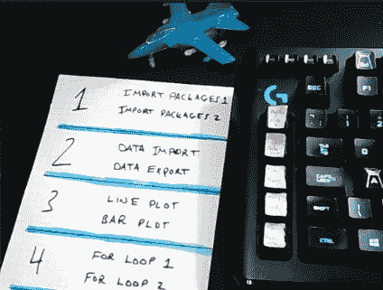
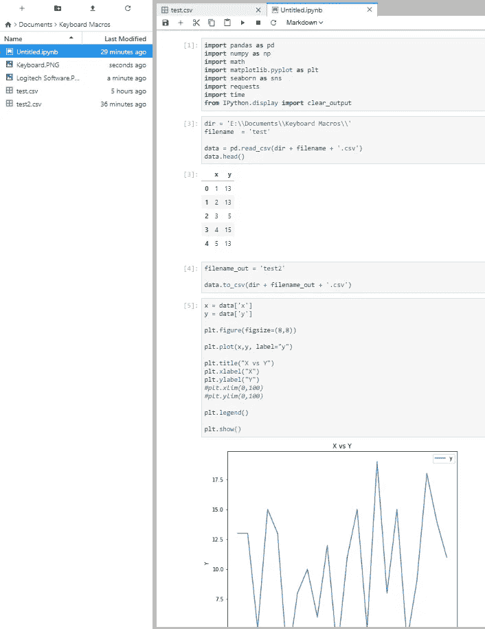

# 使用键盘宏简化编程—视频

> 原文：<https://towardsdatascience.com/making-programming-easier-with-keyboard-macros-video-b3c2303a7881?source=collection_archive---------7----------------------->

Linus Tech Tips 最近的一个[视频介绍了他们的一个编辑器如何使用宏进行视频编辑。这让我开始思考；**可以很容易地创建宏来改进我的编程吗？**](https://www.youtube.com/watch?v=GZEoss4XIgc)

此视频演示了如何创建代码宏及其用途:

## 背景

Source: [Linus Tech Tips — Can your Keyboard do THIS?? — Make ANY key a MACRO!](https://www.youtube.com/watch?v=GZEoss4XIgc)

如前所述，这个想法是在观看 Linus 技术提示视频后产生的。现在，他可能在 3 个专用于宏的键盘上走得有点远了(如上图所示)。然而，我已经碰巧使用了一个有一些宏按键的，所以为什么不利用它。

我的键盘是罗技 G910，它有 9 个宏按键，3 个轮廓，总共有 27 种可能的组合。

## 它是如何工作的

幸运的是，罗技软件使这变得非常容易，但用其他设备复制也应该很简单。我只是分配每个宏来创建一个文本块，粘贴一些预定义的代码。

我为总共 10 个宏分配了 5 个键和 2 个配置文件。这些显示在下图中，并在视频中充分展示。

每个宏都粘贴预定义的代码，从而可以快速轻松地执行一些任务，例如:

*   导入包/依赖项
*   导入/导出数据
*   使用设置的格式创建图
*   创建 for 循环
*   定义函数
*   为减价单元格创建 LaTeX 方程

这些只是我发现的主要用例，但我相信每个人都会根据自己的需求有自己的想法。

我希望这对您自己的数据科学任务有用

谢谢