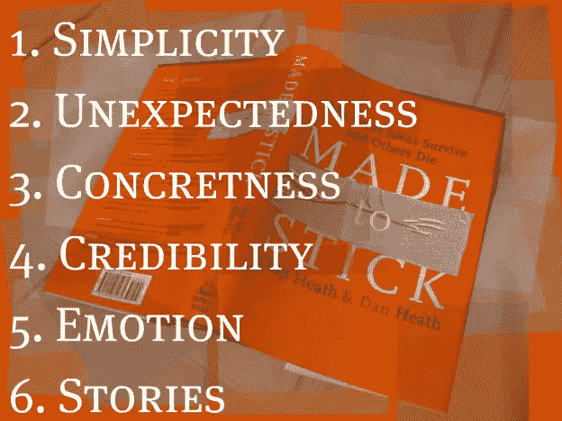

# 作为一名数据科学家，坚持提出建议

> 原文：<https://towardsdatascience.com/making-recommendations-stick-as-a-data-scientist-b1124d489b0b?source=collection_archive---------16----------------------->

## 用这六个原则让推荐脱颖而出

你有没有向观众介绍过你的推荐，却让他们无处可去？如果你像大多数数据科学家一样，很可能你以前也遇到过这种情况。

数据科学家的部分工作是能够将您的工作转化为对利益相关者可行的建议和见解。这意味着让你的想法令人难忘，易于理解和有影响力。

在本文中，我们将探索《让 [*贴上*](https://www.amazon.com/Made-Stick-Ideas-Survive-Others-ebook/dp/B000N2HCKQ) 这本书背后的原理，并在数据科学的背景下应用它。这本书提出，最好的想法遵循六个主要原则:简单、出乎意料、具体、可信、情感和故事(成功)。读完这篇文章后，你将能够把这些原则融入到你的工作中，并增加你的建议和见解的影响力。

## **简单的**

让一个想法变得简单就是把这个想法剥离到它的核心。不是要变笨，而是要创造一些优雅的东西。这意味着你应该避免用想法压倒你的听众，当你试图说三件事时，你什么也没说。使想法简单的另一个关键因素是避免埋没线索。如果在您的分析过程中，您发现 10%的客户贡献了 80%的收入，请以这一关键见解为线索！你应该遵循一个倒金字塔的方法，最初的几分钟传达最多的信息，随着你越走越远，你可以得到更多的细微差别。类比和隐喻也是简单简洁地表达你的想法的好方法。能够使用你的观众能够理解和联系的模式，会使它更容易理解。例如，一个一句话的比喻，比如优步代表 X，可以抓住你想要传达的核心信息。

## **意想不到的**

意想不到的想法是违背人们的期望，利用惊喜的想法。你可以通过几种方式做到这一点，其中之一是让人们承诺一个答案，然后伪造它。例如，在透露真实答案之前，要求猜测员工在完成一项你希望自动化的任务上花费了多少时间。另一种激发兴趣和利用意外原理的方法是使用神秘事物，因为它们会带来“啊哈”时刻。这可能会以一个小故事开始你的陈述，直到最后你才决定。

## **混凝土**

对于非专家来说，抽象是理解的敌人。作为数据科学家，您的工作是让您的建议和见解更加具体。理解的关键是使用具体的图像，并根据人类的行为和感觉来解释想法。具体性的天敌是知识的诅咒。作为数据科学家，我们需要抵制用不必要的技术信息淹没受众的冲动。例如，报告一个模型的均方根误差，可能没有把语言分解成任何人都能理解的更具体的术语有用。

## **可信**

给你的推荐增加可信度有三种形式。当我们想到可信度时，第一个是最常见的，即利用专家来支持声明或断言。另一种方法是使用反权威人士，他们是有着强大故事的真实人物。例如，如果你在谈论吸烟的危害，一个患肺癌的人的故事将比一个无菌的统计数据更有影响力。给你的故事增加可信度的第三种方法是把你观点的可信度外包给你的听众。这意味着创建一个可测试的声明，让受众可以尝试。例如，声称来自区域 A 的客户比来自任何其他区域的客户多花费 80%的客户支持时间。在提出这一主张时，您的受众可以确认这一主张，从而更容易引导您进行推荐。

## **情绪**

在你的想法中加入情感因素是为了让人们关心你。人类天生就能感受人类，而不是抽象概念。因此，一个人往往胜过一个综合统计数据。情绪的另一个组成部分是挖掘你的观众所认同的群体身份。记住这些特征，你就可以把相关的联想联系起来，并唤起你的听众最容易接受的某些图式。例如，如果你知道你的一个听众是一个坚持数字的人，并且想要看到你是如何得出某些结论的详细分类，那么添加一个附录可能是有帮助的。

## **故事**

几个世纪以来，人类一直在讲故事，事实证明这是最有效的教学方法之一。如果你反思过去 5 年读过的书，你更可能记住有趣的故事，而不是客观事实。当把故事编织到你的推荐中时，一定要营造紧张气氛，不要一下子把所有东西都泄露出去。另一个有用的策略是讲故事，作为其他想法的跳板。创造开放式的故事，让你的观众可以在此基础上发展，这是让他们获得主人翁感的好方法。

下一次，当你需要提炼你的见解或推荐时，请记住这六条原则，你将很快创造出简单、意想不到、具体、可信的情感故事！