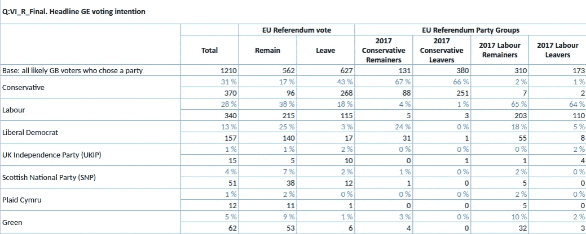
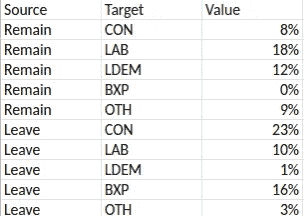
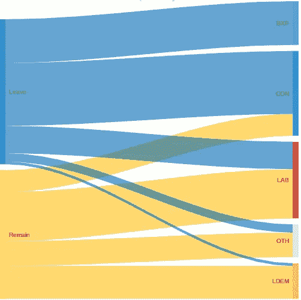

# 在 googleVis 中制作桑基图

> 原文：<https://towardsdatascience.com/making-sankey-diagrams-in-googlevis-f9cabf433ffc?source=collection_archive---------19----------------------->

## 统计程序 R 可用于强大的数据可视化。

我用一个 R 包创建了一个 Sankey 图，展示了在一次大选中，从召回 2016 年欧盟公投投票到当前投票意向的流程。

# 制作桑基图

英国民意调查委员会成员民意调查的数据表显示了不同部分对问题(如投票意向)的回答。使用 2019 年 8 月 8 日至 9 日通过互联网小组对 2003 名英国成年人进行的 [Opinium 民意调查。这项民意调查是由《观察家报》发起的。](https://www.opinium.co.uk/political-polling-8th-august-2019/)

这些数据表提供了受访者的准确人数:

This is an edited part of the Opinium/Observer data tables. (Image: [Opinium/Observer](https://www.opinium.co.uk/political-polling-8th-august-2019/))

然后，我们可以创建表格，显示主要政党(保守党、工党、自由民主党、英国退出欧盟党)和其他政党的留欧和脱欧投票。

准备好的数据表显示源变量和目标变量及其值:

# 使用 googleVis

googleVis 包允许 R 与 Google 图表工具接口。创建 Sankey 图的函数称为 gvisSankey，其选项的结构[有些复杂。](https://developers.google.com/chart/interactive/docs/gallery/sankey#data-format)

要为节点输入正确的颜色，需要按照它们在表中的原始顺序进行排序:第一个源、目标和后续源。这一点还不清楚，需要反复试验。

> `opinium_sankey_gv <- gvisSankey(opinium_sankey_df,
> options = list(height = 500, width = 500, tooltip = "{isHtml:'True'}", sankey = "{link: { colorMode: 'source' }, node: { colors: ['#FFC010', '#0069B5', '#DC241F', '#FAA61A', '#12B6CF', '#DDDDDD', '#0087DC'] }, iterations: 1}"))`

该图显示了从 2016 年召回欧盟公投投票到当前大选投票意向的流程。以下是 Opinium 民意调查的主要估计:

The interactive version of the Sankey diagram may be viewed. (Image: [R/googleVis](http://rpubs.com/anthonybmasters/518971))

创建有效的数据可视化需要时间。使用 googleVis 也有局限性，比如无法为情节设置标题。

Jen Thompson 还提供了使用 gvisSankey 的指南。Google Sheet 文件可能[下载了](https://docs.google.com/spreadsheets/d/e/2PACX-1vTKa00ft1lPW9ScbvBkUf0OOcpNNXh9SQCTq2R_YBWu6jIWIAgOoBfErC8kmNnzZxURa2dalDGaDAtl/pubhtml)，并且[我的 RPubs 文章](https://rpubs.com/anthonybmasters/opinium-sankey)可供阅读。