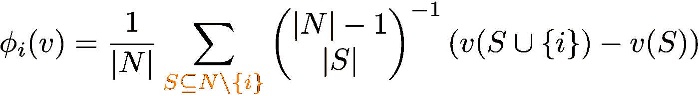
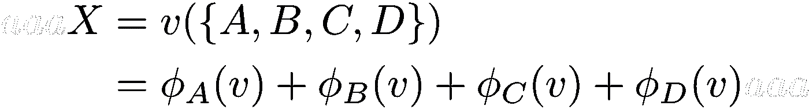

# 理解 Shapley 值

> 原文：<https://towardsdatascience.com/making-sense-of-shapley-values-dc67a8e4c5e8?source=collection_archive---------3----------------------->

Image credit: Iker Urteaga at [https://unsplash.com/photos/TL5Vy1IM-uA](https://unsplash.com/photos/TL5Vy1IM-uA)

我第一次听说 Shapley values 是在研究模型可解释性的时候。我遇到了 SHAP，这是一个可以更好地理解为什么你的机器学习模型会这样的框架。事实证明，Shapley 值已经存在了一段时间，它们最初起源于博弈论领域，可以追溯到 1953 年，目的是解决以下情况:

> 一群不同技能的参与者为了集体奖励而互相合作。奖励应该如何在团队中公平分配？

有趣的是，当一个“旧”的概念应用到另一个领域如机器学习时，它可以获得新的生命。在机器学习中，参与者是你输入的*特征*，集体支出是模型*预测。*在这种情况下，Shapley 值用于计算每个特征对模型输出的贡献。

沙普利值是如何计算的？大多数时候，你会在文学作品中看到这个等式:

让我们把它分解一下。在**联盟游戏**(之前描述的场景)中，我们有一组 **N** 的 *n* 玩家。我们还有一个函数 *v* ，它给出这些玩家的任何子集的值(或支出)，即让 **S** 是 **N** 的子集，然后 v( **S** )给出该子集的值。因此，对于一个联盟博弈( **N** ，v)我们可以用这个等式来计算玩家 *i* 的支付，即沙普利值。

我不知道你是怎么想的，但当我第一次看到这个等式时，我的第一反应是类似于*“这到底是什么？？?"*

我很难理解为什么它看起来是这样的。这花了一些时间，但在尝试了一点之后，它终于开始变得有意义了。所以，让我们开始吧！

好的，我们要做的第一件事是稍微改写一下初始方程

乍一看，我们似乎并没有使我们的处境变得更好，但是请耐心听我说。很快我将分解等式的不同部分，以便理解它们，但是让我们也定义一个玩具场景，我们可以使用它来使它不那么抽象。

假设我们经营一家生产砖的工厂。我们的一个制作团队由四个人组成: **A** 曼达、 **B** 恩、 **C** 莱尔和 **D** on(从现在开始我会用他们名字的第一个字母来称呼他们)。每周他们一起设法生产出 X 数量的砖。因为我们工厂进展顺利，我们有一笔奖金想分发给团队成员。但是，为了让我们以公平的方式做到这一点，我们需要找出每个人每周为生产 **X** 数量的砖做出了多少贡献。

这里的困难之处在于，我们有几个影响因素，它们都会影响团队能够生产的砖块数量。其中一个是团队规模，因为团队越大，生产的砖块就越多。另一个可能是团队成员之间合作的好坏。问题是我们无法以有意义的方式量化这些影响，但幸运的是，对我们来说，Shapley 值可以用来回避这个问题。

我们现在已经定义了我们的玩家( **A** 、 **B** 、 **C** 和 **D** )以及他们正在参与的游戏(生产砖块)。让我们首先决定生产的 **X** 砖块中有多少可以归因于 **D** on，即计算 **D** 的沙普利值。如果我们将其与 Shapley 值公式的参数联系起来，我们就可以得到

所以 **D** 就是我们的选手 *i* 而整个团 **N** 由全部四名队员组成， **A** 、 **B** 、 **C** 和 **D** 。有了这些，让我们开始仔细看看 Shapley 值公式的这一部分

它说我们需要把我们的一群人和*排除*我们现在关注的人。然后，我们需要考虑所有可能形成的子集。因此，如果我们从组中排除 **D** ，我们就剩下 **{A，B，C}** 。从这个剩余的组中，我们可以形成以下子集(即这些是 **S** 可以接受的集合)

总的来说，我们可以构建剩余团队成员的 8 个不同子集。这些子集**和**中的一个是*空*集，即它没有任何成员。现在让我们把注意力转向这一部分

这就是沙普利价值的一个基本概念开始发挥作用的地方:将玩家 *i* 加入游戏的*边际价值*。因此，对于任何给定的子集 **S** ，我们将把它的值与当你把参与人 *i* 包括在内时的值进行比较。通过这样做，我们得到了将参与人 *i* 添加到该子集的*边际值*。

如果我们把它与我们的例子联系起来，我们想看看如果我们把 **D** 加到我们的 8 个子集中，每周生产的砖的数量会有什么不同。我们可以将这 8 个边际值直观地表示为

您可以将这些视为不同的场景，我们需要观察这些场景，以便公正地评估 **D** 对总体产量的贡献。这意味着我们需要观察如果没有人工作(即空集**和**)会生产多少砖块，并将其与只有**和**工作时的情况进行比较。我们还需要观察 **AB** 产生了多少砖块，并将其与 **AB** 和 **D** 一起产生的砖块数量进行比较，以此类推，我们可以形成所有 8 个星座。

好了，我们现在已经知道我们需要计算 8 个不同的边际值。沙普利值方程中的求和告诉我们，我们需要把它们加在一起。然而，在我们这样做之前，我们还需要缩放每个边际值，这是等式的这一部分告诉我们的

当我们用除了玩家 *i* 之外的所有剩余团队成员构建子集时，它会计算每个子集*大小*的排列数。或者换句话说:如果你有 **|N|-1** 名选手，你能和他们组成多少组大小 **|S|** 的队伍？然后我们用这个数字来划分玩家 *i* 对所有大小为 **|S|** 的组的边际贡献。

对于我们的场景，我们有 **|N|-1 = 3** ，也就是说，当计算 **D** 的 Shapley 值时，我们剩下的团队成员。在我们的例子中，我们将使用等式的这一部分来计算我们可以组成多少个大小为 0、1、2 和 3 的组，因为这些只是我们可以与剩余玩家一起构建的组大小。因此，举例来说，如果我们有那个 **|S|=2** ，那么我们得到我们可以构造这个大小的 3 个不同的组: **AB** 、 **BC** 和 **CA** 。这意味着我们应该将以下比例因子应用于 8 个边际值中的每一个:

让我们思考一下为什么我们要这样做。我们想知道 **D** 对团队总产量的贡献有多大。为了做到这一点，我们计算了他对我们能组成的团队的每个星座的边际贡献。通过添加这个比例因子，我们*平均出*团队其他成员对每个子集大小的影响。这意味着当加入到规模为 0、1、2 和 3 *的团队中时，我们能够获得 **D** 的*平均*边际贡献，而不管这些团队的构成*。

好了，我们现在差不多完成了，我们只剩下 Shapley 值方程的最后一部分需要分解，这一点也应该很容易理解

我们还有最后一个比例因子，需要应用于所有的边际值，然后才能对它们求和。我们必须将它们除以参与游戏的玩家数量，即我们总共拥有的团队成员数量。

再说一遍，我们为什么要这么做？好吧，如果我们看一下我们的砖厂例子，我们已经平均了其他团队成员对每个子集大小的影响，允许我们表达 **D** 对大小为 0、1、2 和 3 的组的贡献。谜题的最后一块是*平均出*团队规模的影响，也就是说 **D** 贡献了多少*而不考虑*团队的规模。对于我们的场景，我们通过除以 4 来实现这一点，因为这是我们可以考虑的不同组大小的数量。

我们现在已经到了可以最终计算出 **D** 的 Shapley 值的时候了。我们已经观察到他对团队中不同星座的贡献有多大。我们还计算了团队成员构成和团队规模的平均影响，最终使我们能够计算

I’m playing it fast and loose when it comes to using mathematical notation here, but this is more of a graphical illustration of what we’re doing than a mathematical one (it’s how I visualize it in my head).

我们有了，D 的沙普利值。在我们完成这项工作后，团队的其他成员就会知道每个人对每周生产的砖块数量的贡献，这样我们就可以在所有团队成员之间公平地分配奖金。

至此，我希望您已经更好地理解了沙普利价值观是如何运作的。如果你考虑到我们不需要知道任何关于价值函数 *v* 的内部工作原理，我们只需要观察它给不同子集的值就可以了，我们可以从参与游戏的玩家中制定出这些值。

这是沙普利价值观背后真正的力量和吸引力。然而，这是有代价的。对于一组参与游戏的 n 名玩家，您将拥有需要分析的 2^n 子集，以便计算沙普利值。

有一些方法可以使计算更实际可行，在介绍中我提到了 SHAP 框架，它的主要优势是当应用于机器学习时，它能够更有效地计算 Shapley 值(你可以在这里阅读更多信息)。

非常感谢[Albin remng](https://medium.com/u/f5650d4be1cd?source=post_page-----dc67a8e4c5e8--------------------------------)对本文初稿的宝贵反馈。