# 用 Python 建模新闻报道。第 1 部分:导言

> 原文：<https://towardsdatascience.com/making-sense-of-the-news-part-1-introduction-f171d1da65a8?source=collection_archive---------11----------------------->

有很多新闻媒体有很多不同的观点。从某种意义上说这很好，但从另一种意义上说，任何人都不可能每天都阅读所有的东西，更别说那些忙碌几天的人了。然而，新闻只是随着时间的推移发生的一系列事件，所以这表明有一种方法可以对它进行建模，这样我们就可以了解正在发生的一些事情。

预测新闻趋势可以被认为是类似于人们已经试图在股票市场上做的事情，我们知道有一系列影响股票价格的因素，如果你得到了正确的因素，你就可以根据今天发生的事情预测出股票的未来价格。同样，如果我们真正理解了新闻中正在发生的事情以及影响新闻制作的因素，那么我们应该能够利用这种理解来预测未来的新闻制作。虽然不一定有经济效益，但了解事件的报道如何随着时间的推移而变化，可能有助于我们理解为什么人们会以不同的方式看待事件，以及事情是如何发展到现在这个地步的。

这是探索新闻报道建模系列文章中的第一篇博文。每篇文章都包含独立于其他文章运行分析的代码。它使用 60 天的数据来写博客(刚好够 SARIMA 以后使用)，使用更长的时间会表现得更好。

迄今为止撰写的帖子:

*   第 1 部分:简介(This)随机生成时间序列数据，然后查看一些真实的 Twitter 数据，然后查看一些新闻报道的时间序列，并通过向量自动回归来运行它们，以显示有模式可寻。
*   [第 2 部分:用有限的数据开始新闻预测](/modeling-news-coverage-with-python-part-2-starting-news-forecasting-with-limited-data-5c1092de3ea9)提供了使用现成的神经网络和使用几个新闻报道的时间序列预测报道的基础，然后用 SARIMA 模型做同样的事情。
*   [第三部分:新闻网站与谷歌搜索趋势的互动](/modeling-news-coverage-with-python-part-3-newspaper-coverage-and-google-search-trends-dca50f60a9c8)继续使用 SARIMA 模型来研究新闻网站报道与谷歌搜索趋势之间的互动。它使用新闻数据和搜索数据来预测搜索率和新闻报道。

# 玩时间序列(随机数据)的快速复习

我正在用 python 做这件事，代码全部提供。您应该能够将代码粘贴到启用 python 的笔记本中(例如[https://colab . research . Google](https://colab.research.google))并运行它，它应该能够工作。当我有时间的时候，我会回去修复一些东西，但是我想我会把这篇博客文章放在那里，以防有人在寻找开始这种分析的地方。

所以让我们开始吧！使用 index 代表时间，我们可以使用 numpy 的 random 函数在 Python 中创建一个随机的外部(来自外部模型的输入)时间序列:

```
import pandas as pd
import numpy as np
exogenous = np.random.uniform(size=100)
df = pd.DataFrame(exogenous)
df.plot()
```

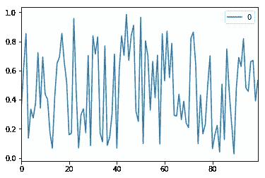

然后，我们可以创建一个内生时间序列，也就是说……我们的外生时间序列的 1.5 倍。

```
endogenous = 1.5 * exogenous
df =  pd.DataFrame([endogenous, exogenous]).T
df.columns = ["endogenous", "exogenous"]
df.plot()
```


我们现在可以运行 OLS，看到内生的是外生的 1.5 倍

```
import statsmodels.api as smmodel = sm.OLS(df.endogenous,df.exogenous)
results = model.fit()
results.summary()
```


OLS Regression Summary on Endo/Exo Series

万岁！我们得到了 1.5 的系数，关于内生导致外生。然而，我们真正想做的是能够提前预测将要发生的事情。由于这些值是随机的，我们不会有任何滞后，但我们可以通过将所有内生值下移一个单位并删除第一个时间序列来改变这一点..

```
df.endogenous = df.endogenous.shift()
df = df[1:]
model = sm.OLS(df.endogenous,df.exogenous)
results = model.fit()
results.summary()
```


OLS on shifted series

嗯，我们有一个系数，但是 R 平方和其他指标都不好。这很好，因为现在每个都是随机值。然而，我们希望看到以前的值，所以让我们尝试一个向量自回归模型，为了好玩，加入一些滞后值。

```
from statsmodels.tsa.api import VARmodel = VAR(df)
results = model.fit(maxlags=3)
results.summary()
```


VAR results

万岁！该模型估计，内生因素与外生因素的差距仅为 1.5 倍，而外生因素是 0.43+-一些噪声，尽管这些噪声在统计上是显著的(应该是 0.5 倍，它也从滞后中获得了一些随机性)。

哦，只是为了好玩，我们可以很容易地说，我们可以用外生来预测内生，但不能用内生来预测未来的外生。为了测试这种情况有多严重，我们可以使用格兰杰因果关系，这基本上是对每个序列分别运行 OLS，然后看看在第二个时间序列中添加是否有助于我们获得更好的数字。因此，运行测试检查第二个时间序列是否有助于预测第一个时间序列。(也就是说，h_0 将是第二个变量不会导致第一个变量，所以如果我们可以否定 h_0，这意味着第二个变量不会导致第一个变量，尽管否定 h_0 只是表明存在相关性，而不是实际的因果关系)。

```
from statsmodels.tsa.stattools import grangercausalitytestsgc = grangercausalitytests(df[["endogenous", "exogenous"]], 2)
```


Granger causality of exogenous on endogenous

在滞后 1 运行从外生到内生的格兰杰因果关系会给我们一个比滞后 1 和滞后 2 更好的检验结果(因为滞后 2 只是噪声)。现在我们可以检查另一个方向。

```
gc = grangercausalitytests(df[[“exogenous”, “endogenous”]], 2)
```

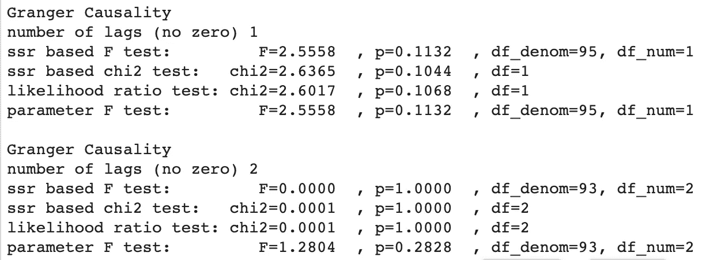

Granger causality of endogenous on exogenous

我们从结果中看到，在内生->外生方向上没有统计上的显著关系，所以不能拒绝 h0。

太酷了，我们记住了什么是时间序列，并可以对它们稍加修改。还有其他重要的东西，如正常化趋势和季节性，以及扰乱自相关，但我们可以稍后再担心，现在让我们来看看新闻。最终，在训练数据之外的任何更好的预测都将是我们所关心的，加入不同的函数只是提高了我们用来判断模型是否好的准确性。

# 新闻时间系列《荒野》(推特)

在进入新闻之前(这是一件痛苦的事情，除非你手头正好有一份新闻文章的档案，我将在稍后介绍一种变通方法)，让我们看看一些随机的有新闻价值的推文。谢天谢地，有一个很好的有新闻价值的特朗普推文档案可供查看。

所以我们可以去[http://www.trumptwitterarchive.com/archive](http://www.trumptwitterarchive.com/archive)然后去“下载”——>“JSON”抓取川普所有推文的档案。我们将把弹出的结果复制/粘贴到一个实际的。json 文件在我们的工作目录中；我把它叫做“trump_tweets.json”。


Going here, downloading Trump’s tweets

所以我们可以把它移植到熊猫身上。

```
df = pd.read_json(“trump_tweets.json”)
df.head()
```


Head of the json file

所以我们看到我们有一堆推文的数据。我们有一堆 created_at 的时间戳，每条推文有多少赞，id 字符串(通过追加到 https://twitter.com/realDonaldTrump/status/)的末尾链接到原始推文)。最重要的是，我们得到了文本。

所以让我们忽略除了 text 和 created_at 之外的一切。现在，有很多方法可以篡改文本，但是我不知道如何在博客文章的这一点上做好自然语言编程。那么看看他发的微博有什么有趣的呢？

嗯，发生了很长时间的事情是俄罗斯勾结和穆勒报告的整个事情。因此，让我们看看他从 2017 年初开始通过 2019 年 3 月的巴尔备忘录使用一些基本的字符串匹配来发布关于俄罗斯和勾结的推文的频率。我们将从他的文本开始，并使其小写

```
#convert created_at to datetimeimport datetime
df.created_at = pd.to_datetime(df.created_at)df = df[(df["created_at"] < datetime.datetime(2019,3,1)) & (df["created_at"] > datetime.datetime(2017,1,1))]# create a column for lower case
df[“text_lower”] = df.text.apply(lambda x:x.lower())len(df)
>>> 41420
```

太好了，我们已经有 41000 条推文了。现在让我们做一些标记

```
df[“russia”] = df.text_lower.apply(lambda x: x.find(“russia”) > -1)df[“collusion”] = df.text_lower.apply(lambda x: x.find(“collu”) > -1)
```

我们可以只选择那些提到这两个词的推文

```
#create df where the previous rows had either russia or collusion labelrc_df = df[df["russia"] | df["collusion"]].set_index("created_at")
```

我们可以重新采样，得到每天的计数，然后继续绘制

```
rc_df_d = rc_df[["russia", "collusion"]].resample("d").sum()rc_df_d.plot(figsize=(12,8)
```

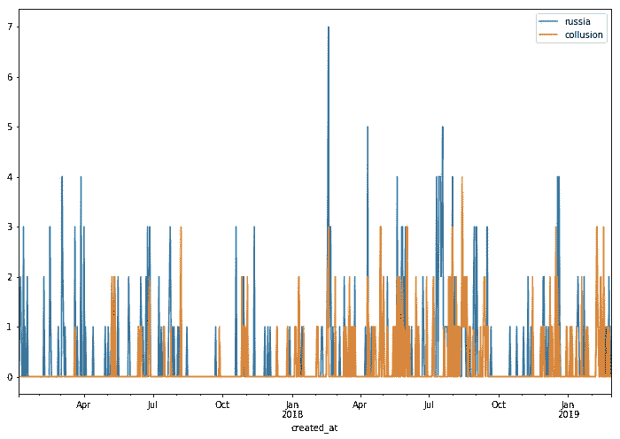

我们可以运行我们的风险值模型

模型= VAR(rc_df_d)
结果=模型.拟合(maxlags=5)
结果.总结()

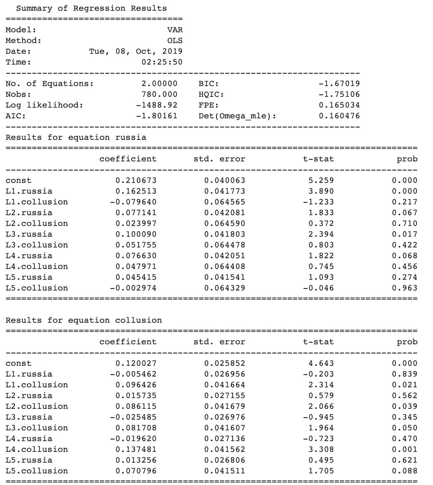

因此，我们看到，到目前为止，我们为我们的模型计算的大系数是他之前是否在推特上发布过关于这个主题的消息，至少在日常水平上。

但是我们不需要只处理每日粒度，我们也可以查看每周粒度。

```
rc_df_w = rc_df[[“russia”, “collusion”]].resample(“w”).sum()
rc_df_w.plot(figsize=(12,8))
```


运行 VAR，我们得到几乎没有关系，除了勾结推文可能与俄罗斯推文 2 周前。

```
model = VAR(rc_df_w)results = model.fit(maxlags=3)results.summary()
```

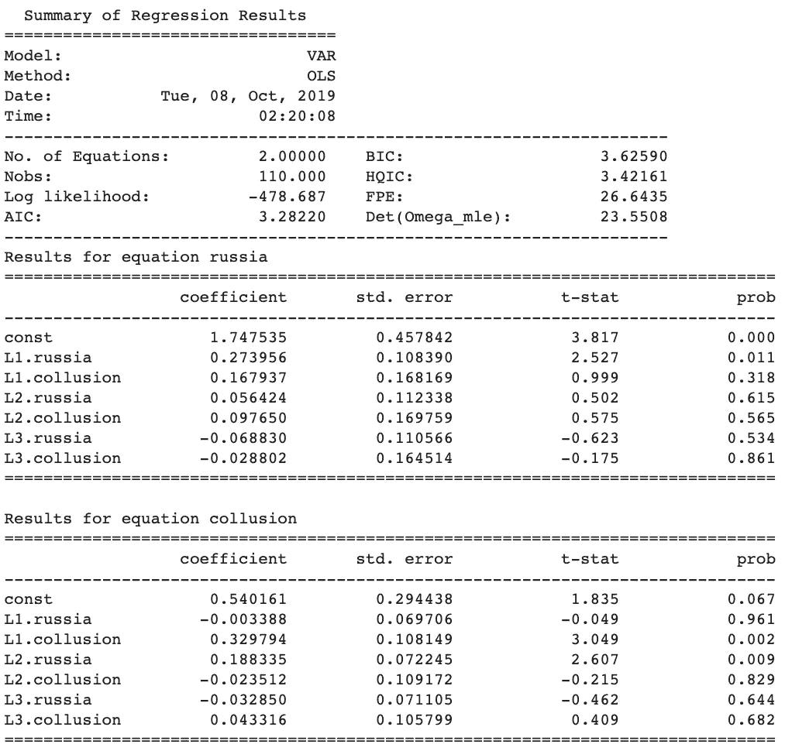

因此，在每周水平上，我们开始看到俄罗斯的推文有一个轻微的系数(. 18)，导致在 2 周的滞后期内关于勾结的推文。所以我们也可以加入更多的变量。让我们随便找个东西，比如，哦，中国，扔进去，重新算一遍。

```
df[“china”] = df.text_lower.apply(lambda x: (x.find(“china”) > -1) or (x.find(“chinese”) > -1))rcc_df = df[df[“russia”] | df[“collusion”] | df[“china”]].set_index(“created_at”)rcc_df_d = rcc_df[["russia", "collusion", "china"]].resample("d").sum()rcc_df_w.plot(figsize=(12,8))
```

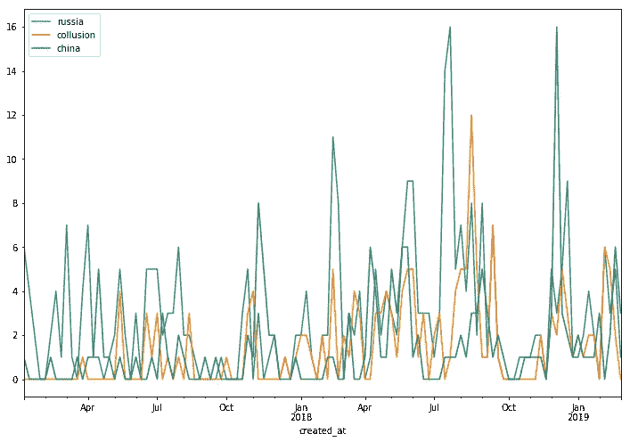

Oh, wait, I think there’s a trend there ish. and a seasonality.I should have covered stationarity and decomp.

所以我们可以检查我们的风险值

```
model = VAR(rcc_df_d)results = model.fit(maxlags=5)results.summary()
```

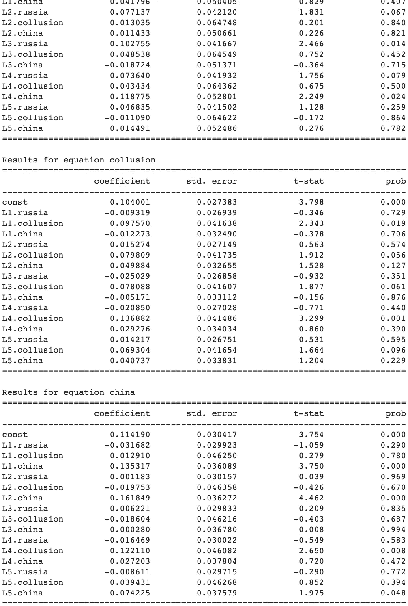

所以在前两者的每日水平上看不到太多，但是看到有一个 0.12 的系数在 4 天的共谋滞后上。

我们可以在那里运行我们的每周 VAR，看看会有什么结果。

```
model = VAR(rcc_df_w)results = model.fit(maxlags=3)results.summary()
```

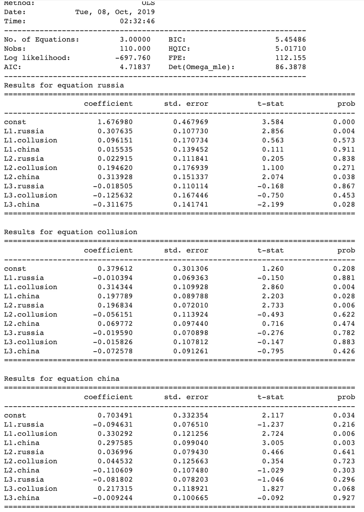

因此，对于这个模型，到目前为止，俄罗斯推文的中国系数有 2 周的滞后，俄罗斯串通有 2 周的滞后，中国串通有 1 周的滞后。所以这里有更多的东西需要挖掘(这涵盖了整个时间段),以检查这些关系何时成立以及多久一次，但现在我们将转而实际查看新闻。因为这个帖子是关于新闻的，不是关于推文的。但现在你看到了如何从 tweets 中提取一些文本，将其转换成时间序列，并运行任何你想在其上运行的模型。

# 所以终于有了真正的新闻

## 预标记集合:GDELT

GDELT[[https://www.gdeltproject.org](https://www.gdeltproject.org/)]是一个非常酷的项目，它每天检查大约 10 万个新闻网站，给所有文章贴上标签，并使它们可用。有一个版本 1 每天拉和版本 2，每 15 分钟拉一些更好的标签。这些标签包括主题(他们自己编的)、人物、地点和其他一些我一时想不起来的东西。

我们将通过下载过去 60 天的数据来了解这一点。如果你知道你在做什么，你可以继续从他们的 BigQuery 数据库中提取你想要的东西，这个数据库可以追溯到 2014 年(尽管早期的文章很糟糕)。

因此，这将是一个有点内存密集型(15gb 左右)，因为我要保持一切在内存中，而不做任何偷偷摸摸的事情。因此，如果你正在使用谷歌 Colab(【https://colab.research.google.com】T2)，你会想切换到一个 GPU，并运行你的内存真正快速使用免费的 25GB 内存升级。如果没有，嗯，你真的可以把所有这些都贴上标签，实际上只需选择相关的出版商，但这只是让你开始拥有你想要的一切。

所以让我们开始吧。

首先，让我们确保安装了 gdelt 的 python 包

```
!pip install gdelt
import gdelt
gd = gdelt.gdelt(version=1)
```

现在，我们将提取最近 60 天的 CSV，并将其保存为 python pkl，为什么不呢

```
#re-importing stuff from earlier in case skipped
from statsmodels.tsa.api import VAR
import pandas as pdimport osos.makedirs(“data”,exist_ok=True)import datetime
cur_date = datetime.datetime(2019,10,7)-datetime.timedelta(days=60)
end_date = datetime.datetime(2019,10,7)
while cur_date < end_date:
  print(cur_date) year = cur_date.year
  month = str(cur_date.month)
  day = str(cur_date.day)
  if cur_date.month < 10:
    month = “0”+month
  if cur_date.day < 10:
    day = “0”+day
  results = gd.Search([‘%s %s %s’%(year, month, day)],table=’gkg’,coverage=True, translation=False) results.to_pickle(“data/%s-%s-%s.pkl”%(cur_date.year, cur_date.month, cur_date.day)) cur_date+=datetime.timedelta(days=1)
```

所以现在 dir“data”应该包含 60 个 pkl 文件，每个文件都有一天。我们可以通过从每个文件创建一个大的 DF 来加载它们

```
df = pd.DataFrame()
k = os.listdir(“data”)
for i in k:
  print(i)
  if i.endswith(“.pkl”):
    df = pd.concat([df, pd.read_pickle(“data/”+i)])
```

现在，万一我们弄坏了东西，我们可以把这个大 df 保存到磁盘上。我认为在这一点上看起来我占用了 6.5gb 左右的内存，保存到 PKL 会崩溃。你也可以保存为 CSV 或任何你喜欢的格式来最小化它所占用的内存，但实际上这一步只是为了加速重置，而不必再次加载所有单独的文件。

```
df.to_pickle(“first_60_days.pkl”)
```

好，让我们看看我们有什么。

```
print(len(df))
>>> 5250547df.head()
```


我们已经得到了日期，即文章的日期，NUMARTS，如果它为同一个实体提取了多个位置(现在不用担心这个)，COUNTS(现在不重要)，

*   日期:日期
*   NUMARTS: > 1 如果多篇文章(不用担心)
*   计数:与数字相关的术语(例如 **50** 抗议者)
*   主题:来自 SML 大地中海的一般主题的 NLP 标签
*   位置:地点
*   人:人+人喜欢的东西
*   组织:组织
*   语气:情绪
*   CAMEOEVENTIDS:用于随时间跟踪事件的一致 ID 值
*   来源:网站文章来自
*   SOURCEURLS:实际文章的原始 URL

让我们快速地看一下 SOURCEURLS。这实际上是用分号分隔的，但总的来说，我们有 262，171 个不同的来源组合。

```
df.SOURCES.nunique()
>>>262171
```

我们可以把它更好的分解成一个字典

```
df.fillna(“”, inplace=True)from collections import Counter
def join_col(x):
  big_string = “;”.join(x).split(“;”)
  myCount = Counter(big_string)
  return dict(zip(myCount.keys(), myCount.values()))x = join_col(df.SOURCES)
x=pd.DataFrame([x]).T.sort_values(by=0, ascending=False)
x
```

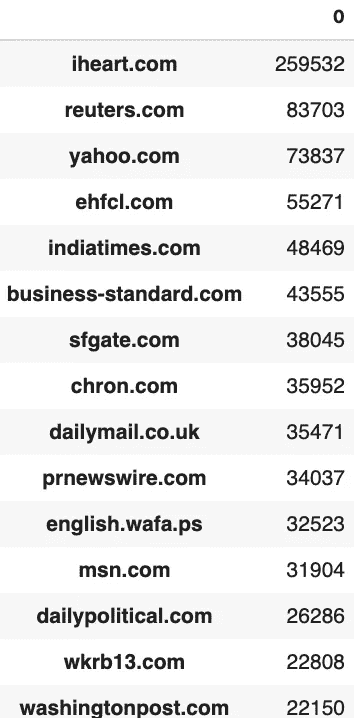

所以我们可以看到一些出版商。如果您希望有一个电子表格版本来标记出版商，而不是使用一个静态数组(就像我马上要使用的一样)，您可以很容易地将其导出到 excel 表中:(然后您可以导入带有标记的 excel 表)

```
x.to_excel(“sources.xlsx”)
```

无论如何，我们可以选择一些随机的网站，并确保他们得到刮除

```
mySources = [“nytimes.com”, “washingtonpost.com”, “foxnews.com”, “cnn.com”]for source in mySources:
  print("{} is {}".format(source, "good" if source in x.index else "bad"))
```

因此，一旦我们知道我们的网站是好的，让我们摆脱这个占据我们所有内存的巨大数据框架的大部分，只看那些我们关心的来源。

```
df = df[df[“SOURCES”].apply(lambda x: x in mySources)]
len(df)
>>> 44112
```

一个非常易管理的 44k 文章！

因此，GDELT 数据的一个问题是，有时日期被解释为 int，有时被解释为 string，所以我们将所有内容快速转换为 string，然后将其转换为 datetimes。(很容易忽略这一点，我刚刚花了一个小时试图找出为什么我的数据透视表被搞乱了，这是因为类型)。

```
df.DATE = df.DATE.apply(lambda x: str(x))
df.DATE = pd.to_datetime(df.DATE)
```

因此，现在我们可以快速查看每个出版商每天有多少文章。我们可以通过按源分组，然后忘记为什么使用数据透视表来做到这一点。

```
ax = df.groupby([“SOURCES”, “DATE”])[[“SOURCEURLS”]].count().unstack().T.droplevel(level=0).plot(figsize=(12,8))
ax.legend(loc=2)
```

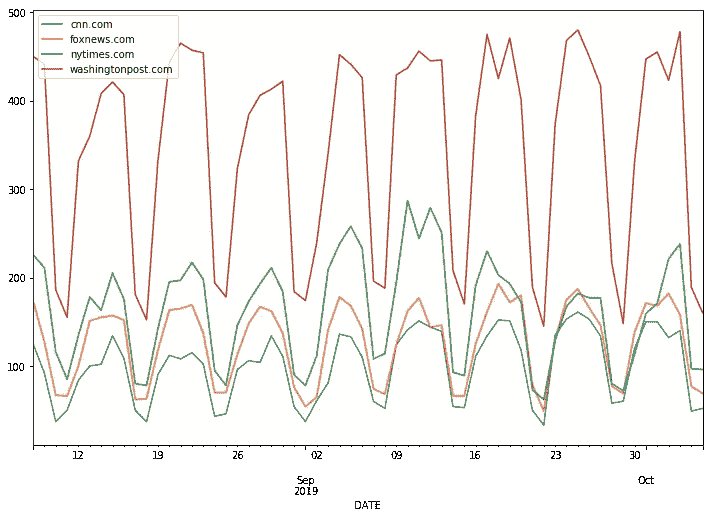

Coverage over Time

我们可以立即看到出版物有一些季节性，工作日的文章量较高，周末的文章量较低。

```
df.groupby([“SOURCES”, “DATE”])[[“SOURCEURLS”]].count().unstack().T.droplevel(level=0).plot.box(figsize=(12,8))
```

我们可以看看箱线图，看看东西是如何分布的。


Boxplots

所以让我们看看不同的出版物都写了些什么！因此，如果我们想记住它们是以“；”的形式存储的，我们可以遍历并提取各个位置不连续的

我们可以在 LOCATIONS 中查找特定的国家，方法是尝试查找单个国家，如下所示:

```
df[df[“LOCATIONS”].apply(lambda x: x.find(“Syria”) > -1)].LOCATIONS.to_list()[0]
```

但是实际上不需要知道国家代码(不像主题或人物有一些 NLP 规范化)；我们可以搜索一下。

所以让我们看看这些组织多久写一次关于不同国家的文章。我们可以对它们进行编码，如果它们包含我们能想到的地方:

```
df[“dprk”] = df[“LOCATIONS”].apply(lambda x: x.find(“North Korea”) > -1)
df[“ukraine”] = df[“LOCATIONS”].apply(lambda x: x.find(“Ukraine”) > -1)
df[“russia”] = df[“LOCATIONS”].apply(lambda x: x.find(“Russia”) > -1)
df[“iran”] = df[“LOCATIONS”].apply(lambda x: x.find(“Iran”) > -1)
df["china"] = df["LOCATIONS"].apply(lambda x: x.find("China") > -1)loc_df = df.groupby([“SOURCES”, “DATE”])[[“dprk”, “ukraine”, “russia”, “iran”]].sum()
```

然后我们可以继续绘制它们

```
fig, ((ax1, ax2, ax5), (ax3, ax4, ax6)) = plt.subplots(nrows=2, ncols=2)
fig.set_size_inches(12,8)
x=0
subplots = [ax1, ax2, ax3, ax4, ax5]
for column in loc_df.columns:
  loc_df[[column]].unstack(level=0).plot(ax=subplots[x])
  x+=1
  plt.tight_layout()
```


正如我们之前看到的，我们可以对这些时间序列运行 VAR，以初步了解这些时间序列之间的相互作用。我们只看天，因为如果我们看周，我们只有 8 个数据点，不会那么好。

因此，让我们看看国家的覆盖范围是如何从一个出版商转移到另一个出版商的！一家出版商是否在某些国家领先于其他出版商？

```
loc_df = loc_df.unstack(level=0)
countries = ["dprk", "ukraine", "russia", "iran", "china"]for country in countries:
  model = VAR(loc_df[[x for x in loc_df.columns if x.startswith(country)]], freq="d")
  results = model.fit(maxlags=3)
  display(results.summary())
```

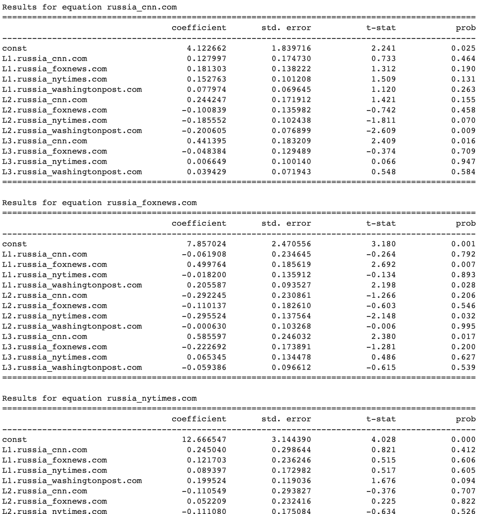

Part of results

太酷了，所以我们看到很多出版商倾向于以这种模式效仿华盛顿邮报对朝鲜的报道。同样，他们也关注《纽约时报》关于乌克兰的报道。当然，我们还没有开始评估一个模型是好是坏，但是现在我们开始看到一些模式从数据中显现出来。

现在让我们来看看每份出版物是如何覆盖不同国家的。

```
for source in mySources: model = VAR(loc_df[[x for x in loc_df.columns if x.endswith(source)]], freq=”d”)
  results = model.fit(maxlags=3)
  display(results.summary())
```

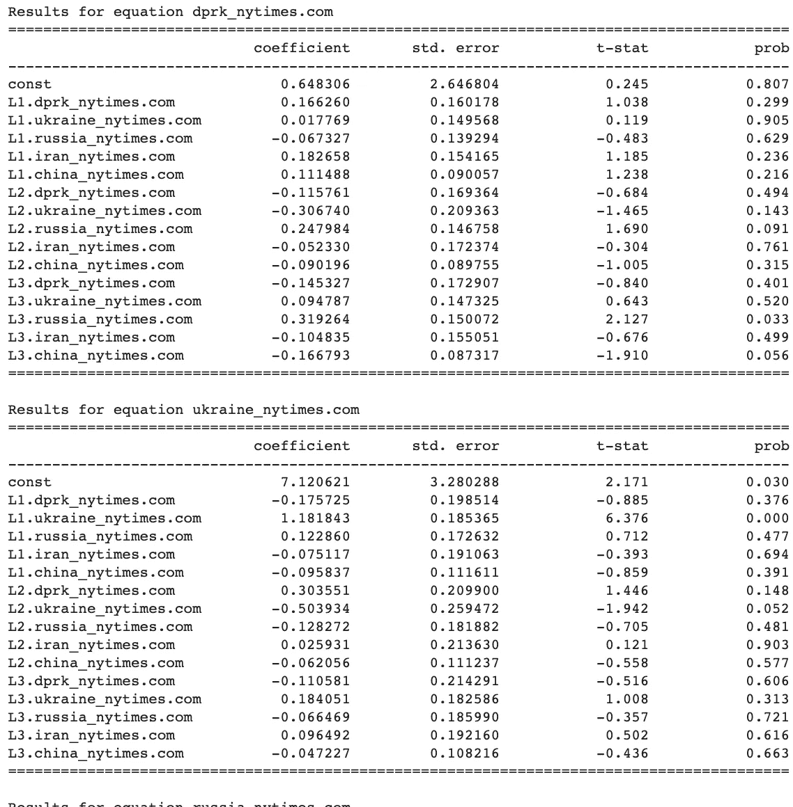

Part of results

所以我们可以看到，这里也有一些相互作用。

这应该足以让人开始摆弄 GDELT 数据集了。你可以利用地点、主题和人物的互动来识别不同种类的文章，看看随着时间的推移会有什么结果。在下一篇文章中，我将看看我是否能涵盖分解，一点关于模型评估，并尝试 SARIMA 和神经网络。

## 抓取您自己的集:

因此，GDELT 数据很好，但它缺少文章的实际文本。它还缺少一些功能，比如作者姓名和文章在网站上的位置。对于这种事情，你可能想要维护你自己的文章来分析自己。

新闻文章可能有点难得到，但是这样做有不同的困难。守护者是。最简单的方法是使用一个 API，允许你请求每一篇文章。纽约时报也有一个 API，但是它返回所有文章的 URL 和一些标签。但是，您可以根据 URL 回到原始 URL，自己抓取文本。这类似于使用 GDELT SOURCEURLS 字段返回并获取原始文本，您也可以对其他出版物这样做。然而，有了 GDELT SOURCEURLS，出版商可以更改旧文件的 URL，所以不能保证你会得到文章。

抓取文章的一个方法是每天抓取新闻网站主页(这是可行的)。但是如果你想要过去文章的档案，你需要能够找出它们在哪里。你可以创建一个谷歌自定义搜索引擎，在白天搜索出版物中的文章，但这需要一段时间。另一种方法是在新闻网站上使用内部搜索引擎。例如《华盛顿邮报》和《福克斯新闻频道》都有内部搜索引擎，你可以搜索特定日期发表的文章，找到需要搜集的文章。

一些新闻网站就是不允许按日期搜索，在这种情况下，你可能想走自定义搜索引擎的路线。其中包括 Breitbart News、Huffington Post 或 CNN。

如果你认为你可能想要一份好的新闻报道档案，那么至少开始每天抓取主页文章是值得的，这样你就可以很好地了解新闻网站在宣传什么。新闻报道变化很快，并不总是很容易回去，找出什么是过去的报道。希望这足以让你开始！