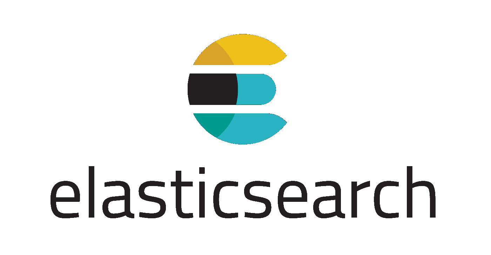
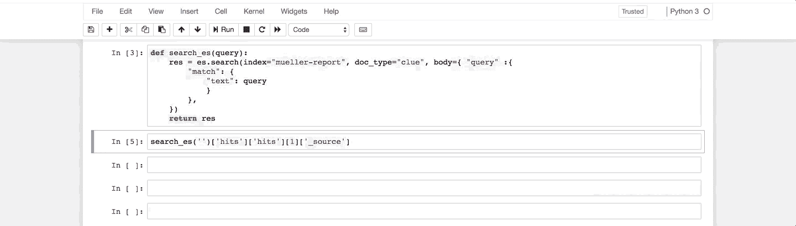
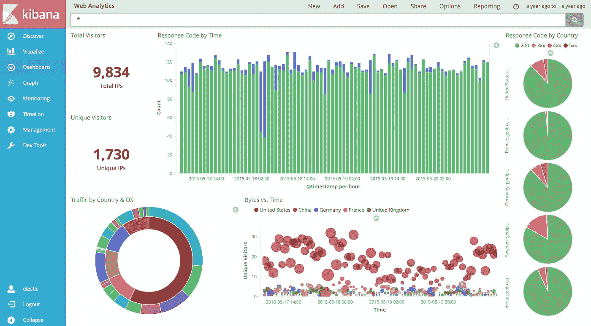
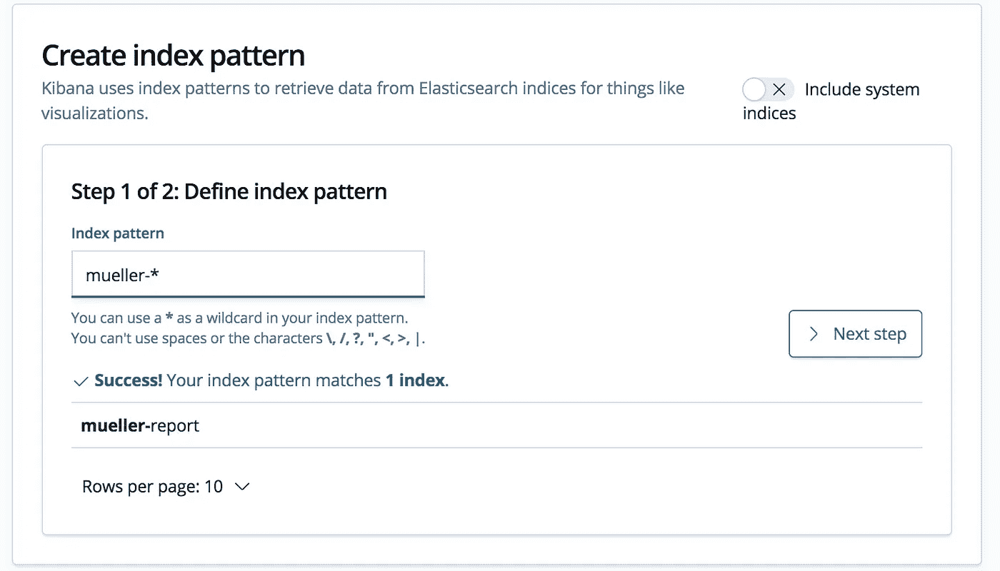
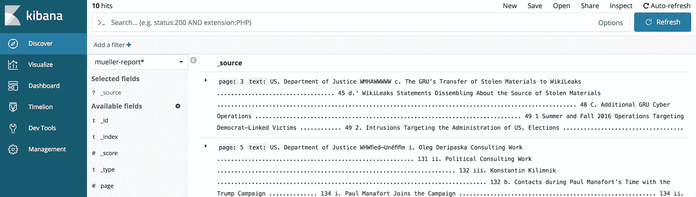

# 使用 OCR 和 Elasticsearch 搜索穆勒报告

> 原文：<https://towardsdatascience.com/making-the-mueller-report-searchable-with-ocr-and-elasticsearch-4e73e55de341?source=collection_archive---------9----------------------->

4 月 18 日标志着穆勒报告的全面发布——这份文件概述了对俄罗斯可能干预 2016 年总统选举的调查。像大多数政府文件一样，这份文件很长(448 页)，读起来会非常乏味。


[Source](https://cdn.cnn.com/cnnnext/dam/assets/190417144337-20190418-mueller-report-drop-generic-blue-large-169.jpg)

更糟糕的是，实际下载的 PDF 基本上只是一张图片。您不能复制/粘贴文本，或者如果您想在文档中搜索更有针对性的信息，可以使用 ctrl+f 查找文本的特定部分。

然而，我们可以很容易地使用两种伟大的技术来搜索这个文档:光学字符识别(OCR)和弹性搜索。

## 光学字符识别

OCR 允许我们对文本进行拍照、识别，然后将其转换为实际文本——参见维基百科上的[这一描述](https://en.wikipedia.org/wiki/Optical_character_recognition)。幸运的是，在当今时代，有许多开源库/产品来完成这项任务。


[Source](https://upload.wikimedia.org/wikipedia/commons/7/78/Tesseract_OCR_logo_%28Google%29.png)

[宇宙魔方](https://opensource.google.com/projects/tesseract)就是这样一个引擎。它最初开发于 80 年代，自 2006 年以来一直是谷歌的项目，是最受欢迎的 OCR 引擎之一。今天，我们将使用 Python 包装器:[pytesserac](https://pypi.org/project/pytesseract/)。我从[这篇文章](https://medium.com/@winston.smith.spb/python-ocr-for-pdf-or-compare-textract-pytesseract-and-pyocr-acb19122f38c)中获得了我最初的 PDF-OCR 灵感——看看吧！

## 弹性搜索

Elasticsearch 是一个可扩展的搜索平台，它使用类似于 TF-IDF 的算法，TF-IDF 代表词频逆文档频率。



[Source](https://www.antaresnet.com/wp-content/uploads/2018/07/Elasticsearch-Logo-Color-V.png)

本质上，它是一个简单的函数，经常在搜索/相似性空间中使用，根据关键字定位文档。它也不太强调频繁出现的单词。例如，因为单词“the”出现在如此多的文本中，我们不希望它被认为是我们搜索查询的重要部分。TF-IDF 在将您的查询与文档进行比较时会考虑这一点。对于它的基本概述，只需查看维基百科。

## 装置

你可以从[网站](https://www.elastic.co/downloads/elasticsearch)或者你的操作系统各自的包管理器下载并安装 elastic。然后你只需要我们将要使用的所有 Python 包。

```
pip install elasticsearch
pip install pdf2image
pip install pytesseract
```

## OCR 文本提取

首先，将[穆勒报告](https://cdn.cnn.com/cnn/2019/images/04/18/mueller-report.pdf)下载到您的主机。然后，我们可以创建一个快速函数，使用 pytesseract 和 pdf2image 库从 PDF 中逐页提取文本。

注意，我设置了默认值`num_pages=10`。这是因为这份报告真的很长，在你的个人电脑上，从每一页提取文本可能要花很长时间。此外，如果您不打算将本地 Elasticsearch 索引部署到云上，那么它也是大量数据。不过，您可以随意将该参数更改为您选择的任何值。

但是不管怎样，当我们在 PDF 上运行这个函数时，我们现在有了所有 PDF 页面的文本和页码！这是一个字典列表(json ),对于 elastic 来说，这是一个很好的入口，可以让它被搜索到。

## 弹性研究索引

你需要做的第一件事是确保 elastic 运行在正确的端口上。打开一个终端，启动 elastic(如果在你的`$PATH`里面，应该就是`elasticsearch`)。默认情况下，这将在端口 9200 上启动服务。

之后，我们可以很容易地使用 Python 客户机与我们的实例进行交互。如果 elastic 在端口 9200 上运行正常，下面的代码应该创建索引`mueller-report`，它有两个字段:`text`和`page`(它们对应于我们在前面函数中的字典键)。

## 搜索我们的索引

我不会深入细节，但是 elastic 使用一种叫做 query DSL 的语言来与索引交互。您可以对它做很多事情，但我们在这里要做的只是创建一个将我们的查询矢量化的函数，并将其与我们的索引中的`text`进行相似性比较。

`res`将是一个 json，包含我们搜索的一系列信息。实际上，我们只想要相关的结果。所以一旦我们实际调用了这个函数，我们就可以解析 json 来获得最相关的文本和页码。

这样，我们的搜索功能在页面文本中查找“司法部”,并返回结果。上面语句中的`[0]`只是为了查看第一个最相关的页面文本和编号。但是，您可以定制解析，以便它返回您喜欢的少/多的结果。



## 使用基巴纳前端

实际上，我们可以使用另一个弹性工具来更好地查看我们的结果，而不是查看我的 jupyter 笔记本中记录不佳的 gif。Kibana 是 elastic 的开源前端，非常适合可视化。首先，从[这个链接](https://www.elastic.co/downloads/kibana)安装 kibana。



[Source](https://www.elastic.co/assets/blt2d6c527d2050e9dd/kibana50dashboard.png)

一旦你安装了 Kibana，在终端中运行`kibana`启动服务，然后在你最喜欢的浏览器中导航到`localhost:5601`。这将允许您与应用程序进行交互。

在与索引交互之前，我们唯一要做的事情是创建一个索引模式。转到 Management > Create Index Pattern，然后输入“mueller-report”——ki Bana 应该会让您知道该模式与我们之前在 elastic 中创建的索引相匹配。



就是这样！如果你转到左边的 Discover 标签，你可以用一种比我们在 elastic 更容易(也更美观)的方式搜索你的索引。



## 后续步骤

把它放在 AWS 上可能会很酷，这样任何人都可以使用它(有一个更好的前端)，但我现在真的不想把我的信用卡绑定到那个实例上。如果其他人想，请自便！我将很快更新 docker 容器和 github 链接。

## 更新

**2019 年 4 月 21 日**—Mueller Report 上有很多关于 OCR 和后续 NLP 的帖子/工作。似乎主要关注的是 OCR 文本的实际质量，因为由于格式或一般的不准确性，结果可能是混乱的。虽然可能没有简单的方法来解决这个问题以供未来分析(除了政府发布了一份*有用的*文件)，但我们至少可以通过在我们的搜索功能中添加一个`fuzziness`参数来弹性补偿我们搜索中的任何拼写错误。

这是一种粗略但通用的方法，可以解释我们可能在 OCR 后的文本中发现的一些错误。