# 使用机器学习的恶意软件分类

> 原文：<https://towardsdatascience.com/malware-classification-using-machine-learning-7c648fb1da79?source=collection_archive---------14----------------------->

## 实施微软恶意软件分类挑战(BIG)的收获

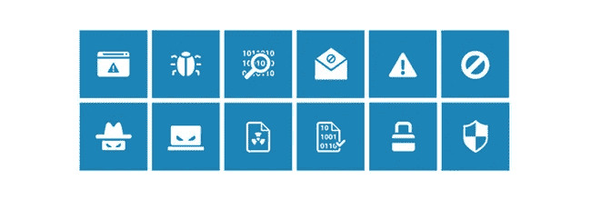

Image Source : Kaggle

如果你喜欢探索大型和具有挑战性的数据集，那么也许你应该试试微软的恶意软件分类。在深入探讨这个问题之前，让我们先来看看你能从中学到什么:

1.  ***如何处理大规模数据？*** 列车总数据集由 200 GB 数据组成，其中 50 GB 数据为。字节的文件和 150 GB 的数据。asm 文件。
2.  ***应该做什么特色工程？如果到目前为止你一直只处理文本和图像数据，这肯定会提高你对特征工程的直觉。***
3.  ***在没有领域知识的情况下，如何逼近一个机器学习问题？*** 用本次挑战赛第一名获奖者的话说:“交叉验证比领域知识更值得信任”。

**业务问题**

> 在过去几年中，恶意软件行业发展非常迅速，辛迪加在技术上投入大量资金来规避传统保护，迫使反恶意软件团体/社区构建更强大的软件来检测和终止这些攻击。保护计算机系统免受恶意软件攻击的主要部分是**识别给定的文件/软件是否是恶意软件。**

**机器学习问题、KPI 和约束**

我们可以将业务问题映射为多类分类问题，其中我们需要预测九个类别( **Ramnit、Lollipop、Kelihos_ver3、Vundo、Simda、Tracur、Kelihos_ver1、Obfuscator)中每个给定字节文件的类。ACY，加塔克**。

KPI:多类日志损失，混淆矩阵

约束:我们需要提供分类概率，错误分类的分类标签应该受到惩罚(这就是为什么 log loss 被选为 KPI)并且应该有一些延迟限制。

**处理大尺寸**

考虑到数据的规模，建议使用云平台，如 GCP、AWS 或 IBM Cloud。我们在 GCP 完成了这个案例研究，使用基于 Linux 的 1vCPU 机箱，配备 30 GB RAM 和 500 GB HDD。点击此[链接](https://www.youtube.com/watch?v=BPUfVq7RaY8&t=222s)了解如何借助 CurlWidget 在 GCP 直接从 jupyter 笔记本上下载数据。下载数据后，下一个挑战将是使用 python 提取这些文件，因为 python 对 7z 文件的支持是有限的。使用名为“p7zip”的软件包，它提供了一个 Linux 命令行工具来提取 7z 文件。

```
# command to install the package in Linux
sudo apt-get install p7zip-full
# Sample Command to extract the data from terminal
7za x yourfile.tar.7z
```

## 数据的关键点

1.  总数据集由 10，868 个组成。字节文件和 10，868 个 asm 文件总共有 21，736 个文件。字节文件由 256 个十六进制数字(十进制值范围为 0 到 255)和一个特殊字符(？？).Asm 文件是使用智能编译器获得的汇编文件。
2.  数据集不平衡。

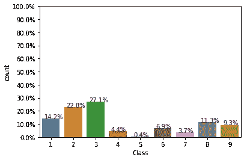

Distribution of malware classes

## **关键特性**

这个案例研究的好处是，它需要大量的耐心和实验来获得有用的特性。基于我们的直觉和之前在这个领域的工作，我们尝试了以下特性

1.  **字节文件的 n-gram 特性:**我们尝试了单字、双字和三字特性。虽然这些特性的性能很好，但是主要的挑战在于处理它们的大维数。一元语法的特征数是 256，二元语法的特征数是 65531，三元语法的特征数留给你的练习。即使有 30 GB 的 RAM，也不可能加载 65531 个特性的全部数据，所以我们选择了块中的 SVD。首先，我们使用随机样本和 3000 个特征尝试了 elbow 方法，以检查保持方差所需的组件数量，我们发现 1000 是一个好数字。

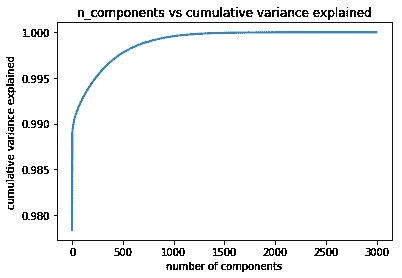

Elbow method to choose number of components

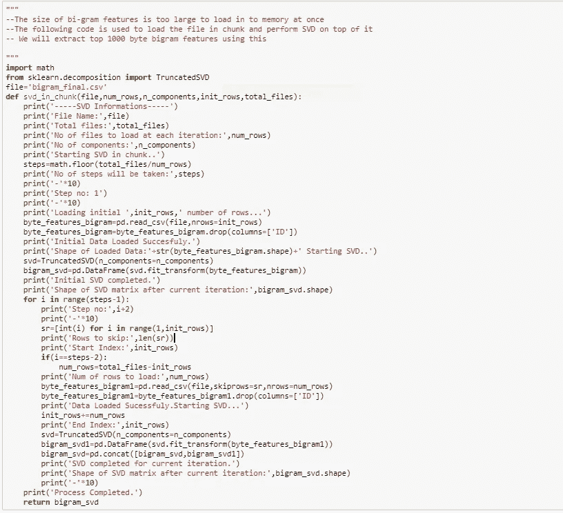

Code to extract bi-gram features using SVD in chunk

2.**字节和 asm 文件的大小:**字节和 asm 文件的大小被证明是很好的特性。让我们来看看文件大小的箱线图

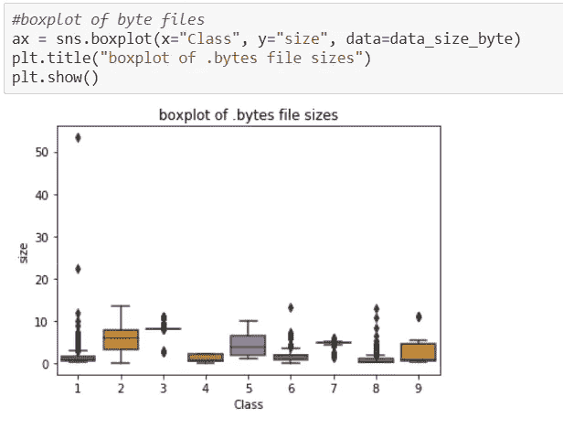

3.**字节数组的大小:**正如我们前面提到的，字节文件由十六进制数字组成。对于每个文件，我们都有一个数组，并将每个元素添加到数组中，并使用这些数组的长度作为一个特征。

4.**ASM 文件的段计数和 n-grams:**ASM 文件由不同的段组成，如前缀(例如。标题、文本)、操作码(例如 jmp，hlt)，关键词(例如。。dll，std::)，寄存器(例如。edx、epi)等。我们将片段的计数作为一个特征。我们还考虑了 asm 文件的一元、二元和三元模型作为特征。

5.**像素强度的字节和 asm 特征:**这可能是本案例研究中最具创新性的特征。我们借用了第一名获胜者解决方案的概念。正如我们前面提到的，字节文件中每个元素的值在 0 到 255 之间。我们可以很容易地将这些字节文件和 asm 文件一起转换成灰度图像。据观察，asm 文件的前 800 个像素密度对最终结果有显著影响。

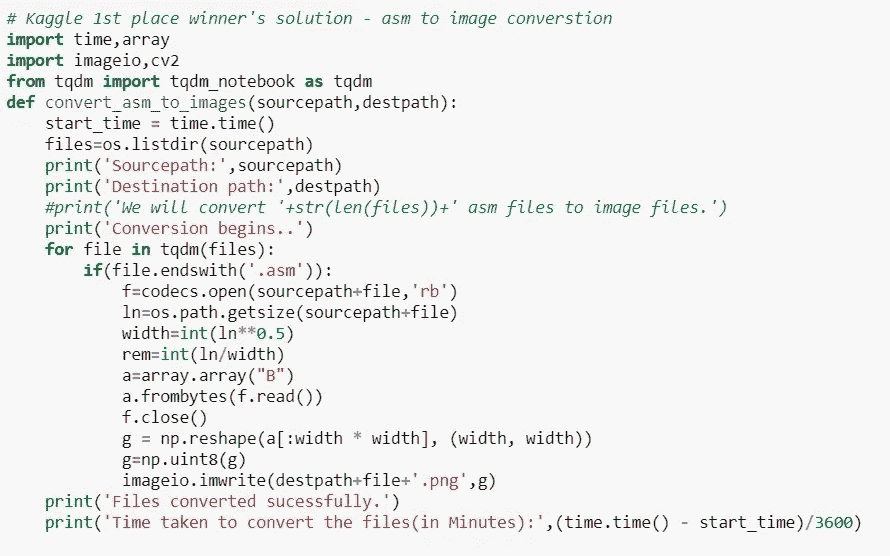

Code to convert asm files to image files

让我们看一下随机 asm 文件在转换后的样子

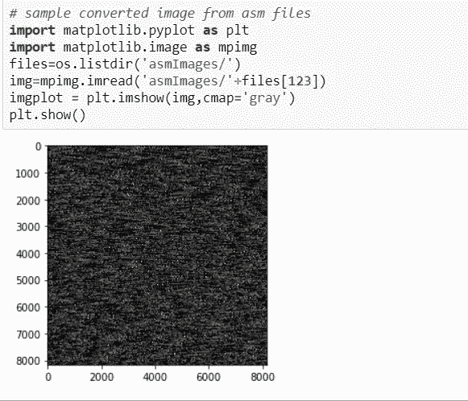

Random image from converted asm files

## 降维和特征选择

到目前为止，您一定已经观察到了特征的维度，并对用于训练的最终特征的维度有所了解。为了解决这个问题，我们使用随机森林来选择重要的特征。重要特性的数量是一个超参数。根据我们的经验，我们尝试了各种数字，显然还有改进的余地。让我们看一个样例代码，看看我们是如何选择最好的三元语法 asm 特性的。我们还尝试了 t-SNE 多变量分析。

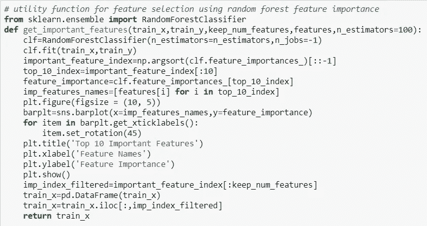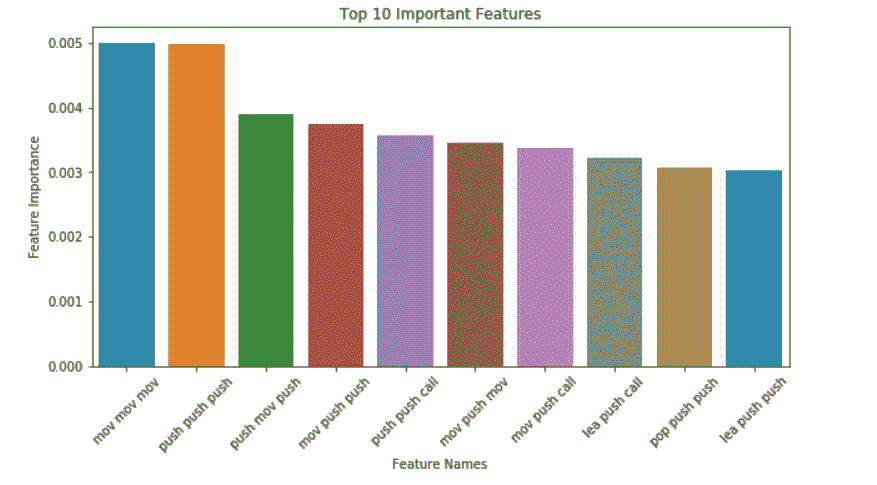

## 系统模型化

我们已经尝试了各种线性机器学习模型，如 KNN、多类逻辑回归和具有各种功能组合的集成，如随机森林、XGBoost 和 LightGBM。我们用单一特征以及字节特征和 asm 特征的组合来训练模型。我们还在从 byte 和 asm 文件获得的图像上尝试了各种 CNN 架构，但与微调的机器学习模型相比，获得的结果较差。由于我们没有恶意软件行业的任何领域知识，我们完全依赖交叉验证。由于特性和文件的数量很大，我们选择了 RandomizedCV 进行交叉验证，并且还有改进的余地。你可能会想到另一个问题，为什么我们同时使用 XGBoost 和 LightGBM？实际上，我们已经从 XGBoost 开始，但是发现 LightGBM 的训练延迟比 XGBoost 低得多，并且性能相似或更好。我们从一个随机模型开始，然后在关注性能后逐渐增加模型的复杂性。

## 结果

最后，如果一个用例不能提供令人满意的结果，它就没有任何价值。在这里，我们只列出校准最终 LightGBM 模型后得到的结果。

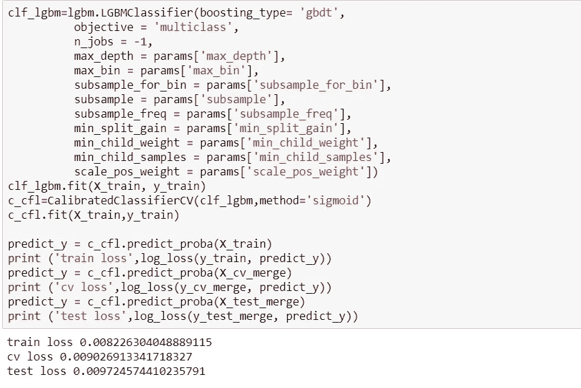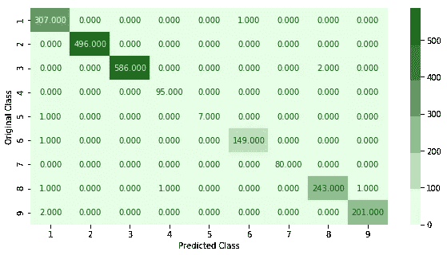

Confusion Matrix

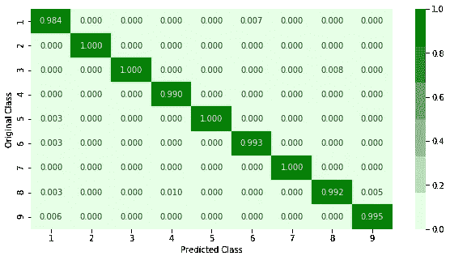

Precision Matrix


Recall Matrix

# 引文

1.  [http://arxiv.org/abs/1802.10135](http://arxiv.org/abs/1802.10135)
2.  https://www.kaggle.com/c/malware-classification/overview
3.  [https://www . Kaspersky . co . in/resource-center/threats/malware-classification](https://www.kaspersky.co.in/resource-center/threats/malware-classifications)
4.  [https://ieeexplore.ieee.org/document/8553780](https://ieeexplore.ieee.org/document/8553780)