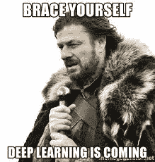
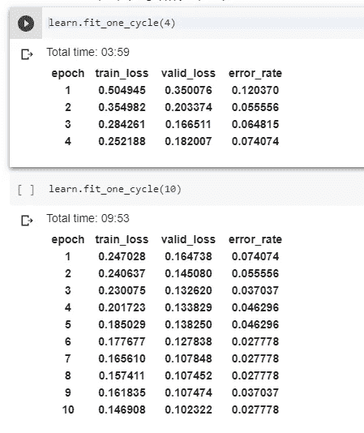
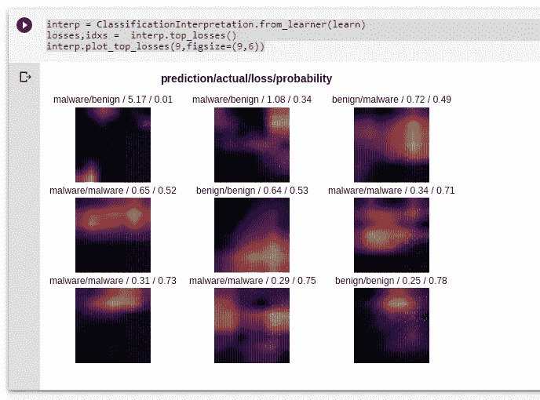
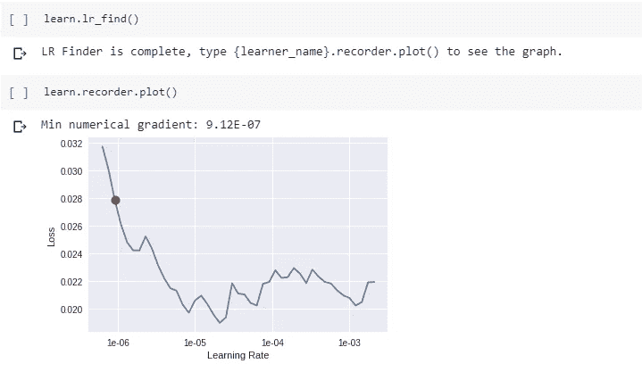
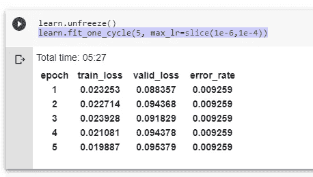

# 使用深度学习的恶意软件检测

> 原文：<https://towardsdatascience.com/malware-detection-using-deep-learning-6c95dd235432?source=collection_archive---------13----------------------->

## fast.ai 中使用卷积神经网络的恶意软件检测


Photo by [Markus Spiske](https://unsplash.com/@markusspiske?utm_source=medium&utm_medium=referral) on [Unsplash](https://unsplash.com?utm_source=medium&utm_medium=referral)

## 什么是恶意软件？

恶意软件是指恶意软件犯罪者派遣感染个人计算机或整个组织的网络。它利用目标系统的漏洞，如合法软件(如浏览器或 web 应用程序插件)中可能被劫持的漏洞。

恶意软件的渗透可能是灾难性的——后果包括数据盗窃、勒索或网络系统瘫痪。

## 为什么检测恶意软件很重要？

恶意软件是当今互联网上最严重的安全威胁之一。事实上，大多数互联网问题，如垃圾邮件和拒绝服务攻击，都有恶意软件作为其根本原因。也就是说，受到恶意软件危害的计算机通常联网在一起形成僵尸网络，许多攻击都是利用这些恶意的、攻击者控制的网络发起的。

为了应对新产生的恶意软件，需要新的技术来检测它们并防止它们造成的任何损害。



## 为什么要深度学习？

如今，深度学习已经主导了各种计算机视觉任务。这些深度学习技术不仅使这场比赛取得了快速进展，甚至在许多比赛中超过了人类的表现。这些任务之一是图像分类。

与更传统的机器学习技术方法不同，深度学习分类器是通过特征学习而不是特定于任务的算法来训练的。这意味着机器将学习呈现给它的图像中的模式，而不是要求人类操作员定义机器应该在图像中寻找的模式。简而言之，它可以自动提取特征，并将数据分类到各种类别中。

早期层学习如何检测边缘等低级特征，后续层将早期层的特征组合成更全面和完整的表示。

我们可以使用后面描述的方法将恶意/良性文件转换成灰度图像。然后我们可以对生成的图像应用这些深度学习技术，将它们分类为恶意软件或良性软件。

## 如何创建恶意软件映像？


为了使用深度学习模型对图像进行分类，我们需要来自良性和恶意文件的图像。我们只做二元分类(恶意类和良性类)。多类分类也可以使用这种技术来完成，其思想是恶意软件文件的变体将具有不同于其他的图像。

准备好数据集后，我们将通过对每个图像执行以下步骤，将每个文件转换为 256x256 灰度图像(每个像素的值在 0 到 255 之间):

```
**Step 1:** Read 8 bits at a time from the file.
**Step 2:** Treat the 8 bits as a binary number and convert it to its    corresponding integer.
**Step 3:** Enter the number as the pixel value.
```

最大 64 KB 的文件可以容纳 256 x 256 的图像。任何大于 64 KB 的文件，其剩余内容都将被删除。
另一方面，如果文件的大小小于 64 KB，剩余的图像将用 0 填充。

由于恶意软件检测是实时进行的，我们需要在几秒钟内将图像分类为良性或恶意软件。因此，保持图像生成过程简单而简短将有助于我们节省宝贵的时间。

# **数据集的准备**

这一步极其简单。所有图像生成后，将它们分成两个文件夹——训练和验证。这些文件夹中的每一个都包含两个文件夹，即恶意软件文件夹和良性文件夹。
将这两个文件夹存储在另一个名为“dataset.tar”的文件夹中，压缩生成一个. tar 文件。

所以最终的目录结构将是→
dataset.tar 包含验证和训练。验证将有恶意文件夹和良性文件夹。火车将有恶意和良性的文件夹。

将压缩文件夹移动到包含代码的 Jupyter 笔记本所在的目录中。

# 实施模型

** *这个问题使用的模型是按照 fast.ai 课程的第 1 课(宠物分类)创建的。* **

要从 Google Drive 中读取数据集，请添加以下代码行

```
!pip install PyDrive #import os
from pydrive.auth import GoogleAuth
from pydrive.drive import GoogleDrive
from google.colab import auth
from oauth2client.client import GoogleCredentialsauth.authenticate_user()
gauth=GoogleAuth()
gauth.credentials = GoogleCredentials.get_application_default()
drive = GoogleDrive(gauth)
```

一旦你运行了上述代码的最后 4 行，Google SDK 会要求你输入一个验证码。它会提到一个链接，一旦你点击它，你会得到你的安全代码。

```
link = '1sL4I4xNh657AhrIOOwbr6TX58ahyC'(add the link here )
```

创建一个变量，该变量包含到。tar 文件包含的数据存储在您的谷歌驱动器。要获取网址，请打开。tar 文件并获取该文件的可共享链接。你不需要整个 URL，只需要它的一部分。所以比如你的可分享链接是“https://drive . Google . com/File/d/**1 sl 4 i4 xnh 657 ahrioowbr 6 tx 58 ahyc**/view？你只需要粗体部分。

## 获取数据路径

```
downloaded = drive.CreateFile({'id':link}) 
downloaded.GetContentFile('dataset.tar')
import tarfile
tar = tarfile.open("dataset.tar")
path = tar.extractall('DS/')
tar.close()
path = Path.cwd().joinpath("DS/dataset/")
path.ls()data = ImageDataBunch.from_folder(path, ds_tfms=get_transforms(), size=224)## To view data in a batch
data.show_batch(rows=3, figsize=(7,6))
## To know the number of classes in a dataset
print(data.c)
## To know the names of the classes in a dataset
print( data.classes)
```

## 创建模型

```
learn = create_cnn(data, model.resnet34, metrics = error_rate)## To know the model architecture
learn.model## Training the model
learn.fit_one_cycle(4)
learn.fit_one_cycle(10)
```

下面是我运行上述代码后得到的输出截图:



Output for 4 and 10 epochs.

```
interp = ClassificationInterpretation.from_learner(learn)
losses,idxs =  interp.top_losses()
interp.plot_top_losses(9,figsize=(9,6))
```



The images with maximum losses.

## 如何找到并设定一个好的学习率？

到目前为止，我们还没有告诉我们的模型在训练模型时使用什么学习率，我们都知道这是训练时最重要的超参数之一。
为了找到一个好的学习率，请执行以下操作:

```
learn.lr_find()
learn.recorder.plot()
```



Finding an optimal learning rate.

```
learn.fit_one_cycle(5, max_lr=slice(1e-6,1e-4))## Saving the weights of the model
learn.save('stage-1-malware-detection')
```



Losses are much less compared to before.

注意:每次调用 fit_one_cycle()函数时，权重都不会重新初始化。因此，如果您一个接一个地调用该函数，则历元会累加，这意味着如果您调用 fit_one_cycle(5)然后调用 fit_one_cycle(10 ),则该模型已经被训练了大约 15 个历元。

完整的代码可以在我的 GitHub 账户上找到，链接[这里](https://github.com/riak16/Malware-Detection-using-Deep-Learning)。这些只是代码的一小部分，仅仅遵循它们不会给出可行的代码。

如有任何建议/改进/讨论，请随时联系我们。:D

## 未来的工作

*   我们可以尝试将数据分为不同类型的恶意软件或良性类别，而不是执行二元分类。
*   我们可以尝试不同的技术来创建一个验证集。在这个阶段，不同类别中的图像以及验证集和训练集中的图像数量是随机选择的。
*   在我们的训练数据集中，尝试恶意软件文件数量与良性文件数量的不同比率。(几乎 1:1 使用)
*   尝试不同的维度来生成恶意软件图像。(使用 256x256)

# 我认为你会喜欢:D 的其他文章

*   [是的，你应该听安德烈·卡帕西的，并了解反向传播](/back-propagation-721bfcc94e34)
*   [NLP 模型评估—最新基准](/evaluation-of-an-nlp-model-latest-benchmarks-90fd8ce6fae5)
*   [计算流体力学中的机器学习](/machine-learning-in-computational-fluid-dynamics-7018941414b9)

> 我很高兴你坚持到了这篇文章的结尾。*🎉我希望你的阅读体验和我写这篇文章时一样丰富。*💖**
> 
> 请在这里查看我的其他文章。
> 
> 如果你想联系我，我会选择推特。