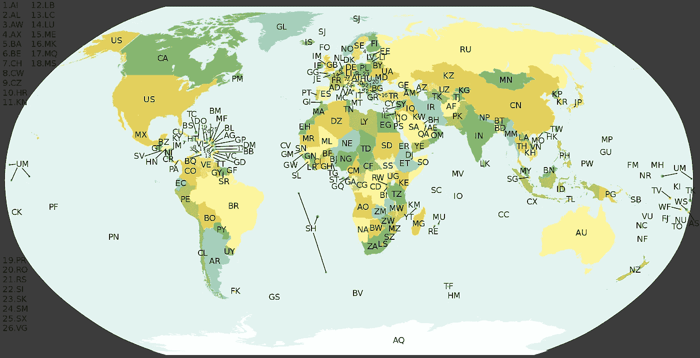
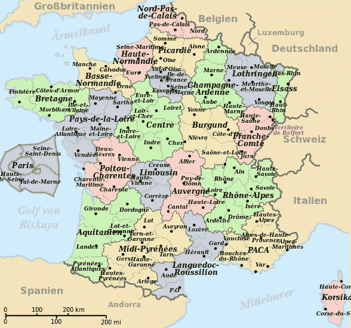

# 管理地理数据:ISO3166、联合国/地方编码和地名

> 原文：<https://towardsdatascience.com/managing-geographical-data-iso3166-un-locode-and-geonames-8306ce4aa474?source=collection_archive---------16----------------------->

最近，我需要定义一个数据模型来处理国际级别的地理数据，即，当您的潜在地址在全球任何一个地方时，如何正确管理有关邮政地址的数据。下面是我在处理将地理数据整合到应用程序和数据库时发现的挑战和备选方案的结果。

# 地区混乱的挑战

当你研究国家是如何组织起来的，你会发现不同的标准，有时地区是相当无形的，很难证明，尤其是在欧洲国家。

仅举一个例子来说明两个国家之间的方法有多么不同:

让我们先来关注一下美利坚合众国，人口 3.25 亿，面积 9525067 平方公里，GDP 20.513 万亿美元。用户使用简单有效模式:

一个国家，27 个州。

第一个和第二个行政命令之间有明确的划分。

现在我们来看看欧元区第四大经济体西班牙，既不是主要国家之一，也不是小国家。人口 4600 万，面积 505990 平方公里，GDP 1.864 万亿美元。这是一个过度复杂的组织的例子:

*一个国家，17 个自治区，2 个自治市，50 个省，8124 个直辖市。*

由于一些人可能会立即指出，这两个国家决不是可比的(尽管它们是国家，所以它们应该是可比的)，我们将只分析美国的一个州。

我们会选择德克萨斯州:它在外延上略大于西班牙，拥有 2600 万人口，GDP 与西班牙相似(1.639 万亿美元)。

*得克萨斯州在行政上划分为 254 个县。*

同样，这并不复杂，这是一个基本而简单的管理。

美国的邮政地址不需要二级行政级别。他们只是使用国家，因为国家被认为是基本的主要行政单位，这就相当于在西班牙不使用自治区(更不用说省了)。

在某些欧洲国家，这种过于复杂且昂贵的地区行政管理模式很常见。分析的例子并不是唯一的，你可以找到其他国家，如法国有类似的情况。

# 协调邮政数据

如果您需要处理国际数据，了解一些有用的国际标准可能会有所帮助。

一般来说，每当你必须处理大量参考数据时，最好先检查是否有国家或国际标准。您不仅会找到协调数据的最佳方式(我说的是最佳，而不是完美)，而且还会更容易找到主数据来填充和更新信息。

如果有人抱怨数据，你还可以争辩说使用了国际标准。通过这种方式，你只需要为用户提供一种方法，让他们可以将自定义数据与自己的想法混淆起来，即如何在地图上放置或命名重要的本地区域。

这里的要点是，处理邮政数据是一个永远不会让所有人都满意的场景。考虑到这一点，遵循国际公认的标准并实现一个允许用户进行更改的接口，就大功告成了。用户现在是数据的所有者(理应如此)。

在这个前提下，我们将研究您可以使用的标准，并回顾每种标准的优缺点。

# ISO 3166–1 国家

如果你需要一个编码系统和一个国家列表，不用再找了:*ISO 3166–1*是你的朋友。

Alpha-2 Codes ISO3166–1

由于世界上没有那么多国家，除了少数有争议的名字，这是一个独特的、确定的名单。

我喜欢使用 Alpha-2 代码来查找和填充列表。请记住，一旦您在合并记录中使用国家(如已开具的发票)，您应包括代码和名称，因为将来可能会有变化。

> 提示:在用户界面中总是使用表格查找的代码，而不是存储代码本身。在最终文档中存储永久值将反映文档或注册发布时的当前名称；这将使您的数据库对未来的变化具有鲁棒性，并将您从处理历史数据中解放出来。

另一种选择是为条目使用 GUIDs/uuid/IDs，并让一个*活动的*列反映该特定记录是否停止。在这个列表上维护潜在的更新和保持对过去变化的准确跟踪是相对容易的。但是，我不喜欢这种方法，因为最终您会保留旧信息，并使主数据维护和迁移变得更加困难。

对于信息本身，实际的标准可以在[这里](https://www.iso.org/obp/ui/#iso:std:iso:3166:-1:ed-3:v1:en,fr)买到，虽然信息可以从不同的来源免费获得，比如[维基百科](https://en.wikipedia.org/wiki/ISO_3166-1)。

> 提示:如果您正在处理一个涉及历史数据集(如宏观经济学)的数据分析项目，并且由于某种原因，您必须包括关于已灭绝国家的信息，请记住，ISO3166–3 为您提供了一个现已灭绝国家的列表，如苏联或南斯拉夫。

# ISO 3166–2 个州/省

如导言中所述，对于第二级行政机构来说，情况并不那么容易(有些国家确实有第三级行政机构，即使没有实体或扩展机构要求这样做)。

这里的最佳选择还是 ISO3166-2。您将在这里找到第二和第三个管理级别。

ISO3166–2:FR

同样，你可以购买官方标准，也可以免费使用维基百科中的信息。

为了正确地处理信息，您可以使用[这个 PHP 解析器](https://github.com/Tigrov/wikipedia-divisions)轻松地删除信息。

# Python 和 Java 对 ISO-3166 的支持

如果你使用 Python，有一个名为 [PyCountry](https://upload.wikimedia.org/wikipedia/commons/a/ac/D%C3%A9partements_r%C3%A9gions_%28France%29_de.svg) 的非常好的包，它已经包含了为你解析的信息。

在 Java 中，我没有发现任何类似的东西，尽管我个人认为这种信息应该在数据库级别进行管理，所以您可以使用上面的 Python 包创建相关的 CSV，并将它们导入到您的 Java 应用程序中。

# UN/LOCODE

一种替代方法是处理来自欧洲经委会的信息。这不仅包括 ISO3166 的分支机构和国家，还包括世界上许多城市的地理位置(包括坐标)。虽然它并不完整(你不会发现每个城市都有一对一的任务)，但它提供了额外的信息。它侧重于运输，因为它包括码头、火车站和国际航空运输协会代码等运输设施的可用性信息。

UN/LOCODE Provides information about trading/transportation locations

 [## ISO 3166-2 -贸易-欧洲经委会

### 该表按字母顺序列出了…的国家名称(英语中的官方简称，如 ISO 3166)

www.unece.org](http://www.unece.org/cefact/locode/subdivisions.html) 

# 城市和邮政编码

州和省有点困难(试着弄清楚在法国用什么)，所以屏住呼吸，现在考虑如何处理城市和邮政编码。可用城市的数量激增，但在您开始恐慌或考虑使用城市和邮政编码的空文本字段之前，请注意有一个非常体面和简单的解决方案:GeoNames 项目。

 [## 地名

### GeoNames 地理数据库涵盖所有国家，包含超过 1100 万个可用的地名…

www.geonames.org](https://www.geonames.org/) 

GeoNames 是一个广泛使用的、完全免费的全球位置数据库，包括它们与 ISO3166-2 的第二/第三行政级别和邮政编码的关系。

在不集成其他外部服务的情况下，这是您所能做到的最大限度。

# 要探索的其他选项

经过我的研究，我想知道谷歌地图 API 是否可以成为集成地址搜索功能的一个选项。如果你不得不在街上交易，这可能是一个好的选择。在我的特定场景中，这不是一个需求，所以我决定继续使用 GeoNames(它可以提供不需要与外部系统在线集成的功能)。

在这种情况下，一个好的选择可能是查询国家数据库。大多数发达国家和半发达国家将依靠免费信息，无论是在线服务还是可下载的数据库。