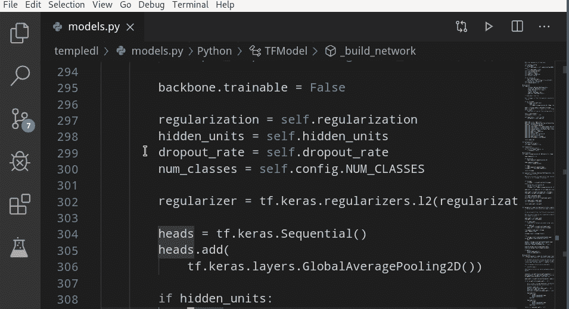

# 使用 pyenv 管理虚拟环境

> 原文：<https://towardsdatascience.com/managing-virtual-environment-with-pyenv-ae6f3fb835f8?source=collection_archive---------0----------------------->

大多数 Python 开发人员和数据科学家都已经听说过虚拟环境。然而，管理为不同项目创建的数十个环境可能会令人望而生畏。pyenv 将帮助您简化虚拟环境的创建、管理和激活。

过去，在 virtualenv 流行之前，我会为所有 Python 项目保留一个全局工作空间。每当我安装或升级其中一个库时，它就可以立即用于所有的项目。通常情况下，它会破坏其中的一些项目…

虚拟环境的主要优点是它们为您的每个项目构成了一个单独的工作空间(virtualenv)。安装在这些工作区中的包不会互相干扰，因此您可以安全地安装、升级或删除库，而不会影响其他项目。

pyenv 是 virtualenv 的扩展，增加了一些好处:

*   有可能相邻安装几个 Python 解释器版本(例如 2.7 和 3.8 甚至 PyPy)，
*   用户安装的解释器和系统 Python 的和平共存，
*   用于管理虚拟环境的集中式系统，
*   切换到项目文件夹时自动激活虚拟环境。

## 安装 Python 解释器📜

让我们先来看看主要特性。如果你想亲自尝试一下，请阅读博文末尾的安装指南。

要创建一个虚拟环境，首先需要确保安装了合适的解释器。您可以从列出的可用解释器中进行选择:

`pyenv install --list`

(你可以用`cd $(pyenv root) && git pull`更新这个列表)然后安装其中一个:

`pyenv install 3.8.0`

要激活新环境并开始使用 Python 3.8.0:

```
pyenv shell 3.8.0
python
```

这将打开 Python 提示符，并显示熟悉的欢迎屏幕:

```
Python 3.8.0 (default, Oct 20 2019, 18:15:07) 
[GCC 9.1.0] on linux
Type “help”, “copyright”, “credits” or “license” for more information.
>>>
```

这些都很好，但是除非你还停留在 90 年代，否则你会更喜欢像 notebook 或 IPython 这样的现代 Python 接口。如果有，请继续读下去！

## 创建虚拟环境💻

到目前为止，我们已经安装了基本的 Python 解释器和标准库。然而，为了让我们的数据科学环境完全发挥作用，我们需要安装数据科学堆栈中的基本包，如 Jupyter、matplotlib 或 pandas。

通常情况下，您的项目将依赖于特定版本的包(这不是最佳实践，但是一些 Python 库比我们的项目运行得更快)。为了隔离一个项目所使用的包，我们可以使用虚拟环境。您可以使用`pyenv-virtualenv`扩展创建一个(参见下面的安装说明):

`pyenv virtualenv 3.8.0 my-data-project`

你可以给环境命名(这里，`my-data-project`)，因为它适合你。要激活环境类型:

`pyenv shell my-data-project`

现在您已经准备好安装您想要使用的库了。您可以从标准 Python 包存储库(PyPi 也称为 cheese shop)中提取它们，并使用`pip`命令安装在当前环境中:

`pip install jupyter notebook matplotlib pandas`

最好只安装您将在项目中使用的库。如果以后你意识到少了什么，你仍然可以用`pip install`添加包。现在，让我们启动笔记本服务器:

`jupyter notebook`

这应该会在浏览器中打开 Jupyter 笔记本界面。干得好！您刚刚安装了运行在最新最棒的 Python 版本中的 Jupyter🎉！一定要尝试它的一些新特性，比如 [Walrus 运算符](https://docs.python.org/3.8/whatsnew/3.8.html#assignment-expressions)或 [f 字符串表达式](https://docs.python.org/3.8/whatsnew/3.8.html#f-strings-support-for-self-documenting-expressions-and-debugging)。

您还可以使用`pyenv versions`列出您的系统上安装的所有 Python 版本和环境，它应该会打印出如下列表:

```
system
3.8.0
3.8.0/envs/my-data-project
```

`system`环境是您的默认系统 Python(随您的操作系统一起安装)。另外两个是用 pyenv 创建的。

## 自动激活环境🚀

没有什么比在安装了额外的库之后才意识到没有激活正确的虚拟环境更令人沮丧的了。这肯定会覆盖当前激活的环境中安装的旧版本的包，并可能破坏您的项目代码。pyenv 的独特优势在于它可以为每个项目自动激活正确的环境。假设您的主目录中有一个名为`predict-prices`的项目目录。要为项目类型选择虚拟环境:

`cd ~/predict-prices
pyenv local my-data-project`

(以项目命名环境是很常见的，为了避免混淆，我在这里对项目目录和环境使用了两个不同的名称)。

下一次，当您在 shell 中切换到包含项目文件的目录(或其中一个子目录)时，pyenv 将为您激活正确的环境！

请注意，如果您之前使用`pyenv shell.`激活了环境，自动激活将不起作用

## 在 IDEs 中使用您的环境

如果你不喜欢，你也可以在你喜欢的 IDE 中使用 pyenv。许多编辑器和 ide 都知道 pyenv 环境，并将为您检测它们。然后，您将能够从下拉菜单中选择当前工作区的环境。



Selecting virtual environment in VS code

## 但是 pip 只针对 Python 包…

虽然`pip`主要针对安装 Python 包，但也可以安装其他语言的软件。许多 Python 库包含一些用 C 或类似语言编写的代码。例如，`numpy` 中的数组在 c 中实现了性能关键的操作。在你的机器上安装这些包时，`pip`可以编译这样的扩展，但是它需要开发者工具(编译器、连接器、构建工具、头文件)的可用性。然而，现在大多数库也为您的平台(Linux、OSX、Windows)提供二进制文件(编译的代码)，打包成一种叫做`wheel`的格式，可以直接从包库中取出，不需要任何编译。

## 为什么不是康达？🐍

conda 是数据科学家喜欢的另一个伟大的 Python 包管理器。在很多方面类似于 pyenv + virtualenv + pip combo。它提供了一个丰富的官方软件包库和一个名为`conda-forge`的用户贡献软件包库。如果这些存储库中没有某些包，您仍然可以使用`pip`来安装它们。conda 的优势在于它是多平台、语言无关的，并且提供所有必要的构建工具和共享库。缺点是它需要安装一个名为`miniconda`的独立库。好消息是，在 pyenv 中安装 miniconda 就像在基于 pip 的环境中一样容易:

`pyenv install miniconda3-latest`

## 装置

要安装 pyenv，只需遵循几个简单的步骤。首先，将 pyenv git 存储库克隆到您的主目录(pyenv 仅支持 OSX 和 Linux，在 Windows 上您需要使用 [Windows 子系统 for Linux](https://docs.microsoft.com/en-us/windows/wsl/install-win10) ):

`git clone https://github.com/pyenv/pyenv.git ~/.pyenv`

然后将 pyenv 添加到您的系统路径中:

```
echo 'export PYENV_ROOT="$HOME/.pyenv"' >> ~/.bash_profile
echo 'export PATH="$PYENV_ROOT/bin:$PATH"' >> ~/.bash_profile
echo -e 'if command -v pyenv 1>/dev/null 2>&1; then\n  eval "$(pyenv init -)"\nfi' >> ~/.bash_profile
```

复制粘贴以上几行应该就可以了，但是如果你需要更详细的解释，请查阅官方指南。

我还使用 pyenv 的扩展来管理虚拟环境，称为 pyenv-virtualenv。要安装它，只需克隆 git 存储库:

```
git clone [https://github.com/pyenv/pyenv-virtualenv.git](https://github.com/pyenv/pyenv-virtualenv.git) $(pyenv root)/plugins/pyenv-virtualenv
```

要启用自动激活，请将此命令复制到您的终端:

```
echo 'eval "$(pyenv virtualenv-init -)"' >> ~/.bash_profile
```

现在，您可以从您的会话中注销，然后再次登录，以便将所有内容设置到位。