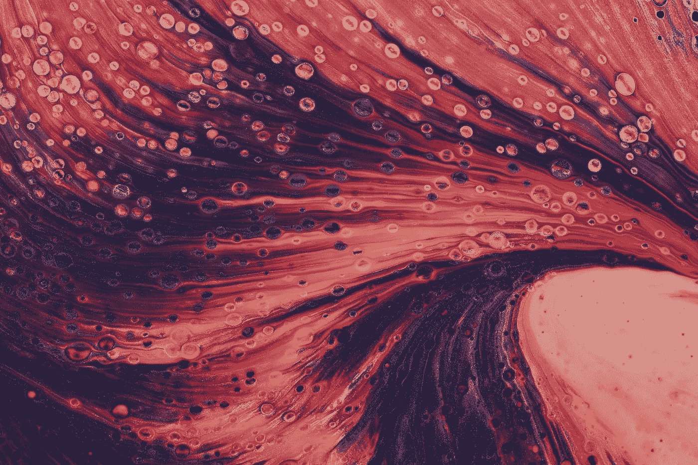

# 流形和神经活动:导论

> 原文：<https://towardsdatascience.com/manifolds-and-neural-activity-an-introduction-fd7db814d14a?source=collection_archive---------13----------------------->

*流形是数学和物理中的重要对象***，因为它们允许用更简单的空间来表达和理解更复杂的结构。这是将该理论与神经科学联系起来以理解和解释复杂的神经活动的关键动机。**

*T he [流形假设](https://www.quora.com/What-is-the-Manifold-Hypothesis-in-Deep-Learning)陈述了真实世界的数据(图像、神经活动)位于被称为*流形的低维空间中，这些流形嵌入在高维空间中。松散流形是局部看起来像欧几里得空间的拓扑空间。为了给流形一个简单的例子，并理解前两个句子，考虑一个球。球体不是欧几里得空间，因为我们不能用直线连接两点，而是需要测地线的概念，但是局部欧几里得几何定律是很好的近似。例如，地球可以近似为一个球体。你不是生活在一个球体上，而是生活在一个平面上。所以我们可以说我们“生活”在一个流形上。我希望这能给术语流形的含义一点直觉。**

*流形本身属于拓扑学和微分几何的数学分支。它们存在于任何维度的空间中，但是为了简单起见，为了更直观，我们在这里只考虑三维空间。*

*在这篇文章中，我不想深入探究它背后的数学，而是探索它在神经科学中的相关性，以及如何利用它从神经活动数据中获得更多见解。如果你对流形的更深入的数学解释感兴趣，你可能会觉得这篇[文章](http://bjlkeng.github.io/posts/manifolds/)很有趣。*

# *为什么我们对神经活动中的流形感兴趣？*

*最近，神经系统的许多研究正在经历从单个神经元到群体水平的假设和分析的范式转变。大脑中的网络由成千上万的神经元组成。我们可以预期，一个网络的自由度的数量和它的神经元的数量一样大。然而，研究[【1】](https://journals.plos.org/ploscompbiol/article/file?id=10.1371/journal.pcbi.1007074&type=printable)显示了实验证据，表明局部大脑活动被限制在由几个变量跨越的子空间(低维流形)中。*

*出现的一个关键问题是，除了单独研究每个神经元之外，通过研究这些被记录的神经元群体还能获得什么科学见解。事实上，当它们的活性被平均化时，单个单元通常不显示任何刺激特异性。这就是多重假说的由来。我们希望找到在单个神经元水平上不明显的结构(或特征)。此外，简单地平均许多神经元的响应可能会掩盖重要的信号，因为神经群体在其细胞类型、投射目标等方面通常具有巨大的多样性。[【第二】](https://www.nature.com/articles/nn.4255)。*

*在计算神经科学中，流形假设认为，潜在的网络连通性限制了神经群体活动的可能模式，并且这些模式被限制在一个低维流形中，该流形由几个独立变量跨越，我们可以称之为“神经模式”[【3】](https://www.sciencedirect.com/science/article/pii/S0896627317304634)。 [*盖莱戈等人。艾尔。*](https://www.sciencedirect.com/science/article/pii/S0896627317304634) 进一步说明*

> *“这些神经模式捕获了人口协方差的重要部分。正是这些神经模式的激活，而不是单个神经元的活动，提供了神经动力学和功能的基本构建模块。”*

*为了识别这些神经模式，我们需要应用一些降维方法来计算高维神经活动的低维表示。*

# *降维背后的直觉*

*在这里，我不会深入探讨像主成分分析(PCA)这样的特定类型的降维方法，而是会提供一个基于[【4】](https://www.nature.com/articles/nn.3776)的一般直觉。如果你对 PCA 更深刻的解释感兴趣，请看这篇写得很好的[博文](http://alexhwilliams.info/itsneuronalblog/2016/03/27/pca/#some-things-you-maybe-didnt-know-about-pca)。*

*通常，我们对有 *D* 个测量变量的数据进行降维，并且我们怀疑这些变量可以通过更少数量的“解释性”变量 *K* 来更好地表示(或理解)。我们如何提取这些解释变量取决于选择的方法。由于人们不能直接观察到这些变量，它们被称为潜在变量。我们试图以描述我们数据的统计特征来结束，并把我们数据的某些方面作为噪声排除。*

*在神经科学中，变量 *D* 通常对应于观察到的神经元数量。由于这些神经元跨越了一个基础网络，因此很可能不是相互独立的，可以假设我们只需要一小部分的潜在变量来解释它们的网络活动。下面是一个思考这些潜在变量的好方法:*

> *“潜在变量可以被认为是共同的输入，或者更一般地说，可以被认为是未被观察到的神经元在与被记录的神经元相同的网络中的集体作用。”*

*我们通常测量的是一个神经元发出的动作电位的时间序列。在神经科学中，这通常被建模为泊松过程。降维的目的是描述不同神经元的放电频率是如何协变的(并排除作为噪声的尖峰变化)。每一个神经元都提供了由潜在变量捕获的同一潜在过程的不同视图。潜在变量定义了一个 K 维空间，表示在群体反应中突出的共享活动模式。*

*下一部分将提供一个这样的例子，以及我们如何使用这些潜在的属性来建立一个基于神经模式激活的单个神经元活动的生成模型。*

# *神经流形*

**

*Figure 1: (A) Activity of each recorded neuron is a weighted combination of the time varying activation of the neural modes. (B) Trajectory of time-dependent population activity in the neural space spanned by three recorded neurons (red). This trajectory is mostly confined to the neural manifold which is a plane shown in gray and spanned by the neural modes (green and blue vector). (This Figure is adapted from [3])*

*如上所述，最近的实验工作表明，神经功能可能建立在我们称为神经模式的特定群体活动模式的激活上，而不是建立在单个神经元的独立调节上。为了估计这些神经模式的数量，我们对记录的群体活动应用了类似 PCA 的降维方法。获得的一组神经模式现在定义了一个*神经流形*。这个流形可以被认为是一个表面，它捕获了记录的活动数据中的大部分差异，参见图 1(B)中的灰色[超平面](https://www.google.com/search?q=hyperplane&oq=hyperplane&aqs=chrome..69i57j0l5.1428j0j7&sourceid=chrome&ie=UTF-8)。神经模式的时间相关激活被称为它们的*潜在动力学*。每个神经元的活动被表示为来自所有模式的潜在动力学的加权组合，见图 1 (A)。*

*为了让我们刚才说的更清楚一点，把每个神经元想象成一个 N 维状态空间中的一个轴，每个轴对应一个神经元的放电频率。某个时间点的活动对应于该空间中的一个点，神经元活动的时间演化构成了一个轨迹[1]。现在，轨迹(图 1 (B)红线)倾向于被约束到这个状态空间的一个线性子空间(神经流形)而不是在所有方向上自由移动(图 1 (B)灰线)。*

*每个神经元可以参与一个或多个神经模式，并且神经模式包括群体活动中的大部分神经元。在图 1(B)中，描绘了三个神经元的神经空间(或状态空间)。同样，每个轴代表一个神经元的活动。我们之前提到过，网络连通性限制了群体活动的可能模式，这意味着群体动力学不会探索完整的高维神经空间，而是会保留在低维表面“神经流形”中。在我们的(简单)例子中，这个流形是由两个神经模式 *u1* 和 *u2* 跨越的平坦超平面。*

*神经模式可用于建立实际神经活动的生成模型[3]。我们可以将每个神经模式与一个潜在变量相关联，这样任何时间点的神经活动都是由相应潜在变量加权的神经模式的总和，图 1 (A) [1]。*

*这些神经模式现在可以用来描述特定任务的神经流形，例如运动皮层[5]。*

# *结论*

*科学的主要追求是用简单的术语解释复杂的现象。降维使我们能够在群体水平上研究神经元，而不是平均群体反应或单独研究每个神经元。神经模式跨越一个低维流形，其中神经活动受到限制，允许检测网络中的模式。*

*此外，神经模式及其潜在的动力学提供了对整个大脑许多区域功能的更多了解，这些了解在单个神经元水平上并不明显[【5】](http://A stable, long-term cortical signature underlying consistent behavior)。*

*尽管如此，在这个研究领域仍有一些悬而未决的问题。例如，神经流形的概念不限于平面。神经流形可能是神经空间内的非线性表面。对于动力学探索神经空间的更大区域的复杂行为，线性方法可能是糟糕的估计，我们需要非线性方法，例如 [IsoMap](https://en.wikipedia.org/wiki/Isomap) 。*

*请注意，本文中讨论的研究集中在与某些特定任务相关的神经流形上。另一个问题是不同的流形如何在神经空间内相互组织。*

*我希望这篇文章让你对什么是神经流形假说有了第一印象。为了进一步阅读，我推荐我在本文中引用的论文。*

## *参考*

*[1]“扰乱脉冲神经元网络中的低维活动流形”，e . rnberg，A. Kumar*

*[2]“概念和技术进步为理论神经科学定义了一个关键时刻”，A. K. Churchland，L. F. Abbott*

*[3]“运动控制的神经流形”，J. A. Gallego，M. G. Perich，L. E. Miller，S. A.Solla*

*[4]“大规模神经记录的维数约减”，J. P. Cunningham，B. M. Yu*

*[5]“一致行为背后的稳定、长期的皮层信号”，J. A. Gallego，M. G. Perich，R. H. Chowdhury，S. A. Solla，L. E. Miller*