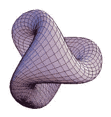
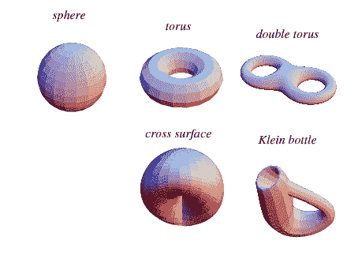
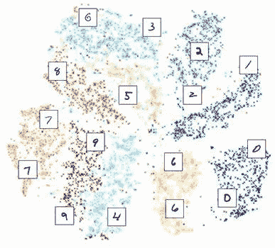
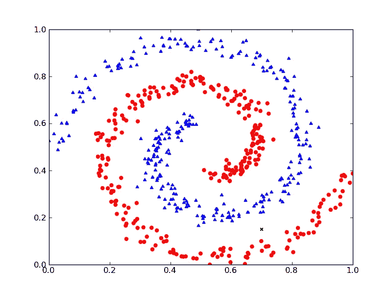
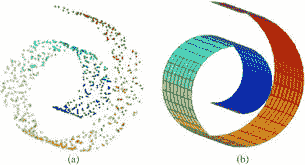

# 数据科学中的流形——概述

> 原文：<https://towardsdatascience.com/manifolds-in-data-science-a-brief-overview-2e9dde9437e5?source=collection_archive---------8----------------------->

What is this thing?

数据科学需要对数据有深刻的理解。随着越来越多的数据积累，回答以下问题变得更加困难:

> 我如何以准确且有意义的方式在空间上表示我的数据？

我声称回答这个问题的一个超级有用的步骤是理解什么是**流形**。*这里有一个好消息:*很可能你已经理解了什么是流形。流形本质上是可视化的，所以日常例子是丰富的。

在本文中，我将:

1.  解释什么是流形，给出一个概念性的定义。
2.  在不同的上下文中可视化流形的例子。
3.  展示流形在数据科学中的应用。

# 什么是流形？

流形描述了大量的几何曲面。要成为一个流形，有一个重要的规则需要满足。理解这一属性的最好方法是通过例子。流形存在于任何一个维度，但为了简单起见，让我们考虑一个三维空间。

假设有一只小蚂蚁在三维流形上行走。这个流形可以是弯曲的，扭曲的，甚至有洞。**规则如下:** *从蚂蚁的角度来看，它走到哪里都应该看起来像一个平面*。

这个规则听起来耳熟吗？如果你正在寻找一个应用程序，我想这是一个我们所有人都可以涉及的；我们生活在一个流形上！球面是三维流形中最简单的例子之一。

# 流形的例子

下面是一些常见的流形例子。请注意，流形只是这些对象的表面，而不是内部。

Basic surfaces that are manifolds.

你能想到是**不是**流形的曲面吗？这些表面在一些“尖”点会有问题。以下是我首先想到的几个:

1.  一个立方体。如果你沿着一边走，到了边上，东西就会太尖，看起来就不再像平面了。
2.  一座山的风景。假设峰顶非常尖，在这一点上，物体看起来不会像平面。
3.  一个沙漏。假设两半的交点是一个单点，那么这个规则在这里就被打破了。

## 思考流形的直觉

这些例子的共同主题是它们有些光滑——这意味着没有尖锐的尖峰或边缘。对象的整体形状可以是无定形的，这在描述没有严格边界的数据集时很好。

# 数据科学中的流形

数据可以来自各种空间。它可以是所有图像的空间，或者来自一个价格和数值范围。这些[高维空间](/understanding-high-dimensional-spaces-in-machine-learning-4c5c38930b6a)具有复杂的表示，并不总是可视化的。然而，数据可能来自由流形表示的特殊子集。

因此，流形可以充当从复杂空间到更简单、更平滑子集的垫脚石。

Manifold of handwritten digits as a two-dimensional representation.

分类问题是流形学习的主要例子——我们专门寻找分离两种类型数据的流形。

Classification problems involve finding manifolds.

其他时候，我们可能对将数据“分解”到更低的维度感兴趣——考虑从螺旋形流形中采样，并学习如何将它从下面的三维表示展开为二维平面表示。

(a) Dataset spatial representation. (b) Smooth surface approximation.

## 定义流形

不幸的是，流形通常不容易解析定义，大多数几何对象都是如此。机器学习中的许多任务都与*学习*数据的多种表示有关，然后利用这种表示对剩余空间进行预测。如果你对机器学习的这个分支感兴趣，可以去看看*流形学习*。

# 结论

看数据对很多人来说是极其满足的，理解数据的几何结构也随之而来。流形是发现数据的基本表面。一旦你有一个流形来描述你的数据，你就可以预测剩余的空间。

感谢阅读！如果能听到你对这篇文章的反馈以及你将来想看到的东西，那将是非常好的！欢迎在下面的评论中写下任何问题。