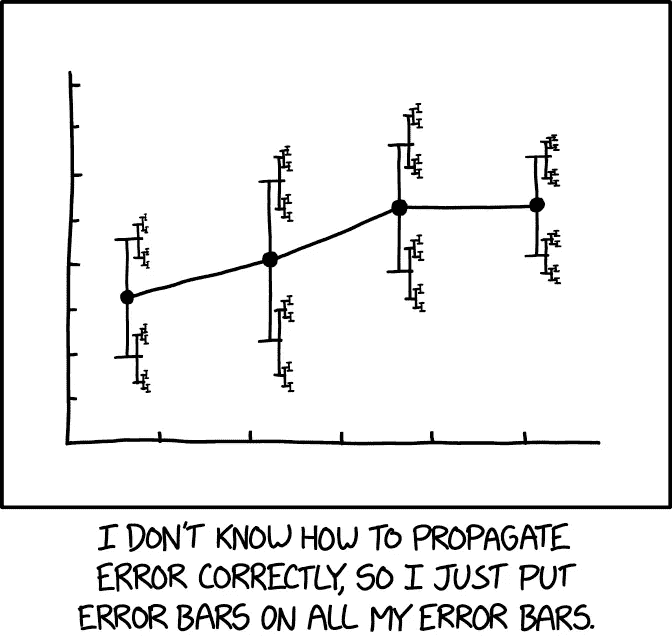

# 用随机状态操纵机器学习结果

> 原文：<https://towardsdatascience.com/manipulating-machine-learning-results-with-random-state-2a6f49b31081?source=collection_archive---------3----------------------->


Photo by [Simon Basler](https://unsplash.com/@simonbasler?utm_source=medium&utm_medium=referral) on [Unsplash](https://unsplash.com?utm_source=medium&utm_medium=referral)

## 理解随机状态对模型结果的影响

T 调整超参数、执行正确的特征工程、特征选择等都是构建机器学习模型的数据科学流程的一部分。几个小时花在调整和修改过程的每个部分，以改善我们的模型的结果。

然而，在数据科学中最受欢迎的函数中，有一个参数可以改变，以改变机器学习的结果。

…..它与领域知识或您对数据所做的任何工程无关。

## **随机状态**

```
ML_model(n_estimators=100,max_depth=5,gamma=0,**random_state=0..)**
```

一个看似无害的论点可能会改变你的结果，但几乎没有任何文章教你如何优化它。通过对训练数据和模型种子的随机排列进行一些操作，任何人都可以人为地改善他们的结果。

在这篇文章中，我想温和地强调一下大多数数据科学项目中经常被忽视的一个组成部分— **随机状态**，以及它如何影响我们在机器学习中的模型输出。

## 那么随机状态是如何影响分类器输出的呢？

为了展示这是如何影响预测结果的，我将使用 Kaggle 著名的[泰坦尼克号数据集](https://www.kaggle.com/c/titanic/data)来预测乘客的存活率。

使用训练数据集，我应用了一些最少的数据清理和特征工程，只是为了获得足够好的数据用于训练。在这个例子中，我将使用 xgboost 分类器模型进行典型的网格搜索交叉验证。

我将使用的培训数据:

利用网格搜索寻找最优的 xgboost 超参数，得到了模型的最佳参数。

基于交叉验证结果，我的最佳性能达到 82.49%，最佳参数为:

```
'colsample_bytree': 1.0, 'gamma': 0.5, 'max_depth': 4, 'min_child_weight': 1, 'subsample': 0.8
```

这个过程是许多机器学习项目的主要内容:搜索一系列超参数，以获得最佳的平均交叉验证结果。这时，工作就被认为完成了。

毕竟，交叉验证应该对随机性具有鲁棒性。对吗？

# **不完全是**


对于数据科学教程或 Kaggle 内核中的结果展示，笔记本将会就此结束。然而，我想拉回到以前的工作流程，以显示不同随机状态的结果如何不同。

这次让我们在分类器上运行具有 5 种不同随机状态的代码:

让我们也改变交叉验证随机状态:

**所有返回的结果都不同**。对于 xgboost 分类器和交叉验证分割的 5 种不同的随机状态，网格搜索运行产生 25 种不同的最佳性能结果。

拥有多个结果源于这样一个事实，即我们使用的数据和算法有一个随机的成分会影响输出。

然而，这在数据科学过程中产生了巨大的疑问，因为我们一直在改变我们的模型。

对于我所做的每一个改变，我会比较不同运行的结果来验证改进。例如*改变“a”可以提高模型 2%,增加“b”可以进一步提高模型 3%。*

随着上面显示的结果的变化，这让我想知道我的特征工程是否真的有助于更好的结果**或者这种改进完全是偶然的**。

也许不同的随机状态会使我的结果比以前更糟。


Photo by [dylan nolte](https://unsplash.com/@dylan_nolte?utm_source=medium&utm_medium=referral) on [Unsplash](https://unsplash.com?utm_source=medium&utm_medium=referral)

## 我最初的成绩是 82.49%，但 84.84%更高

请注意，在分类器随机状态 4 和分层洗牌随机状态 2 下，我的结果比我最初的运行高出了 84.84%。

那我该展示哪个结果呢？

呈现最好的模型结果是诱人的，因为随机种子是固定的，结果是可重复的。

结果的 2%的改善仅仅归因于不同的随机状态，这似乎是荒谬的。似乎在一个好的日子里，用正确的种子，我们会得到一个更好的结果。

## 我们应该如何应对这种不确定性？



[https://xkcd.com/2110/](https://xkcd.com/2110/)

在数据科学管道中，有许多方法可以解决这个问题。这绝不是一个完整的列表，而只是我在工作中进行的一些实践。

**1)从一开始就固定随机状态**

对所有事情都承诺一个固定的随机状态，或者更好的是，确定一个全局随机种子，这样随机性就不会发挥作用。将其视为流程中不可改变的变量，而不是可以修补的东西。

或者，

**2)使用预测结果作为区间**

由于结果在一个范围内会有所不同，因此您可以选择将交叉验证结果报告为一个范围。用不同的种子重复运行，以产生您可以报告的置信区间。人们可以很轻松地说，该模型的性能范围确实在这个范围之内。

**3)减少数据分割的不平衡/随机性**

减少随机分割对数据的影响的方法之一是确保分割不会对数据的组成产生太大影响。

将数据分层以减少随机性。对数据进行分层可确保训练测试分割/oob 错误/交叉验证的数据在训练和测试集中分别具有相同的存活者/非存活者比率。分割是通过保留每个职业的百分比来完成的，这样可以减少随机洗牌对结果的影响。甚至可以在[多列](https://stackoverflow.com/questions/45516424/sklearn-train-test-split-on-pandas-stratify-by-multiple-columns)上进行分层。

*值得注意的是，尽管数据是随机的，但表现的变化不应太大。*

如果精度结果随种子变化很大，这可能意味着**模型不够稳健**，你应该考虑改进你的方法以更好地拟合数据。大多数情况下这并不重要，但是当边界非常接近时，考虑所有可以用来提高模型性能的变量，包括随机状态，将是很有诱惑力的。

希望这篇文章已经设法强调了随机性如何影响我们的模型，以及减轻其影响的几种方法。

下面是我用过的代码的 [github repo](https://github.com/WeiHanLer/Manipulating-machine-learning-results-with-random-state-) ，都可以转载。感谢阅读！