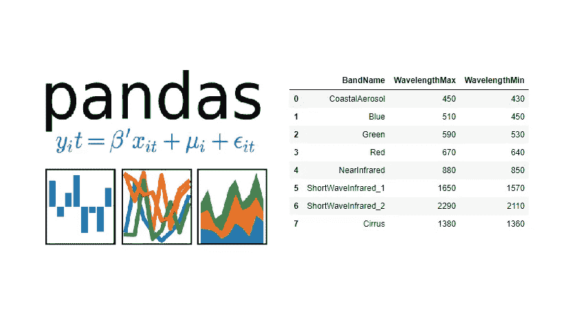
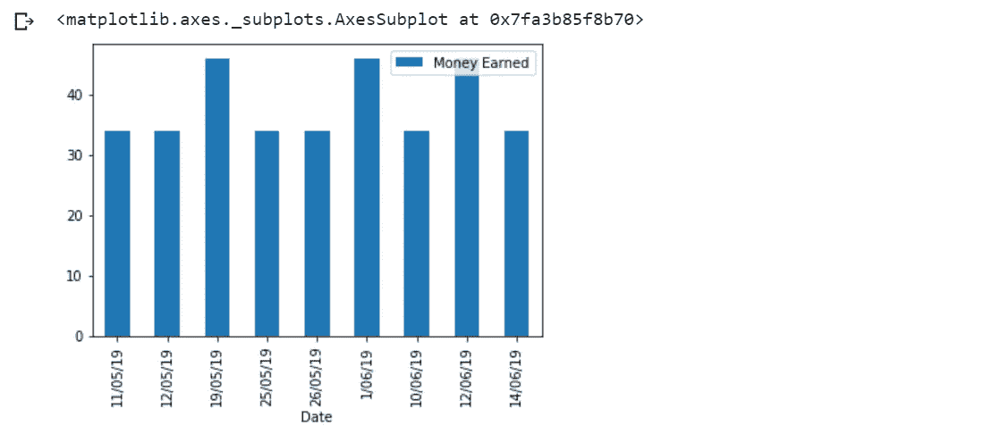
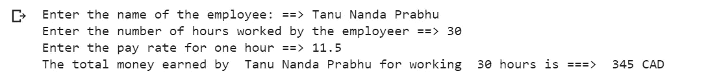

# 使用 Python 操作熊猫的数据。

> 原文：<https://towardsdatascience.com/manipulating-the-data-with-pandas-using-python-be6c5dfabd47?source=collection_archive---------15----------------------->

## 让我们用 Python 来计算我的熊猫数据框架的兼职收入。



Credits: [GeoSpatial Training Services](https://geospatialtraining.com/tutorial-using-pandas-dataframes-with-the-arcgis-api-for-python/)

在开始之前，让我给你介绍一下 [Pandas](https://pandas.pydata.org/) ，Pandas 是一个 python 库，它为 Python 编程语言的数据分析工具提供了高性能、易于使用的数据结构，如系列、数据框和面板。为了使用 pandas 库和它的数据结构，你必须安装并导入它。请参见[熊猫](https://pandas.pydata.org/)库的文档以获得更多更好的理解和安装指南。

# **计算兼职收入的步骤。**

1.  导入所需的(熊猫)库。
2.  将日期、工作时间和收入等值存储在数据帧中。
3.  向现有数据帧添加更多行(更新数据帧的行)。
4.  计算挣的钱和工作的总时间。
5.  用日期和挣得的钱绘制条形图。
6.  包括搜索选项，以便搜索相应的工作日期。
7.  最后添加工资选项。

**让我们开始吧！！！**

**1。导入所需的(熊猫)库。**

在本教程中，我们将只使用 pandas 库来执行以下计算，pandas 库本身将为我们提供计算总和并绘制条形图的选项，您无需导入 matplotlib 来绘制图形，pandas 库将为您提供绘制条形图的选项。这将是非常重要的，以了解如何使用熊猫数据框架绘制条形图。如果你用的是 Google Colab 笔记本，你不需要安装任何熊猫图书馆，只需要导入就可以了。否则，您必须在命令提示符下说 pip install pandas 来手动安装它。别名(pd)的原因是，当我想通过别名使用任何方法时，我不必每次都写给熊猫，我可以改为写 pd.method name。

```
# Importing pandas library.
import pandas as pd 
```

**2。将日期、工作时间和收入等值存储在数据帧中。**

```
# Creating a data frame df.
df = pd.DataFrame({'Date':['11/05/19', '12/05/19', '19/05/19', '25/05/19', '26/05/19', '1/06/19'],'Time Worked': [3, 3, 4, 3, 3, 4],'Money Earned': [33.94, 33.94, 46, 33.94, 33.94, 46]})# Head displays only the top 5 rows from the data frame.
df.head()
```


Storing the values in a data frame.

在这一步中，我将所有数据分类为数据、工作时间和收入三列。日期栏以日/月/年格式显示工作的日期，它将以字符串形式存储，工作时间以整数形式显示一天内完成的工作总量(小时),收入以整数形式显示一天内收入的总额(加元)。在这里工作一小时，最低工资是 11.51 加元。所有这些只是原始数据，这些数据后来被存储在 pandas DataFrame 中，并被分配给一个变量 df。为此，只需使用“pd。DataFrame”并传入所有数据，通过这样做，熊猫会自动将原始数据转换成 DataFrame。我使用 head()是因为数据框包含 10 行数据，所以如果我打印它们，它们可能会看起来很大并覆盖大部分页面，因此 head()显示数据框中的前 5 行数据。

**3。向现有数据帧添加更多行(更新数据帧的行)**

在这一步中，我们将学习如何向现有数据框追加或添加更多行，这是一个重要的步骤，因为很多时候您必须通过添加更多行来更新您的数据框，在本例中，我首先创建了一个名为 df2 的新数据框，然后通过将 df2 作为参数传递来调用 append()。您必须像 df.append(df2) (existing)那样将新数据帧附加到现有数据帧。append(新数据帧))，现在在 append 函数中，我们有一些其他参数，如 ignore_index = True，这可以防止数据帧追加新的索引，因此在此示例中，所有索引都是连续的(递增)，下一个参数是 sort = False。这是因为我们不想根据索引对数据进行排序，否则我们的数据将完全是一个混合体，您可以通过分别将这些参数的值更改为 False 和 True 来处理这些参数，并注意它们之间的差异。最后，将新的附加数据帧存储到新的变量 df 中。

```
# Adding more rows
df2 = pd.DataFrame({‘Date’: [‘10/06/19’, ‘12/06/19’, ‘14/06/19’],
                    ‘Time Worked’: [3, 4, 3],
                    ‘Money Earned’: [33.94, 46, 33.94]})
df2
```


Storing the values in a new data frame df2

```
# Appending the rows of the old data frame to the new data frame.df = df.append(df2, ignore_index=True, sort = False)
df.head()
```


Appending the rows of the old data frame to the new data frame.

**4。计算挣得的钱和总工作时间的总和**

这一步非常简单，因为我们只需获得“挣得的钱”和“工作的时间”两列的总和。要做到这一点，您只需使用 sum()即可，它将返回这两列中所有数据的总和。我只是对 Total_earnings 使用 round()来获得精确的值。确保在 df 中传递正确的列名，因为如果列名不匹配，就会给你带来麻烦。最后，我以可读性更好的方式打印结果。

```
Total_earnings = df[‘Money Earned’].sum()
Total_time = df[‘Time Worked’].sum()print(“You have earned total of ====>” ,round(Total_earnings),“CAD”)
print(“ — — — — — — — — — — — — — — — — — — — — — — — — — — — ”)
print(“You have worked for a total of ====>”, Total_time, “hours”)
```


Printing the result of total earnings and total time worked.

**5。绘制总持续时间与收入的条形图**

正如我前面提到的，要绘制一个图形，您不必导入 matplot 库，pandas 有一个 plot()，它将在一定程度上帮助您绘制一个图形。我已经使用了 plot()并将“日期”和“赚的钱”作为 x 和 y 值传递(因为你需要 x 和 y 值来绘制一个图形；)我想要一个条形图，所以我用了条形图，你也可以使用线，分散到关键字种类。然后我们得到一个漂亮的条形图，其中所有的值都是根据我们的期望绘制的。

```
# Plotting a bar graph using pandas library.
df.plot(x =’Date’, y=’Money Earned’, kind = ‘bar’)
```



Plotting the graph of Date vs Money Earned.

上面显示的不是绘制图表的最佳方式，但是我已经向你们展示了熊猫库可以帮助你们绘制图表，有时使用这种方法很方便，因为数据和计算较少，你所要做的就是用 x 和 y 值绘制图表。

**6。包括搜索选项，以便搜索相应的工作日期。**

这是一个额外的步骤，只是为了给它一种感觉，就像我加入了一些功能的数据库，比如搜索选项。在实时项目中，这是一个方便的功能，你经常需要搜索数据，但你不能手动搜索，所以在下面代码片段的帮助下，你就可以完成任务了。在这个例子中，我使用 str.contains()进行搜索操作，并将数据作为参数传递，现在数据是一个变量，包含用户输入的要搜索的数据。输入日期时，str.contains()会搜索输入的日期，然后显示日期和数据框中的相应值。这将有助于当你想搜索一个特定的数据，并获得时间和金钱，你可以只输入日期，并得到结果快，而不是手动寻找所需的日期。

```
# Including a search option.
date = input(“Enter the date you want to search ===> “)
df[df[‘Date’].str.contains(date)]
```


The result of the search option.

**7。最后添加工资选项**

这更像是一个可选(奖金)步骤，因为这将为输入的数据生成工资，这不是一个行业级工资生成器，而是一个简单的工资生成器，具有不同的功能和打印报表。逻辑非常简单，我所做的就是将姓名、小时数和费率作为用户输入，然后将费率和小时数相乘，并将它们存储在 total_money 中，并将其封装在一个函数中。

```
# Function payroll contains calculation of total money.
def payroll():
 name = input(“Enter the name of the employee: ==> “)
 hours = int(input(“Enter the hours worked by the employee ==>“))
 rate = float(input(“Enter the pay rate for one hour ==> “)) total_money = hours * rate print(“The total money earned by “, name, “for working “, hours,  “hours”, “is ===> “, round(total_money), “CAD”)
```



The result of the payroll function.

因此，这就是如何使用 pandas 数据框和 python 计算兼职收入的方法。我知道这很容易理解，因为我已经尽可能多地解释了代码，剩下的你可以自己练习。如果你对熊猫图书馆知之甚少，这是一个好的开始，这些是你应该唾手可得的一些基本方法。我就讲到这里，让你们练习代码。如果你有任何疑问，请在评论区告诉我，或者给 tanunprabhu95@gmail.com[发邮件](mailto:tanunprabhu95@gmail.com)让我知道你的问题，我一定会解决你的问题。祝你过得愉快！！！！