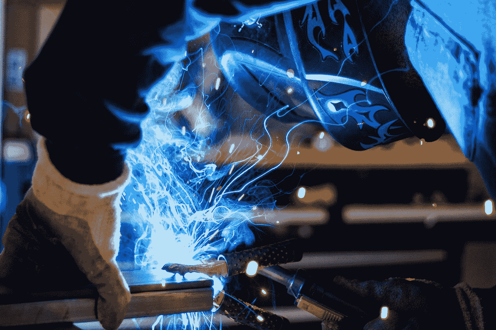
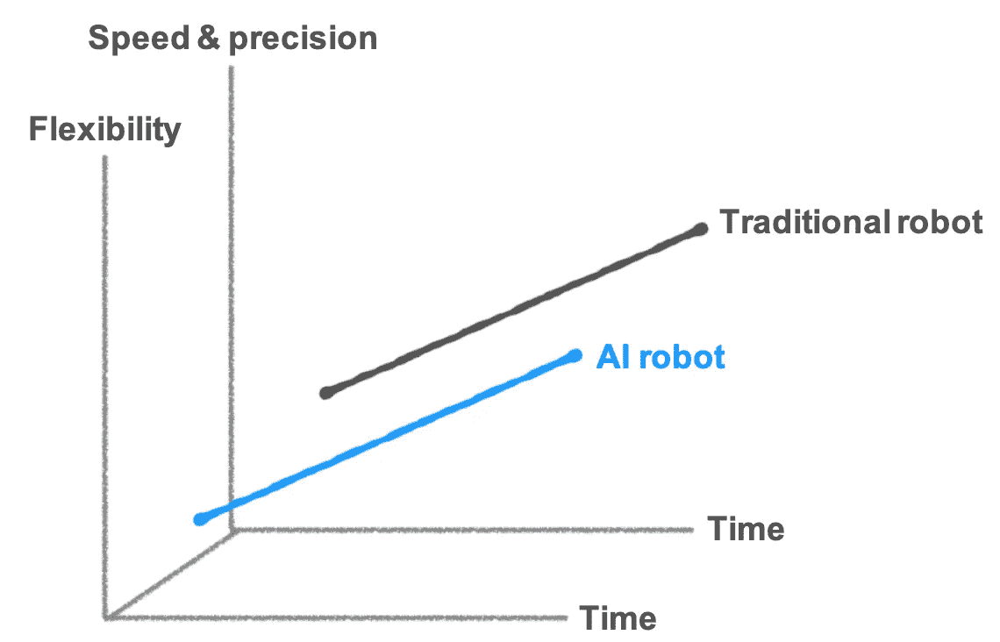

# 在人工智能定义的自动化的新时代，公司会蓬勃发展还是勉强生存？

> 原文：<https://towardsdatascience.com/manufacturing-industry-reshuffle-will-companies-thrive-or-barely-survive-in-the-new-era-of-aa06a3cade5c?source=collection_archive---------29----------------------->

Photo by [Rob Lambert](https://unsplash.com/@roblambertjr?utm_source=medium&utm_medium=referral) on [Unsplash](https://unsplash.com?utm_source=medium&utm_medium=referral)

先前我们讨论了人工智能如何使机器人执行过去无法完成的任务。具体来说，AI 机器人在三大领域实现了[突破。但会对目前制造业的格局产生什么影响呢？谁将能够抓住新技术所带来的机遇？哪些公司将面临前所未有的挑战？](/its-here-how-ai-robot-will-revolutionize-manufacturing-44ce784438d4?source=---------2------------------)

# **人工智能机器人将如何颠覆制造业？**

> 破坏性创新是由哈佛商学院教授克莱顿·克里斯滕森提出的。该理论的中心思想是:行业中的现有参与者一般选择专注于“持续创新”，以改善现有客户的现有产品和服务。这些客户通常是那些产生最多利润的人。

此时，一些资源较少的小公司就会抓住机会，瞄准被忽视的市场需求，站稳脚跟。破坏性创新分为两种类型:**低级市场创新**和**新市场创新**。

## 低层次的市场创新(如数码摄影)

Photo by [Jon Tyson](https://unsplash.com/@jontyson?utm_source=medium&utm_medium=referral) on [Unsplash](https://unsplash.com?utm_source=medium&utm_medium=referral)

早期的数码相机分辨率差，快门延迟长。然而，随着数码摄影质量和分辨率的提高，数码相机已经逐渐从低端市场走向主流市场。

具有讽刺意味的是，尽管柯达开发了数码相机，但最终还是被新技术淘汰了。原因是柯达不可能放弃该公司三分之二的胶片市场份额。这就是“创新的困境”。尽管目睹了新技术的威胁，但由于现有的公司结构和战略，公司无法应对。

## **新市场创新(如电话)**

**新市场创新**指公司通过瞄准现有公司不服务的客户来进入市场。比如电话刚问世的时候，只能用于短距离的本地通信。当时电报行业的领头羊西联电讯拒绝购买发明者贝尔的专利，因为该公司最赚钱的业务是长途电报市场。当时，短距离通信甚至不被认为是一个市场。不幸的是，他们无法预见未来无处不在的电话通讯。

# AI 机器人带来的正是新市场的 D **颠覆性创新**！

汽车和电子制造业目前占工业机械臂出货量的 60%。这就是 FANUC、ABB、库卡和安川等传统机器人公司将大部分资源用于“持续创新”的原因他们专注于自己擅长的领域和主要客户的需求:提高**速度和精度**。

Comparison of traditional and AI robot innovation strategies (source: Bastiane Huang)

他们忽略了新的市场和应用，包括[仓储、食品和制造的配套流程](/its-here-how-ai-robot-will-revolutionize-manufacturing-44ce784438d4?source=---------2------------------)。这些行业的客户不需要如此高速、高精度的工作。他们需要的是**灵活性、灵巧性，以及机器人学习识别和处理各种部件的能力**。

感知到这些未满足的需求，新的人工智能机器人创业公司开始将人工智能应用于机器人。这些公司开始进入隐蔽的新市场，如配套、包装和仓储。

Source: OSARO

有趣的是，这些创业公司很多都不生产自己的机械臂。相反，他们专注于开发机器学习模型、机器人视觉感知和控制软件。因此，他们与现有的机器人手臂制造商合作，提供硬件支持。你可能会假设，即使这些机器人公司不追求 AI 创新，它们也不会被淘汰，因为自动化仍然需要硬件供应。

然而，这忽略了一些事实:

首先，很少有机器人公司已经发现了商机，并开始与这些初创公司合作或建立自己的人工智能团队。由于他们的领先，这些公司可以在以前没有服务的市场建立客户基础，并领先于他们的竞争对手。

其次，随着 AI 的采用越来越多，产业链中最有价值的组件将逐渐从硬件**转移到软件和数据**。我们已经可以从自动驾驶汽车的发展趋势中看出这一点。一旦无人驾驶汽车变得高度自主，最赚钱的组件将掌握在特斯拉、谷歌和其他控制机器学习模型和自动驾驶数据的公司手中。

这就是传统汽车制造商高度警惕的原因。汽车制造商要么积极参与并购，要么与硅谷软件人工智能初创公司合作。相比之下，机械臂制造商似乎不像汽车制造商那样对颠覆性的人工智能技术做出反应。

# **机器人制造商、制造商和人工智能初创公司:谁能在人工智能时代巩固地位？**

与汽车行业的同行相比，大多数机器人公司似乎对人工智能的反应不够快。即使他们真的投资人工智能，他们仍将面临与柯达相同的困境。组织的重建和战略的制定，以尽量减少转型的负面影响，将考验每个公司管理层的判断和决心。

另一方面，开发新市场极具挑战性。创业公司仍然需要与制造商密切合作，开发更好地满足客户需求的解决方案。制造过程甚至比仓储更复杂。创业公司不一定像理解人工智能和机器人一样理解制造过程。这给了制造商一个成长和转型的绝佳机会！

如果制造商能够率先与这些新的人工智能创业公司合作，他们将能够通过流程自动化提高生产效率和质量。他们还可以满足少量但高度定制的客户需求，这在过去是很难实现的。这一点尤为重要，因为制造商长期以来一直受困于大规模生产和残酷的定价竞争。

制造中心应该利用他们现有的优势和制造过程中的知识来发展人工智能，最终成为下一个人工智能中心。

与人工智能应用相对成熟的零售或消费网络等其他行业相比，人工智能在制造业的发展仍处于萌芽状态。传统制造商仍然有可能利用他们的优势，包括对应用案例的更好理解和对数据的掌握，来巩固在自动化新时代的地位！

如果你想看更多这样的文章，请点击这里！

Bastiane Huang 是 OSARO 的产品经理，OSARO 是一家总部位于旧金山的初创公司，致力于开发软件定义的机器人。她曾在亚马逊的 Alexa 小组和哈佛商业评论以及该大学的未来工作倡议中工作。她写关于人工智能、机器人和产品管理的文章。跟着她到这里 。