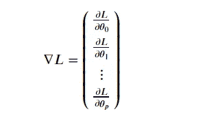
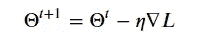
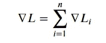
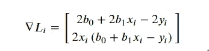
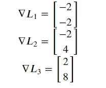
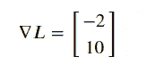

# Map-Reduce:梯度下降

> 原文：<https://towardsdatascience.com/map-reduce-gradient-descent-276e6ed0b002?source=collection_archive---------21----------------------->

## 使用 PySpark 和 vanilla Python

一些统计模型𝑓(𝑥通过优化依赖于一组参数θ的损失函数𝐿(θ来学习。有几种方法可以找到损失函数的最佳θ，其中一种方法是按照梯度迭代更新:

然后，计算更新:

因为我们假设数据点之间是独立的，所以梯度变成了求和:

其中𝐿𝑖是𝑖-th 数据点的损失函数。

Image by [Gerd Altmann](https://pixabay.com/users/geralt-9301/?utm_source=link-attribution&utm_medium=referral&utm_campaign=image&utm_content=70509) from [Pixabay](https://pixabay.com/?utm_source=link-attribution&utm_medium=referral&utm_campaign=image&utm_content=70509)

以统计模型𝑓(𝑥)=𝑏0+𝑏1𝑥和损失函数𝐿(θ)=(𝑓(𝑥)−𝑦为例)。如果我们有一组三个数据点𝐷={(𝑥=1,𝑦=2),(𝑥=−2,𝑦=−1),(𝑥=4,𝑦=3)}

那么它们中每一个的损失函数是

𝐿1=(𝑏0+𝑏1−2)、𝐿2=(𝑏0−2𝑏1+1)和𝐿3=(𝑏0+4𝑏1−3)与

如果我们从𝑏1=1 𝑏0=0 的解决方案开始，那么梯度是:

积累后会产生

现在，我们创建一个函数，它将接收参数 b 和一个数据点 x 作为列表，并返回该数据点的预测值(y)。

**Ex: f_linear([0, 1], [1]) will give an output of 1**

我们定义一个接收预测 y 和实际 y 并返回它们之间的平方误差的函数。

**Ex: L(1, 1) will give an output of 0**

函数 gf_linear(f，b，x，y)将返回具有参数 b 的函数 f 相对于平方损失函数的梯度，在 x 和实际结果 y 处评估。此函数应返回每个元素𝑗对应于相对于𝑏𝑗和𝑗={0,1,…,𝑝}.的梯度的向量

**Ex: x = [1], y = 2, b = [0, 1], gf_linear(f_linear, b, x, y) will give an output of [-2,-2]**

# **地图缩小:**

我们开发了一个生成值的地图缩减作业，因此该值的第一个元素是所有数据的平均损失函数。我们将映射函数实现为`map_mse(f, b, L, xy)`，其中`f`是函数`b`是函数的参数`L`是损失函数`xy`是数据。假设数据将以 RDD 的形式出现，其中每个元素的格式如下:

`[x, y]`其中`x`是列表，`y`是标量

**Ex:**rdd _ data . map(lambda x:map _ MSE(f _ linear，[0，0，0]，L，x))。collect()会给出一个**输出**为:[[1，[9，1]]，[1，[16，1]]，[1，[0.0，1]]，[1，[0，1]]。这里 key 是 1，b=[0，0，0]，我们从 rdd_data 得到 x。map 的输出是每个数据点的键和值。

现在，我们创建一个 reduce 作业，它接收前一个 reduce(或 map)的两个值，并适当地合并它们。在 reduce 作业结束时，值的第一个元素是均方误差。

**例如:** rdd_data。\
map(lambda x:map _ MSE(f _ linear，[0，0，0]，L，x))。\
reduceByKey(reduce_mse)。first()[1][0]会给我们一个 6.25 的**均方误差**。(x 和 y 值请遵循 rdd_data)

因此，现在我们将计算数据模型的累积梯度。我们将定义一个映射函数`map_gradient(f, gf, b, xy)`，它将接收一个函数`f`，它的梯度`gf`，它的参数`b`，以及一个数据点`xy = [x, y]`。此外，我们将定义一个函数`reduce_gradient(v1, v2)`来适当地组合这两个值。

**Ex:**rdd _ data . map(lambda xy:map _ gradient(f _ linear，gf_linear，[0，0，0]，xy))。reduceByKey(reduce_gradient)。first()[1]将给出[-14.0，-30.0，-20.0]的**输出**

现在，为了得到一个优化的值，我们运行下面的代码，使 MSE 每次都减少。

感谢你的阅读，我希望你能学会或至少理解梯度下降是如何工作的，以及如何使用 Map-Reduce 实现它。

Linkedin:

 [## Harsh Darji -特约撰稿人- Medium | LinkedIn

### 我是一名数据科学爱好者，追求应用高级分析，建立大数据分析工具…

www.linkedin.com](https://www.linkedin.com/in/harshdarji23/) 

GitHub:

 [## harshdarji23 -概述

### 在 GitHub 上注册您自己的个人资料，这是托管代码、管理项目和与 40…

github.com](https://github.com/harshdarji23)