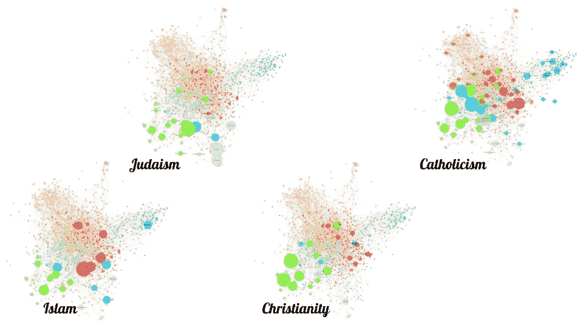
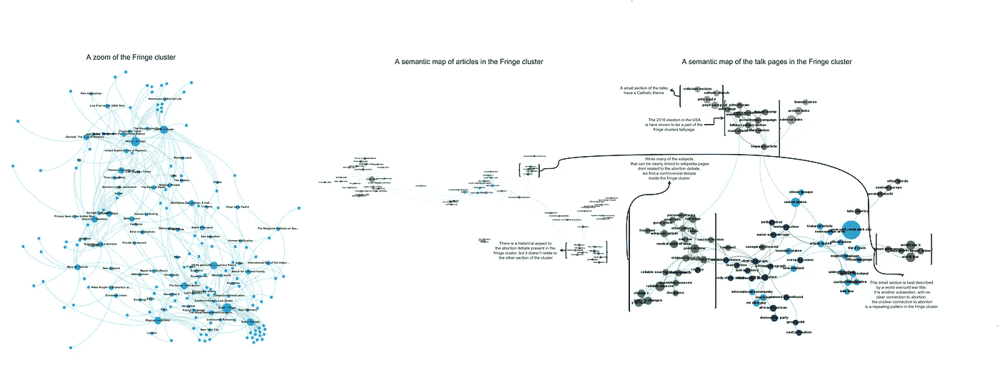

# 绘制争议地图:堕胎辩论

> 原文：<https://towardsdatascience.com/mapping-controversies-abortion-debate-7235029fc6d9?source=collection_archive---------21----------------------->

## 维基百科&辩论的竞技场

安-索菲·索尔森，杰佩·卡姆斯特鲁普，拉斯穆斯·德·尼尔加德和约翰内斯·范登赫维尔。

自从堕胎成为可能以来，围绕这个话题的讨论就一直存在。虽然在现实世界中很容易发现外界的争议，但我们还是去了维基百科，调查一个追求中立的在线百科全书会如何呈现它。

通过使用数字方法和收集在线数据，我们调查了堕胎辩论如何在维基百科的舞台上展开。我们的发现也许向我们展示了当维基百科试图解决社会中有争议的话题时，它和英美世界是如何运作的。

# 我们所做的:

首先，我们收集了绘制争议地图所需的数据。我们使用了几个 python 脚本，然后对数据进行了清理和排序，这样就可以构建可视化了。这里我们应用了几个不同的程序和应用程序。

这些脚本要么使用维基百科 API，因此向维基百科数据库“请求”信息，然后返回这些信息，要么它们抓取和爬行维基百科。这个过程包括脚本“浏览”有问题的页面，从中提取信息，如文本或链接，并移动到其他连接的页面。

在这样做的时候，我们选择了维基百科类别 [*堕胎辩论*](https://en.wikipedia.org/wiki/Category:Abortion_debate) 作为种子，或者“起源页面”，深度为 2，从而移动到所有连接到这个的页面，然后所有的页面链接到那些。这给了我们种子类别的成员，从这个和他们的子类别链接的子类别，总共 204 个维基百科页面。

然后使用其他脚本和程序的组合来处理我们的数据集，如 Gephi、CorTexT、alteryx 和 Tableau。

这为我们的可视化产生了 5 种类型的数据；

1.  显示链接到其他页面的页面的数据。
2.  特定页面上特定单词的出现。
3.  页面中的文本。
4.  不同的编辑修改不同的页面。
5.  特定用户在特定时间对页面进行的修订或编辑。

产生的 204 个维基百科页面的数据集然后用两个不同的 python 脚本抓取，生成带有全文的文件。一个用于通过 CorTexT 进行语义分析，而另一个用于查询用户指定的关键字。然后，我们通过 API 检索修订历史，以生成所选页面的两条时间线。

最后，我们抓取了维基百科的 HTML，生成了一个由文本链接连接的 204 页的网络，这意味着维基百科文章的主要文本。然后，这与关键字搜索相结合，生成了 11 个衍生网络，按笔记大小显示了选定的问题。

Workflow of our process of data harvesting and construction of visualizations, for a larger size [click here](https://drive.google.com/open?id=17V3Zg6ulpWwZg6QN0gDGjH9VuLeeWtRD).

# 针，遇到草堆:

Our network, where we sat down and looked for clusters in the network. We identified 4 distinct clusters, but also a middle that did not separate easily. For a larger size, [click here](https://drive.google.com/open?id=1c6oe7qB1-gJPWDxXmTq1sbJDEYZdDCts).

我们开始使用开源应用程序把从[堕胎辩论类别](https://en.wikipedia.org/wiki/Category:Abortion_debate)收集来的维基页面排列成一个可视网络。这给了我们一张由两种截然不同的东西组成的地图。点是维基页面的可视化，称为*节点*。第二件事是连接这些节点的线。这些线表示节点是相连的——在这张地图上，这些线显示了不同的维基页面如何在维基页面的文本中相互链接。在我们的术语中，这些线被称为*边。*

为了搞清楚这个网络，我们使用了一种力导向的放置算法，称为 [ForceAtlas2](https://journals.plos.org/plosone/article?id=10.1371/journal.pone.0098679) 。该算法给数据点和它们的连接一种空间感，我们需要这种空间感来直观地分析网络。ForceAtlas2 的工作原理是给边和节点一种推拉效应，其中边的功能就像一种弹簧，将节点绑定在一起，这些节点相互排斥。这样，具有许多共同边的节点彼此更接近。因此，该算法将节点展开，并使得通过 Venturini 等人(Venturini 等人)陈述的 4 条规则对网络进行空间分析成为可能。铝:2015):

> 1:哪些是主要的集群？
> 
> 2:分隔它们的主要结构孔是哪些？
> 
> 3:每个集群中有哪些子集群？
> 
> 4:分隔它们的是哪些较小的结构孔？

然而，我们的问题是，我们的网络中几乎没有结构上的漏洞——它更像一只海星，而不是中间有洞的相连的集群。因此，我们最终在我们看到的“海星”的明显手臂周围画了圈。

这给了我们*爱尔兰、加拿大、宗教、*和*美国法律体系——*但它留给我们一个大中心，我们不知道如何分析。

Map of the category of Abortion debate on Wikipedia, and its subcategories with a depth of two. This map shows the network after the use of the modularity tool in gephi. For a larger size, [click here](https://drive.google.com/open?id=1tmzPrFBB9c5ZfUtW6qsHGOa_DOaqHmuX).

为了尝试理解这只海星，我们使用了 Gephi 内置的一个工具，叫做[模块化工具](https://github.com/gephi/gephi/wiki/Modularity)。模块化是一种尝试将大集群分成更小的子集群的方式，通过数学定位大网络如何划分成更小的组，彼此之间有更多的内部连接。这些子网络可以指示更大网络内的某些社区。

简而言之，它试图让计算机在理解集群时做一部分分析工作。这是通过用不同的颜色给不同的子簇着色来实现的。

模块化工具给了我们与我们自己挑选的集群大致相同的集群。但它也给了我们两个新的集群，在参考了维基百科的文章*后，我们将其命名为*权利*和*边缘*。*

模块化地图也迫使我们提出另一个观点— *桥。*桥是连接集群的节点——它们是维基百科上通过链接不同主题来连接两者的页面的表示。模块化工具简单地为子集群分配一个它最有可能找到的桥接节点。同样地，堕胎节点成为美国法律系统的一部分，尽管它并不在附近。这可能不是最好的情况，一旦你手动查看维基百科上的页面及其内容。

但是我们的新聚类也许也给了我们一些关于维基百科作为媒介的见解——争论集中在英美世界，但也在法律方面。也许网络也向我们展示了英语维基百科如何对堕胎辩论的争议进行排序，或者用 Marres & Moats (Marres，Nortje & David Moats: 2015)的话说:

> ……我们可以从关注知识内容和争议中的政治利益之间的关系(这是早期 sts 的目标)扩展这种对称方法，以包括媒介和内容之间的关系。

本质上；我们看到媒体，这里是维基百科，是如何组织讨论有争议的事情的。

## 地区、宗教和法规:

为了更好地区分我们的聚类，我们搜索了特定的关键词，看看这些关键词是否在文章语料库的某些部分使用得更多。请注意，下面的网络是上面网络的循环版本。

Prevalence of regional notions shown by size.

首先，我们调查了在不同地区开展的主题。我们仔细观察了几个英语国家的流行情况。通过对国家术语进行关键字搜索，并在对这些术语进行分组(即“爱尔兰人”、“爱尔兰人”和“爱尔兰人”)时，我们看到两个地理聚类(*加拿大*和*爱尔兰*)，与模块化工具得出的聚类密切相关。我们进一步看到，美国的观念严重影响了网络。

Prevalence of religious notions shown by size.

我们发现人们对绿色集群很感兴趣，这是使用模块化工具的结果。为了探索这一点，我们对伊斯兰教、犹太教、基督教和天主教进行了关键词搜索。每一个都是通过搜索包含该信仰的几个词(即“穆斯林”和“伊斯兰”)来构建的。通过比较这些，我们都看到所有的宗教彼此之间有很大的关联，大多数都出现在左下方，同时也看到了它们的差异，如天主教更多地出现在“*爱尔兰*”部分。

Prevalence of different juridical terms shown by size.

在调查网络时，我们注意到很大一部分链接页面都是关于法庭案件的。因此，我们决定调查这个话题对辩论的影响程度。我们看到“法律”严重影响了整个辩论，而“法庭案例”大多位于左上角，大多数位于橙色群集内。最有趣的也许是禁止和管制之间的区别(两者都由动词和名词组成)。我们看到禁酒令在“宗教”绿色集群中更加突出。这可能是因为宗教团体更倾向于谈论禁止堕胎，而监管可能更像是一个法律话题。由于一些集群也有地理上的相似性(如上所述)，这里的差异也可能是由于文化或语言的差异。

# 连通性:单行道还是双行道？

A visualization showing the degree of the graphs in two way — in degree and out degree. For a larger size, [click here](https://drive.google.com/open?id=10-mHcGjx7gMSApPcAr1wgndvRd9iaMeX).

这两张地图展示了维基百科的链接是如何作为一种等级体系运作的。维基百科上的一些文章，如 [*罗伊诉韦德*](https://en.wikipedia.org/wiki/Roe_v._Wade) 在两个网络中都很大。在 *Roe 诉 Wade* 一案中，两个地图中的这种表述是其历史和法律分歧的产物。在美国，如果不联系到 1973 年美国最高法院的案例，讨论堕胎几乎是不可能的。其后果今天仍在政界和司法界继续。

但是更有趣的是那些在一张地图上很大并且可见，但是在另一张地图上却看不见的。堕胎联系紧密，但这在维基百科的结构方式和我们收集数据的方式上是有意义的。几乎所有关于堕胎辩论的网页，以及它的子分类都会链接到关于堕胎的文章。堕胎的文章本身主要读起来像是一个医疗流程及其与历史和宗教实践的关系。文章很少用在辩论上，辩论有自己的文章。

一些链接不太好，但包含其他页面链接的页面是像 [*【美国】*](https://en.wikipedia.org/wiki/Army_of_God_(United_States))*[*特纳日记*](https://en.wikipedia.org/wiki/The_Turner_Diaries)[*Eugen Relgis*](https://en.wikipedia.org/wiki/Eugen_Relgis)和各种关于围绕堕胎主题的[游行](https://en.wikipedia.org/wiki/March_for_Life_(Washington,_D.C.))的文章。因此，有一个大的出度而没有一个大的入度可能会告诉我们，所讨论的节点位于网络的边缘。有些联系甚至可能是试图获得更多的合法性，或者是效仿拉图尔，试图调解自己在争议中的立场。也许特别是如果用户群是非常独特的一篇文章？*

# *语义展开海星:*

*我们利用 CorTexT.net 网站进行了一系列不同的语义分析。该网站是由两个法国政府机构资助的 [LISIS 研究单位](http://umr-lisis.fr/)的在线平台——IFRIS 和 [INRA](http://institut.inra.fr/en) 。CorTexT 是一个有趣的工具，因为它让我们通过一种算法来运行我们的数字电子表格，这种算法对这些电子表格的内容进行语义分析。这让我们有机会从维基百科中搜集大量的文本，然后将它转化为常用短语的网络。*

*我们对维基百科堕胎辩论类别中的所有文章页面都做了这样的处理，结果地图如下。*

**

*A map of the top 100 phrases and words in the Wikipedia category of abortion debate. Made with CorTexT. For a larger size, [click here](https://drive.google.com/open?id=1zH3FiWa7Wsf8xHqpR3rrRKmtPitI7KLF).*

*这张地图证实了我们的发现，即美国司法系统在文章描述堕胎辩论的方式中占据显著地位。这可能是一个迹象，表明这个有争议的话题是如何通过法律体系及其决策方式来处理的？显然，美国的制度似乎就是这样运作的。司法的分量使其他形式黯然失色，这些形式可能是处理有争议话题的途径，如宗教或政治，它们在这种关系中发挥的作用较小。*

*这张地图还缺少一些东西——争议。或者说，它没有表现出来。也许这告诉我们一些关于维基百科辩论结构的事情——对用户之间争议的处理隐藏在文章之外的某个地方，媒体宁愿避开互联网上辩论者的混乱信息来源？我们必须更深入地了解维基百科页面的世界，才能找到这场斗争。*

# *语义映射集群:*

*下面的可视化是三个图的合成，基本聚类的所有衍生物，从整个网络中移除，聚类中的文章页面的语义分析，以及文章的谈话页面的语义分析。语义分析是通过 CorTexT 完成的。*

## *权限-群集:*

**

*Composite of graphs from the Rights cluster. Notice how much of the debate surrounding the production of the article happens in the Talk pages, and how these are often refering to Wikipedias policies. For a larger size, [click here.](https://drive.google.com/open?id=1sPVSx8-lFL5WOYyyAyijXb38sqDweq18)*

## *爱尔兰集群:*

**

*Composite of graphs from the Irish cluster. Here a discussion on the representation of the relationship between the Republic of Ireland and Northern Ireland is done in the articles. A reflection on another controversial issue, that is present because of the geographical nature of the articles. For larger size, [click here.](https://drive.google.com/open?id=1t5gdNc1AjScXogpSO-WOm8jSh06EudXb)*

## *边缘集群:*

**

*Composite of graphs from the Fringe cluster. Here we also see that, in the analysis of the articles, there are very few bridges between the different clusters. Perhaps a sign that this cluster should be investigated? Maybe a reflection on how well the modularity tool produced a cluster where the contents of it form a community — here it clearly lumped different communities together. For larger size, [click here](https://drive.google.com/open?id=1iTEDNjK9f6vkoPxGoebw_SxpBAN-6ApN).*

## *加拿大集群:*

**

*Composite of graphs from the Canadian cluster. These graphs are interesting in that they display nothing like that looks like a controversy. What has been mapped here is everyday Wikipedia editing of articles. Quite interesting, when one thinks of the subject matter and Canadas geographical connection to America. For larger size, [click here](https://drive.google.com/open?id=1Y3ib5WE6GNFdZWsnxt7oouaLITqVoZJf).*

## *宗教和伦理集群:*

**

*Composite of graphs from the Religious & Ethical cluster. Here the discussion on the Talk pages is about certain denominations of christianity — especially The Church of the Latter Day Saints. For a larger size, [click here](https://drive.google.com/open?id=1Nsnwtlc0TOPsTUw8mS4OiGGGirffWXZg).*

## *美国法律体系集群:*

**

*Composite of graphs from the American Legal System cluster. Once again, we see the use of Wikipedias policies to filter out views, that are controversial in the articles of the online enyclopedia. Also interesting here, is the fact that all discussion is about judicial and political topics. It is a very specific way of treating a complex subject. For larger size, [click here](https://drive.google.com/open?id=1uOIf-CuS-jWPCLYfPR8OKNVe82Tj7sUs).*

*对我们来说，很明显，文章和谈话页面的单独语义分析给了我们一个媒体技术效果的概述，这是 Marres 和 Moats (Marres，Nortje & David Moats 2015: 6)所讨论的。*

*它变成了一张地图，不仅是用户和他们的不同意见的地图，也是这些不同意见只能在维基百科的特定空间里使用的地图。对话页面是一种后端，尽管它是公开可见的——你必须寻找它才能使用它。*

*这种布置作为物品的一种过滤器。由于维基百科的政策而被认为有问题的内容被隔离到谈话页面的空间中，以便成为文章的一部分，或者被简单地丢弃并最终在谈话部分存档。所以我们也看到了我们在堕胎辩论类文章的语义分析图上没有看到的。原因很简单，由于维基百科的内部运作，争议已经以某种方式被过滤掉了。*

*这种在谈话页中的过滤在边缘、爱尔兰和美国法律体系群中非常明显。在这里，我们在所有这些地图中都有一个大型语义集群，涉及维基百科在编辑中的良好行为政策——这是维基百科上处理分歧的明显方式之一。*

*对边缘集群的分析也强调了对模块化工具的批判。它似乎将几个不同的文章社区结合在一起，而这一簇簇支离破碎的主题不容易连接起来。模块化工具看起来并不是一个完美的工具，但在批判性使用时仍然非常有用。*

# *维基百科用户，以及如何映射他们:*

*这张二分图显示了编辑用户和维基百科文章之间的关系。通过以这种方式产生我们的数据，一些有趣的事情出现了。*

**

*A bipartite graph showing the relationships between individual users and Wikipedia articles. Users are represented by the red nodes, while the green nodes are Wikipedia articles. Size indicates the level of activity, while the thickness of the edges reflect the amount of times a users has edited one specific article. Based on user revision history data since 2001 from Wikipedia. For a larger size, [click here.](https://drive.google.com/open?id=10gjIIMrmEju03q6yC-0nN0sAXRt6jdRW)*

*例如，右下角的集群是一个主要由爱尔兰用户组成的集群，他们编辑与爱尔兰堕胎法相关的文章。这突出了某些文章编辑的地理性质。2018 年，爱尔兰堕胎法出现在媒体上，因为围绕这些法律的改变举行了全民公决。这可能产生了更多来自当地爱尔兰维基人的与这些页面的互动，他们想在这个展开的讨论中扩展文章。*

*然后是中间的大集群，诸如*堕胎辩论*、[、*反堕胎暴力*、](https://en.wikipedia.org/wiki/Anti-abortion_violence)[、*美国反堕胎运动*、](https://en.wikipedia.org/wiki/United_States_anti-abortion_movement)的周围文章显示大量用户在大集群中的许多不同页面上编辑。*

*最有趣的是我们也开始在以前的网络上看到的——学位地图。这些页面中的许多在以前看起来并不重要，但是正如我们所看到的，人们对编辑它们有很大的兴趣。尤其是像 [*詹姆斯·奥基夫*](https://en.wikipedia.org/wiki/James_O%27Keefe) 和 [*白人种族灭绝阴谋论*](https://en.wikipedia.org/wiki/White_genocide_conspiracy_theory) 这样的页面在这个地图上很有意思。这些页面有大量的维基人，他们只编辑网络中的这些特定文章。这些网页是有趣的异常现象——它们在网络中并没有突出的文章，但是它们吸引了大量的活动。这张地图上许多较大的绿色节点都可以这么说。在用户数据进入我们的地图之前，它们中的大多数并不突出。这是争议的标志吗？有些文章确实突出了有争议的话题和人物。也许这值得深入研究一下。*

# *堕胎辩论和白人种族灭绝的阴谋论？*

**

*A look into the behaviour and activity of the Wikipedia users editing the Wikipedia article “White Genocide Conspiracy Theory”. For a larger size, [click here](https://drive.google.com/open?id=1Dqr58w_GuVpP9Mc0MVKuEzVzQ16bOqw0).*

*当我们冒险调查编辑*白人种族灭绝阴谋论*文章的特定维基人时，一张争议话题的地图出现了。这些用户似乎在文章和聊天页面的海洋中航行，在那里，似乎处于永无止境的辩论状态的主题被描述并被制作成一种百科全书式的知识。*

*许多我们认为是过去几年互联网战场的文章。 [*Gamergate 争议*](https://en.wikipedia.org/wiki/Gamergate_controversy) 、 [*Alt-right*](https://en.wikipedia.org/wiki/Alt-right) 、 [*Me Too movement*](https://en.wikipedia.org/wiki/Me_Too_movement) 的文章都是重剪辑发生的地方。*

**

*A screenshot of the mainpage of the [Gamergate controversy talk pages](https://en.wikipedia.org/wiki/Talk:Gamergate_controversy). Here you can see the different policies being enforced. This article is labelled as controversial and therefore comes with additional scrutiny and sanctions.*

*这让我们看到了维基百科的温和一面。显而易见，维基百科的政策，如 [*中立观点*](https://en.wikipedia.org/wiki/Wikipedia:Neutral_point_of_view) 或 [*原创研究*](https://en.wikipedia.org/wiki/Wikipedia:No_original_research) 正在迅速成为我们如何看待文章中争议的经典。这些政策在讨论中被用作武器——尤其是在有争议的讨论页面中。这些规定是摒弃不同意见的方式，或者是压制对文章措辞权威的质疑。*

*但是这当然没有向我们展示，用户是如何参与有争议的讨论的。他们是版主还是有问题的编辑？进入单个文章的讨论页面并绘制单个用户的评论会给我们一个概览，如果我们走这条路的话，这可能是一条追求的途径。*

*对于我们的使用来说，可以说这些用户几乎都与大量非常有争议的页面相关——在某种程度上。从这个意义上来说，这是维基百科上意见战场的地图——从文章和他们的谈话页面到管理员的公告栏。互联网上最大的百科全书关于什么是*事实*的元讨论是通过遵守严格的行为规则并积极执行这些规则来安排的。*

# *一段时间以来的维基百科用户:*

*到目前为止，我们已经看到用户如何以不同的方式参与不同的主题。上面我们看到了用户在不同的页面上有不同的参与度。下面我们将概述他们是如何随着时间的推移做到这一点的，以及我们是如何绘制的。通过将时间变量引入等式，我们可以看到不同的页面或主题在不同的时间是如何突出的。*

**

*Timelines for 13 specific pages, picked by us. Made in Tableau. For a larger size, [click here](https://drive.google.com/open?id=1tp1QG_zWcZL4HddXFhA9NA2KfP3Hsasp).*

*上面我们看到了 13 个不同的页面，考虑到随着时间的推移修改(或编辑)的数量。所有的网页都被发现是重要的，要么作为一个集群的中心，要么通过我们的其他可视化。*

*我们注意到的第一件事是“罗伊诉韦德案”页面的大部分内容完全盖过了其他页面，从而强调了我们之前的想法，即这是堕胎辩论中的一个核心角色。从修订量(节点大小)和独特用户参与度(线条粗细)来看都是如此。*

*接下来我们要强调的是，我们看到了一种模式，即页面在创建后的最初几年(标为“出生”)会有更多的活动，例外情况是“堕胎法”和“堕胎辩论”页面，它们的活动似乎会随着时间的推移而保持不变。*

*这可能表明，如果一个页面在第一年后出现活动上升，这要么是因为该主题突然变得有争议，要么是因为随后包含的新事件。我们看到有两页展示了这种行为，即“白人种族灭绝阴谋论”和“爱尔兰宪法第八修正案”。调查第一个提到的页面，我们看到南非事件的迹象开始了一场跨越大西洋到唐纳德·特朗普的争端，然后进一步传播到阴谋论的页面。*

**

*Does the genocide of white people originate in South Africa? According to Wikipedia, it certainly travels through the country — invoking the character of President Trump on the way.*

*在下一节中，我们将进一步探究爱尔兰案例中价格上涨的可能原因。*

# *我们的爱尔兰问题:*

*我们想通过维基百科页面上对爱尔兰宪法第八修正案(T0)和第三十六修正案(T3)的编辑时间线可视化来说明的一点是，它们都经历了相同的编辑过程。所有四个图表在相同的月份有相似的峰值。正如我们上面的大图显示的，一个大的尖峰“在生命的后期”表明了维基百科之外的改变，但是第 36 次修正是在修订和编辑发生前几个月才创建的。*

*虽然第 36 修正案是 2018 年 1 月 18 日创建的新维基百科页面，但我们可以看到修订量的峰值和参与编辑的独立用户是如何按时间段连接的。在第八修正案的编辑历史的可视化上也可以看到类似的趋势。*

**

*Screenshot from the Wikipedia article page about [The Thirty-sixth Amendment of the Constitution of Ireland](https://en.wikipedia.org/wiki/Thirty-sixth_Amendment_of_the_Constitution_of_Ireland).*

*虽然我们从阅读爱尔兰宪法第八修正案的内容中知道，它禁止使用堕胎，而第三十六修正案为必要时绕过第八修正案提供了可能性。*

**

*Revision history of the Wikipedia page concerning the Eighth Amendment of the Constitution of Ireland.*

**

*Revision history of the Wikipedia page concerning Thirty-sixth Amendment of the Constitution of Ireland.*

*这两个维基百科页面的内容解释了这两个页面之间的联系，以及同时修订这两个页面的必要性。我们在编辑社区中从独特的用户活动中看到的类似峰值显示了这些变化的相关性。我们认为两个页面上独特编辑的数量是爱尔兰宪法两个修正案政治变化的一个指标。*

*上面，我们看了维基百科用户随着时间的推移编辑的更一般的方式。现在，我们深入探讨爱尔兰集群的部分内容的编辑。我们想探究维基百科用户是否会在全球范围内追随爱尔兰宪法的变化。*

# *爱尔兰的编辑们:*

**

*Data visualization of user data from the Irish cluster. Made with Tableau. For a larger size, [click here](https://drive.google.com/open?id=1qW-JpkrGbAIu7GF2JpzC5-wjqWPW7eJM).*

*在我们可视化的第一部分，最左边，我们看到大部分编辑是如何由识别的人完成的，几乎所有的修改都是由识别的用户完成的。这已经通过柱状图的使用得到了说明。如果我们将“高”数量的用户编辑和修改与我们可视化的第二和第三个图表进行比较，我们会看到对更新爱尔兰和爱尔兰事务，特别是堕胎的信息感兴趣的独特用户的增加。第一张图让我们相信用户主要是人类，而不是自动机器人。第二张图中的尖峰也表明了某种变化，需要整合到维基百科页面中，就像之前的时间线一样。维基百科页面描述了两部法律，这两部法律相互影响，正在讨论的变化可能是第 36 修正案的通过，这直接影响了第 8 修正案。*

*上面的图像显示了一个由人类组成的团体，他们在维基百科中的行为主要是爱尔兰式的。这回答了谁以及在某种程度上什么时候的问题。从数据来看，在这个集群中似乎没有关于堕胎的关注或争议，只有关于爱尔兰堕胎的争议或关注，而在集群的其他地方没有类似的关注(Munk:2014)。*

*正因为如此，我们想在更高的程度上理解事件的时间线。因此，我们继续绘制爱尔兰人的活动图。*

**

*Data visualization of user data from the Irish cluster. Made with Tableau. For a larger size, [click here](https://drive.google.com/open?id=1t88PJfLaQUXbqkfk25IZlB-GSGwKnWYu).*

*在第一张图中，我们看到在上述修订时间线峰值的同一时期，匿名和非匿名使用修订的情况有所增加。从这张图表中我们可以了解到的新情况是，在仅仅两个月的增加行动后，我们看到匿名用户的大幅下降。*

*当跟随修订和唯一编辑的时间线时，在可视化的中间，我们可以看到两条线彼此跟随，直到 2017 年 10 月左右，此时 pages 编辑的下降多于修订。这可能意味着一场“改版战争”，用户将精力用在改变现有内容上，而不是贡献新信息。它也可以指向一个专门的核心用户，他们修改和编辑新的信息。从左边的图表中，我们还可以看到修改页面上的大多数用户都是可识别的。这可能也是爱尔兰集群的普遍情况。正如我们在上面看到的，有一大群人参与了爱尔兰堕胎的话题。*

*当我们打开维基百科第八修正案和第三十六修正案的评论时，我们看到了民意调查的许多变化。像对第八修正案和第三十六修正案的民意调查这样的单一问题会产生大量的修改，因此会产生峰值。*

# *将关键词映射到堕胎类别:*

*通过对通过 CorTexT 找到的堕胎辩论的语义关键词进行更深入的研究，并系统地回顾最常见的名词短语，我们可以确定 12 个关键词，我们可以在整个堕胎类别中找到它们。*

**

*Maps showing different keywords from the abortion debate category, mapped out on the abortion category of Wikipedia. For larger size, [click here](https://drive.google.com/open?id=1lopnBdvP2BmwokFP0jgJMZvQIFjHtFHx).*

*“反堕胎”和“反堕胎选择”主要与北美堕胎辩论有关。然而，关键词"反堕胎"，一个最常被支持堕胎群体用来称呼反对堕胎者的术语，主要出现在关于反堕胎暴力的页面上，显示当暴力被用来攻击堕胎做法时，它被命名为反堕胎而不是反堕胎。*

*关键词“死亡”主要出现在关于在爱尔兰和美国引发堕胎辩论的人的具体案例的页面中。[萨维塔·哈拉帕纳瓦](https://en.wikipedia.org/wiki/Death_of_Savita_Halappanavar)的案件对爱尔兰堕胎辩论和相关立法产生了巨大影响，[克米特·戈斯内尔](https://en.wikipedia.org/wiki/Kermit_Gosnell)的案件同样是一个关于美国非法堕胎结果的有争议的案件*

*“权利”被视为既与胎儿的权利相关，这是一个反堕胎的焦点，也与生殖权利的概念相关，这是一个在欠发达国家主要与妇女权利相关的问题。这表明了世界各地权利问题的双重性。*

**

*Maps showing different keywords from the abortion debate category, mapped out on the abortion category of Wikipedia. For larger size, [click here](https://drive.google.com/open?id=1_c3fa9VjGjbGqCdfoSHOpvBh6yW08Gg6).*

*“婴儿”在流产和关于流产的哲学辩论中占主导地位。这显示了不同的观点，婴儿与胎儿依赖流产与堕胎，以及如何从哲学角度就堕胎的道德性进行辩论。*

*“生存能力”是美国堕胎法律纠纷中的一个核心概念，主要位于这一组中，可能是因为它与胎儿生存能力有关。*

*“母亲”出现在像[共产主义下的堕胎](https://en.wikipedia.org/wiki/Abortion_under_communism)这样的页面下，也许可以用现在和以前的共产主义国家法律来解释，这些法律允许堕胎来保护母亲的生命。*

*“健康”的分布表明，这一概念在很大程度上与发展中国家妇女的生殖权利和健康有关。*

*很明显，在某种程度上，描绘一场如此复杂的争议有其自身的生命力，越陷越深最终会产生更多的问题而不是答案。最终在这里，我们希望表明，没有真正的终结，我们仍然有新的机会进行调查，这个关键词分析揭示了以前没有探索的争议方面。这最后的分析标志着我们对堕胎争议和维基百科内部运作的探索的结束。这是一次旅行；一次紧张、激动人心、有时甚至令人疲惫不堪的学习经历。*

# *那么，我们对堕胎辩论了解多少？*

*回到我们最初的网络，我们不再仅仅看到一只孤独的海星。*

*相反，我们看到了不同的反对堕胎的观点，以及由此产生的次级争议。我们看到了与主题的联系，从未想象过的联系，我们看到在我们的海星网络中严重缺乏医学专家，这是我们没有预料到的。*

*那么堕胎辩论是关于什么的呢？谁是持不同意见的一方，他们在哪里会面，分歧是什么，会停止吗？*

*在我们的映射中，参与堕胎辩论的行动者被简化为维基百科的编辑。他们可以是匿名的，也可以是固定的，甚至是机器人。他们只在维基百科见面，这里是当地的酒吧；一个人了解最新八卦、讨论生活、呐喊和闲逛的地方。尽管我们展示了辩论的主题，但我们没有可视化地展示分歧的实际内容。分歧的核心证据似乎隐藏在谈话页面中，隐藏在回复文章和在页面上添加观点的行列中。虽然我们已经谈到了这一点，但分歧的真正原因似乎从我们的手指间溜走了。*

*必须说几句维基百科在这场争论中扮演的角色。维基百科的结构和政策为不同意见提供了一定的舞台。我们映射的内容是通过一层层的页面构建的。大多数人从来不会点击超过这篇文章的无争议网页——但我们很少想到它是一个可能会因为用户的内部工作而不断变化的页面，在它背后的 talkpages 上进行辩论——修改和编辑。维基百科的用户一直在构建事实，利用网站的政策作为工具，将文章组织成事实的文学载体。*

*关于堕胎的争论还有很多方面需要探索，但是通过以上的回顾，无论是争论还是描绘争议的过程，我们希望至少已经阐明了其中的一小部分。*

# *参考书目:*

*北卡罗来纳州马雷斯和北卡罗来纳州莫茨(2015 年)。用社交媒体描绘争议:对称的例子。https://doi.org/10.1177/2056305115604176*

*芒克，A. K. (2014 年)。在线绘制风能争议:方法和数据集介绍。*

*t .文图拉尼，m .雅克米和 d .佩雷拉。视觉网络分析:里约+20 在线辩论的例子。巴黎梅迪亚实验室科学。*