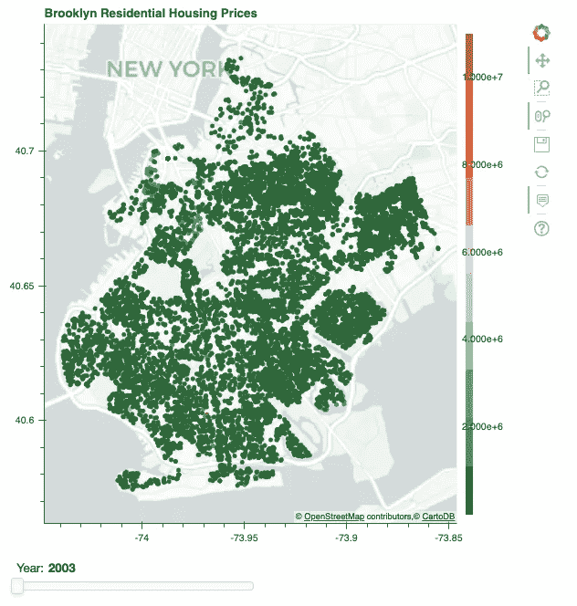

# 绘制布鲁克林的房价图

> 原文：<https://towardsdatascience.com/mapping-housing-prices-in-brooklyn-593d304c4fc?source=collection_archive---------22----------------------->

## 使用散景的地理测绘教程

Photo by [NASA](https://unsplash.com/@nasa?utm_source=unsplash&utm_medium=referral&utm_content=creditCopyText) on [Unsplash](https://unsplash.com/search/photos/new-york-map?utm_source=unsplash&utm_medium=referral&utm_content=creditCopyText)

在他的小说《如何毁灭一座城市》中，P.E .莫斯科维茨写了美国四个城市中产阶级化的影响:新奥尔良、底特律、旧金山和纽约。他认为地理学家尼尔·史密斯发展了自 1979 年以来关于中产阶级化最有影响力的学术理论——租金差距。中产阶级化是可以预见的。它遵循资本主义经济学的基本原则，“投资者会去潜在回报率最高的地方。”通过检查税收数据，人们可以在短时间内确定哪里的建筑可以便宜买到，哪里的建筑可以变得更贵。头奖将会是在一个中产阶级化的社区的几个街区内找到一栋破旧的建筑。关键是一处房产的可购买价格和一旦改造后的价值之间的差距。租金差距越大，建筑物成为目标的可能性就越大。**寻找下一个中产阶级社区的房地产开发商依赖于这样一个事实，即卖家没有意识到潜在的价值。**

[Kaggle](https://www.kaggle.com/) 有很多很棒的数据集，我很幸运地找到了一个很棒的[数据集](https://www.kaggle.com/tianhwu/brooklynhomes2003to2017)关于 2003 年至 2017 年的布鲁克林房屋销售。这些数据来自纽约冥王星的 shapefiles 和大量的空值。每个条目都有一个地址和 X、Y 坐标，这些坐标将这些点标绘成布鲁克林的形状。

我真的很想在布鲁克林的地图上绘制所有的点，并制作一些交互式的可视化，所以我决定与 Bokeh 合作这个项目。

我的第一步是把我所有的 X 和 Y 坐标转换成纬度和经度，这样我就可以把它们转换成正确的墨卡托坐标。因为你的电脑屏幕是平的，而地球不是平的，所以在绘制地图时，散景只接受墨卡托坐标。

It’s a banana.

由于我无法找到一个免费和快速的地理编码资源，我用我所拥有的。我取了 20 个数据点，一次查找一个数据点的经纬度坐标。利用这些坐标，我创建了一个训练数据集，以便通过简单的线性回归来预测其他 25，000 个点的纬度和经度。

自然地，我也对纵坐标重复了这个操作，并将这些值放入它们自己的列中。结果相当准确。当我比较一个随机数据点的估计坐标和实际坐标时，差异只有几个街区。此外，当我标绘最后一组坐标时，水里和公园里都没有房子。

这是一个将你的经纬度坐标转换成墨卡托坐标的函数。

散景图在交互和用户操作方面有很大潜力。你需要用 conda 命令安装 bokeh。要阅读文档和更详细的说明，请点击[这里。](https://bokeh.pydata.org/en/latest/docs/installation.html)以下是开始绘图时需要导入的重要包。

Bokeh 有自己的贴图图块集，允许在没有 shapefiles 或 API 的情况下进行贴图。这对我是一个巨大的加分。他们的牌组在这里列出[。请注意，这里的文档中有一些令人困惑的方向。**导入图块集的正确方法是直接导入。在上面的代码中，您调用包 bokeh.tile_providers 并导入您想要使用的任何样式的地图。**使用 get_provider 或 Vendors 会返回一个错误。有些调色板是列表，有些是字典。确保像这样检查你选择的调色板的数据类型。](https://bokeh.pydata.org/en/latest/docs/reference/tile_providers.html#bokeh-tile-providers)

如果类型是一个列表，那么你只需要定义你的调色板就可以了。如果类型是字典，您必须在下面的第二行代码中指出要使用多少种颜色。

我会把这一大块的所有东西一行一行的分解。我定义了我的调色板，并指出我想要 10 种不同的颜色，这将对应于所售房屋的 10 个不同的价格范围。点击[此处](https://bokeh.pydata.org/en/latest/docs/reference/palettes.html)查看所有调色板散景报价。源被定义为我的数据帧，称为 TwoThree。这是 2003 年以来所有相关的住房数据。

我不仅想在地图上绘制数据来显示位置，还想用颜色来区分更贵的房子和不太贵的房子。映射器是为我的颜色条属性定义的。它需要一个字段名，以及一系列低值和高值。散景有一个伟大的可定制的悬停功能。当鼠标悬停在可视化中的任何一点上时，您可以决定在相应的窗口中会弹出什么信息。我使用变量工具提示来定义我想要显示的内容。每个属性都是标签和数据来源的元组。在这里看文档[。如果数据来自您的数据集，第二个值必须以“@”开头，如果该值来自可视化本身，如索引或图表中的 X 和 Y 坐标，您将在该值前面加上“$”。我添加了一个小部件滑块，以便可视化能够根据所选年份改变和呈现新数据。我将在另一篇教程中更详细地介绍这一点。滑块现在将纯粹是装饰性的。](https://bokeh.pydata.org/en/latest/docs/user_guide/tools.html)

Pretty!

我将图形的 X 轴和 Y 轴定义为墨卡托。这将把墨卡托坐标转换成经纬度坐标，所以它将像一个真正的地图！我称之为工具提示，它是当你在每个点上悬停时出现的值，我给我的图形一个标题。因为这是一张地图，所以我也必须添加我的地图框。

我正在创建一个散点图，所以我只需引用引号中相应的列名，就可以在图中添加圆。颜色将由我的 mapper 变量和我的数据源中的值决定。我创建了一个颜色条作为我的点的键，在它下面我表示我想把我的颜色条放在图表的右边。

我可以将我的布局定义为一行或一列。列会将所有内容上下叠放(从上到下)，而行会将所有内容并排放置(从左到右)。我现在把我的形象放在我的滑块上面。

2003 年，布鲁克林似乎有很多售价低于 200 万美元的房子。事实上，我的很多数据表明，很多房屋售价低于 1000 美元，很可能是因为止赎。

通过缩放功能，我在公园坡找到了一些更贵的房子。2003 年，我敢肯定一些房地产投资者希望在公园坡北部的 Prospect Heights 附近买房。

是的，就在离这个 300 万美元的家几个街区远的地方，有一栋售价 16.5 万美元的房子。

我计划在这个项目上做更多的工作，并将创建至少一个与散景视觉交互的教程。让我知道你喜欢使用哪些绘图可视化工具，为什么。我一定会检查他们！