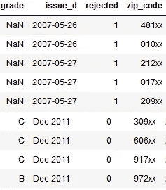

# 使用 Python 分析 Lending Club 贷款-教程

> 原文：<https://towardsdatascience.com/mapping-inequality-in-peer-2-peer-lending-using-geopandas-part-1-b8c7f883d1ba?source=collection_archive---------18----------------------->

## 如何使用 pandas，geopandas，matplotlib 处理来自最大的在线 P2P 贷款平台的信贷。

市场借贷是可能存在歧视或不公平借贷行为的场所。在这个帖子系列中，我们研究了 1935-40 年间的*红线*和今天的 P2P 贷款格局之间的空间相关性。


red —main Redlining cities in the 1930s | green — Lending Club’s highest loan application rejects in 2012 | magenta — Lending Club’s highest interest rates in 2012

# 问题定式化

作为一家[](https://www.fdic.gov/regulations/laws/rules/2000-6000.html)*的平等住房贷款机构，一个 P2P 贷款市场应该“不分种族、肤色、宗教、国籍、性别、残疾或家庭状况”地筛选贷款申请系统性地拒绝来自特定邮政编码的贷款可能会伤害少数族裔申请人。这是一种在 1935 年至 1940 年间被称为**划红线**的做法，当时房主贷款公司或“HOLC”在近 250 个美国城市创建了用颜色标记社区信用价值和风险的地图。这些地图最近被数字化，可以在[映射不等式](https://dsl.richmond.edu/panorama/redlining)上查看。尽管有联邦公平住房法案，现代的红线最近在美国 61 个城市被曝光。另一项调查发现有几家银行显然将一些少数民族排除在他们客户的投资组合之外。*

*我们使用 Python、Pandas、Jupyter Notebook 和 [Geopandas 库](http://geopandas.org)来可视化来自 [Lending Club](http://lendingclub.com/) 的 2400 万份贷款申请，Lending Club【】是世界上最大的 P2P 贷款平台。目的是调查来自 20 世纪 30 年代被划红线的邮政编码的申请者是否更有可能被今天的市场拒绝。如果没有，我们将核实此类贷款申请人是否获得更高的违约利率。我们也想探究这些关系如何在 Lending Club 的整个生命周期中演变，从 2006-2007 年到现在。*

# *标记数据收集*

*[绘制不平等](https://dsl.richmond.edu/panorama/redlining)网站提供了一个选项，可以下载上世纪 30 年代*被划上红线*的所有美国城市的[形状文件](https://en.wikipedia.org/wiki/Shapefile)。shapefiles 包含描述每个城市中的街区(区域)的多边形的地理纬度和经度坐标，因为它们是由 HOLC 划定的。*

```
*import geopandas as gpd
df_redlines_map = gpd.read_file('data/HOLC_ALL.shp')
df_redlines_map.head()*
```

**

*Figure 1*

*每行代表一个具有以下特征的多边形(区域):*

*   **状态*:美国状态，*
*   **城市*:美国城市，*
*   **looplat，looplng* :多边形起始坐标，*
*   **名称*:区域名称，*
*   **holc_id* :区域编号，*
*   **holc_grade* : HOLC(安全)等级，*
*   **area_descr* :区域描述，*
*   **几何*:构建多边形的所有坐标的集合。*

***HOLC 等级**描述了 20 世纪 30 年代分配给该区域的信用价值，如下所示:*

*   *最好的*
*   *b——仍然可取*
*   *c——肯定下降*
*   *D —危险*

*我们清除那些 HOLC 等级无效的多边形。*

```
*df_redlines_map = df_redlines_map[df_redlines_map.holc_grade!='E']*
```

# *红线功能工程*

*在开始我们的分析之前，我们先来看看 HOLC 分配的等级分布，不仅是在每个邮政编码内，而且是在州一级。这需要追溯到 20 世纪 30 年代，对每个地区的人口进行估计。一种简单的方法是使用每个 HOLC 等级的分区数。因为相应多边形的大小变化很大，我们可能无法直观地了解人口数量。因此，我们选择使用区域面积(以平方公里为单位)作为基准单位。*

*我们从**开始计算每个区域**的平方公里面积，以及它的地理中心(“质心”)。*

```
*proj = partial(pyproj.transform, pyproj.Proj(init='epsg:4326'),
               pyproj.Proj(init='epsg:3857'))
df_redlines_map['area'] = [transform(proj, g).area/1e+6 for g in df_redlines_map['geometry'].values]
df_redlines_map['centroid_lat'] = df_redlines_map.geometry.centroid.y
df_redlines_map['centroid_long'] = df_redlines_map.geometry.centroid.x
df_redlines_map.head()*
```

**

*Figure 2*

*我们现在将使用每个区域的*质心*的坐标**来添加每个区域的邮政编码**。为此，我们依赖免费的 Python 库 [uszipcode，](https://pypi.org/project/uszipcode/)，它使用自己最新的地理编码数据数据库对每批 100 个区域进行地理编码。*

```
*from uszipcode import SearchEngine
i = 0
while i < df_redlines_map.shape[0]:
    df_redlines_map.loc[i:i+100,'zipcode'] = df_redlines_map[i:i+100].apply(lambda row: search.by_coordinates(row.centroid_lat,row.centroid_long, radius=30, returns=1)[0].zipcode, axis=1)    
    i = i + 100
df_redlines_map.head()*
```

**

*Figure 3*

*计算每个邮政编码的**总*红线区域*现在很简单。***

```
*df_redlines = df_redlines_map.groupby(['zipcode']).agg({'area': np.sum}).reset_index().rename(columns={'area': 'zip_area'})
df_redlines.head()*
```

**

*Figure 4*

*我们现在可以计算每个州的**总*红线区域*。***

```
*df_redlines_state = df_redlines_map.groupby(['state']).agg({'area': np.sum}).reset_index().rename(columns={'area': 'state_area'})
df_redlines_state.head()*
```

**

*Figure 5*

*使用前面的计算，我们可以获得每个州内 HOLC 等级的**百分比分布。***

```
*df_redlines_state_details = df_redlines_map.groupby(['state','holc_grade']).agg({'area': np.sum}).reset_index().rename(columns={'area': 'holc_area'})
df_redlines_state_details = df_redlines_state_details.merge(df_redlines_state, on='state', how='left')
df_redlines_state_details['holc_ratio'] = df_redlines_state_details.holc_area/df_redlines_state_details.state_area
df_redlines_state_details.head()*
```

**

*Figure 6*

*我们还可以计算每个邮政编码的**相似值。***

```
*df_redlines_details = df_redlines_map.groupby(['zipcode','holc_grade']).agg({'area': np.sum}).reset_index().rename(columns={'area': 'holc_area'})
df_redlines_details = df_redlines_details.merge(df_redlines[['zipcode','zip_area']], on='zipcode', how='left')
df_redlines_details['holc_ratio'] = df_redlines_details.holc_area/df_redlines_details.zip_area
df_redlines_details.head()*
```

**

*Figure 7*

*正如我们将在后面看到的，一些有趣的可视化需要我们将等级值转换成特征。这允许我们计算每个区域内 A、B、C 和 D 分区的**面积比，如下所示。我们用零填充缺失的比率值，以考虑没有 HOLC 区的邮政编码。***

```
*for grade in ['A', 'B', 'C', 'D']:
    df1 = df_redlines_map[df_redlines_map.holc_grade==grade].groupby(['zipcode']).agg({'area': np.sum}).reset_index().rename(columns={'area': grade + '_area'})
    df_redlines = df_redlines.merge(df1, on='zipcode', how='left')
    df_redlines[grade + '_ratio'] = df_redlines[grade + '_area'] / df_redlines.zip_areadf_redlines.fillna(0, inplace=True)*
```

*这些比率帮助我们估计所谓的 **HOLC 拒绝比率**，定义为在 20 世纪 30 年代由于*的红线*而在一个邮政编码内被拒绝的贷款申请的百分比。假设 A 分区申请人的比率为 0%，C 和 D 分区为 100%，B 分区为 90%。我们选择 B 为 90%，因为它接近文献[ ][ ]中的平均拒绝比率。*

```
*df_redlines['holc_reject_ratio'] = (.9*df_redlines.B_ratio + df_redlines.C_ratio + df_redlines.D_ratio)
df_redlines.head()*
```

**

*Figure 8*

# *红线勘探*

*下面的条形图显示，在 20 世纪 30 年代，HOLC 考虑的大多数地区被列为危险区或衰落区。*

```
*redlines_labels = {'grade': ['A', 'B', 'C', 'D'],
                   'desc':['A - Best', 'B - Still Desirable', 'C - Definitely Declining', 'D - Hazardous'],
                   'color': ['g', 'b', 'y', 'r']
         }
fig, ax  = plt.subplots(1,1,figsize=(15,5))
sns.countplot(y='holc_grade',data=df_redlines_map, palette=redlines_labels['color'], ax=ax)
ax.set_title('Count of zones per grade');*
```

**

*Figure 9*

*HOLC 划定的区域通常不太大，不到 5 平方公里。我们注意到很少有表面达到 180 平方公里以下的异常值。*

```
*fig, ax  = plt.subplots(1,1,figsize=(15,5))
sns.boxplot(y="holc_grade", x="area", palette=redlines_labels['color'],data=df_redlines_map, ax=ax)
sns.despine(offset=10, trim=True)
ax.set_title('Distribution of zone areas (km^2) per HOLC grade');*
```

**

*Figure 10*

*根据 HOLC 在 20 世纪 30 年代的分类，阿拉巴马州和堪萨斯州的危险总面积最大。新罕布什尔州和印第安纳州的选区大部分被归类为绝对衰落。*

```
*fig, ax  = plt.subplots(1,1,figsize=(20,5))
sns.barplot(x="state", y="holc_ratio", hue='holc_grade', data=df_redlines_state_details, ax=ax)
ax.set_title('Holc Grade Ratio per state');*
```

**

*Figure 11*

# *贷款特征工程*

*在探索了*红线*数据之后，现在让我们来看看今天的贷款情况。在 2007 年第一季度和 2018 年第二季度之间收到的所有贷款申请都是从 Lending Club 网站下载的。这里引用的项目[的作者向我们提供了合并和清理后的数据](https://sites.google.com/view/cs109alendingclubgroup26fall18)。*

```
*df_loan = pd.read_csv('data/df_reject_ratio_2007-2018.csv')
df_loan.head()*
```

**

*Figure 12*

*每个贷款申请由以下**特征**描述:*

*   **issue_d* :收到申请的日期。*
*   **邮政编码*:申请人(借款人)邮政编码的 3 位数字。出于隐私考虑，Lending Club 不公布完整的邮政编码。*
*   **拒绝*:如果申请被 Lending Club 拒绝，则标志值为 1，否则为 0。*
*   **等级*:表示利率的类别(仅适用于未被拒绝的申请)。*

*根据每一份贷款申请和信用报告，每一笔贷款都被分配一个从 A 到 G 的等级和相应的利率每个贷款等级及其对应的当前利率显示在 [Lending Club 网站](https://www.lendingclub.com/public/rates-and-fees.action)上。*

```
*print('There have been {} loans requests received at Lending Club since 2007, of which {} have been rejected'.format(df_loan.shape[0], df_loan[df_loan.rejected==1].shape[0]))
There have been 24473165 loans requests received at Lending Club since 2007, of which 22469074 have been rejected*
```

*探索大型时间序列的一种常用方法是根据更大的时间单位(如季度)聚合感兴趣的特征。Lending Club 数据的一个问题是 *issue_d* 的格式，对于许多行来说是 YYYY-MM-DD，但是我们也可以找到格式为 b-YYYY 的日期。例如，我们看到 2007 年 5 月 26 日和 2011 年 12 月的行。将日期转换为季度时，最好对每种格式进行不同的处理。*

*具体来说，我们将数据分成两组，每种日期格式一组。*

```
*df1 = df_loan[(df_loan.issue_d.str.len()==10)]
df1['issue_q'] = pd.to_datetime(df1.issue_d, format='%Y-%m-%d').dt.to_period('Q')
df1.head()*
```

**

*Figure 13*

```
*df2 = df_loan[(df_loan.issue_d.str.len()!=10)]
df2['issue_q'] = pd.to_datetime(df2.issue_d, format='%b-%Y').dt.to_period('q')
df2.head()*
```

**

*Figure 14*

*现在，我们可以合并两个数据集。*

```
*df_loan = df1.append(df2)*
```

*我们进一步使用这些数据来计算 **Lending Club 贷款拒绝率，**定义为每个季度每个邮政编码被拒绝的贷款申请的百分比。*

```
*df_loan_reject_ratio = df_loan[['issue_q','zip_code','rejected']].groupby(['issue_q','zip_code']).agg(['count', 'sum'])
df_loan_reject_ratio.columns = df_loan_reject_ratio.columns.droplevel(level=0)
df_loan_reject_ratio = df_loan_reject_ratio.rename(columns={'count':'lc_total_requested', 'sum':'lc_total_rejected'})
df_loan_reject_ratio['lc_total_accepted'] = df_loan_reject_ratio.lc_total_requested - df_loan_reject_ratio.lc_total_rejected
df_loan_reject_ratio['lc_reject_ratio'] = df_loan_reject_ratio.lc_total_rejected/df_loan_reject_ratio.lc_total_requested
df_loan_reject_ratio = df_loan_reject_ratio.reset_index()
df_loan_reject_ratio.head()*
```

**

*Figure 15*

*上面的汇总表给出了每个季度和邮政编码的以下数量:*

*   **lc_total_requested:* 收到的贷款申请数量，*
*   **lc_total_rejected:* 拒绝的贷款申请数，*
*   **lc_total_accepted:* 接受的贷款申请数，*
*   **LC _ reject _ ratio:**LC _ total _ rejected*与 *lc_total_requested 的比率。**

*类似地，我们计算 **Lending Club 贷款等级比率**(每个邮政编码和季度特定利率的贷款百分比)。*

```
*df_loan_grades = df_loan[df_loan.rejected==0][['issue_q','zip_code','issue_d']].groupby(['issue_q','zip_code']).count().reset_index().rename(columns={'issue_d':'total_accepted'})for grade in ['A', 'B', 'C', 'D', 'E', 'F', 'G']:
    df1 = df_loan[(df_loan.rejected==0)&(df_loan.grade==grade)][['issue_q','zip_code','issue_d']].groupby(['issue_q','zip_code']).count().reset_index().rename(columns={'issue_d': 'LC_' + grade + '_accepted'})
    df_loan_grades = df_loan_grades.merge(df1, on=['issue_q','zip_code'], how='left')
    df_loan_grades['LC_' + grade + '_ratio'] = df_loan_grades['LC_' + grade + '_accepted'] / df_loan_grades.total_accepted*
```

**

*Figure 16*

*例如， *LC_A_accepted* 是被接受并被分配利率 A 的申请数量。 *LC_A_ratio* 是相应的百分比。*

# *贷款和标记数据合并*

*我们现在准备合并贷款和*红线*数据，允许我们尝试不同的可视化，并在查看 2007-2018 年的“贷款与红线”时提出有趣的问题。*

*因为 Lending Club 只披露了申请人邮政编码的 5 位数中的 3 位数，所以我们必须根据 **123xx** 邮政编码模式对数据进行汇总和合并。*

```
*df_redlines[‘zip_code’] = df_redlines[‘zipcode’].astype(‘str’)
df_redlines[‘zip_code’] = df_redlines[‘zip_code’].str.pad(5, ‘left’, ‘0’)
df_redlines[‘zip_code’] = df_redlines[‘zip_code’].str.slice(0,3)
df_redlines[‘zip_code’] = df_redlines[‘zip_code’].str.pad(5, ‘right’, ‘x’)
df_redlines_aggr = df_redlines.fillna(0).groupby('zip_code').agg({'zip_area': np.sum, 
'A_area': np.sum, 'B_area': np.sum, 'C_area': np.sum, 'D_area': np.sum, 'A_ratio': np.mean,'B_ratio': np.mean,'C_ratio': np.mean,'D_ratio': np.mean,'holc_reject_ratio': np.mean}).reset_index()df_redlines_aggr.head()*
```

**

*Figure 17*

*上表显示了 HOLC 在 20 世纪 30 年代对 A、B、C 或 D 区域的总面积(km2 ),这些区域由一个 123xx 邮政编码模式表示，其中 123 是 Lending Club 公布的邮政编码数字的代表数字。还提供了每个 HOLC 等级的总面积比以及总 HOLC 剔除率。*

*继续这个聚合的红线数据集，我们现在将添加贷款数据。对于缺少贷款数据或*标记*数据的 123xx 地区，空比率替换为 0。*

```
*df_redlines_loan = df_loan_reject_ratio.merge(df_loan_grades, on=['zip_code','issue_q'], how='left').merge(df_redlines_aggr, on='zip_code', how='left')
df_redlines_loan.issue_q = df_redlines_loan.issue_q.astype('str')
df_redlines_loan.fillna(0, inplace=True)
df_redlines_loan.head()*
```

**

*Figure 18*

# *结果*

*看下面的线图，我们可以看到 Lending Club 平均拒绝的贷款比 HOLC 在 20 世纪 30 年代拒绝的要多。我们可以预料，将来拒收的数量会进一步增加。*

```
*fig, ax = plt.subplots(1,1,figsize=(15,5))
sns.lineplot(x="issue_q", y="lc_reject_ratio",data=df_redlines_loan, ax=ax, label='LendingClub reject ratio')
plt.axhline(df_redlines_loan[df_redlines_loan.holc_reject_ratio>0].holc_reject_ratio.mean(), color='r', label='HOLC reject ratio')
plt.axhline(df_redlines_loan.lc_reject_ratio.mean(), color='black', label='LendingClub reject ratio Average')
plt.xlabel('quater')
plt.ylabel('ratio')
plt.title('Average Loan Reject Ratio over time')
plt.legend()
plt.xticks(rotation=45);*
```

**

*Figure 19*

*下面的散点图显示了 Lending Club 和 HOLC 的贷款拒绝率之间的正相关关系。这表明了以下假设:在 20 世纪 30 年代，HOLC 拒绝大部分或几乎所有贷款的地区，也是 Lending Club 今天可能拒绝大量贷款的地区。*

```
*fig, ax = plt.subplots(1,1,figsize=(15,5))
sns.scatterplot(x=’lc_reject_ratio’, y=’holc_reject_ratio’, data=df_redlines_loan[df_redlines_loan.holc_reject_ratio>0], ax=ax)
plt.title(‘Loan Reject Ratio per zipcode — LendingClub versus HOLC’);*
```

**

*Figure 20*

*如下面的 distplot 所示，Lending Club 拒绝率分布似乎复制了 HOLC 在大面积地区的拒绝率分布，这些地区在 20 世纪 30 年代被划分为*危险*或*明确拒绝*贷款。*

```
*fig, ax = plt.subplots(1,1,figsize=(15,5))
sns.distplot(df_redlines_loan[df_redlines_loan.holc_reject_ratio>0].holc_reject_ratio, color='r', hist = False, kde = True, kde_kws = {'shade': True, 'linewidth': 3}, label='HOLC', ax=ax)
sns.distplot(df_redlines_loan[df_redlines_loan.holc_reject_ratio>0].lc_reject_ratio, color='g', hist = False, kde = True, kde_kws = {'shade': True, 'linewidth': 3}, label='LendingClub', ax=ax)
plt.xlabel('ratio')
plt.title('Loan Reject Ratio Distribution over zipcodes');*
```

**

*Figure 21*

*从下面的热图来看，HOLC 和 Lending Club 特征之间的相关性非常弱。这可能意味着，一般来说，知道一个地区的 HOLC 等级并不能帮助我们自信地预测 Lending Club 的贷款拒绝或贷款利率。*

```
*corr = df_redlines_loan.corr()
mask = np.zeros_like(corr, dtype=np.bool)
mask[np.triu_indices_from(mask)] = True
f, ax = plt.subplots(figsize=(11, 9))
cmap = sns.diverging_palette(220, 10, as_cmap=True)
sns.heatmap(corr, mask=mask, cmap=cmap, vmax=.3, center=0,
            square=True, linewidths=.5, cbar_kws={"shrink": .5})
ax.set_title('Correlation between HOLC and LendingClub');*
```

**

*Figure 22*

*下面的分布图表明，几乎没有贷款俱乐部申请人在*红线区*获得最低利率(A)。大多数申请人获得中等利率(B、C 或 D)。只有少数申请人不得不面对非常高的利率(E、F 或 G)。这种分布表明，Lending Club 在评估信贷冲销风险时可能不会考虑*红线*。*

```
*f = df_redlines_loan[(df_redlines_loan.holc_reject_ratio==1)&(df_redlines_loan.lc_reject_ratio!=1)].sort_values(by='lc_reject_ratio', ascending=False).reset_index()[['zip_code', 'holc_reject_ratio', 'lc_reject_ratio', 'LC_A_ratio', 'LC_A_ratio', 'LC_B_ratio', 'LC_C_ratio', 'LC_D_ratio', 'LC_E_ratio', 'LC_F_ratio', 'LC_G_ratio']]*
```

**

*Figure 23*

# *结论*

*我们的研究为借贷俱乐部的现代划红线提供了一些证据。1930 年代的红线图和今天的贷款俱乐部接受贷款请求和评估违约风险的政策之间存在内在联系的假设仍然有效。*

*Lending Club 使用的数据中有一些不公平算法或历史偏见的迹象。从我们的探索性数据分析中可以清楚地看到这一点，尤其是 HOLC 拒绝率和 Lending Club 拒绝率之间的正线性趋势。*

*感谢您阅读至此。*

*在本系列文章的第二部分中，我们将使用 Geopandas 在美国的地理地图上显示红线区域、贷款拒绝率和贷款利率分布。这将包括一个用于空间时间序列可视化的 choropleth 地图动画，显示 2007 年至 2018 年间 peer-2-peer lending 的地理景观在*红线*方面如何演变。*

## *文献学*

> *库特曼切，c .，斯诺登，K. (2011 年)。修复抵押贷款危机:HOLC 贷款及其对当地住房市场的影响。《经济史杂志》,第 71 卷第 2 期，第 307-337 页。*
> 
> *[ ]菲什巴克，p .，弗洛雷斯-拉古内斯，a .，霍拉斯，w .，坎特，s .，特雷伯。J. (2010)。20 世纪 30 年代房主贷款公司对住房市场的影响。金融研究评论，24(6)，1782 年至 1813 年。*