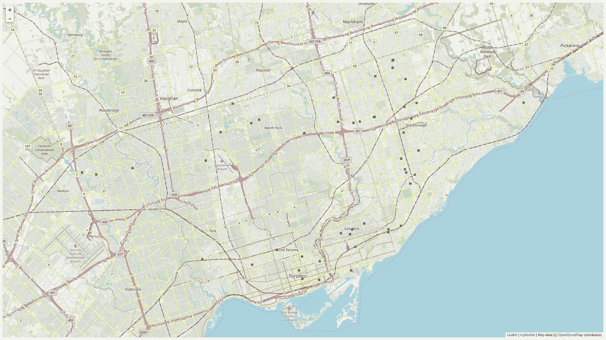

# 使用 Python 绘制多伦多已报告坑洞的位置图

> 原文：<https://towardsdatascience.com/mapping-locations-of-reported-pot-holes-in-toronto-using-python-376402d8da53?source=collection_archive---------19----------------------->

## 通过开放数据从 311 多伦多收集数据，用于可视化报告的坑洞。

欢迎来到我的第一个教程，可视化多伦多周围的坑洞的位置。我叫 Mumtahin，是一名数据科学专家，目前在加拿大支付行业工作。数据分析和数据科学项目的最大技能包括理解数据准备。为分析/研究收集数据所需的工作量因手头的任务而异。本教程的目的是提供清理数据和图形化表示数据的基本介绍，因为这是我日常工作的一个重要方面。

对于本教程，我们将从由 [open data](https://www.toronto.ca/city-government/data-research-maps/open-data/open-data-catalogue/#e2634d40-0dbf-4d91-12fa-83f039307e93) (由多伦多市维护)提供的可公开访问的 API 端点获取 JSON 格式的结构化数据。你可以通读这篇文章，并了解一步一步的过程，或者如果你熟悉下面的概念，请随意使用我的 Github [资源库](https://github.com/mmonzoor/introductory_pot_hole_viz)中的 Jupyter 笔记本进行自己的探索！

## 入门指南

对于本教程，请确保您安装了 Python 3 版本。我用的是 Python 3.6.6。

如果您想安装并运行我的 Jupyter 笔记本，请确保您已经安装了 Jupyter 笔记本。关于设置 Jupyter 笔记本的简短的初学者友好教程，请点击[这里](https://medium.com/codingthesmartway-com-blog/getting-started-with-jupyter-notebook-for-python-4e7082bd5d46)。

## 安装所需模块

*   熊猫(我用的是 0.24.1 版本)
*   matplotlib(我使用的是 3.0.2 版本)
*   mpl 传单

## 导入模块

## 构建我们的查询

我们有一个由 311 多伦多提供的 API 端点命中。首先，我们需要构造一个查询，其参数反映了我们实际需要的信息。我们将要连接的 API 包含了各种主题的数据，例如垃圾收集、涂鸦清除和其他城市服务的报告数据，以及我们想要的实际坑洞数据。对我们来说，查询是没有意义的，而且可能会使服务器陷入困境，去获取我们一开始就不想要的信息。

到目前为止，我们知道些什么？我们知道我们只需要与报告的坑洞相关的数据。根据 311 发布的 README 文档并查看开放数据目录，我们还了解到以下信息:

*   API 记录限制:一次 1000 条记录
*   坑洞修复请求有一个服务代码:c rowr-12
*   jurisdiction_id 将始终为“toronto.ca”
*   agency_responsible:始终设置为 311 Toronto
*   service_notice:未退回
*   邮政编码:未返回

我们需要什么？

*   我们需要决定开始和结束日期范围来构造我们的查询。

## 选择日期范围并使用 API 限制

当决定一个日期范围时，很难选择一个有意义的时间向我们展示有价值的结果。因为我们的分析是关于坑洞的，一些关于坑洞成因的先验知识会有所帮助。在深度冻结和解冻期间，会导致路面出现裂缝，这是造成坑洞的原因。当我写这篇文章的时候，多伦多正在经历冰冻和解冻的时期，导致这个城市经历了比平常更高的报告。基于这些知识，查看最近 4 个月的数据会很有趣。

假设我们需要 4 个月的数据，记住为 API 响应设置的最大记录限制是很重要的。311 Toronto API 在其响应对象中有 1000 条记录的限制。使用 API 时有大小限制或速率限制是相当常见的。这是一种确保 311 Toronto 的服务器不会因试图满足大量请求而过载的方法，并且可以提供良好的服务质量。为了遵守 1000 条记录的限制，我首先抽查了不同月份的记录总数。我发现一个月的平均数据低于 1000 条记录的限制。考虑到最近该城市的报告比平时多，我们的数据可能会受到限制，但我们仍然应该有足够的数据点用于我们的可视化。我们将我们的日期范围(4 个月)划分为 29 天的时间段，并对这 29 天的每个时间段进行同步请求。

现在我们有了一个将日期分块的函数，我们将继续选择开始和结束日期。我们知道，在冬末和春季的冰冻和解冻季节，坑洞是有问题的。知道了这一点，看看今年冬天的数据会很有趣，因为我们有一些交替的寒冷和温暖的日子。我们在下面定义了我们的日期参数，但是你可以随意从我的 Github 中获取这个笔记本，并更改日期以获得更多信息。如果您在我的存储库中运行该笔记本，或者基于本教程创建您自己的版本，请随意调整日期范围。

使用上面写的函数，我们有一个反映日期范围块的日期列表。从这个列表中，我将把每个偶数索引项作为我的开始日期，每个奇数索引项作为我的结束日期。

```
[datetime.datetime(2018, 11, 1, 0, 0),
 datetime.datetime(2018, 11, 30, 0, 0),
 datetime.datetime(2018, 12, 1, 0, 0),
 datetime.datetime(2018, 12, 30, 0, 0),
 datetime.datetime(2018, 12, 31, 0, 0),
 datetime.datetime(2019, 1, 29, 0, 0),
 datetime.datetime(2019, 1, 30, 0, 0),
 datetime.datetime(2019, 2, 28, 0, 0),
 datetime.datetime(2019, 3, 1, 0, 0),
 datetime.datetime(2019, 3, 4, 0, 0)]
```

我们在上面的输出中看到，第一个范围是 2018–11–01 到 2018–11–30。第二个范围是 2018–12–01 到 2018–12–30 等等。我们看到每个偶数位置(0，2，4 等。)是开始日期，奇数位置的项目是结束日期。

## 提出 API 请求

基本网址:[https://secure.toronto.ca/webwizard/ws/requests.json?](https://secure.toronto.ca/webwizard/ws/requests.json?)

使用 311 自述文件中已知的参数，我们可以添加 service_code、jursidiction _ id、start_date 和 end_date 等参数。我们的 API 请求将从上面获取每个开始和结束日期范围分区。我们总共会做 5 个。

现在我们有了一个巨大的列表(data_clob ),其中包含了返回结果的嵌套 JSON，我们看到每个条目都以关键字“service_requests”开头。我们对每个“服务请求”的价值感兴趣。

## 查看熊猫数据框架中的数据

熊猫可以从 csv、字典、列表、SQL 查询等一系列格式中读取您的数据，并将其放入数据框中。如果您研究这个数据框架，您可以看到我们有一些重要的列，如 long(经度)和 lat(纬度)。

## 更多清洁

根据自述文件中的信息，我们可以删除以下几列:“机构 _ 责任”、“服务 _ 通知”和“邮政编码”。



## 计算所需的调查天数和维修天数

我们可以根据“requested_datetime”和“updated_datetime”之间的时间差来计算调查报告的预计天数。“expected_datetime”似乎表示修补坑洞的预期日期，但它通常由一个固定的日期值填充。对于某些报告，我不确定这种自动填充背后的原因是什么。

在下面的要点中，我获取 requested_datetime、updated_datetime 和 expected_datetime 的字符串日期值，并使用 pandas 的 to_datetime 方法将其转换为 datetime 对象(第 4、5 和 6 行)。

一旦我们有了数据框架，我们就可以计算调查和维修所需的平均天数。使用这些平均值，我们设置一个阈值来决定服务请求是慢还是快。

使用上面的分类，我们用 mplleaflet 对应的经度和纬度来绘制坑洞的位置。

*   比平均响应/调查慢(地图上的蓝点)
*   比平均响应/调查更快(地图上的黑点)
*   比平均修复速度慢(地图上的红色方块)
*   比平均修复速度更快(地图上的绿色方块)

上面的文件保存为 HTML 格式，其中包含我们最终的可视化。

您可以在这里查看互动结果:[http://www.mmonzoor.com/pot_holes.html](http://www.mmonzoor.com/pot_holes.html)

## 结论

到目前为止，我们已经学习了如何使用 JSON 对象等结构化数据，通过 GET 请求进行 API 调用，使用 pandas 清理数据，以及通过 matplotlib 可视化清理后的数据。现在你有了一个清晰的数据框架，可以随意调查你可能对你的城市有疑问的问题。如果你所在的城市有像 311 Toronto 这样的开放数据目录，试着模仿这个教程，也许你会发现一些有趣的见解！我希望这个教程是有帮助的，我愿意尽我所知回答任何问题，所以请随意评论。

## GitHub 知识库

[](https://github.com/mmonzoor/introductory_pot_hole_viz) [## mmonzoor/introductive _ pot _ hole _ viz

### 在 GitHub 上创建一个帐户，为 mmonzoor/introductive _ pot _ hole _ viz 开发做贡献。

github.com](https://github.com/mmonzoor/introductory_pot_hole_viz)