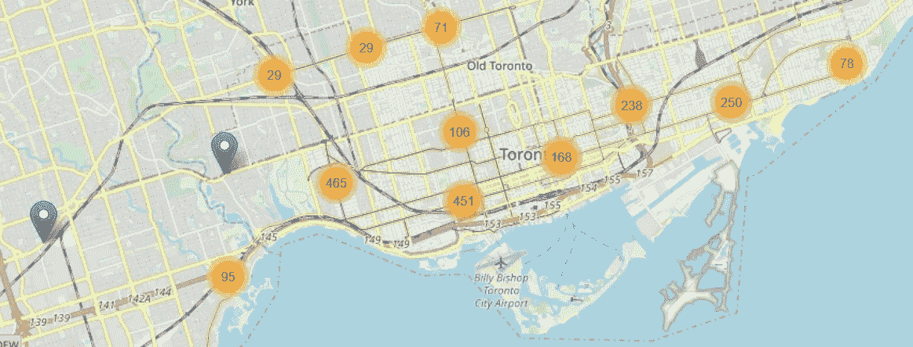
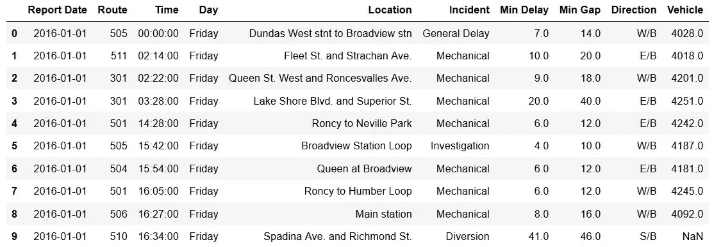
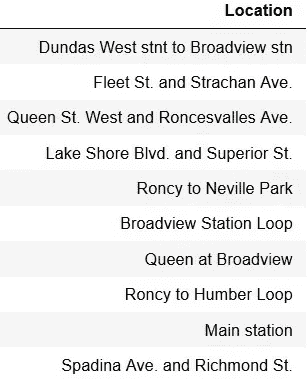
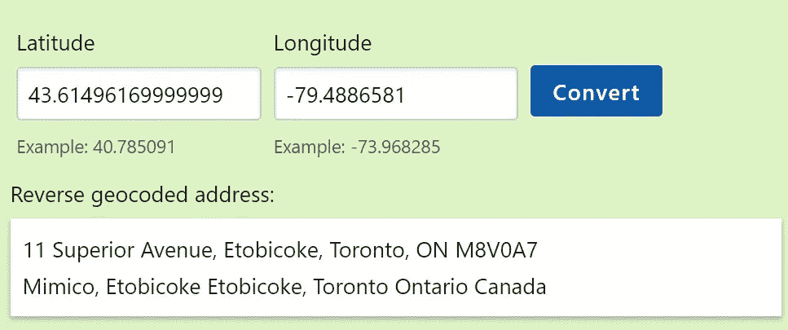
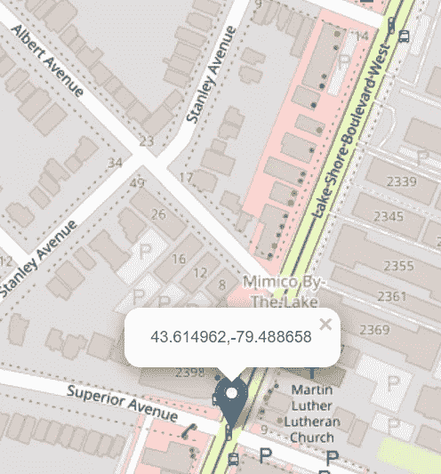
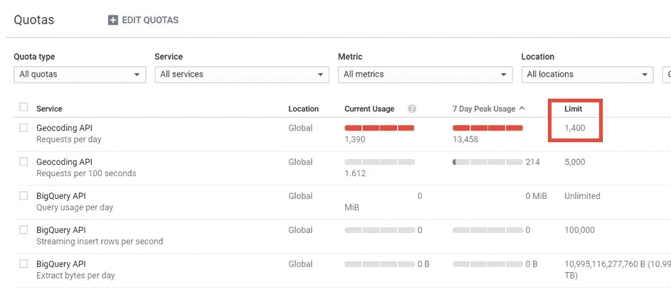
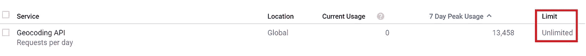
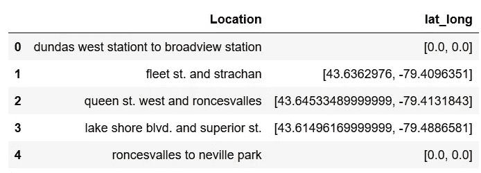
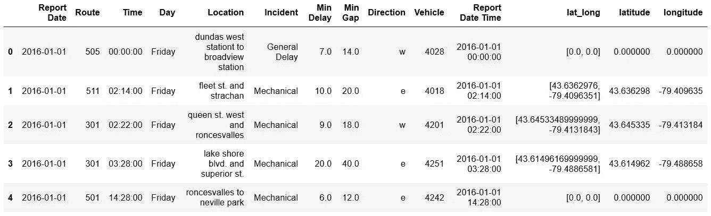

# 映射混乱的地址第 1 部分:获取纬度和经度

> 原文：<https://towardsdatascience.com/mapping-messy-addresses-part-1-getting-latitude-and-longitude-8fa7ba792430?source=collection_archive---------11----------------------->



我的家乡多伦多有幸拥有北美唯一一个大型有轨电车网络，它在战后的街头铁路仇杀中幸存了下来。多伦多的有轨电车是整个快速交通系统的重要组成部分。然而，他们有一个明显的弱点——如果一辆电车被堵了，其他电车就不可能绕过它，所以电车延误有可能引发交通堵塞。我一直在研究一个模型，该模型使用[一个公开的关于有轨电车延误信息的数据集](https://www.toronto.ca/city-government/data-research-maps/open-data/open-data-catalogue/#e8f359f0-2f47-3058-bf64-6ec488de52da)来预测和帮助防止这种延误。


Streetcar delays can cause gridlock (photo by author)

电车延误数据集包括自 2014 年 1 月以来系统中每次延误的详细信息，包括延误的时间、持续时间和位置。



Streetcar delay dataset

## 问题是:杂乱的地址

位置字段完全是非结构化的-交叉点以多种格式表示(“Queen and Sherbourne”、“queen/sherbourne”)，街道和地标的指示不一致。



例如，单个地标可能出现在具有多个不同位置值的数据集中:

*   朗塞斯瓦勒斯场
*   朗西场
*   朗克。车房。

我需要可视化延迟的位置，以了解网络的哪些部分最容易出现拥堵。为了可视化位置，我需要将它们转换成纬度和经度值。在本文中，我描述了如何从输入数据集中杂乱的位置获取纬度和经度值。在本系列的[下一篇文章](https://medium.com/@markryan_69718/mapping-messy-addresses-part-2-insights-from-folium-bafd55858faf)中，我将描述如何使用这些纬度和经度值来生成地图以可视化延迟模式。

## 解决方案第 1 部分:清理位置值以减少冗余

在尝试获取纬度和经度值之前，我开始对位置值进行一些老式的清理，包括:

*   将所有位置值设置为小写

*   替换用多个字符串表示的公共值，包括不一致的街道名称，并对所有交汇点使用一致的连接:

*   应用一个函数为交叉点处的街道名称提供一致的顺序，以避免冗余，如“皇后和宽景”/“宽景和皇后”:

这些简单的清理将唯一位置的数量减少了 35%，从 15.6 k 减少到 10 k 多一点。正如我们将看到的，减少唯一位置的数量意味着对 API 进行更少的调用来将位置转换为经度和纬度值。Google 地理编码 API 每 k 次调用的成本为 5.00 美元，所以我通过减少唯一位置的数量节省了 25 美元。

## 解决方案第 2 部分:使用 Google 地理编码 API 获取纬度和经度值

我决定使用 Google 地理编码 API 来获取纬度和经度值。这一过程没有我预想的那么简单，我希望如果您使用地理编码 API，您可以从我学到的经验中受益，如下所述。

以下是我在从 Python 调用地理编码 API 之前必须采取的步骤:

*   在 Google Cloud 中建立一个项目。我按照说明[这里](https://medium.com/giscle/setting-up-a-google-cloud-instance-for-deep-learning-d182256cb894)。
*   查看地理编码 API [介绍材料](https://developers.google.com/maps/documentation/geocoding/start)，并按照其中的说明(1)为您的谷歌云项目激活地理编码 API，以及(2)获取地理编码 API 的 API 密钥
*   查看用于谷歌地图服务的 [Python 客户端](https://github.com/googlemaps/google-maps-services-python)自述文件，了解如何从 Python 调用地理编码 API 的说明

要准备从 Python 调用地理编码 API:

1.  安装客户端

```
! pip install -U googlemaps
```

2.将您的 API 键与地理编码 API 客户端相关联，并调用地理编码 API 获取已清理数据集中的样本地址:“lake shore blvd. and superior st .”请注意，传递给地理编码 API 的地址包括数据集中的位置和城市(数据集中所有位置的城市均为“多伦多”)。

3.[检查返回的纬度和经度](https://www.latlong.net/Show-Latitude-Longitude.html)以确认它与输入地址匹配:



Latitude and longitude returned by the Geocoding API match the input location

既然我们已经验证了从位置值到纬度/经度再回到地址的往返过程，那么在我们能够转换整批位置值之前，还有一些障碍需要克服。

## 障碍#1:地理编码 API 在看似无辜的位置值上受阻

地理编码 API 阻塞了一些位置值，但不是我预期的位置值。我天真地试图通过发送垃圾地址“asdfasdfjjjj”来测试 API，并得到非空的 JSON:

然而，当我试图转换一批位置时，它在一个看起来不错的位置值上失败了:“roncesvalles to neville park”

为了可靠地转换一批位置，我必须将地理编码 API 调用封装在一个函数中，该函数检查返回的列表是否为空，如果是，则返回占位符值:

## 障碍 2:默认的每日 API 限制对于我需要转换的一批位置来说太小了

使用定义为可靠地调用地理编码 API 的 **get_geocode_result** 函数，我准备好进行批处理运行来转换位置值。为了最小化对 API 的调用，我定义了一个新的数据帧 **df_unique** ，它只包含唯一的位置值:

然而，当我调用 **get_geocode_result** 函数向 **df_unique** 数据帧添加纬度和经度值时:

我收到以下错误消息:

在谷歌云控制台中检查我的项目的[配额页面](https://console.cloud.google.com/project/_/apiui/apiview/geocoding_backend/quotas)，我可以看到我每天对地理编码 API 的调用限制只有 1400 次。这就是为什么当我试图为值超过 10k 的 df_unique 数据帧调用 API 时，会出现 OVER_QUERY_LIMIT 错误。



为了增加我对这个项目的地理编码 API 调用的每日限额，我必须向 Google Cloud support 开一张罚单，要求提高我对地理编码 API 的每日限额:



## 进行批处理运行以将位置转换为经度和纬度

随着我的每日地理编码 API 限制的提高，我能够在 **df_unique** 数据帧上无错误地调用 API。1.5 小时后(表示大约 110 次 API 调用/分钟)，我得到了一个数据帧，其中包括所有不同位置的纬度和经度值:



接下来，我在 df_unique 数据帧中创建不同的经度和纬度列，然后用 df_unique 连接原始数据帧:

最后，我有一个数据帧，包含所有原始数据以及与位置值对应的纬度和经度值:



## 摘要

下面总结了获取纬度和经度值以对应原始数据集中所有混乱位置所需的步骤:

1.  清理原始数据集以移除冗余位置并减少唯一位置的数量
2.  通过[在 Google Cloud](https://medium.com/giscle/setting-up-a-google-cloud-instance-for-deep-learning-d182256cb894) 中创建一个项目，获取一个 API 密钥，并为 Google Maps 服务设置 [Python 客户端，设置 Python 对 Google 地理编码 API 的访问](https://github.com/googlemaps/google-maps-services-python)
3.  使用地址(位置和城市)调用地理编码 API，并解析返回的 JSON 以获得纬度和经度。检查返回空列表的 API，如果您要转换的不同位置的数量大于默认的每日限制，请使用 Google Cloud 支持打开一个票证以获得增加的每日 API 限制。

在本系列的下一篇文章[中，我将描述如何使用这些纬度和经度值来生成地图，以可视化来自原始数据集的延迟模式。](https://medium.com/@markryan_69718/mapping-messy-addresses-part-2-insights-from-folium-bafd55858faf)

如果您想亲自尝试本文中描述的代码:

*   将位置转换为纬度和经度的主要笔记本是这里的。您将需要获得自己的 API 密钥来运行它。
*   你可以在这个笔记本上使用的输入数据帧的一个例子是这里的。请注意，该数据帧中的位置值已经被清除(小写，街道名称以一致的顺序),如上文**解决方案第 1 部分:清除位置值以减少冗余**一节所述。