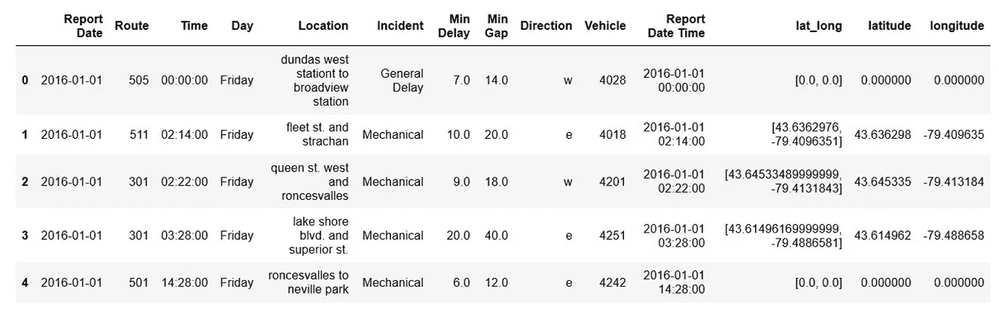
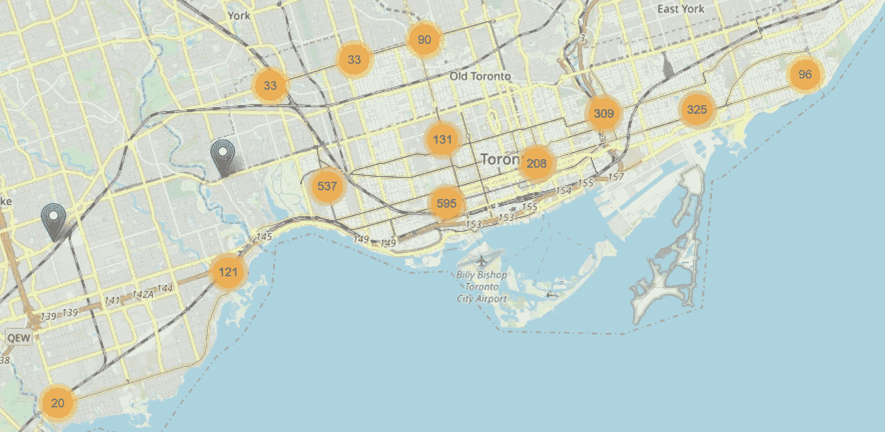

# 绘制混乱的地址第 2 部分:来自叶的见解

> 原文：<https://towardsdatascience.com/mapping-messy-addresses-part-2-insights-from-folium-bafd55858faf?source=collection_archive---------12----------------------->

Toronto streetcar delay heat map

在本系列第一篇文章的[中，我描述了](/mapping-messy-addresses-part-1-getting-latitude-and-longitude-8fa7ba792430)[多伦多有轨电车延迟数据集](https://www.toronto.ca/city-government/data-research-maps/open-data/open-data-catalogue/#e8f359f0-2f47-3058-bf64-6ec488de52da)，并经历了从具有不精确、混乱的位置值的原始数据集获取所需的步骤:

到包含所有位置的纬度和经度值的数据帧:

在本文中，我将回顾使用第一篇文章中的纬度和经度值获得延迟数据的地图可视化的步骤。

## 映射镜头 1:像素化灰尘

我第一次尝试可视化包括纬度和经度的数据集时，我决定使用[像素化数据](https://github.com/pixiedust/pixiedust/wiki/Tutorial:-Using-Notebooks-with-PixieDust-for-Fast,-Flexible,-and-Easier-Data-Analysis-and-Experimentation)。

安装并导入 Pixiedust 后，显示数据框:

使用键**纬度**和**经度**和数值**最小延迟**:

选择简单的聚类风格，我得到如下的地图:

Some streetcar delay locations are obviously not correct

来自 Pixiedust 可视化的一些观察:

*   加纳以南的大西洋中的值位于本初子午线和赤道的交点(纬度/经度= 0.0/0.0)。在这些位置，地理编码 API 返回一个空列表，上一篇文章中描述的 **get_geocode_result** 函数[返回一个占位符值。](/mapping-messy-addresses-part-1-getting-latitude-and-longitude-8fa7ba792430)
*   在绘制的 10 k 个位置中，超过 97k 个位于多伦多地区，并且是有轨电车延迟的潜在有效地点。

*   除了多伦多地区的 9.7 k 个位置和[0.0，0.0]处的 238 个值之外，在世界其他地方有 43 个位置明显不符合有轨电车延迟的有效地点。

This “Toronto” streetcar is in San Francisco, but the dataset only covers Toronto (photo by author)

说完，我基本上用尽了我能用 Pixiedust 得到的东西。虽然 Pixiedust 没有给我想要的一切，但它确实提供了一些非常快速的见解，有助于节省时间。

## 贴图拍摄 2:叶子

在穷尽了我可以从 Pixiedust 获得的东西之后，我转向了[follow](https://python-visualization.github.io/folium/)，这是一个在 Python 的上下文中很容易利用 fleet . js 库的设施的库。

Pixiedust 可视化显示有轨电车网络上存在合法延迟位置之外的值。为了准备使用，我删除了位于有轨电车网络边界之外的记录。这将数据集的大小减少了 6.5%，只有 65 k 条记录。

Bounding box for valid streetcar delays

您可能想知道为什么街道网格不与边界框对齐。多伦多街道网格大致垂直于市中心的安大略湖海岸线，因此网格相对于由纬度和经度定义的边界框向左扭曲[。](http://glaikit.org/2010/03/10/torontos-angles/)

回到代码—现在我们已经准备好安装和导入 Folium 了:

然后，我们可以创建一个简单的映射，显示数据集中前 2.5 k 条记录的延迟聚类:

这是生成的地图，它让我们了解了城市不同区域延误的相对集中程度:

我们可以放大到西部市区。注意女王街西的热点，在巴瑟斯特和奥辛顿之间，由三一贝尔伍兹公园南边的伯爵指示。

放大来仔细观察热点，很明显，公园南面的皇后区和斯特拉坎区是吸引延误的地方。在这个例子中，全市 7%的延误发生在这个十字路口。

既然我们已经查看了集群，让我们修改集群视图的代码，以显示延迟持续时间的热图视图:

这是整个系统的样子:

如果我们放大到市中心的中心部分，延误的集中是显而易见的，包括巴瑟斯特、斯帕迪纳和海湾与皇后码头交汇处的湖泊附近的三个不同的热点。

## 结论

通过[的上一篇文章](/mapping-messy-addresses-part-1-getting-latitude-and-longitude-8fa7ba792430)和这篇文章，我已经描述了从杂乱的自由格式地址到纬度和经度，再到使用 leav 的有用地图可视化的旅程。这些可视化提供了对数据的深入了解，例如街车延误热点的位置，这些数据很难从原始数据集中提取。

如果您想探索本文中描述的代码:

*   本文描述的笔记本是[这里](https://github.com/ryanmark1867/manning/blob/master/streetcar_data-geocode-visualize.ipynb)
*   输入数据集在这里是[这里是](https://raw.githubusercontent.com/ryanmark1867/manning/master/2014_2018_df_cleaned_keep_bad_loc_geocoded_apr23.csv)