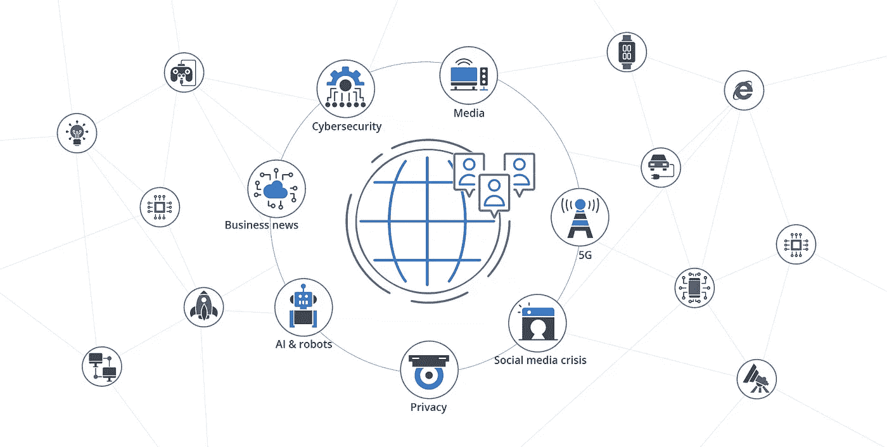
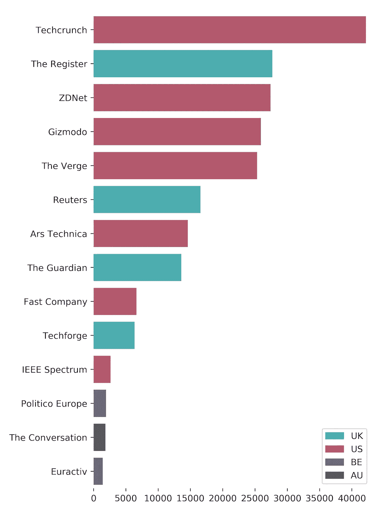
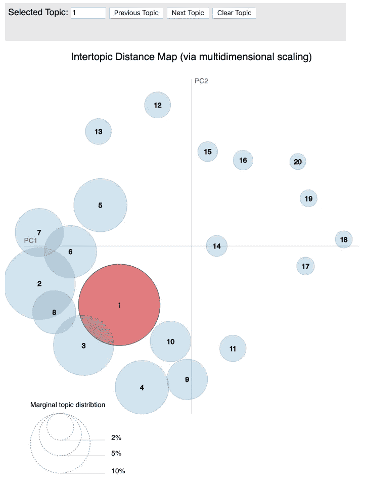
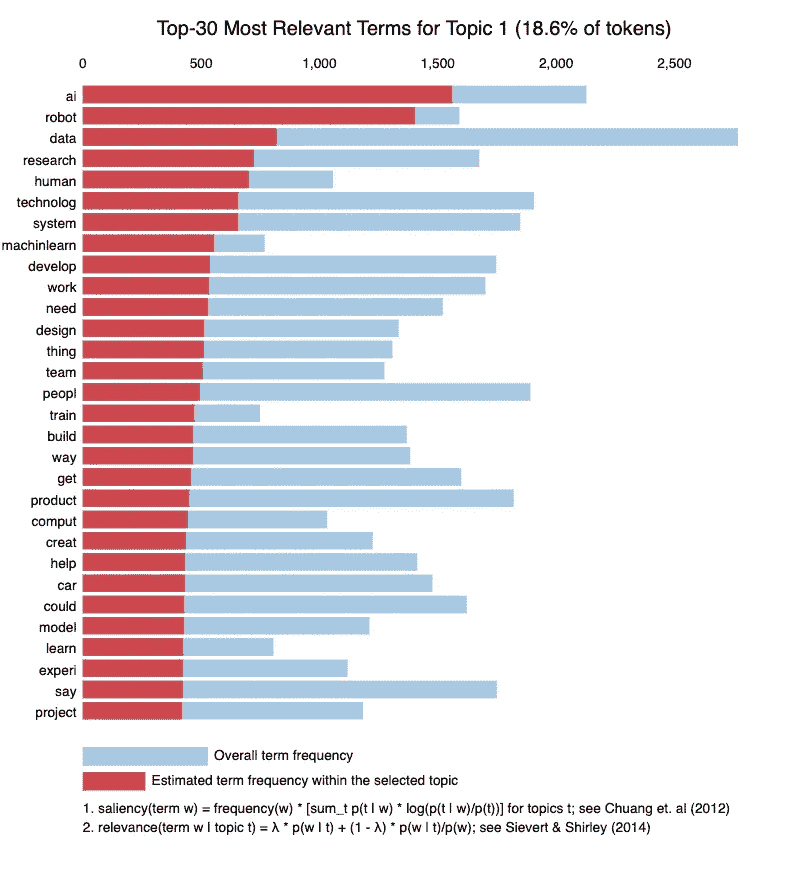

# 用主题建模描绘技术世界

> 原文：<https://towardsdatascience.com/mapping-the-tech-world-with-topic-modelling-bfc3c40af507?source=collection_archive---------31----------------------->

## 我们用流行的话题建模算法 LDA 分析了 20 万篇科技新闻文章

*克里斯托夫·乔迪、祖卡斯·纳瓦罗、米查什·帕利斯基、马切伊·维拉莫夫斯基(德拉布·UW，华沙大学)*

Image by: DELab UW

> 作为 [NGI 前进](https://research.ngi.eu)项目的一部分，[德拉布·UW](http://www.delab.uw.edu.pl/pl/)正在支持欧盟委员会的[下一代互联网](https://www.ngi.eu)计划，确定与互联网相关的新兴技术和社会问题。我们的团队一直在尝试各种自然语言处理方法，以发现不同类型的在线媒体中的趋势和隐藏模式。您可以在这里找到我们的工具和演示文稿。

这篇文章展示了我们对科技新闻的最新分析结果。我们有两个主要目标:

1.  在讨论新兴技术和社会问题的新闻中发现最重要的话题，
2.  来映射这些主题之间的关系。

我们的文本挖掘练习基于由 213 000 篇科技媒体文章组成的科技新闻数据集。数据收集时间为 40 个月(2016 年 1 月 1 日至 2019 年 4 月 30 日)，包括文章的纯文本。如图所示，出版商位于美国、英国、比利时和澳大利亚。关于数据集的更多信息可以在我们的 [Zenodo 知识库](https://zenodo.org/communities/ngi_forward/)中获得。

Sources by number of articles and country

在这篇简短的介绍中，我们关注一种广泛使用的文本挖掘方法:潜在狄利克雷分配(LDA)。LDA 因其易用性、灵活性和可解释的结果而广受欢迎。首先，我们为所有非技术读者简要解释算法的基础。在文章的第二部分，我们展示了 LDA 在一个足够大的数据集上可以实现什么。

# 皱胃向左移

文本数据是高维的。在最基本的形式中，它通常被表示为单词包(BOW)矩阵，其中每行是一个文档，每列包含一个单词在文档中出现的频率。这些矩阵可通过线性代数方法进行转换，以发现其中隐藏的(潜在的和低维的)结构。

主题建模假设文档(如新闻文章)包含各种不同的主题。例如，报道剑桥分析丑闻的新闻文章可能包含以下主题:社交媒体、政治和技术法规，具有以下关系:60%社交媒体、30%政治和 10%技术法规。另一个假设是，主题包含特征词汇，例如，*社交媒体*主题由脸书、推特等词描述。

LDA 是由 [Blei 等人(2003)](http://www.jmlr.org/papers/volume3/blei03a/blei03a.pdf) 基于贝叶斯统计提出的。该方法的名称提供了它的关键基础。潜在来自于文档包含我们事先不知道的潜在主题的假设。分配表明我们将单词分配给主题，将主题分配给文档。狄利克雷是一个多项式似然分布:它提供了任何数量的结果的联合分布。例如，狄利克雷分布可以描述野生动物园中观察到的物种的出现([唐尼，2013](https://www.goodreads.com/book/show/18711042-think-bayes) )。在 LDA 中，它描述了主题在文档中的分布，以及词在主题中的分布。

主题建模方法背后的基本机制很简单:假设文档可以由有限数量的主题描述，我们试图从由特征词组成的主题组合中重建我们的文本。更准确地说，我们旨在通过两个矩阵的组合来重新创建我们的 BOW 单词-文档矩阵:包含文档中主题的狄利克雷分布的矩阵(主题-文档矩阵)，以及包含主题中的单词的矩阵(单词-主题矩阵)。最终矩阵的构建是通过一个叫做吉布斯采样的过程实现的。Gibbs 抽样背后的思想是将改变逐字引入两个矩阵:改变文档中所选单词的主题分配，并评估这种改变是否改进了我们文档的分解。在所有文档中重复 Gibbs 抽样的步骤提供了提供样本的最佳描述的最终矩阵。

关于主题建模的更多细节，我们推荐[这个](https://medium.com/analytics-vidhya/topic-modeling-using-lda-and-gibbs-sampling-explained-49d49b3d1045)和[这个](https://medium.com/nanonets/topic-modeling-with-lsa-psla-lda-and-lda2vec-555ff65b0b05)的优秀帖子。关于这项研究的完整技术描述，请阅读我们的[完整报告](https://fwd.delabapps.eu/topic_modelling.html#Methods-technical-description)。

# 结果

主题建模最重要的参数是主题的数量。主要目标是达到令人满意的主题分离水平，即主题既不是所有问题都集中在一起，也不是过于分散的问题。为了实现这一点，我们试验了不同的 LDA 超参数水平。对于有 20 个主题的设置，主题是平衡的和可分离的。

因此，我们确定了 20 个主要主题，呈现在下面的可视化中。每个圆圈代表一个主题(大小反映了主题在文档中的流行程度)，距离由词汇的相似性决定:共享相同单词的主题彼此更接近。在第二个图中，条形代表当前所选主题的特有术语(对于图示，主题 1。被选中)。一对重叠的条表示给定术语在语料库范围内的频率，以及其特定主题的频率。我们设法达到逐渐减小的主题大小:最大的主题占 19%，第五个 8%，第十个 5%。

要探索呈现结果的交互式可视化，请点击[此处](https://mpalinski.github.io/ngi-fwd-deliv/)。

For the interactive visualisation see: [https://mpalinski.github.io/ngi-fwd-deliv/](https://mpalinski.github.io/ngi-fwd-deliv/)

在研究了这些最相关的术语后，我们用最接近的总括术语标记了每个主题。经过仔细检查，我们将话题数量减少到了 17 个(话题 5 和 16 成为了联合类别*太空技术*，话题 10 &和 19 被融合在一起形成了一个关于*媒体的话题*，而话题 14 &和 15 则专注于 *CPU 和其他硬件*)。在接下来的章节中，我们将简要介绍已确定的主题。

## 话题一: **AI &机器人**

人工智能和机器人构成了最大的主题，约占所有令牌的 19%，其特点是机器学习术语(例如*训练数据*)以及流行的人工智能应用(*机器人、自动驾驶汽车*)。

## 话题 2:社交媒体危机

社交媒体话题也同样普遍，涵盖了现代社交媒体平台( *facebook* 、 *twitter* )有争议的方面，如隐私权、内容节制、用户禁令或选举干预使用微目标(例如:*隐私*、*禁令*、*选举*、*内容*、*删除*)。

## 话题三:**商业新闻**

大量科技文章报道了商业新闻，尤其是在主要平台(T0)、T2 亚马逊、云计算(T4 AWS、T5)等服务或物联网、区块链 T9 等新兴技术上。主题词也暗示了对科技公司财务结果的高度关注(*收入*、*亿*、*销售*、*增长*)。

## 主题 4:智能手机

主题 4 涵盖了关于 522 亿美元智能手机市场的文章。两大制造商——三星和苹果——以同样的出场次数名列关键词列表之首。文章重点介绍设备的特点、参数及提供的附加服务(*摄像头*、*显示器*、 *alexa* 等)。).

## 主题 5 和 16:空间

对太空探索的兴奋在科技媒体中很常见。这些主题包括关于美国国家航空航天局、未来的火星和月球任务以及致力于空间技术的公司的报告，如 SpaceX。

## 主题 6:隐私

主题 6 围绕剑桥分析隐私丑闻展开，并在语料库中收集该关键词的所有提及内容。英国退出欧盟公投期间，剑桥分析公司(Cambridge Analytica)参与公投脱欧运动是一个主要焦点，诸如 *eu* 和 *uk* 等关键词的高位表明了这一点。不出所料，在处理加州争议后果的文章中也经常提到 GDPR。

## 话题七:**网络安全**

主题 7 涉及网络空间安全问题。它探索恶意软件和系统漏洞的主题，既针对传统的计算机系统，也针对基于区块链的新型分散技术。

## 主题 8: 5G

备受期待的第五代无线网络具有巨大的潜力，可以通过 ICT 组件改变所有领域。话题 8 涉及向市场提供 5G 技术的全球竞争(*华为*、*爱立信*)。它还捕捉到了关于 5G 对网络中立性的影响的争论。5G 的主要质量是实现信号的“分段”，这就引发了一场争论，即根据网络中立法，它是否能像前几代移动通信一样被对待。

## 话题九:**跨平台**

主题 9 的重点是操作系统，包括移动( *ios* 、 *android* )、桌面( *windows* 、 *macos* )以及专用服务(浏览器 *chrome* 、 *mozilla* )和应用商店( *appstore* )。

## 主题 10 和 19:媒体

媒体主题围绕最重要的媒体平台:流媒体和社交媒体。2018 年，全球视频流媒体市场规模约为 370 亿美元，音乐流媒体在此基础上又增加了 90 亿美元，占音乐行业收入的近一半。特别是，本主题关注主要的流媒体平台( *youtube* 、*网飞*、 *spotify* )、社交媒体( *facebook* 、 *instagram* 、 *snapchat* )、播客的日益流行以及流媒体服务的商业策略(*订阅*、*广告*)。

## 话题 11:微软

在其 40 年的历史中，微软已经进行了 200 多次收购。其中一些被认为是成功的(如 LinkedIn、Skype)，而另一些则不那么成功……(诺基亚)。话题 11 收集了描述微软近年来完成、计划和失败的收购的文章( *github* 、 *skype* 、 *dropbox* 、 *slack* )。

## 话题 12: **自动驾驶汽车**

自主交通是公众辩论的一个重要话题。决策者应该考虑是否应用补贴或税收来平衡这项技术的公共和私人成本和利益。视听技术为社会福利提供了巨大利益的可能性——拯救生命；减少撞车、拥堵、油耗和污染；增加残疾人的行动能力；并最终改善土地利用([兰德，2016](https://www.rand.org/pubs/research_reports/RR443-2.html.) )。专题 12 阐述了该技术的技术缺陷(*电池*)以及积极的外部性，如降低排放( *epa* 、*排放*)。

## 话题 13:特斯拉

LDA modelling 已经将特斯拉和其他 Elon Musk 项目确定为一个单独的主题。除了特斯拉电动汽车和自动驾驶汽车的发展，该主题还包括与其他移动解决方案相关的词汇(如 Lime)。

## 主题 14 和 15: **CPU 和其他硬件**

主题 14 涵盖英特尔和 AMD 之间的 CPU 创新竞赛，以及因国家安全问题被 Donald Trump 阻止的 Broadcom-高通收购事件。主题 15 包括关于各种标准( *usb-c* )、存储设备( *ssd* )等的新闻。

## 主题 17:初创企业

主题 17 集中于创业生态系统和众包融资。文章讨论了创业战场或创业小巷等主要创业竞赛，以及 Patreon 等众筹服务。

## 话题 18: **可穿戴设备**

我们观察到可穿戴设备的采用激增，如健身追踪器、智能手表或增强和虚拟现实耳机。这一趋势带来了重要的政策问题。一方面，可穿戴设备在监测健康方面提供了巨大的潜力。另一方面，它可能会被对用户隐私和个人数据访问的担忧所掩盖。专题 18 中的文章讨论了可穿戴设备领域关于新设备、新功能等的新闻。( *fitbit* ，*心率*)。

## 话题 20: **博彩**

主题 20 涉及博彩业。它涵盖了流行游戏(*口袋妖怪*)、游戏平台(*任天堂*)、各种游戏控制台( *switch* )和游戏博览会( *e3* )。

# 结论

我们通过主题建模提供了技术世界的鸟瞰图。主题建模是探索广泛主题的适当基础，如社交媒体危机、人工智能或商业新闻。在这个阶段，我们能够确定引发公众辩论的主要总括主题。

我们的[完整报告](https://fwd.delabapps.eu/topic_modelling.html#Results-qualitative-analysis)还包括另一种机器学习方法:t-SNE。在这种算法的帮助下，我们创建了一个新闻的二维地图，其中涉及相同主题的文章是邻居。