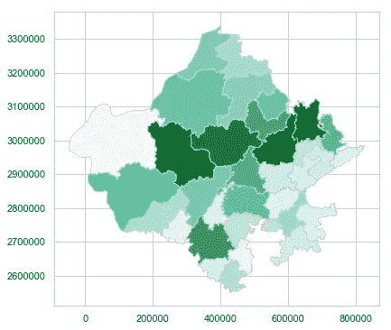

# 使用 Python 中的 Matplotlib、Pandas、Geopandas 和底图进行制图

> 原文：<https://towardsdatascience.com/mapping-with-matplotlib-pandas-geopandas-and-basemap-in-python-d11b57ab5dac?source=collection_archive---------0----------------------->

作为 FORSK TECHNOLOGIES， 的一名实习生，我探索了相当多的 Python 库(Matplotlib、Pandas、Numpy、Seaborn、Shapefile、Basemap、Geopandas ),它们对绘制数据(某种程度上也是实时数据)很有帮助..)过地图。


# 用 Python 绘制地理地图

在处理数据科学时，可视化地图上的数据非常有用，这可以通过 geopandas 等模块来完成。在这里，我们将探索使用 [shapefiles](https://en.wikipedia.org/wiki/Shapefile) ()创建地理地图并在其上可视化数据的方法。shp)和其他一些 Python 库。

在这里，我们将根据地图上的可视化数据来研究拉贾斯坦邦的城市人口。

本文所需的 shapefile 可以从这个链接下载 [**点击这里**](https://www.arcgis.com/home/item.html?id=acb8cb18e7cd45c982086b6ef2bb5a62)

**安装 Shapefile 库**

```
*~ conda/pip install pyshp*
```

**导入库**

```
*import numpy as np
import pandas as pd
import shapefile as shp
import matplotlib.pyplot as plt
import seaborn as sns*
```

**初始化可视化集**

```
*sns.set(style=”whitegrid”, palette=”pastel”, color_codes=True) sns.mpl.rc(“figure”, figsize=(10,6))*
```

**打开矢量地图**

矢量地图是一组具有. shp 格式的文件。

```
*#opening the vector map**shp_path = “\\District_Boundary.shp”**#reading the shape file by using reader function of the shape lib**sf = shp.Reader(shp_path)*
```

shp.reader 导入的不同形状的数量

```
*len(sf.shapes())*
```

结果将是 33，这告诉我们有 33 个形状，或者我们可以说拉贾斯坦邦地区的城市。

要浏览这些记录:

```
*sf.records()*
```


A sample output

要浏览特定记录，其中 1 是 Id 或行号，0 表示列:

```
***sf.records()[1][0]***
```

**结果-**

```
Output= Barmer
```

**将形状文件数据转换为熊猫数据帧:**

通过将 shapefile 数据转换为更相关的 Pandas Dataframe 格式，使访问城市变得更加容易。

```
**def read_shapefile(sf):**
    #fetching the headings from the shape file
    fields = [x[0] for x in sf.fields][1:]#fetching the records from the shape file
    records = [list(i) for i in sf.records()]
    shps = [s.points for s in sf.shapes()]#converting shapefile data into pandas dataframe
    df = pd.DataFrame(columns=fields, data=records)#assigning the coordinates
    df = df.assign(coords=shps)
    return df
```

数据转换为数据帧后的可视化，其中数据帧指的是行和列

```
*df = read_shapefile(sf)****df.shape***
```

具有(33，6)形状的数据帧意味着其中有 33 行和 6 列。

**让我们看看创建的数据帧的示例**

```
*# sample of a data representation the last point has the coordinates of the data latitude and longitude which will be used to create a specific map shape****df.sample(5)***
```

结果会是这样的—


Output

这里的线是用来创建地图的纬度和经度。

**借助 Matplotlib** 绘制拉贾斯坦邦的城市地图或特定形状

#a)根据城市坐标绘制形状(多边形),

#b)计算并返回该特定形状的中点(x0，y0)。

#此中点也用于定义打印城市名称的位置。

```
**def plot_shape(id, s=None):**
    plt.figure()
    #plotting the graphical axes where map ploting will be done
    ax = plt.axes()
    ax.set_aspect('equal')#storing the id number to be worked upon
    shape_ex = sf.shape(id)#NP.ZERO initializes an array of rows and column with 0 in place of each elements 
    #an array will be generated where number of rows will be(len(shape_ex,point))and number of columns will be 1 and stored into the variable
    x_lon = np.zeros((len(shape_ex.points),1))#an array will be generated where number of rows will be(len(shape_ex,point))and number of columns will be 1 and stored into the variable
    y_lat = np.zeros((len(shape_ex.points),1))
    for ip in range(len(shape_ex.points)):
        x_lon[ip] = shape_ex.points[ip][0]
        y_lat[ip] = shape_ex.points[ip][1]#plotting using the derived coordinated stored in array created by numpy
    plt.plot(x_lon,y_lat) 
    x0 = np.mean(x_lon)
    y0 = np.mean(y_lat)
    plt.text(x0, y0, s, fontsize=10)# use bbox (bounding box) to set plot limits
    plt.xlim(shape_ex.bbox[0],shape_ex.bbox[2])
    return x0, y0
```

**设置城市名称以绘制各自的地图**

```
*DIST_NAME = ‘JAIPUR’**#to get the id of the city map to be plotted**com_id = df[df.DIST_NAME == ‘JAIPUR’].index.get_values()[0]****plot_shape(com_id, DIST_NAME)****sf.shape(com_id)*
```


Output

> 为了绘制特定的形状，我们必须知道特定城市的 ID，但是将 shapefile 文件数据更改为 Pandas dataframe 使工作变得更加容易和简单，现在我们可以直接调用它的名称。

**绘制全图**

这个特殊的函数将所有使用坐标制作的单个形状组合起来，并显示为一个组合形状。

```
def plot_map(sf, x_lim = None, y_lim = None, figsize = (11,9)):
    plt.figure(figsize = figsize)
    id=0
    for shape in sf.shapeRecords():
        x = [i[0] for i in shape.shape.points[:]]
        y = [i[1] for i in shape.shape.points[:]]
        plt.plot(x, y, 'k')

        if (x_lim == None) & (y_lim == None):
            x0 = np.mean(x)
            y0 = np.mean(y)
            plt.text(x0, y0, id, fontsize=10)
        id = id+1

    if (x_lim != None) & (y_lim != None):     
        plt.xlim(x_lim)
        plt.ylim(y_lim)*#calling the function and passing required parameters to plot the full map****plot_map(sf)***
```


**绘制缩放地图**

```
*y_lim = (2900000,3000000) # latitude**x_lim = (200000, 400000) # longitude****plot_map(sf, x_lim, y_lim)***
```


output

**在完整的地图上突出显示一个单一的形状**

结合以前的功能就可以了。我们可以在一张完整的地图上画出一个形状。ID 和颜色代码将是该功能的必需参数。

```
**def plot_map_fill(id, sf, x_lim = None, 
                          y_lim = None, 
                          figsize = (11,9), 
                          color = 'r'):**

    plt.figure(figsize = figsize)
    fig, ax = plt.subplots(figsize = figsize)
    for shape in sf.shapeRecords():
        x = [i[0] for i in shape.shape.points[:]]
        y = [i[1] for i in shape.shape.points[:]]
        ax.plot(x, y, 'k')

    shape_ex = sf.shape(id)
    x_lon = np.zeros((len(shape_ex.points),1))
    y_lat = np.zeros((len(shape_ex.points),1))
    for ip in range(len(shape_ex.points)):
        x_lon[ip] = shape_ex.points[ip][0]
        y_lat[ip] = shape_ex.points[ip][1]
    ax.fill(x_lon,y_lat, color)

    if (x_lim != None) & (y_lim != None):     
        plt.xlim(x_lim)
        plt.ylim(y_lim)*#plot_map_fill(0, sf, x_lim, y_lim, color=’y’)****plot_map_fill(13, sf,color=’y’)***
```


Desired Output

**用城市 ID 在整个地图上突出显示多个形状**

在这个函数的帮助下，作为参数，我们可以给出多个城市的 ID，这将导致突出显示多个城市而不是 1 个。

```
**def plot_map_fill_multiples_ids(title, city, sf, 
                                               x_lim = None, 
                                               y_lim = None, 
                                               figsize = (11,9), 
                                               color = 'r'):**

    plt.figure(figsize = figsize)
    fig, ax = plt.subplots(figsize = figsize)
    fig.suptitle(title, fontsize=16)
    for shape in sf.shapeRecords():
        x = [i[0] for i in shape.shape.points[:]]
        y = [i[1] for i in shape.shape.points[:]]
        ax.plot(x, y, 'k')

    for id in city:
        shape_ex = sf.shape(id)
        x_lon = np.zeros((len(shape_ex.points),1))
        y_lat = np.zeros((len(shape_ex.points),1))
        for ip in range(len(shape_ex.points)):
            x_lon[ip] = shape_ex.points[ip][0]
            y_lat[ip] = shape_ex.points[ip][1]
        ax.fill(x_lon,y_lat, color)

        x0 = np.mean(x_lon)
        y0 = np.mean(y_lat)
        plt.text(x0, y0, id, fontsize=10)

    if (x_lim != None) & (y_lim != None):     
        plt.xlim(x_lim)
        plt.ylim(y_lim)
```

让我们看看地图是什么样子的

```
*#naming the id numbers of the cities to be coloured**city_id = [0, 1, 2, 3, 4, 5, 6]****plot_map_fill_multiples_ids(“Multiple Shapes”,******city_id, sf, color = ‘g’)***
```


**通过城市名称在整个地图上突出显示多个形状**

最近，我们遇到了用城市 ID(索引)突出显示形状的问题，但尽管我们的数据是熊猫数据框架，我们也可以通过提到城市名称来做到这一点。

```
# plotting the city on the map to be coloured by using the dist_name**def plot_cities_2(sf, title, cities, color):**

    df = read_shapefile(sf)
    city_id = []
    for i in cities:
        city_id.append(df[df.DIST_NAME == i.upper()]
                         .index.get_values()[0])
    plot_map_fill_multiples_ids(title, city_id, sf, 
                                       x_lim = None, 
                                       y_lim = None, 
                                       figsize = (11,9), 
                                       color = color);
```

让我们来看看输出

```
*south = [‘jaipur’,’churu’,’bikaner’]**plot_cities_2(sf, ‘DIST’, south, ‘c’)*
```


**绘制热图**

这是一种根据提供的值用不同强度的特定颜色填充形状的地图。它以地理格式提供清晰的数据解释。

在第一个函数中，我们将把我们的数据列表划分为区间或箱，其中每个箱将具有特定的颜色强度，6 个箱和 4 个不同的颜色托盘。

```
**def calc_color(data, color=None):**
        if color   == 1: 
            color_sq =  ['#dadaebFF','#bcbddcF0','#9e9ac8F0','#807dbaF0','#6a51a3F0','#54278fF0']; 
            colors = 'Purples';
        elif color == 2: 
            color_sq = ['#c7e9b4','#7fcdbb','#41b6c4','#1d91c0','#225ea8','#253494']; 
            colors = 'YlGnBu';
        elif color == 3: 
            color_sq = ['#f7f7f7','#d9d9d9','#bdbdbd','#969696','#636363','#252525']; 
            colors = 'Greys';
        elif color == 9: 
            color_sq = ['#ff0000','#ff0000','#ff0000','#ff0000','#ff0000','#ff0000'];

        else:           
            color_sq = ['#ffffd4','#fee391','#fec44f','#fe9929','#d95f0e','#993404']; 
            colors = 'YlOrBr';
        new_data, bins = pd.qcut(data, 6, retbins=True, 
        labels=list(range(6)))
        color_ton = []
        for val in new_data:
            color_ton.append(color_sq[val]) 
        if color != 9:
            colors = sns.color_palette(colors, n_colors=6)
            sns.palplot(colors, 0.6);
            for i in range(6):
                print ("\n"+str(i+1)+': '+str(int(bins[i]))+
                       " => "+str(int(bins[i+1])-1))
            print("\n\n   1   2   3   4   5   6")    
        return color_ton, bins;
```

函数 plot_cities()和 plot_map_fill_multiples_ids 应进行调整，以利用这种新的颜色方案:

```
**def plot_cities_data(sf, title, cities, data=None,color=None, print_id=False):**

    color_ton, bins = calc_color(data, color)
    df = read_shapefile(sf)
    city_id = []
    for i in cities:
        city_id.append(df[df.DIST_NAME == 
                            i.upper()].index.get_values()[0])
    plot_map_fill_multiples_ids_tone(sf, title, city_id, 
                                     print_id, 
                                     color_ton, 
                                     bins, 
                                     x_lim = None, 
                                     y_lim = None, 
                                     figsize = (11,9));**def plot_map_fill_multiples_ids_tone(sf, title, city,  
                                     print_id, color_ton, 
                                     bins, 
                                     x_lim = None, 
                                     y_lim = None, 
                                     figsize = (11,9)):** 
    plt.figure(figsize = figsize)
    fig, ax = plt.subplots(figsize = figsize)
    fig.suptitle(title, fontsize=16)
    for shape in sf.shapeRecords():
        x = [i[0] for i in shape.shape.points[:]]
        y = [i[1] for i in shape.shape.points[:]]
        ax.plot(x, y, 'k')

    for id in city:
        shape_ex = sf.shape(id)
        x_lon = np.zeros((len(shape_ex.points),1))
        y_lat = np.zeros((len(shape_ex.points),1))
        for ip in range(len(shape_ex.points)):
            x_lon[ip] = shape_ex.points[ip][0]
            y_lat[ip] = shape_ex.points[ip][1]
        ax.fill(x_lon,y_lat, color_ton[city.index(id)])
        if print_id != False:
            x0 = np.mean(x_lon)
            y0 = np.mean(y_lat)
            plt.text(x0, y0, id, fontsize=10)
    if (x_lim != None) & (y_lim != None):     
        plt.xlim(x_lim)
        plt.ylim(y_lim)
```

让我们举一个例子，以热图演示格式绘制数据。

```
*names= [‘jaipur’,’bikaner’,’churu’,’bhilwara’,’udaipur’]**data = [100, 2000, 300, 400000, 500, 600, 100, 2000, 300, 400, 500, 600, 100, 2000, 300, 400, 500, 600]**print_id = True # The shape id will be printed**color_pallete = 1 # ‘Purple’****plot_cities_data(sf, ‘Heat map of given cities’, names, data, color_pallete, print_id)***
```


**绘制真实数据**

绘制拉贾斯坦邦地区的人口图，这里指的是真实数据。

```
*# reading data set
census_17 = df.POPULATION**census_17.shape**#plotting**title = ‘Population Distrubution on Rajasthan Region’**data = census_17**names = df.DIST_NAME****plot_cities_data(sf, title, names, data, 1, True)***
```


希望你已经理解了通过 Python 库绘制地图的概念。

具体代码可以参考我的[***GITHUB***](https://github.com/ashwanidhankhar/Forsk/blob/master/Day4%2C5/geomap.py)。

# 使用 Geopandas 制图


我们已经看到了用 Pandas 数据帧进行制图的过程，现在轮到用 Geopandas 数据帧对其进行可视化了。Geopandas 简化了 Python 中地理空间数据(包含地理成分的数据)的处理。它结合了熊猫和 shapely 的功能，通过运行一个更紧凑的代码。这是开始制作 choropleth 地图的最好方法之一。

让我们先通过 Geopandas 绘制一些地图，然后在上面绘制拉贾斯坦邦的人口！

上一主题中使用的 Shapefile 足以进一步用于 Geopandas。

**安装**

```
conda install geopandas
```

**第一步是导入所需的库**

```
import pandas as pd
import matplotlib.pyplot as plt
import geopandas as gpd
```

**获取感兴趣的数据**

作为印度最大的邦，拉贾斯坦邦是一个人口高度密集的邦。绘制人口地图将使可视化更加简单和高效。让我们设置路径，通过 Geopandas 打开 Rajasthan 地区的 shapefile。

```
# set the filepath and load
fp = “\\District_Boundary.shp”#reading the file stored in variable fp
map_df = gpd.read_file(fp)# check data type so we can see that this is not a normal dataframe, but a GEOdataframe**map_df.head()**
```


让我们预览一下地图

```
#plotting the map of the shape file preview of the maps without data in it
**map_df.plot()**
```


现在是时候打开包含要绘制的数据的 CSV 文件了。在这里，我们也可以为所需的数据制作一个 csv，但我只从 shapefile 中提取数据，而不是制作 csv 或在 web 上搜索，这样可以节省大量时间。

```
#opening the csv(.shp) file which contains the data to be plotted on the map
df = gpd.read_file(\\District_Boundary.shp”)df.head()#selecting the columns required
df = df[[‘DIST_NAME’,’POPULATION’]]#renaming the column name
data_for_map = df.rename(index=str, columns={‘DIST_NAME’: ‘DISTRICT’,‘POPULATION’: ‘POP’})
```

让我们预览一下地理数据框架

```
# check dat dataframe
**data_for_map.head()**
```


现在，让我们将地理数据与数据集连接起来

```
# joining the geodataframe with the cleaned up csv dataframe
merged = map_df.set_index(‘DIST_NAME’).join(data_for_map.set_index(‘DISTRICT’))#.head() returns the top 5(by default ) lines of the dataframe
**merged.head()**
```


Output after merging datasets

**映射时间**

首先，我们需要为 Matplotlib 绘制地图做一些预先要求的工作，如设置变量、范围和为地图创建基本图形。

```
# set a variable that will call whatever column we want to visualise on the map
variable = ‘POP’# set the range for the choropleth
vmin, vmax = 120, 220# create figure and axes for Matplotlib
fig, ax = plt.subplots(1, figsize=(10, 6))
```

**创建地图的时间**

```
merged.plot(column=variable, cmap=’BuGn’, linewidth=0.8, ax=ax, edgecolor=’0.8')
```



这就是我们想要的，地图已经准备好了！但是需要一些美化和定制。

```
# remove the axis
ax.axis(‘off’)# add a title
ax.set_title(‘Population of Rajasthan’, fontdict={‘fontsize’: ‘25’, ‘fontweight’ : ‘3’})# create an annotation for the data source
ax.annotate(‘Source: Rajasthan Datastore, 2019’,xy=(0.1, .08), xycoords=’figure fraction’, horizontalalignment=’left’, verticalalignment=’top’, fontsize=12, color=’#555555')
```

颜色条是地图中必不可少的东西，它告诉我们要寻找的参数，让我们为我们的地图定制它。

```
# Create colorbar as a legend
sm = plt.cm.ScalarMappable(cmap=’BuGn’, norm=plt.Normalize(vmin=vmin, vmax=vmax))# empty array for the data range
sm._A = []# add the colorbar to the figure
cbar = fig.colorbar(sm)#saving our map as .png file.
fig.savefig(‘map_export.png’, dpi=300)
```


您可能已经知道为什么使用 Geopandas 进行制图更好了。它有一个非常紧凑和简单的代码，并给出了一个很好的期望输出。通过这种方法，我们可以绘制任何地区的任何类型的数据。

关于 th **e** 的确切代码，请参考我的 [***GITHUB***](https://github.com/ashwanidhankhar/Forsk/blob/master/DAY%209%20Rajasthan/map_geopandas_rajasthan.py) 。

# 使用底图制图


Matplotlib 底图工具包是一个用于在 Python 中的地图上绘制 2D 数据的库。底图本身不进行任何绘图，但提供了将坐标转换为 25 种不同地图投影之一的工具。 [Matplotlib](http://matplotlib.sourceforge.net/) 用于在转换后的坐标中绘制轮廓、图像、矢量、线或点。提供了海岸线、河流和政治边界数据集，以及绘制它们的方法。

在本节中，您将了解如何通过底图工具包在地图上绘制数据。

让我们通过底图工具包来查看地图可视化。

**安装**

```
conda install basemap
conda install basemap-data-hires
```

**导入库**

```
import numpy as np
import matplotlib.pyplot as plt
from mpl_toolkits.basemap import Basemap
import geopandas as gpd
import pandas as pd
```

> 注意:如果在导入底图库时遇到任何困难或错误(PROJ_LIB ),您可以直接设置其路径，以便在导入底图之前导入并运行它。

```
#to import the basemap library give the direct path to the libraryimport os
os.environ["PROJ_LIB"]="C:\\Users\\Anaconda3\\Library\\share"
```

让我们从 csv 和 shapefile 中获取感兴趣的数据。以下是下载所需 csv 文件的链接 [**点击此处**](https://github.com/ashwanidhankhar/Forsk/blob/master/Day10%20Rajasthan/latlong_raj.csv) 和所需 shapefile】点击此处

```
city=gpd.read_file("F:\\District_Boundary.shp")
csv=pd.read_csv("\\latlong_raj.csv")
```

我们从加载数据开始。Lat-long 是从一个单独的 csv 中导入的，其他数据如地区名称及其人口来自。在前面部分下载的 shp 文件。

```
lat=csv['LAT'].values
lon=csv['LONG'].values
population = city['POPULATION'].values
dist=city['DIST_NAME'].values
```

> 这些数据已经被保存为一个 numpy 数组，你可以通过[ *type(lat)]* 来检查它。

**接下来，我们设置地图投影，散布数据，然后创建一个颜色栏**

```
fig = plt.figure(figsize=(8, 8))
m = Basemap(projection='lcc', resolution='h', 
            lat_0=27.0238, lon_0=74.2179,
            width=1.05E6, height=1.2E6)
m.shadedrelief()
```

我们的地图背景现在已经准备好了，可以在上面绘制数据。印度拉贾斯坦邦的 lat-long 已经用“lcc”投影设置了一定的缩放量，以便只聚焦特定的状态。


我们来给它添加一些细节，划分一下界限。

```
m.drawcoastlines(color='blue',linewidth=3)
m.drawcountries(color='gray',linewidth=3)
m.drawstates(color='gray')
```


现在是时候在地图投影上散布数据并设置颜色条了。

```
# scatter city data, with c reflecting population
m.scatter(lon,lat, latlon=True,
          c=population,s=700,
          cmap='YlGnBu_r', alpha=0.5)#create colorbar 
plt.colorbar(label=r'Population')
plt.clim(300000, 4000000)
```


看起来是不是少了点什么？是啊！当然，区名。我们无法通过这种投影来识别地区。

**让我们把它们画出来。**

> 我们在上面的变量中存储了地区名称及其经度，但是我们将数据存储为 numpy 数组，所以我们需要将它们存储在列表或字典中。

```
dict1={}
list1=[]
list2=[]
list3=[]
n=0#storing each value in different lists
for z in lat:
    list1.append(z)
for c in lon:
    list2.append(c)
for b in dist:
    list3.append(b)#storing the values of lat long in a dictionary with lat as keys and long as values    
while(n<len(list1)):
    dict1[list1[n]]=list2[n]
    n+=1
```

现在，lat-long 已被存储到字典(dict1)和区名列表(list3)中。让我们用它们来命名区域。

```
i=0# Map (long, lat) to (x, y) for plotting
#naming the cities of Rajasthan with the help of their lat(z)long(c)for z,c in dict1.items():
    x,y = m(c, z)
    plt.plot(x, y, 'ok', markersize=5)
    plt.text(x, y,list3[i], fontsize=10);
    i+=1
```


参考我的[***GITHUB***](https://github.com/ashwanidhankhar/Forsk/blob/master/Day10%20Rajasthan/basemap_rajasthan.py)获取 th **e** 确切代码。

这就是了。感谢您的阅读。

有关 Geopandas、Basemap 的更多信息，或者您想了解 Python、ML、DL、AI、IoT 等行业趋势技术，请联系 Forsk Technologies。