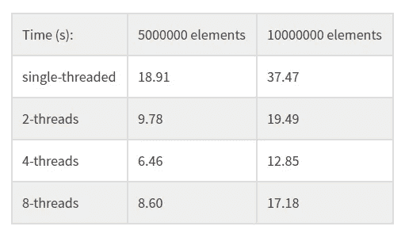
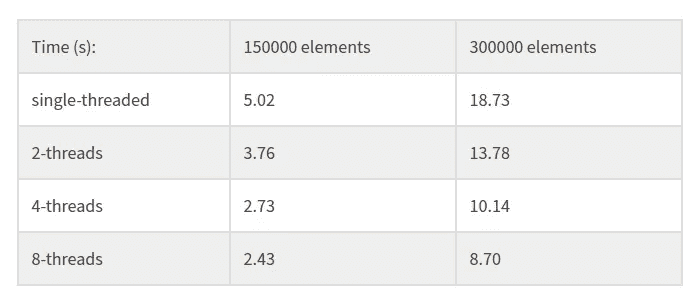

# 使用线程在 C 中从头开始使用 MapReduce:Map

> 原文：<https://towardsdatascience.com/mapreduce-in-c-from-scratch-using-threads-map-c6b1b01f020c?source=collection_archive---------17----------------------->


Source: [Pixabay](https://pixabay.com/photos/knowledge-book-library-glasses-1052011/)

Hadoop 的 MapReduce 不仅仅是一个框架，还是一种解决问题的哲学。

借鉴函数式编程，MapReduce 团队意识到很多不同的问题可以分成两种常见的操作: **map** ，和 **reduce** 。

**映射**和**缩减**步骤都可以并行**完成**。

这意味着只要你能以那种特定的方式**框定你的问题**，就会有一个解决方案，它可以很容易地并行运行。这通常会大大提升**性能**。

这听起来不错，并行运行通常是一件好事，尤其是在大规模工作时。但是，坐在后面的一些人可能会想，什么是**地图**和**减少**？

# 什么是 MapReduce？

为了理解 MapReduce 框架，我们需要了解它的两个基本操作: **Map** 和 **Reduce** 。

它们都是高阶函数:也就是说，它们是可以把其他函数作为自变量的函数。

具体来说，当您需要将 A 类型的某个元素序列转换为 B 类型的一个结果或一系列结果时，您将:

*   将你所有的输入映射到不同的域:这意味着你将用一个选择的函数来转换它们，并应用到每个元素。
*   根据某种标准对映射的元素进行分组，通常是一个分组关键字。
*   **用其他函数减少每个组上的映射元素。这个函数需要两个参数并返回一个相同类型的参数，连续运行一个**累加器**和集合中每个值之间的运算。它应该是**交换和关联**，因为并行执行**不会保证操作的任何顺序**。**

为了更清楚地说明这一点，让我们看一个例子。

# MapReduce 解决方案示例

假设你在一家电子商务公司工作，他们给你一个如下形式的日志文件:

```
John Surname bought 2 apples 
Alice Challice bought 3 bananas 
John Surname bought 5 pineapples
```

然后他们让你告诉他们每个顾客买了多少水果。

在这种情况下，在解析该文件并将其转换为实际格式(如 CSV)后，您可以轻松地遍历每一行，并在字典上的每个名称下添加购买的水果的数量。

你甚至可以用一点 [Bash 脚本](http://www.datastuff.tech/programming/files-strings-shell-tutorial/)来解决它，或者将 CSV 加载到[熊猫数据帧](http://www.datastuff.tech/data-science/exploratory-data-analysis-with-pandas-and-jupyter-notebooks/)上并获得一些统计数据。

然而，如果日志文件有一万亿行长，bash 脚本并不能真正减少它。尤其是如果你不是永生的。

您需要并行运行这个。让我提出一个 MapReduce-y 的方法:

*   **通过解析每个字符串，将**每一行映射成一对形式为<的名称、数量>。
*   按名称分组。
*   **通过对数量求和来减少**。

如果您熟悉 SQL 和关系数据库，您可能会想到类似的解决方案。该查询类似于

`select user, sum(bought_fruits)`
`from fruit_transactions group by user;`

# 为什么 MapReduce 缩放

注意**映射器不需要看到整个文件**，只需要看到一些行。另一方面，**减速器**，**只需要具有相同名称**的线(属于同一组的线)。

你可以在同一台计算机上用许多不同的线程来做这件事，然后把结果连接起来。

或者，您可以让许多不同的进程运行地图作业，并将它们的输出提供给另一个运行归约作业的集合。

如果日志足够大，您甚至可以在许多不同的计算机上运行 Mapper 和 Reducer 进程(比如说，在一个集群上)，然后最终在某个湖中加入它们的结果。

这种解决方案在 ETL 作业和其他数据密集型应用程序中非常常见，但我不会深入研究应用程序。

如果你想了解更多关于这种可扩展解决方案的知识，我建议你去看看这本关于大规模设计应用的 O'Reilly 书籍。

# 用 C 语言编程 MapReduce

现在你已经了解了什么是 MapReduce，以及为什么 MapReduce 会扩展，让我们开门见山吧。

对于这第一篇文章，我们将编写两个不同的实现 *Map* 函数的程序。

其中一个将是**单线程**，介绍几个概念并展示一个**简单的解决方案**。另一个将使用 *pthread* 库来制作一个真正的**多线程**，和**快得多的**版本的 *Map* 。最后，我们将对二者进行比较，并运行一些基准测试。

像往常一样，所有的代码都可以在[这个 C GitHub 项目](https://github.com/StrikingLoo/mapReduCe)上获得。

# Map 在 C 中的单线程实现

首先，我们先记住*地图*是做什么的。

> *Map 函数接收一个* ***序列*** *和一个* ***函数*** *，并返回* ***将该函数应用于序列中每个元素*** *的结果。*

因为这是 C 语言，表示一个序列可以非常直接:我们可以使用一个指针指向我们映射的任何类型！

然而，有一个问题。C 是静态类型的，我们希望我们的 Map 函数尽可能的通用。我们希望它能够映射任何类型的元素序列(假设它们都共享一个类型)。我们不要在这里失去理智，孩子们。

我们如何解决这个问题？这个问题可能有几种不同的解决方案。我选择了看起来最简单的一个，但也可以随意加入其他想法。

我们将使用`void*`的序列，并将所有东西都转换成这种类型。这意味着每个元素都将被表示为一个指向随机内存地址的指针，而无需指定类型(或大小)。

我们将相信我们在所有这些序列元素上调用的任何函数都知道如何在使用它们之前将它们转换为正确的类型。我们有效地将那个问题委托出去了。

我们需要解决的一个小问题是序列长度。指向 void 的指针不携带序列有多少元素的信息。它只知道从哪里开始，不知道从哪里结束。

我们将通过传递序列长度作为第二个参数来解决这个问题。知道了这一点，我们的 *Map* 函数变得非常简单。

您可以看到，该函数接收一个`void**`来表示它将映射的序列，以及一个`void* (*f)(void*)`函数，该函数将某种泛型类型的元素转换为另一种(或相同的)元素。

之后，我们可以在任何序列上使用我们的*映射*函数。我们只需要事先做一些笨拙的包装和指针运算。

这里有一个例子，使用一个函数，对于质数返回 1，对于其他的返回 0。

正如所料，结果指针指向一个整数序列:1 对应于质数，0 对应于合数。

现在我们已经完成了单线程 *Map* 函数，让我们看看如何在 c 语言中并行运行这个函数。

# C 语言中的多线程映射函数

*(如果您想使用流程和分叉添加一个基准，请随时提出拉取请求！)*

为了在 C 语言中使用并行执行，我们可以求助于进程或线程。

对于这个项目，我们将使用线程，因为它们更轻量级，在我看来，它们的 API 对于这类教程来说更直观一些。

# 如何在 C 语言中使用线程

C 中的 threads API 非常直观，即使一开始有点晦涩。

*   一个指向`pthread_t`的指针:实际的线程。
*   一个配置`struct`。在这种情况下，我们将使用`NULL`作为默认配置。
*   我们希望线程运行的函数。与进程不同，线程只会运行一个函数，直到它返回，而不是继续执行任意代码。这个函数必须接受一个`void*`参数，并返回另一个`void*`值。
*   前述函数的输入。必须投给`void*`。

要使用它们，我们必须使用`#include <pthread.h>`。手册页很好地解释了他们的界面。然而，对于本教程，我们将使用的是`pthread_create`函数。

`pthread_create`需要四个参数:

在调用`pthread_create`之后，一个并行执行线程将开始运行给定的函数。

一旦我们为我们希望映射的每个块调用了`pthread_create`，我们将不得不对它们中的每一个调用`pthread_join`，这使得父(原始)线程**等待**直到它旋转的所有线程**完成运行**。

否则，程序会在映射完成之前结束。

现在，让我们尽情欣赏一些代码。

# 在 C 语言中使用 pthread 实现并行 MapReduce

为了用 C 语言编写 MapReduce 的 *Map* 函数，我们要做的第一件事是定义一个`struct`来存储它的通用输入和输出，以及我们将要映射的函数。

由于并行执行需要某种方式的切片和**分区**，我们也将把那个逻辑存储在这个结构中，使用两个不同的**索引**作为我们切片的开始和结束。

接下来，我们将编写实际执行映射的函数:它将从`start`到`end`循环输入，将映射函数应用于每个输入的结果存储在输出指针中。

最后，节目的主角，启动线程的函数，给每个线程分配一个`map_argument`,等待所有的地图作业运行，最后返回结果。

注意这个函数如何允许我们选择我们想要多少线程，并相应地对数据进行分区。它还处理 *pthreads* 的创建和加入。

最后，我们在 main 中调用该函数的方式如下所示:

```
concurrent_map( (void**) numbers, twice, N, NTHREADS)
```

其中`NTHREADS`是我们想要的线程数，`N`是`numbers`拥有的元素数。

现在代码完成了，让我们运行一些基准测试！这真的会更快吗？所有这些包装代码会使事情变得更慢吗？让我们来了解一下！

# C 语言中的映射，基准:单线程与多线程

为了衡量使用并行 *Map* 带来的性能提升，我测试了一些单线程算法与多线程算法的对比。

## 第一个基准:slow_twice

对于我的第一个测试，我使用了 *slow_twice* 函数，它只是将每个数字乘以 2。

你可能会奇怪，“为什么叫慢？”。答案很简单:我们将每个数字翻倍 1000 次。

这使得操作更慢，所以我们可以测量时差，而不必使用太多的数字，初始化需要太长时间。它还让我们对许多内存写入的情况进行基准测试。

因为每个数字的执行时间是恒定的，所以非并行算法的时间随着输入大小几乎成线性增长。

然后我用 2、4 和 8 个线程运行它。我的笔记本电脑有 4 个内核，我发现这也是使用线程的最佳数量。对于其他一些算法，我发现使用我的核心数量的倍数是最佳的，但事实并非如此。

## 基准测试结果

我将每个基准测试运行 10 次，取平均值，以防万一。

结果如下:



对于这两个测试案例，使用 **4 个线程**比单线程实现大约快**三倍**。这证明了使用并行 *Map* 比使用普通单线程版本要快得多。

添加 4 个以上的线程也是有代价的，可能是由于初始化和上下文切换的开销。

## 第二个基准:is_prime

对于这个基准测试，我编写了一个朴素的质数测试函数:它简单地遍历所有小于输入的数，如果任何数被整除，则返回 1，否则返回 0。

注意，这个函数对每个元素取 O(n ),而不是 O(1 ),所以数据的一些分区(有序的)会比其他的慢很多。我想知道这会如何影响运行时间？



在这种情况下，并行算法再次击败了单线程算法。没有什么大的意外。然而，这一次当使用超过 4 个线程时有了一个**改进**！

我认为这是因为在对我们的输入进行分区时，将它分成更小的块会使最慢的分区花费更少的时间，从而使我们的瓶颈变小。

# 结论

我从这个实验中获得了很多乐趣。

挑选**多少线程使用**比仅仅“使用相同数量的内核”要困难得多，而且**很大程度上依赖于我们的输入**，即使是非常愚蠢的算法。

这可能有助于我们理解为什么优化集群的配置对于一个大型应用程序来说是一项如此艰巨的任务。

将来，我可能会添加一个并行的 *reduce* 实现来完成这个小框架。

其他一些可能会很有趣并且我可能会在未来运行的基准测试是 C 语言中的*Map*vs[Python 列表理解](http://www.datastuff.tech/programming/pythons-list-comprehensions-uses-and-advantages/)，以及 C 语言 vs SIMD 汇编。

*如果你想提升数据科学家的水平，可以看看我的* [*最佳机器学习书籍*](http://www.datastuff.tech/data-science/3-machine-learning-books-that-helped-me-level-up-as-a-data-scientist/) *清单和我的* [*迎头痛击教程*](http://www.datastuff.tech/programming/terminal-tutorial-more-productive/) *。*

记住，你可以以任何你喜欢的方式使用这段代码，或者运行你自己的实验，如果你这样做了，请不要忘记在评论中让我知道你的结果！

如果你想对我说什么或问什么，请随时在 [Twitter](http://www.twitter.com/strikingloo) 、 [Medium](http://www.medium.com/@strikingloo) 或 [dev.to](http://www.dev.to/strikingloo) 上联系我！

*原载于 2019 年 10 月 19 日*[*http://www . data stuff . tech*](http://www.datastuff.tech/programming/how-to-code-mapreduce-in-c-from-scratch-using-threads-pt-1-map/)*。*