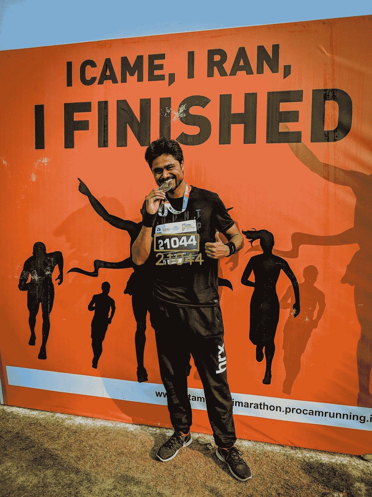

# 马拉松围兜识别和认可

> 原文：<https://towardsdatascience.com/marathon-bib-identification-and-recognition-25ee7e08d118?source=collection_archive---------6----------------------->

## 使用深度学习和图像处理来识别马拉松围兜上的数字。

Me after finishing the Mumbai Marathon 2019, and, of course, the bib number recognition (using AWS Rekognition API)

# 开始

我最近参加了一场马拉松。几天后，我收到了一封电子邮件，里面有一个链接，我可以在那里查看并下载我的比赛日照片。我需要把我的号码放在网页上，它就会调出所有我的照片。这让我思考这是如何成为可能的！

对于那些不熟悉跑步项目的人来说，围兜是一张贴有电子标签的纸。这个标签用来记录运动员在马拉松过程中的准确时间。围兜也有一个独特的围兜号码，用大字体印刷，还有跑步者的名字和其他一些文字。(见照片供参考)

我开始思考标记照片的可能方法。一个显而易见的方法是手动标记——有一组人看着照片，阅读围嘴号码，并用这些围嘴号码标记照片。这是一项繁琐的任务，假设每场马拉松会有超过 5000 张照片。另一种方法是使用计算机视觉。

# 计算机视觉

我的理念是，任何需要人类看着一幅图像，然后以一种近乎机械的方式跟着它做动作的任务，都可以而且应该用计算机视觉来实现自动化。我们拥有最先进的算法来解决这个问题，并拥有强大的计算能力来实现这些解决方案。为什么不利用它呢？这个项目就是这样开始的。

我开始探索不同的计算机视觉技术，这些技术可以用来给照片贴上号码标签。我将简要描述我能想到的每一种方法:

1.  **EAST text detector+tessera CT text recognition**:想法是首先检测图像中的文本区域，然后识别文本以识别 bib 号码。我使用 EAST 文本检测器模型来识别图像中带有文本的区域，然后将这些区域传递给 Tesseract 模型来识别文本。
    优点:实施简单快捷。
    缺点:不太准确，会检测到照片中的大量其他文本。
2.  **图像处理使用 OpenCV** 识别围脖区域，然后进一步处理围脖区域提取数字。提取的数字可以传递给预先训练的 ML 模型以识别号码。
    优点:对计算能力要求不高。
    缺点:很难概括不同的围兜设计
3.  **分割使用深度学习**模型，如 MaskRCNN，从图像中分割出 bib。在 bib 上应用图像处理来提取数字。将提取的数字传递给预先训练的 CNN 网络以识别数字。
    优点:分割围脖和识别数字的准确性高。
    缺点:功耗大，因此速度较慢，难以针对不同的围兜设计推广图像处理方法
4.  **物体检测使用深度学习**模型直接识别 bib 号码区域而不是整个 bib。与以前的方法相比，这可以为我们节省许多图像处理步骤。应用图像处理来提取数字，并将它们传递给预先训练的 CNN 网络来识别它们。
    优点:与前面的方法类似，深度学习模型可以非常准确。
    缺点:计算要求高
5.  **人脸识别:**这种方法在识别照片中的跑步者方面具有很大的优势，即使围兜被遮挡，这种情况确实经常发生。有多种方法来实现面部识别，我不会进入它的细节，因为它本身可以是一本书。我会马上提到我能想到的几种方法。一种方法是根据注册时提供的身份证照片匹配人脸(可能使用暹罗网络和三联丢失)。另一种方式可以是上述两种方法的混合。我们可以基于人脸识别将每个跑步者的照片聚集在一起，然后尝试从其中一张照片上读取围兜号码，在那里围兜清晰可见。
6.  来自谷歌(Vision)、AWS (Rekognition)或微软 Azure 的基于云的 API:使用这些 API 来检测和识别图像中的文本，然后过滤掉 bib 号码(可能使用所有 bib 号码的数据库)。

# 项目

首先，我尝试了第一种方法，以了解一个经过一般训练的模型将如何处理这个问题。不出所料，它的表现不是很好。无法保证正确识别 bib 编号，而且在图像中检测到大量假阳性文本。我将在以后的文章中写更多关于它的内容。后来，我开始尝试(第三)种方法，包括使用实例分段。这是这个项目的核心。

当我第一次着手解决这个问题时，它似乎不是一个大任务。只有当我深入到这个项目中，细微之处开始浮出水面时，我才意识到这个问题是多么具有挑战性。只是给你一个想法，唯一可能的方法，我可以得到正确阅读的照片上的数字在顶部是使用 AWS Rekognition API。虽然对人类来说阅读这个围嘴可能很容易，但训练计算机阅读这个数字就没那么简单了。我用自定义图像处理管道得到的最好结果是“1044”而不是“21044”。这是有原因的，比如为不同的围兜设计和配色方案创造一个通用的启发。我将在以后的博客中讨论。

我提出的解决方案可能还不是最好的。我意识到对解决方案的改进是无止境的。这个解决方案的端到端执行是本系列文章的主题。我选择这个项目的主要原因是尝试构建计算机视觉项目的各个方面——收集数据集、注释图像、实现用于分割的深度学习模型、图像处理、创建用于 OCR 的 CNN 模型、为给定的数据集定制训练、将这些不同的部分缝合在一起等。

我会把上面提到的每一个部分都写出来，并分享代码。您可以自由地获取代码并进行改进，或者将其用于您自己的应用程序。从这个项目中学到了很多，我希望社区能从中受益。

请随时留下任何建议/评论/批评。我会尽可能快。

这是这个系列的下一部分:

 [## 创建数据集—使用 Selenium 和 BeautifulSoup 抓取马拉松图片

### 创建用于围兜识别的马拉松图像数据集(第 1 部分)

medium.com](https://medium.com/@kapilvarshney/gathering-data-scraping-marathon-images-using-selenium-and-beautifulsoup-fe52d9cc9023)