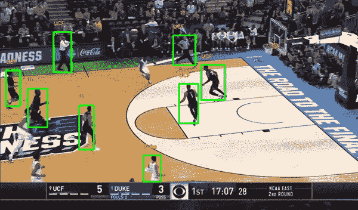
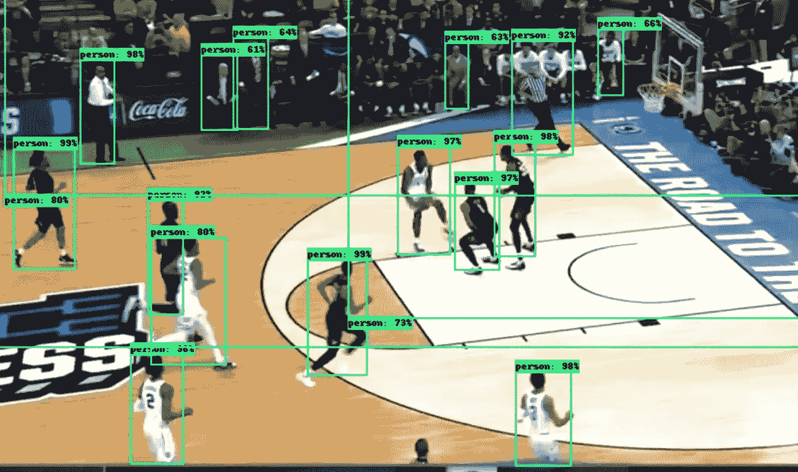
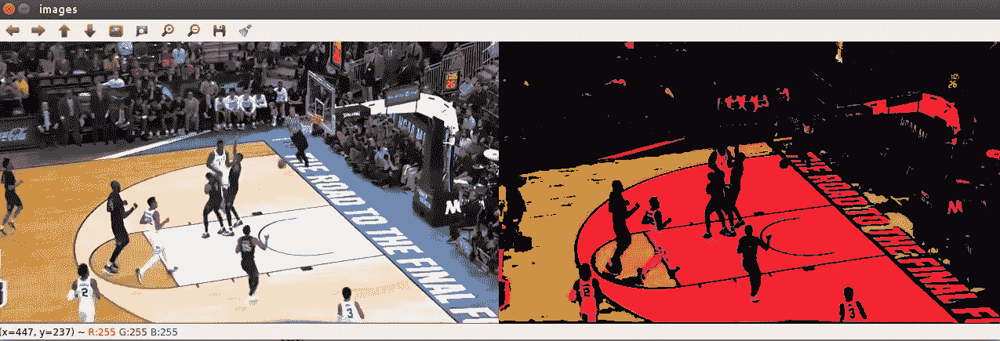
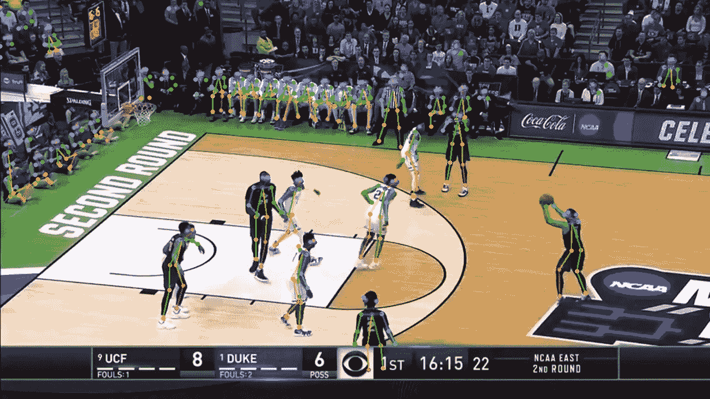

# 三月疯狂-分析视频以检测球员、球队和尝试投篮的人

> 原文：<https://towardsdatascience.com/march-madness-analyze-video-to-detect-players-teams-and-who-attempted-the-basket-8cad67745b88?source=collection_archive---------5----------------------->

## 用数据做很酷的事情！

# 介绍

这是三月疯狂月！这是一个多么激动人心的赛季。作为数据科学家，让我们利用这个机会对篮球片段做一些分析。通过使用深度学习和 opencv，我们可以从视频剪辑中提取有趣的见解。见下面的例子 gif 的游戏 b/w UCF 和杜克大学，我们可以确定所有的球员+裁判，标签球员到球队的球衣颜色为基础。在博客的后面，我将展示我们如何识别哪个球员试图投篮。所有这些都可以实时完成。

Detecting players and teams

你可以在我的 [Github repo](https://github.com/priya-dwivedi/Deep-Learning/blob/master/march_madness_team_shot/object_detection/March_Madness_Object_Detection.ipynb) 上找到代码

那我们开始吧。

# 检测玩家

我已经使用了一个预训练的检测模型，如[更快的 RCNN](https://arxiv.org/abs/1506.01497) 来检测球员。很容易从 [Tensorflow 对象检测 API](https://github.com/tensorflow/models/tree/master/research/object_detection) 下载一个在 COCO 数据集上训练的更快的 RCNN 并测试它。API 将图像的每一帧作为输入，并在 80 个不同的类别中进行检测。如果你是 Tensorflow 对象检测的新手，想了解更多，请查看这个[博客](/is-google-tensorflow-object-detection-api-the-easiest-way-to-implement-image-recognition-a8bd1f500ea0)。该模型在检测人方面做得相当好，但是由于人群中有大量的人，所以在该视频中有许多检测。参见下面的样品检测。我抑制了太大的检测，以更干净地分割出球员。您还可以在 API 中使用分数阈值来过滤掉低可信度检测。查看 [Github](https://github.com/priya-dwivedi/Deep-Learning/tree/master/march_madness_team_shot) 上的代码，了解如何抑制分数低和多次错误检测的盒子的提示。

Detection output from Pretrained Tensorflow model

# 探测队

现在有趣的部分来了。我们如何检测哪些球员是 UCF 对杜克大学？我们可以使用 OpenCV 来做到这一点。

如果您不熟悉 OpenCV，请参阅下面的教程:

[OpenCV 教程](http://opencv-python-tutroals.readthedocs.io/en/latest/py_tutorials/py_tutorials.html)

OpenCV 允许我们识别特定颜色的面具，我们可以用它来识别白人和黑人球员。主要步骤是:

*   将图像从 BGR 转换到 HSV 色彩空间。
*   在 HSV 空间中，指定白色和黑色的颜色范围。这需要一点实验，你可以在[笔记本](https://github.com/priya-dwivedi/Deep-Learning/tree/master/march_madness_team_shot)中想象不同阈值的影响。
*   使用 OpenCV 遮蔽(着色)阈值范围内的像素。
*   OpenCV Bitwise_and 将不在蒙版中的任何像素涂成黑色

白色请参见下面的输出。它们被伪装成“粉红色”,背景中的其他东西都是黑色的

Detecting white colour pixels

为了识别每个玩家的团队，我们从 tensorflow 对象检测中提取边界框，并计算边界框中非黑色像素的百分比，以确定该玩家的团队。

整体代码工作得很好。然而，这是一个识别黑白球衣球员的硬编码逻辑。通过使用聚类来查找相似的玩家，可以使其更通用

# 检测姿势和拍摄者

[OpenPose](https://github.com/CMU-Perceptual-Computing-Lab/openpose) 是一个实时多人姿势检测库。它可以检测图像中的人，并输出每个人的主要关节的关键点——每个人最多可以有 25 个关键点。代码是开源的。你必须按照自述文件中的建议安装[这里](https://github.com/CMU-Perceptual-Computing-Lab/openpose/blob/master/doc/modules/python_module.md)。安装后，你可以通过它运行图像，并获得场景中所有球员的关键点，如下所示。

Open pose output

那么我们如何识别试图投篮的球员呢？

我们可以寻找手腕关键点在头顶的玩家。意味着举起双手。这可能表明像上面的场景一样准备射击，或者可能是防御性的。此外，球的坐标以及手腕关键点的坐标可用于识别哪个玩家举手将球靠近他们。

# 结论

深度学习通过链接不同的想法，使得进行真正酷的分析成为可能。有许多开源代码和预训练的模型，您可以使用这些数据开始学习。以上只是起点。其他可以做的很酷的事情包括:

1.  使用 OCR 读取比赛分数，让您的系统了解哪个队赢了
2.  跟踪球以预测何时射门得分
3.  跟踪玩家以获得每个玩家的统计数据
4.  检测事件，如灌篮，三分篮球等。

希望你拉代码自己试试。

我有自己的深度学习咨询公司，喜欢研究有趣的问题。我已经帮助许多初创公司部署了基于人工智能的创新解决方案。请到 http://deeplearninganalytics.org/的[来看看我们吧。](http://deeplearninganalytics.org/)

你也可以在[https://medium.com/@priya.dwivedi](https://medium.com/@priya.dwivedi)看到我的其他作品

如果你有一个我们可以合作的项目，请通过我的网站或 info@deeplearninganalytics.org 联系我

**参考文献**

*   [Tensorflow 对象检测 API](https://github.com/tensorflow/models/tree/master/research/object_detection)
*   关于使用 OpenCV 检测颜色的好教程