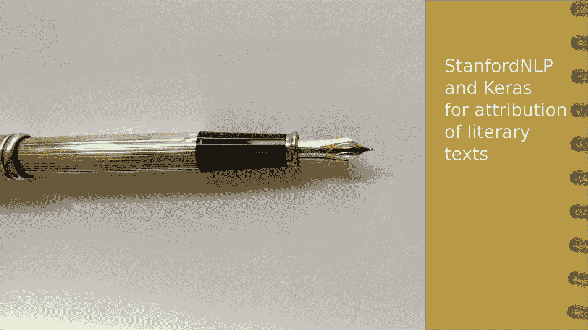
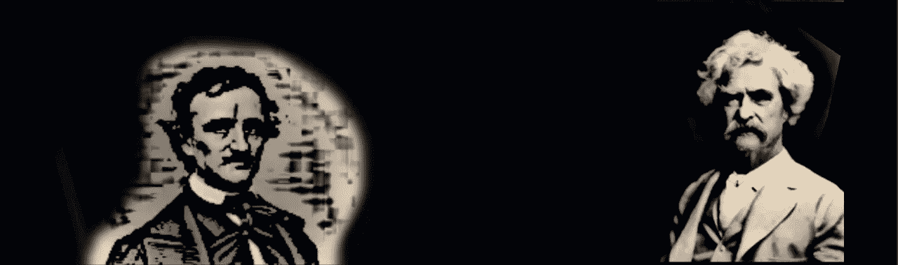
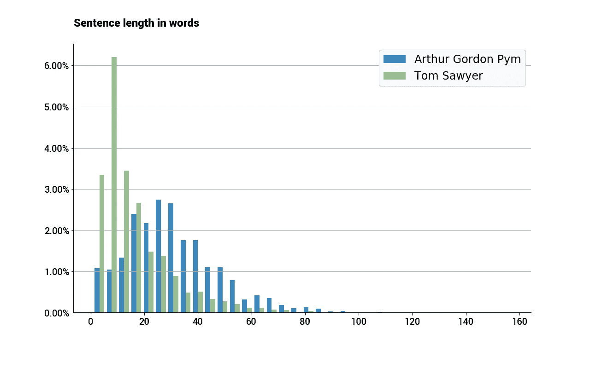
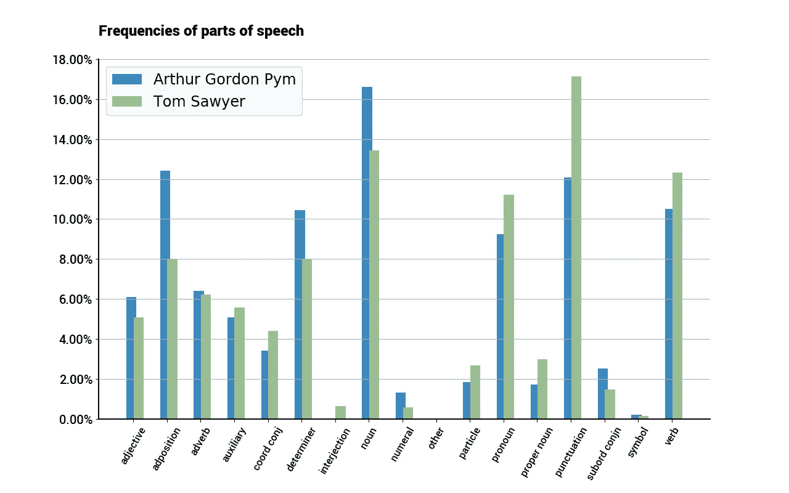
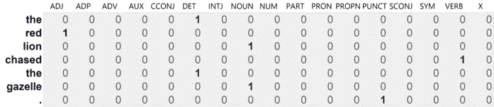
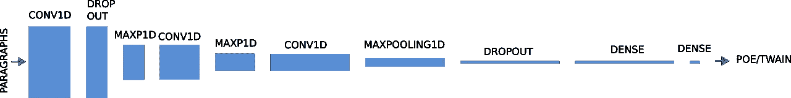
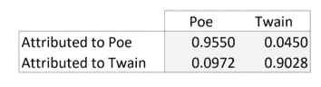

# 马克·吐温曾写道…或者是爱伦坡？

> 原文：<https://towardsdatascience.com/mark-twain-once-wrote-or-was-it-poe-47268538ecab?source=collection_archive---------26----------------------->



BiblioEater is all set to identify the writer

## 作者归属的 StanfordNLP 和 Keras

假设你追随某个作家，吞食了她/他的任何一部作品。如果给你提供一本全新的书，你检查几段就能认出作者的风格吗？

很可能你会。这篇文章的目的是探索一台机器完全做到这一点的可能性。我们将分析两位著名作家作品的一些文学特征，然后训练一个神经网络将新的文本分配给一位或另一位作家。

我们的工具将是刚刚推出的 [StanfordNLP](https://stanfordnlp.github.io/stanfordnlp/) Python 包，我们最近写了一个[简短介绍](https://levelup.gitconnected.com/first-look-at-stanfordnlp-2b7d43190957)以及直观的深度学习 API Keras，在我们的例子中是 Tensorflow。我们将由此产生的模型戏称为*食书者。*



Edgar Allan Poe and Mark Twain

# 作者和他们的书

我们选出了两位十九世纪的著名作家。一边是非常有趣的马克·吐温，另一边是才华横溢的讲故事者埃德加·爱伦·坡。两个原因导致我们选择他们。我们需要足够老的作品进入公共领域。我们还希望两位作者使用大致相同的语言变体，在他们的例子中是美国英语。

请记住，StanfordNLP 包括能够处理 53 种不同人类语言的模型，因此您可以使用相同的方法将雨果与左拉或塞万提斯与奎维多进行比较。

我们将从一个稍微更具挑战性的角度来处理这个问题，而不是像机器学习中的规范那样，获取每个作者的一批文本，并在训练和验证桶中分割数据集。我们将用两本小说进行训练，用两本不同的作品进行验证。即:

*   亚瑟·戈登·皮姆的叙述将被用来训练埃德加·爱伦·坡式的读书人。
*   《汤姆·索亚历险记》将被用来为马克·吐温做同样的事情。
*   *Eureka* 将用于验证 Poe 模型。爱伦·坡主要写短篇小说，但我们选择了长篇小说，尽管不太长。
*   而*哈克贝利·费恩历险记*是吐温为了验证而选的作品。

这种方法有许多障碍:书籍的主题不同，作者可能随着时间的推移而演变，等等。

此外，在所选的吐温小说中，作者使用了当地方言。虽然这可能有助于对文本进行分类，但从解析的角度来看，这将是一个挑战。

另一方面,《尤利卡》不是一部虚构的作品，爱伦坡在写作的时候，他的个性可能已经跨越了天才和疯子之间的界限。

然而，我们打赌，每个作者的作品中都有某种文学特征。

# 环境

我们在一个 Ubuntu 盒子里用 Python 3.6 工作过。GitHub 中提供了用于生成本文中讨论的结果的完整代码(细节在底部)。

数据集足够小，可以在没有 GPU 的工作站上运行神经网络训练，尽管有一个 GPU 总是有帮助的。下载英文版的 StanfordNLP 模型可能是更耗时的任务。


Polishing the text — but not a lot!

# 文本准备

只要遵守许可条款，古腾堡计划就有数以千计的免费电子书——大多数情况下，你必须避免分发任何修改过的副本。我们用网络浏览器下载了上面提到的四篇文章。

之后，我们用标准的文本编辑器删除了不需要分析的文本部分。这使得我们无法按照古登堡计划的许可分发它们，所以如果你想运行代码，你需要直接从古登堡计划下载电子书。

我们还在吐温的两部作品中发现了许多弯曲的双引号和下划线。我们在文本编辑器中处理它们。对于我们的目的，这种级别的数据清理就足够了。然而，让我们记住，一流的数据准备+平均算法往往胜过平均数据清理+一流的算法。

## 从语法上分析

正如我们在上一篇文章中所解释的，我们将应用 StanfordNLP 模型来解析这些书中的每一个句子。这将为每个单词分配[的词性](https://universaldependencies.org/u/pos/)和[的特征](https://universaldependencies.org/u/feat/)。例如:

> 他拿起画笔，平静地开始工作

从汤姆·索亚，变成了

```
He (PRON - Case=Nom|Gender=Masc|Number=Sing|Person=3|PronType=Prs) took (VERB - Mood=Ind|Tense=Past|VerbForm=Fin) up (ADP - _) his (PRON - Gender=Masc|Number=Sing|Person=3|Poss=Yes|PronType=Prs) brush (NOUN - Number=Sing) and (CCONJ - _) went (VERB - Mood=Ind|Tense=Past|VerbForm=Fin) tranquilly (ADV - _) to (PART - _) work (VERB - VerbForm=Inf)
```

看看不同句子中语言的使用，我们期望捕捉到作者的部分写作风格。例如，这项研究的一个目标曾经写道:

> 当你抓住一个形容词时，杀死它。(马克·吐温)

所以你不会期望在他的文章中过度使用形容词。事实上，我们会看到坡在形容词的使用上超过了吐温——尽管不是很多。

# 一些文体特征

我们接受这样的假设，每个作家都有他/她自己的文学风格，这样的个人足迹应该是显而易见的，即使看一些粗糙的特征，就像下面的那些。有一门名为[文体学](https://en.wikipedia.org/wiki/Stylistics)的成熟学科专门研究这些现象。

## 句子长度



你喜欢简短直接的句子，还是喜欢制造复杂冗长的句子？(哦不，四个形容词，对不起马克！)在所附的图表中，很明显吐温比爱伦·坡更喜欢使用短句——这并不奇怪。

以这样或那样的方式，我们的作者属性算法应该捕捉这个特征，因为它看起来很有鉴别性。

## 词类的使用

在 StanfordNLP 的帮助下，我们为两本书的每个句子都指定了词类。作者中动词、形容词和名词的比例是多少？数据会有什么不同吗？



Usage of parts-of-speech in both works

Poe 倾向于更重视介词，如中的*或*到*，以及从属连词，如 *if* 或 *while。这暗示了一种更复杂的风格。吐温的书比坡的书包括更多的标点符号，这与组成更短的句子是一致的。**

这个简单的分析没有显示出词性之间的顺序关系。正如我们将要展示的，这是一份适合*阅读者*的好工作。

## 其他功能

以上只是我们可以在两个文本中分析的特征的几个例子。鉴于 StanfordNLP 所提供的，我们可以看看作品的其他特点:

*   单词特征可用于建立动词的使用方式(哪种时态和模式是首选？)以及类似的名词(单数、复数)。
*   词汇的使用。例如，单词 *vessel* 在《亚瑟·戈登·皮姆》中出现了 96 次，而在《汤姆·索亚》中一次也没有出现。同样，吐温写了 156 次男孩，这个词没有出现在 Pym 中。这似乎是一个棘手的话题，因为词汇可能过多地与情节联系在一起，就像这里的情况，而不是与写作风格联系在一起。
*   我们甚至还没有触及 StanfordNLP 中的[依赖解析器](https://nlp.stanford.edu/software/nndep.html)。它分析句子，识别主要术语或句法中心。那些词头(动词、名词等)的选择。)可能与每个作家的选择有关。

# 文本结构分类与作者归属

让我们直接进入分类。给定这些书中的一篇短文，找出它最可能的作者。

## 战略

有许多关于二进制或多标签文本分类的深入文章。这就是为什么我们在这里做一些稍微不同的事情。我们不是用实际的文本来训练我们的网络，而是只输入它的语法结构。

所以对于 *BiblioEater* 来说，这两句话看起来是一样的:

> 红狮子追逐瞪羚
> 
> 我们年轻的研究员找到了解决办法

因为两者都符合 DET-ADJ-名词-动词-DET-名词的顺序。让我们记住，我们不会使用单词特征，例如限定词是被定义的冠词(*)还是所有格代词( *Our* )。*

*通过这样做，我们忽略了**大量的**信息，我们的模型可能会因为保留它们而变得更好。然而，这篇文章的目的是要表明，即使信息有限，我们也能捕捉到作者的部分风格。请继续阅读。*

## *一键编码*

*如果我们是在处理文字，比如加利纳·奥莱尼克 [这里](/word-embeddings-exploration-explanation-and-exploitation-with-code-in-python-5dac99d5d795)所解释的 word2vec 将是一个自然的选择。但是我们只处理 17 种不同的词性。因此，我们可以很容易地提供一个独热编码，将它们中的每一个表示为长度为 17 的向量，所有元素都设置为零，只有一个元素对应于语音的顺序位置。视觉上，*

> *红狮子追赶瞪羚。(DET-ADJ-名词-动词-DET-名词-标点)*

*转换为*

**

## *段落，而不是句子*

*在确定了我们将如何处理文本之后，我们现在来解决我们向模型提供多少文本以确定作者的问题。一次一个句子似乎太少了，因为两个作者产生相同句法结构的几率有时似乎很高。*

*我们决定输入 3 个连续的句子作为网络的输入。我们称之为一个段落，尽管从技术上来说，大部分时间它并不是一个段落。*

*Tom Sawyer 是两部作品中最长的一部，我们对所有生成的段落进行采样，因此 Tom 和 Pym 在训练过程中使用相同数量的段落来代表他们。*

*输出显然是二进制的:要么是 Poe，要么是 Twain 是作者。*

**

*Ready to eat books*

# *阅读者——神经网络*

*在定义神经网络的拓扑结构时，你可以随心所欲地发挥创造力。但是考虑几件事情:*

*   *我们讨论的是输入层的几千个段落。不完全是大数据，是吗？我们必须小心，不要设计太重的网。*
*   *整个练习归结为一个简化的文本分类问题，就像 Yoon[描述的用词性代替原始单词的问题。](https://arxiv.org/abs/1408.5882)*

*因此，我们选择了相对简单的设计，甚至比 Yoon 论文中的设计还要简单:*

**

*BiblioEater topology*

*它由一系列基本的卷积层和最大池层对组成，最后由两个密集层组成，以获得二进制输出。你也可以找几个脱层作为防止过度合身的安全网。该代码保存了 BiblioEater 类中的所有细节。*

*驱动训练过程的各种参数，例如过滤器数量、步幅等。可以在代码中找到。它们被隔离为常量，以便于调整和比较结果。*

*当 StanfordNLP 使用 PyTorch 进行机器学习时，我们自然会选择 PyTorch 而不是 Keras。然而，我们用 Keras，因为它通常更容易阅读。*

# *结果*

*利用代码中保存的建模值， *BiblioEater* 有 18，954 个参数，不是很多，因此即使是一个无 GPU 的工作站也可以轻松处理训练工作。我们输入了来自两本书的偶数个带标签的段落，得到了 0.9313 的准确度。不算太坏，我们已经提到了所有的警告。*

*但是当我们强迫*食书者*吞下《尤利卡》和《哈克贝利·费恩历险记》时，布丁的真正证据就来了。请记住，这些书中的任何文本都没有包含在培训中。还要记住，每次网络上出现的都是 3 句话的段落，这并不多。这是我们得到的混淆矩阵。*

**

*因此,*阅读者*在 90%以上的时间里都对两本它以前没看过的书。这是考虑到我们决定不包括但在文本中存在的所有特征。如果我们给它输入 4 句话的段落，我们可以为每个作者增加大约 0.015 的准确率。*

*调整参数，我们得到了类似的结果，但结果有些不稳定，这表明数据集有点小。也许我们应该选择狄更斯的所有作品！*

# *我能运行代码吗？*

*你当然可以。从 [github](https://github.com/angelnew/biblioeater) 下载，请先通读 README.md 文件。*

# *结论*

*作家在作品中打上自己风格印记并不新鲜。我们在这篇文章中试图传达的是他如何仅仅基于三个连续句子的词性来处理文本归属。添加我们忽略的功能后，我们的结果应该会显著改善。高质量开源软件(Keras、Tensorflow 和最近的 StanfordNLP)的出现使这成为可能。*