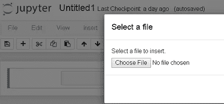

# 降价单元格— Jupyter 笔记本

> 原文：<https://towardsdatascience.com/markdown-cells-jupyter-notebook-d3bea8416671?source=collection_archive---------21----------------------->

我不知道如何开始。这将是我第一个与编程相关的故事。今天，我将努力缩小 Jupyter 笔记本中的降价单元格描述。我想我不必在 Jupyter 笔记本上花费太多的文字。根据 Jupyter.org[的说法，“ **Jupyter** 笔记本是一个开源的网络应用程序，允许你创建和分享包含实时代码、方程式、可视化和叙述文本的文档”。Markdown 是一种流行的标记语言，被用作数据科学家和分析师的标准。它既不是 HTML Markdown 的超集，也不是 HTML 的替代品，甚至接近它。它的语法非常小，只对应于 HTML 标签的一个非常小的子集。通常在 Jupyter Notebook 中，单元格类型默认为 code。如果我们想要输入任何文本来描述不被认为是代码的任何东西，那么我们需要使用单元格类型作为 Markdown。](https://jupyter.org/)

要将 code 单元格转换为 markdown 单元格，我们可以使用快捷键 m 从切换工具栏或单元格菜单中更改单元格类型。现在让我们简要讨论 Jupyter Notebook 支持的 markdown 语法。


Convert cell type from **Code to Markdown**

**标题**:有六种类型的标题，每种标题都以散列符号`**(#)**`开头，后跟一个空格，其中最大的标题使用单个散列，最小的标题使用六个散列符号。

可选地，标题可以以标记标签开始，即，从标题 1 到标题 6，具有以下语法。如果我们单击工具栏上的 run 按钮，输出文本将如下图所示。如果有人想描述几个问题，用几个标题类型来突出问题的重要性是很容易的。


Output for **Headings** and **Headings 2** markdown cell.

**样式和变化(粗体、斜体文本、背景):**markdown 中的标题和其他文本都可以是粗体、斜体或常规*字体样式*，有几种*颜色*和不同的*背景颜色*。我们也可以改变*字体* 像时间新罗马或 Calibri。

**枚举列表:**通过 markdown 可以形成有序列表、项目符号列表或嵌套的条目列表。一个编号列表是由 HTML 的`<ol>`标签完成的，也可以应用在 Markdown 中。也可以应用几种其他方法来制作这种有序或无序的列表。

```
1\. First 
    1\. First one
    2\. First two
2\. Main list <br>
a. Sub-list <br>
b. sub list 
3\. Main list
* main list 
* A
  * B
    * C
+ A
  + B
    + C
- A
  - B
    - C
```

**内部&外部链接(超链接):**以 http 或 https 开头的 Markdown 文本自动呈现超链接。外部和内部超链接都可以通过以下方式添加。*Markdown 中的内部链接*以`<a>`标签开始，该标签具有由属性‘id’定义的唯一 id。

```
<a> [https://www.google.com](https://www.google.com) </a> <br>
<a href="[http://www.google.com](http://www.google.com)">Google</a><br>[http://typora.io](http://typora.io)<br>
[Google]([https://www.google.com](https://www.google.com))<br><a id =integer> </a> 
[Arman](#integer)
```

**表格:**表格可以在 markdown 单元格中通过管道符号`**(|)**`和破折号`**(-)**`组成，用来标记列和行。分号`(:)`或 das `**(-)**` 符号用于对齐各列。

**图像:**您可以从工具栏中插入图像，方法是从编辑菜单中选择“*插入图像*”，并从您的计算机中选择目标文件夹中的图像。我们还可以通过以下命令在 markdown 单元格上添加图像。

```

```



Inserting image using the Edit menu.

**方程式:**在 markdown 单元格中提到方程式时，数学符号包含在 *'* `$symbol here$` *'* 中。内联表达式可以通过用`$`包围 latex 代码来添加，而在它们自己的行上的表达式用`$$`包围。

```
$e^{i\pi} + 1 = 0$
$$e^x=\sum_{i=0}^\infty \frac{1}{i!}x^i$$
$$e^{i\pi} + 1 = 0$$<br>
$\sqrt{k}$
```

**Github 风味降价:**使用*反引号*或*左引号* `**(`)**` 键三次，我们可以获得与降价单元格输出相同的代码风味甲酸盐。

```
```python
A = "Python syntax highlighting"
print(A)
for i in range(0,10):
    print(A)
```
```

输出:


GitHub flavored Markdown.

**块引号、换行符和水平线:**换行符使用 2 个空格或该代码进行手动换行符:`<br>`。可以通过使用符号`'>'`或包含预期文本分块列表的`<blockquote>text for blockquote</blockquote>`获得块引号。我们还可以使用`(___) or (***) or (---)`三个连字符或标记标签添加一条水平线`<hr>.`文本或标题可以通过`<center>text<center>`集中。

```
> Professor says <br />
> It's good for<blockquote>This is good</blockquote>> 1 Blockquotes
>> 2 Blockquotes
>>> 3 Blockquotes
>>>> 4 Blockquotes
>>>>>>>> 8 BlockquotesAsterisks
***
Underscores
___
hipen--- # <center>Your centered level h1 title</center>
<h3 align="center">This is a centered header</h3>
```

我已经在 GitHub 库中添加了 markdown 单元格的所有命令。你可以在这里查看[。](https://github.com/Arman-Null/Markdown-Cells---Jupyter-Notebook.git)

[](https://github.com/Arman-Null/Markdown-Cells---Jupyter-Notebook.git) [## arman-Null/Markdown-Cells-Jupyter-笔记本

### 此时您不能执行该操作。您已使用另一个标签页或窗口登录。您已在另一个选项卡中注销，或者…

github.com](https://github.com/Arman-Null/Markdown-Cells---Jupyter-Notebook.git) 

我感谢丹尼尔·布克、乔纳森·惠、何塞·马西亚尔·波尔蒂利亚和威尔·科尔森以及其他一些人，他们总是激励我在这个神奇的平台上写作。我会试着继续写具体的问题。

**参考链接:**

1.  [https://www . data camp . com/community/tutorials/markdown-in-jupyter-notebook](https://www.datacamp.com/community/tutorials/markdown-in-jupyter-notebook)
2.  [https://www . tutorialspoint . com/jupyter/jupyter _ notebook _ markdown _ cells . htm](https://www.tutorialspoint.com/jupyter/jupyter_notebook_markdown_cells.htm)
3.  [https://jupyter-Notebook . readthedocs . io/en/stable/examples/Notebook/Working % 20 with % 20 Markdown % 20 cells . html # Markdown-basics](https://jupyter-notebook.readthedocs.io/en/stable/examples/Notebook/Working%20With%20Markdown%20Cells.html#Markdown-basics)
4.  [https://medium . com/IBM-data-science-experience/markdown-for-jupyter-notebooks-cheat sheet-386 c05 aeebed](https://medium.com/ibm-data-science-experience/markdown-for-jupyter-notebooks-cheatsheet-386c05aeebed)