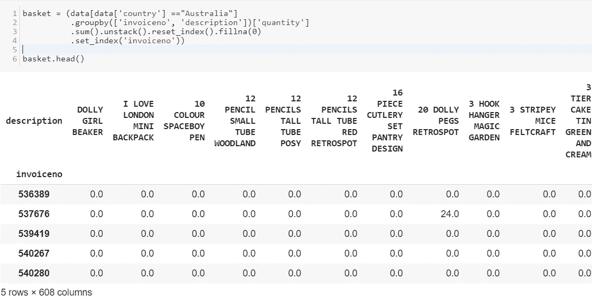

# 基于购物篮分析的关联规则挖掘

> 原文：<https://towardsdatascience.com/market-basket-analysis-knowledge-discovery-in-database-simplistic-approach-dc41659e1558?source=collection_archive---------13----------------------->

## 无监督学习&数据库中的知识发现


[https://sarit-maitra.medium.com/membership](https://sarit-maitra.medium.com/membership)

M **市场购物篮分析** (MB)是一种关联分析，是一种流行的数据挖掘技术。这是一种**数据中的知识发现(KDD)** 这种技术可以应用于各种工作领域。在这里，我将使用一个零售交易数据，并展示如何向企业提供信息来捕获买方的购买行为。这也可以是决策支持系统的一部分。

各种形式的数据挖掘可应用于这类数据集，例如分类、关联、预测、聚类、异常值分析等。在这里，我将重点介绍关联规则挖掘技术，它发现隐藏在数据集中的有趣关系。如果你有兴趣，可以访问我早前的文章***(***[***1***](https://medium.com/analytics-vidhya/integrated-approach-of-rfm-clustering-cltv-machine-learning-algorithm-15f9cb3653b0)***)；(***[***2***](/measuring-customers-value-using-python-lifetimes-d8b19a04e9c1)***)；(***[***3***](https://medium.com/clustering-segmentation/introduction-7321e39c595e)***)。***

我们很多人都熟悉 UCI 机器学习数据库发布的以下数据集。MB 分析中使用的数据是事务性数据。在这里，数据具有 MB 分析的所有基本成分。然而，从我的经验来看，交易数据很少或者我们可以说，从来不会以这种格式出现。因此，由于交易数据的复杂性，数据清理和数据读取是 MB 分析的主要活动。


让我们看看数据框的尺寸以及唯一的*发票号*和*客户号*


如果我们比较*【发票号】*和*【描述】*，我们可以看到一些行没有发票号。

```
data[‘invoiceno’].value_counts()
```


让我们删除没有发票号的行，并删除信用交易(发票号包含 C 的交易)。


现在，我们需要将商品合并为每行 1 个交易，每个商品 1 个热编码。让我们检查数据框中的国家名称。


让我们看看澳大利亚的销售情况，并将结果与法国的销售情况进行比较。在我们深入分析之前，让我们先了解一下关联规则。

# 关联规则挖掘

在这种情况下，规则生成是挖掘频繁模式的首要任务。关联规则是形式为 *x → y，*的蕴涵表达式，其中 *x* 和 *y* 是不相交的*项目集。*为了评估这样一个关联规则的*【兴趣】*，已经开发了不同的度量标准。我将使用 ***支持、*** 和 ***提升*** 度量。

# 韵律学

假设商品 ***x*** 正在被客户购买，那么商品 ***y*** 在同一个交易 ID 下被客户挑选的几率也就被找出来了。衡量联想有 3 种方式: ***支持度、*** 信心度、 ***升力度。***

> **Support {freq (x，y) / n，range: [0，1]}** 给出包含项目 x 和 y 的交易的分数。它告诉我们经常购买的项目或经常购买的项目组合，我们可以筛选出频率较低的项目。
> 
> **Confidence {freq(x，y) / freq (x)，range: [0，1]}** 根据 x 出现的次数，告诉我们 x 项和 y 项一起出现的频率。
> 
> **Lift { support/support(x)* support(y)，range: [0，inf]}** 表示一个规则对 x 和 y 的随机出现的强度，它解释了一个规则的强度，Lift 越大就是强度越大。

# Apriori 算法

这是一种数据挖掘方法，也是关联规则的基础。Apriori 算法使用*【频繁项集】*生成关联规则。它考虑到了一个*【频繁项集】*的子集也一定是一个*【频繁项集】*。*【频繁项集】* >的值超过一个阈值(即支持度)。



数据中有相当多的零，但我们还需要确保任何正值都被转换为 1，任何小于 0 的值都被设置为 0。因此，让我们对数据应用一种热编码，并删除邮资列；我们不打算探讨邮资。


既然数据的结构是正确的，我们可以生成支持度至少为 7%的频繁项集(选择这个数字是为了让我得到足够多有用的例子)。

# 数据挖掘中的信心和支持

*   为了选择感兴趣的规则，我们可以使用最著名的约束，这些约束是置信度和支持度的最小阈值。

> 支持度是项集在数据集中出现频率的指示。信心是规则被发现为正确的频率的指示”

```
# generate the rules with their corresponding support, confidence 
# and lift
frequent_itemsets = apriori(basket_sets, min_support=0.07, use_colnames=True)
print (frequent_itemsets)rules = association_rules(frequent_itemsets, metric=”lift”, min_threshold=1)
rules.head()
```


如果我们打印关联的数量，我们会看到找到了 800 条关联规则。


```
support=rules.as_matrix(columns=[‘support’])
confidence=rules.as_matrix(columns=[‘confidence’])
```

下面的支持度和置信度散点图显示了数据集的关联规则(前 10 个规则)。


让我们看看这告诉了我们什么。例如，我们可以看到有相当多的规则具有很高的*值，这意味着它比给定的交易和产品组合的数量所预期的更频繁地出现。我们还可以看到几个 ***置信度*** 也很高的地方。在这方面，领域专长有很大优势。我就在这里找一个大 ***抬*** (6)高 ***信心*** (0.8)。*

**

*查看规则，我们可以发现，*" RED retro spot CAKE STAND "*和 *"36 支铅笔管 RED RETROSPOT"* 是一起购买的，而 *"4 个传统旋转陀螺"、"闹钟 BAKELIKE GREEN "和" RED DINER WALL CLOCK"* 是一起购买的，购买方式高于整体概率。在这一点上，我们可能想看看有多少机会可以利用一种产品的受欢迎程度来推动另一种产品的销售。*

**

*我们可以看到，虽然有关联规则存在，但是相比于 385 个数字*的“36 支铅笔管红色逆行点”*而言，只有 73 个数字的“*红色逆行点蛋糕摊”*所以也许企业必须采取某种策略来使两者不相上下。*

*同样有趣的是，看看不同购买国家的组合是如何变化的。让我们来看看在法国有哪些流行的组合。*

******

*所以，这样我们就可以比较，准备一份分析报告。根据我们定义的关联规则，我们发现一些产品之间存在显著的相关性。这里应用的*先验算法*具有一定的阈值。我们也可以试验不同阈值。**越大*抬*抬**意味着联想越有趣。具有高 ***支持度*** 的关联规则是潜在有趣的规则。类似地，具有高 ***置信度的规则*** 也会是有趣的规则。*

****我这里可以联系到***[](https://www.linkedin.com/in/saritmaitra/)****。*****