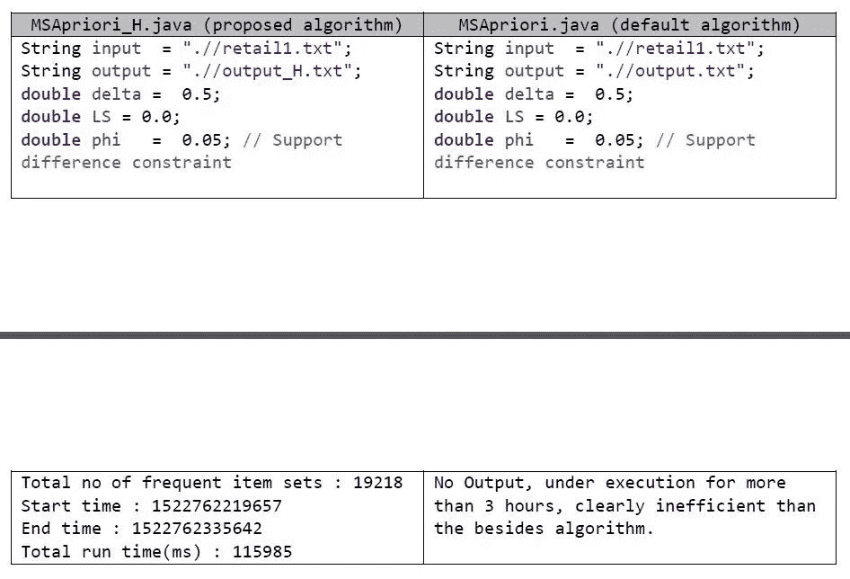

# 购物篮分析——多支持频繁项目集挖掘

> 原文：<https://towardsdatascience.com/market-basket-analysis-multiple-support-frequent-item-set-mining-584a311cae66?source=collection_archive---------19----------------------->

## 对缺省 MSApriori 算法的改进。


Pic credit: Upgrad

# 简介:

从交易数据库(购物篮)中生成关联规则的问题是许多零售商感兴趣的。关联规则的形式是𝑋 → 𝑌，其中 x，y 是 I(所有产品(或项目)的集合)和𝑋 ∩ 𝑌 = ∅.的子集

可以将上述关联规则的含义理解为，如果顾客购买了集合 X 中的物品，那么他可能购买集合 y 中的物品。关联规则的一些众所周知的例子可以是{ Milk }--> {Bread } 、{ Milk }--> { Bread，Eggs} 、{ Bread，Butter }--> { Jam }和幽默的{ Diapers }--> { Beer }。请注意，关联规则是不可交换的，即𝑋 → 𝑌不等于𝑌 → 𝑋.

为给定的交易数据库(市场篮)寻找关联规则的问题定义如下:

a.给定一个大小为 z 的事务数据库，其中有 n 个不同的项目和一个输入支持度和置信度，找出满足给定支持度和置信度约束的所有规则𝑋 → 𝑌。

b.支持度是一个阈值，该阈值将确定 X 中的项目是否足够频繁以被考虑用于关联规则生成。更具体地说，如果{X}。count / Z >= support，那么 X 被认为是一个频繁项集。

c.置信度是决定购买 y 的条件概率的阈值。更具体地说，如果{𝑋⋃𝑌}.count / {X}。计数> =置信度，则𝑋 → 𝑌被视为有效的关联规则。

假设零售商销售了“N”种不同的商品/产品，那么计数和生成关联规则的强力方法的复杂度为 O(N！).

Apriori 算法是对蛮力算法的改进，它基于这样的观察:只有当 X 的所有真子集都是频繁项目集时，项目集 X 才是频繁项目集。这将减少为生成所有可能的关联规则而需要探索的状态/规则的数量。Apriori 算法根据这一原理工作，分两步执行

a.在大小为 1，2，3…k 的事务数据库中查找所有频繁项集。

b.从频繁项目集 2，3，4…k 中生成所有有效的关联规则。

c.如果不能再生成 k + 1 大小的频繁项集，则停止。

Apriori 算法至少需要对事务数据库进行“k”次扫描。

# MSApriori:

MSApriori 代表多重支持 Apriori，它是 Apriori 算法在现实生活场景中的一个更受约束的定义。Apriori 算法只考虑交易中所有项目的一个支持值，而不管项目是频繁销售的项目(如杂货)还是不太频繁销售的项目(高价项目，如家居装饰)。因此，要为经常/很少售出的商品建立称重方案，每件商品都有单独的支撑。MSApriori 算法的问题定义修改如下:

a.给定一个交易数据库和每个项目和置信度的不同最小输入支持(MIS ),找出满足给定支持和置信度约束的所有规则𝑋 → 𝑌。

b.支持度是一个阈值，该阈值将确定 X 中的项目是否足够频繁以被考虑用于关联规则生成。由于 MSApriori 中对不同的项目有不同的支持，任何满足其集合中项目的最小 MIS 的项目集合都被认为是频繁的。更具体地说，如果

a.|X| = 1，

*   {X}。count/n > = miss(X)，那么 X 被认为是一个频繁项集。

b.|X| >= 1，

*   {X}。count / n >= MIN (MIS(X1)，MIS(X2)，MIS(X3)…MIS(Xk))；Xi ∈ X，i=1 到 k

c.为了阻止非常频繁和不太频繁的项目一起出现在任何频繁项目集合中，在候选项目集合 X 上施加支持差异约束φ

a.|X| >= 1，

*   MAX(Supp(X1)，Supp(X2)…Supp(Xk))–MIN(Supp(X1)，Supp(X2) … Supp(Xk)) <= Φ

The task of assigning MIS to items must be done in a meticulous manner. For highly moving items such as daily groceries, a high value of MIS is desired. For not so frequently sold items such as high end electronics, a less value of MIS is desired. One such assignment of MIS can be done using the following approximation.

MIS (item) = δ * Supp (item); δ ∈ [0, 1]

The above assignment is discussed in [刘兵等人的网络挖掘](https://www.cs.uic.edu/~liub/WebMiningBook.html)。求解 MSApriori 的算法也是刘兵在上面的书里提出的，姑且称之为默认的 MSApriori 算法。默认的 MSApriori 算法对每个候选项集 Ck 扫描事务数据库；k > =2 来计算频繁项集 Fk。

考虑到数据库中有“Z”个总事务和“N”个唯一项，默认的 MSApriori 算法需要计算对所有 C2 的支持；如果每个项目的 MIS 按上述等式定义，C2 将有 N*(N-1)/2 个项目集。

总时间复杂度= N*(N-1)/2 * Z ~ O(n3)。

类似地，C3、C4… Ck 也会有相应的复杂性，这是基于项集的大小乘以数据库中的事务数量。

# 对 MSApriori 的改进建议:

对缺省 MSApriori 提出的改进是使用一种前瞻策略，在事务数据库扫描的第一遍中计算每个 Ck 的支持，将它们存储在哈希表(Hk)中，并在需要时检索它们。在事务数据库扫描的第一遍中，对于长度为“L”的每个事务，每个 Ck (k <= L) is generated locally and the count of its support increased in Hk. So, for C2, the proposed modification would work as follows,

```
/* modified MSApriori Algorithm form Bing et al */Modificaiton-1: init-pass()For each item(i) in Transaction T:a. Compute/increment the support of item(i)b. For each item(j) in Transaction T: // (j>i)
       Compute the hashcode of itemset(i,j)
       Retrieve the support of itemset(i,j) from the hash table(H2)
       Initialize/Increment the support of itemset(i,j).Modificaiton-2: CandidateGen2() //Candidate generation function for 2-itemsetFor each item(i) in list L/C2:
    For each item(j) in list L: // (j>i)
        Compute the hashcode of itemset(i,j)
        Retrieve the support of itemset(i,j) from the hash table(H2)
        If support > MIS(item(i)) // and other constrains like Φ
            Return itemset(i,j) into F2.
```

NOTE: CandidateGen2() directly returns the items into F2, no need for scanning the transaction database again!

In the Modificaiton-1, an extra sub-loop is added for each transaction to compute the support for 2-itemsets, assuming the average length of transaction is ‘L’ then this step would add further processing time of L*(L-1)/2 for each transaction in the database. Assuming, there are ‘Z’ transactions in the database, the time required to complete the init-pass() is

Time complexity (init-pass) = L*(L-1)/2 * Z

~= c * Z ~ O(Z) //for all practical reasons L << Z

In the Modificaiton-2, I am adding an extra step for accessing the hash table (H2) which can be done in constant time (TH) in most library implementations. The time required to complete CandidateGen2() is given as

Time complexity = N*(N-1)/2*TH ~ O(n2).

Combining both modifications, total time complexity = O(Z) + O(n2) < O(n3)! (from the default algorithm).

# Verification of the result:

The default MSApirioi algorithm is implemented by [Phillipe et al in the 开源 java data mining library SPMF](http://www.philippe-fournier-viger.com/spmf/) )。我已经[用我在 MSAprori _ H.java 程序中提出的修改](https://github.com/cs17emds11029/MSApiori)修改了 SPMF 库中的默认 MSApriori 算法。MSApriori 和 MSApriori_H 的执行结果如下:

考虑的数据集:retail1.txt

数据集中不同项目的数量:N = 2603。

数据集中的事务数量:Z = 541909。



关于此算法的哈希函数要求的注释。理想情况下，我们需要一个散列函数，它能为一组整数提供唯一的散列值，而不考虑给定集合中整数的顺序。生成这样一个散列函数肯定不是一件简单的任务，所以我在实现中将散列值放宽为一个 Java 对象。我选择了一个要在 MSApriori_H.java 中实现的 BitSet 对象。

MSApriori_H.java 中的哈希函数:

```
/* Input k-item set in Integer[] items */BitSet hashcode = new BitSet(Integer.MAX_VALUE);for(int i=0; i<items.length; i++) {hashcode.set(items[i])};return hashcode;
```