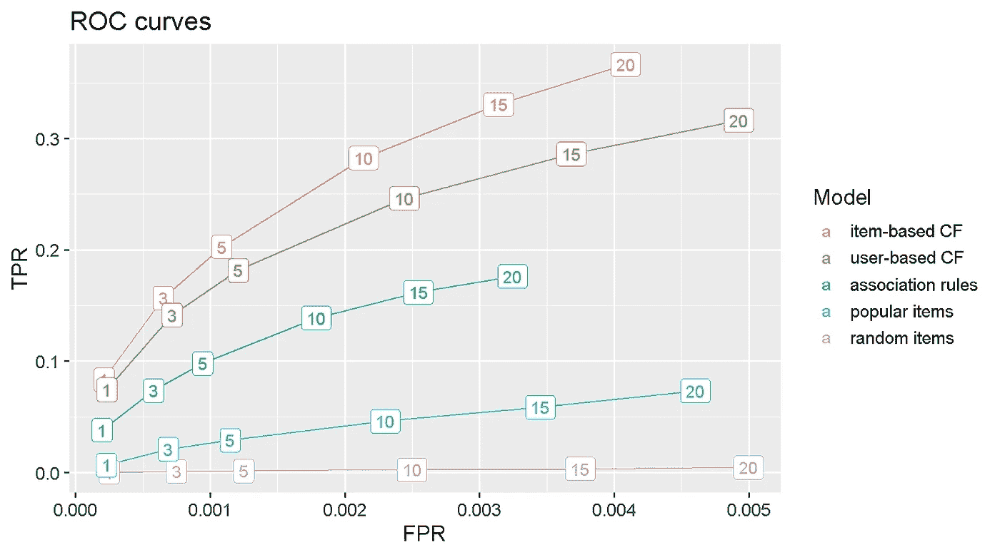

# 带推荐人的购物篮分析

> 原文：<https://towardsdatascience.com/market-basket-analysis-with-recommenderlab-5e8bdc0de236?source=collection_archive---------9----------------------->

## 我对购物篮分析的看法——第 2 部分，共 3 部分


Photo by [Victoriano Izquierdo](https://unsplash.com/@victoriano?utm_source=medium&utm_medium=referral) on [Unsplash](https://unsplash.com?utm_source=medium&utm_medium=referral)

## O verview

最近我想学习一些新的东西，并挑战自己进行端到端的**市场篮子分析**。为了继续挑战自己，我决定将我的努力成果展示给数据科学界。

这是**三柱**中的**第二柱**，排列如下:

> ***第一部分*** *:(可以在这里找到*[](/clean-a-complex-dataset-for-modelling-with-recommendation-algorithms-c977f7ba28b1)**)用推荐算法* ***第二部分*** *:用* ***推荐器 lab*** *R 包
> 应用各种产品推荐模型**

## *加载包*

```
*# Importing libraries
library(data.table)
library(tidyverse)            
library(knitr)
library(recommenderlab)*
```

## *数据*

*为了进行分析，我将使用在第 1 部分[](/clean-a-complex-dataset-for-modelling-with-recommendation-algorithms-c977f7ba28b1)**中准备和清理的`retail`数据集。如果你想继续这篇文章，确保你得到了[数据集](http://archive.ics.uci.edu/ml/datasets/online+retail)并运行第 1 部分的 [R 代码，你可以在我的](https://github.com/DiegoUsaiUK/Market_Basket_Analysis/blob/master/Market_Basket_Analysis_Part1.R) [Github 简介](https://github.com/DiegoUsaiUK/Market_Basket_Analysis)中找到。***

```
***glimpse(retail)
## Observations: 528,148
## Variables: 10
## $ InvoiceNo   <dbl> 536365, 536365, 536365, 536365, ...
## $ StockCode   <chr> "85123A", "71053", "84406B", "...
## $ Description <fct> WHITE HANGING HEART T-LIGHT HOLDER, ...
## $ Quantity    <dbl> 6, 6, 8, 6, 6, 2, 6, 6, 6, 32, 6, 6, 8, ...
## $ InvoiceDate <dttm> 2010-12-01 08:26:00, 2010-12-01 08:26:00, 2010-12...
## $ UnitPrice   <dbl> 2.55, 3.39, 2.75, 3.39, 3.39, 7.65, ....
## $ CustomerID  <dbl> 17850, 17850, 17850, 17850, 17850, ...
## $ Country     <fct> United Kingdom, United Kingdom, ...
## $ Date        <date> 2010-12-01, 2010-12-01, 2010-12-01, ...
## $ Time        <fct> 08:26:00, 08:26:00, 08:26:00, 08:26:00, ...***
```

## ***系统模型化***

***对于这个项目的分析部分，我使用的是[**re commender lab**](https://cran.r-project.org/web/packages/recommenderlab/index.html)，这是一个 R 包，它提供了一个方便的框架来评估和比较各种推荐算法，并快速建立最适合的方法。***

## ***创建评级矩阵***

***在开始之前，我需要在一个*评级矩阵*中安排购买历史，订单按行排列，产品按列排列。这种格式通常被称为 *user_item matrix* ，因为*“用户”*(例如客户或订单)往往位于行上，而*“项目”*(例如产品)位于列上。***

*****推荐者实验室**接受两种类型的评级矩阵用于建模:***

*   *****实际评分矩阵**由实际用户评分组成，需要标准化。***
*   *****二进制评级矩阵**，由 **0 的**和 **1 的**组成，其中 **1 的**表示产品是否被购买。这是分析所需的矩阵类型，不需要标准化。***

***但是，在创建评级矩阵时，很明显有些订单不止一次包含相同的商品，如下例所示。***

```
***# Filtering by an order number which contains the same stock code more than onceretail %>% 
  filter(InvoiceNo == 557886 & StockCode == 22436) %>% 
  select(InvoiceNo, StockCode, Quantity, UnitPrice, CustomerID)## # A tibble: 2 x 5
##   InvoiceNo StockCode Quantity UnitPrice CustomerID
##       <dbl> <chr>        <dbl>     <dbl>      <dbl>
## 1    557886 22436            1      0.65      17799
## 2    557886 22436            3      0.65      17799***
```

***向 [**UCI 机器学习库**](http://archive.ics.uci.edu/ml/index.php) 捐赠该数据集的公司可能有一个订单处理系统，该系统允许将一个项目多次添加到同一订单中。对于这个分析，我只需要知道一个项目是否包含在一个订单中，因此需要删除这些重复的项目。***

```
***retail <- retail %>% 
# Create unique identifier
    mutate(InNo_Desc = paste(InvoiceNo, Description, sep = ' ')) # Filter out duplicates and drop unique identifier
    retail <- retail[!duplicated(retail$InNo_Desc), ] %>% 
    select(-InNo_Desc)# CHECK:  total row count - 517,354***
```

***我现在可以创建评级矩阵。***

```
***ratings_matrix <- retail %>%
# Select only needed variables
  select(InvoiceNo, Description) %>% # Add a column of 1s
  mutate(value = 1) %>%# Spread into user-item format
  spread(Description, value, fill = 0) %>%
  select(-InvoiceNo) %>%# Convert to matrix
  as.matrix() %>%# Convert to recommenderlab class 'binaryRatingsMatrix'
  as("binaryRatingMatrix")ratings_matrix
## 19792 x 4001 rating matrix of class 'binaryRatingMatrix' with 517354 ratings.***
```

## ***评估方案和模型验证***

***为了确定模型的有效性，推荐者实验室实施了许多评估方案。在这个`scheme`中，我选择 *train = 0.8* 进行 80/20 训练/测试分割，将数据分割成一个训练和一个测试集。我还设置了 *method = "cross"* 和 *k = 5* 进行 5 重交叉验证。这意味着数据被分成 k 个大小相等的子集，80%的数据用于训练，剩下的 20%用于评估。模型被递归估计 5 次，每次使用不同的训练/测试分割，这确保了所有用户和项目都被考虑用于训练和测试。然后可以对结果进行平均，以产生单个评估集。***

***选择 *given = -1* 意味着对于测试用户来说，除了 1 个项目外，所有随机选择的项目都被保留进行评估。***

```
***scheme <- ratings_matrix %>% 
  evaluationScheme(method = "cross",
                   k      = 5, 
                   train  = 0.8,  
                   given  = -1)scheme
## Evaluation scheme using all-but-1 items
## Method: 'cross-validation' with 5 run(s).
## Good ratings: NA
## Data set: 19792 x 4001 rating matrix of class 'binaryRatingMatrix' with 517354 ratings.***
```

## ***设置算法列表***

*****推荐实验室**的主要特性之一是能够一次评估多个算法。首先，我用我想要估计的`algorithms`创建一个列表，指定所有的模型参数。在这里，我考虑在**二元评级矩阵上评估的方案。**我包含了**随机项目**算法，用于基准测试。***

```
***algorithms <- list(
  "association rules" = list(name  = "AR", 
                        param = list(supp = 0.01, conf = 0.01)),
  "random items"      = list(name  = "RANDOM",  param = NULL),
  "popular items"     = list(name  = "POPULAR", param = NULL),
  "item-based CF"     = list(name  = "IBCF", param = list(k = 5)),
  "user-based CF"     = list(name  = "UBCF", 
                        param = list(method = "Cosine", nn = 500))
                   )***
```

## ***评估模型***

***我现在要做的就是将`scheme`和`algoritms`传递给`evaluate()`函数，选择 *type = topNList* 来评估前 N 个产品推荐列表，并使用参数 *n = c(1，3，5，10，15，20)* 指定要计算多少个推荐。***

*****请注意**基于 CF 的算法每种都需要几分钟来估计。***

```
***results <- recommenderlab::evaluate(scheme, 
                                    algorithms, 
                                    type  = "topNList", 
                                    n     = c(1, 3, 5, 10, 15, 20)
                                    )## AR run fold/sample [model time/prediction time]
##   1  [0.32sec/73.17sec] 
##   2  [0.24sec/72.72sec] 
##   3  [0.23sec/72.27sec] 
##   4  [0.24sec/72.82sec] 
##   5  [0.24sec/72.69sec] 
## RANDOM run fold/sample [model time/prediction time]
##   1  [0sec/20.08sec] 
##   2  [0sec/19.01sec] 
##   3  [0sec/18.69sec] 
##   4  [0sec/19.26sec] 
##   5  [0.02sec/19.41sec] 
## POPULAR run fold/sample [model time/prediction time]
##   1  [0.01sec/15.94sec] 
##   2  [0sec/16.34sec] 
##   3  [0sec/15.91sec] 
##   4  [0.02sec/16.02sec] 
##   5  [0.01sec/15.86sec] 
## IBCF run fold/sample [model time/prediction time]
##   1  [515.11sec/3.11sec] 
##   2  [513.94sec/2.88sec] 
##   3  [509.98sec/3.05sec] 
##   4  [513.94sec/3.13sec] 
##   5  [512.58sec/2.81sec] 
## UBCF run fold/sample [model time/prediction time]
##   1  [0sec/296.54sec] 
##   2  [0sec/291.54sec] 
##   3  [0sec/292.68sec] 
##   4  [0sec/293.33sec] 
##   5  [0sec/300.35sec]***
```

***输出存储为包含所有评估的列表。***

```
***results## List of evaluation results for 5 recommenders:
## Evaluation results for 5 folds/samples using method 'AR'.
## Evaluation results for 5 folds/samples using method 'RANDOM'.
## Evaluation results for 5 folds/samples using method 'POPULAR'.
## Evaluation results for 5 folds/samples using method 'IBCF'.
## Evaluation results for 5 folds/samples using method 'UBCF'.***
```

## ***想象结果***

*****推荐者实验室**有一个基本的`plot`功能，可用于比较型号性能。然而，我更喜欢把结果整理成整齐的格式，以增加灵活性和图表定制。***

***首先，我以一种方便的格式安排一个模型的混淆矩阵输出。***

```
***# Pull into a list all confusion matrix information for one model 
tmp <- results$`user-based CF` %>%
  getConfusionMatrix()  %>%  
  as.list() # Calculate average value of 5 cross-validation rounds 
  as.data.frame( Reduce("+",tmp) / length(tmp)) %>% # Add a column to mark the number of recommendations calculated
  mutate(n = c(1, 3, 5, 10, 15, 20)) %>%# Select only columns needed and sorting out order 
  select('n', 'precision', 'recall', 'TPR', 'FPR')##    n  precision     recall        TPR          FPR
## 1  1 0.06858938 0.07420981 0.07420981 0.0002327780
## 2  3 0.04355442 0.14137351 0.14137351 0.0007171045
## 3  5 0.03354715 0.18148235 0.18148235 0.0012076795
## 4 10 0.02276376 0.24627561 0.24627561 0.0024423093
## 5 15 0.01762715 0.28605934 0.28605934 0.0036827205
## 6 20 0.01461690 0.31627924 0.31627924 0.0049253407***
```

***然后，我把前面的步骤代入一个公式。***

```
***avg_conf_matr <- function(results) {
  tmp <- results %>%
    getConfusionMatrix()  %>%  
    as.list() 
    as.data.frame(Reduce("+",tmp) / length(tmp)) %>% 
    mutate(n = c(1, 3, 5, 10, 15, 20)) %>%
    select('n', 'precision', 'recall', 'TPR', 'FPR') 
}***
```

***接下来，我使用`purrr`包中的`map()`函数以一种整齐的格式获得所有结果，为图表制作做好准备。***

```
***# Using map() to iterate function across all models
results_tbl <- results %>%
  map(avg_conf_matr) %>% # Turning into an unnested tibble
  enframe() %>%# Unnesting to have all variables on same level
  unnest()results_tbl## # A tibble: 30 x 6
##    name                  n precision   recall      TPR      FPR
##    <chr>             <dbl>     <dbl>    <dbl>    <dbl>    <dbl>
##  1 association rules     1  0.0428   0.0380   0.0380   0.000197
##  2 association rules     3  0.0306   0.0735   0.0735   0.000579
##  3 association rules     5  0.0266   0.0979   0.0979   0.000944
##  4 association rules    10  0.0224   0.139    0.139    0.00179 
##  5 association rules    15  0.0202   0.162    0.162    0.00255 
##  6 association rules    20  0.0188   0.176    0.176    0.00325 
##  7 random items          1  0.000202 0.000219 0.000219 0.000250
##  8 random items          3  0.000253 0.000820 0.000820 0.000750
##  9 random items          5  0.000242 0.00131  0.00131  0.00125 
## 10 random items         10  0.000222 0.00241  0.00241  0.00250 
## # ... with 20 more rows***
```

## ***受试者工作特征曲线***

***可以使用 ROC 曲线来比较分类模型的性能，该曲线绘制了*真阳性率* (TPR)与*假阳性率* (FPR)。***

***基于项目的协同过滤模型是明显的赢家，因为它在任何给定的 FPR 水平上都实现了最高的 TPR。这意味着，对于相同级别的不相关推荐(误报)，该模型正在产生最高数量的相关推荐(真阳性)。***

*****注意**使用`fct_reorder2()`按最佳最终 FPR 和 TPR 排列情节图例条目，用曲线排列它们，使情节更容易阅读。***

```
***results_tbl %>%
  ggplot(aes(FPR, TPR, 
             colour = fct_reorder2(as.factor(name), 
                      FPR, TPR))) +
  geom_line() +
  geom_label(aes(label = n))  +
  labs(title = "ROC curves", colour = "Model") +
  theme_grey(base_size = 14)***
```

******

## ***精确回忆曲线***

***另一种比较分类模型性能的常用方法是使用**精度与召回曲线**。Precision 显示模型对*假阳性*(即推荐不太可能被购买的商品)的敏感程度，而 Recall(TPR 的另一个名称)则显示模型对*假阴性*(即不推荐极有可能被购买的商品)的敏感程度。***

***通常，我们关心的是准确预测哪些商品更有可能被购买，因为这将对销售和收入产生积极影响。换句话说，我们希望在**精度**相同的情况下，最大化**召回**(或最小化 FNs)。***

***该图证实了**基于项目的协作过滤器** (IBCF)是最好的模型，因为它对于任何给定的精度水平都具有更高的召回率。这意味着 **IBCF** 将所有级别的第一手资料的 FNs 降至最低(即不建议购买可能性很高的物品)。***

```
***results_tbl %>%
  ggplot(aes(recall, precision, 
             colour = fct_reorder2(as.factor(name),  
                      precision, recall))) +
  geom_line() +
  geom_label(aes(label = n))  +
  labs(title = "Precision-Recall curves", colour = "Model") +
  theme_grey(base_size = 14)***
```

******

## ***对新用户的预测***

***最后一步是生成具有最佳性能模型的预测。为此，我需要创建一个虚构的采购订单。***

***首先，我创建了一个包含 6 个随机选择的产品的字符串。***

```
***customer_order <- c("GREEN REGENCY TEACUP AND SAUCER",
                     "SET OF 3 BUTTERFLY COOKIE CUTTERS",
                     "JAM MAKING SET WITH JARS",
                     "SET OF TEA COFFEE SUGAR TINS PANTRY",
                     "SET OF 4 PANTRY JELLY MOULDS")***
```

***接下来，我将这个订单以一种**推荐者 lab** 接受的格式放置。***

```
***new_order_rat_matrx <- retail %>% # Select item descriptions from retail dataset
  select(Description) %>% 
  unique() %>% # Add a 'value' column with 1's for customer order items
  mutate(value = as.numeric(Description %in% customer_order)) %>% # Spread into sparse matrix format
  spread(key = Description, value = value) %>% # Change to a matrix
  as.matrix() %>% # Convert to recommenderlab class 'binaryRatingsMatrix'
  as("binaryRatingMatrix")***
```

***现在，我可以创建一个`Recommender`。我使用`getData`来检索训练数据，并设置 *method = "IBCF"* 来选择性能最好的模型(“基于项目的协同过滤”)。***

```
***recomm <- Recommender(getData(scheme, 'train'), 
                       method = "IBCF",  
                       param = list(k = 5))recomm## Recommender of type 'IBCF' for 'binaryRatingMatrix' 
## learned using 15832 users.***
```

***最后，我可以将`Recommender`和生成的订单传递给`predict`函数，为新客户创建前 10 名推荐列表。***

```
***pred <- predict(recomm, 
                newdata = new_order_rat_matrx, 
                n       = 10)***
```

***最后，建议的项目可以作为一个列表进行检查***

```
***as(pred, 'list')## $`1`
##  [1] "ROSES REGENCY TEACUP AND SAUCER"   
##  [2] "PINK REGENCY TEACUP AND SAUCER"    
##  [3] "SET OF 3 HEART COOKIE CUTTERS"     
##  [4] "REGENCY CAKESTAND 3 TIER"          
##  [5] "JAM MAKING SET PRINTED"            
##  [6] "RECIPE BOX PANTRY YELLOW DESIGN"   
##  [7] "SET OF 3 CAKE TINS PANTRY DESIGN"  
##  [8] "GINGERBREAD MAN COOKIE CUTTER"     
##  [9] "3 PIECE SPACEBOY COOKIE CUTTER SET"
## [10] "SET OF 6 SPICE TINS PANTRY DESIGN"***
```

# ***评论***

***这就结束了这个项目的建模和评估部分，我发现这很简单，也很愉快。 **recommenderlab** 直观易用，我特别欣赏它同时评估和比较几种分类算法的能力。总之，我已经学会了如何在 R 中使用 **recommenderlab** 进行市场购物篮分析，以解释结果并选择表现最佳的模型。***

## ***代码库***

***完整的 R 代码可以在[我的 GitHub 简介](https://github.com/DiegoUsaiUK/Market_Basket_Analysis)中找到***

## ***参考***

*   ***有关推荐的实验室包，请参见:[https://cran.r-project.org/package=recommenderlab](https://cran.r-project.org/package=recommenderlab)***
*   ***关于推荐者实验室软件包简介，请参见:[https://cran . r-project . org/web/packages/re commender lab/vignettes/re commender lab . pdf](https://cran.r-project.org/web/packages/recommenderlab/vignettes/recommenderlab.pdf)***

****原载于 2019 年 3 月 25 日*[*https://diegousei . io*](https://diegousai.io/2019/03/market-basket-analysis-part-2-of-3/)*。****