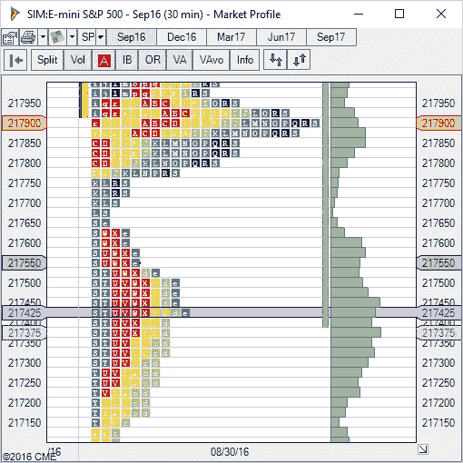
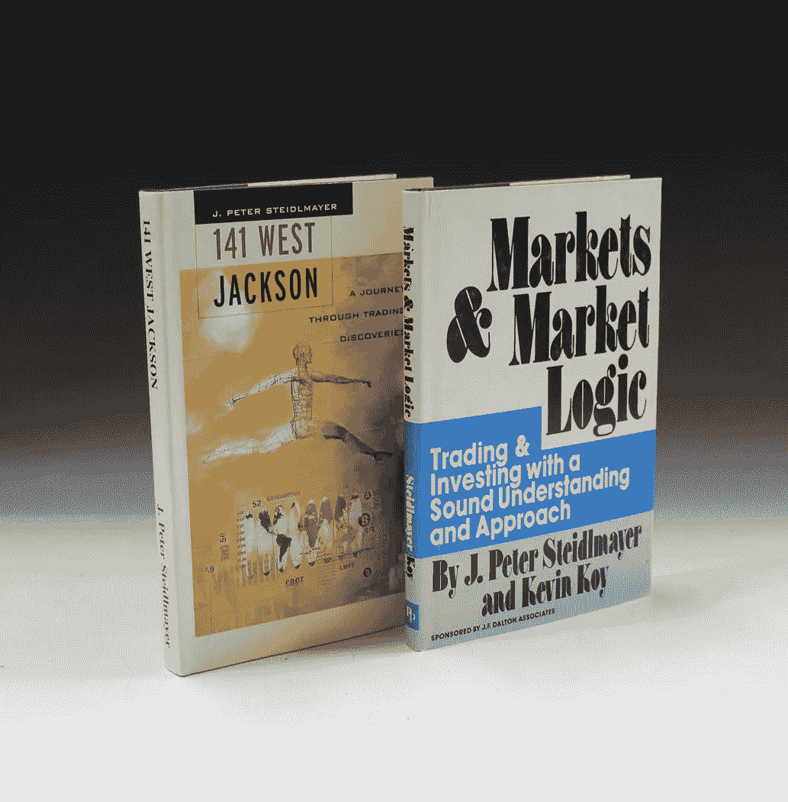
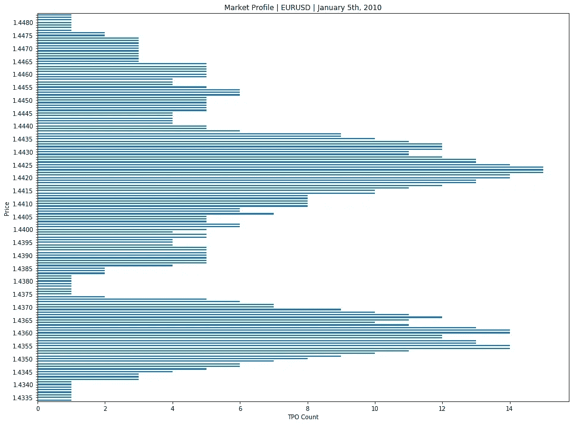

# 市场概况:金融市场的统计观点

> 原文：<https://towardsdatascience.com/market-profile-a-statistical-view-on-financial-markets-6a00cd62410d?source=collection_archive---------5----------------------->

## 关于如何在 Matplotlib 中绘制市场轮廓的简单介绍和简短方法



Market profile is a technique used to contextualize current market conditions.

## 市场概况方法简介

市场分析是 J. Peter Steidlmayer 在 60 年代开发的一种技术。该方法代表给定市场在给定时期的统计分布。

Steidlmayer，一个富裕农民的儿子，在 60 年代成为 CBOT 的场内交易者，并最终在 80 年代初成为 CBOT 导演之一。他融合了最小相关价格变动、平衡和高斯分布的概念，定义了一种方法，可以跟踪特定市场在特定时间的变动情况。

市场概况理论在几本书中都有适当的介绍，在互联网上也有一些好的资料。这种方法在 80 年代末和 90 年代引起了极大的兴趣，Steidlmayer 是这种方法的主要推动者，他还在 80 年代初负责在 CBOT 提供第一批电子数据服务。虽然它不再是一种主流的分析技术，但它仍然拥有一批积极使用它的追随者。

市场概况使用时间和价格来定位交易时段的价值区域(即参与者认为给定资产/工具的公允价格所在的价格区域)。虽然它不是一种交易方法或系统，但它是一种分析给定市场当前状态的可靠方法，因为它有助于澄清市场是否正在盘整或形成趋势。

市场概况优于交易量概况的一个优点是不需要交易量数据。这对于不受监管的场外交易市场来说尤其有趣，在这种市场中，交易量信息要么不可用，要么没有意义。它还允许使用非昂贵的历史数据进行模拟。

由于市场概况使用 TPO(时间价格机会)的概念来反映感兴趣的领域，这些领域与高交易量领域高度相关。所以最后，这两种方法可以得到相似的结果，有时看到这两种情况如此相似真的令人吃惊。对此的解释是，在市场上以给定的价格移动大量货物需要时间，而这一时间转化为给定价格下的大量 TPO。这有效地有助于关联市场概况和数量概况。

尽管所有主要的交易软件都有一些插件，但市场概况在某种程度上是一个不同的野兽。在 20 世纪 90 年代的巅峰时期，市场概况通常是通过专业软件(如 Steildmayer 曾经发行的软件 Capital Flow)来开发的。这种软件包价格昂贵，因为它们是为基金和机构参与者设计的。

我一直对市场和销量非常感兴趣，在过去的几个月里，我一直在深入研究和研究这些领域。

这些分析技术帮助你确定主要参与者可能在哪里，他们的行动方向是什么。有人可能会说，市场剖析是另一个时代的技术；我们不能忘记，这是 60 年代为大宗商品场内交易构想的一种方法，一些帮助市场概况发光的配套信息(如 CBOT 的流动性数据库)不再可用，但我认为支持该方法的基本统计概念仍然适用。

在我看来，平衡/不平衡和高斯分布概念的使用使该方法强大并得到科学支持，因为这些概念有助于处理无法以确定性方式描述的复杂自然过程——股票市场很适合这一类别。这是个人观点，我可能有偏见，因为我的市场策略是尽可能利用统计数据。

我对市场概况的兴趣特别集中在日内交易上。我特别使用 30 分钟蜡烛线，这是为市场概况定义的原始时间框架。30 分钟是一个没有被广泛使用的时间框架，但它有一个很大的优势，足够大以避免小时间框架的玩家(特别是 HFT)，并且足够小以获得足够的日内交易。在不久的将来，我想将市场概况的概念扩展到更大的时间范围，就像 90 年代基金使用的所有主要软件一样。超越 30 分钟时间框架的优点是可以检测到有效周期——不容易但可行——通过这样做，可以预测更大的市场波动。因此，可以计划回转操作。关于如何实现这一点的一些信息包含在下一部分的书籍中。

## 掌握市场概况

市场概况是一个复杂的方法，需要专注和经验来掌握。对于那些有兴趣了解更多的人，我会指出我所找到的关于这个主题的最相关的书籍。



141 West Jackson and Markets & Market Logic are the classic books writen by Steidlmayer about Market Profile

关于市场概况的经典书籍有“ *141 West Jackson* ”(对于那些好奇的人，那是 CBOT 在芝加哥的地址)和“ *Markets & Market Logic* ”。

一个更现代的重温将是 J. Peter Steidlmayer 和 Steven B. Hawkins 的《 *Steidlmayer 谈市场:用市场概况进行交易》。*

这三本书都很好地介绍了市场概况。“141 West Jackson ”特别令人愉快，而“Steidlmayer on Markets:Trading with Market Profile”可能是最实用的一个。

作为建设性的批评，我要指出，在某些方面，一些摘录可能过于关注专有软件的功能，而没有对这些功能如何工作进行适当的解释，这可能会给人一种被促销营销所针对的感觉。除此之外，书籍值得任何对该主题感兴趣的人阅读，因为它们是由该方法的关键利益相关者编写的。

## Matplotlib 和 Python 中的市场概况

作为一个关于市场概况的实践示例，我使用 Matplotlib 在 Python 中包含了一个获取市场概况分布及其绘图的例程。

假设您在 Python 中有以下市场概况数据:

```
day_market_profile = [
  (Decimal(1.4334), 1, 'n'),
  (Decimal(1.4335), 1, 'n'),  
  (Decimal(1.4336), 1, 'n'),
   ...
  (Decimal(1.4360), 14, 'bcdijklmpqrsuv'),
   ...
  (Decimal(1.4482), 1, 'E'),  
  (Decimal(1.4483), 1, 'E'),
]
```

该数据是在定制的 market_profile 例程中获得的，该例程使用 30 分钟 TPOs 生成每日市场概况。

```
day = datetime(2010,1,5)
day_market_profile = market_profile(day, Decimal('0.0001'))
for i in day_market_profile:
    print(str(i[0]) + ' | ' + str(i[1]).rjust(2,' ') + ' | '  + i[2])
```

打印元组列表会导致:

```
1.4334 |  1 | n
1.4335 |  1 | n
1.4336 |  1 | n
1.4337 |  1 | n
1.4338 |  1 | n
1.4339 |  1 | n
1.4340 |  1 | n
1.4341 |  1 | n
1.4342 |  3 | noq
1.4343 |  3 | noq
1.4344 |  3 | noq
1.4345 |  4 | noqr
1.4346 |  5 | bnoqr
1.4347 |  6 | bmnoqr
1.4348 |  6 | bmnoqr
1.4349 |  7 | bcmnoqr
1.4350 |  8 | bckmnoqr
1.4351 |  9 | bckmnoqrs
1.4352 | 10 | bckmnoqrst
1.4353 | 11 | bckmnopqrst
1.4354 | 14 | bcklmnopqrstuv
1.4355 | 14 | bcklmnopqrstuv
1.4356 | 13 | bcklmopqrstuv
1.4357 | 13 | bcklmopqrstuv
1.4358 | 12 | bcklmopqrsuv
1.4359 | 12 | bcdklmpqrsuv
1.4360 | 14 | bcdijklmpqrsuv
1.4361 | 14 | bcdijklmpqrsuv
1.4362 | 13 | bcdijklmpqrsu
1.4363 | 11 | bdhijklmpqs
1.4364 | 10 | bdhijklmpq
1.4365 | 11 | bdfhijklmpq
1.4366 | 12 | bdfghijklmpq
1.4367 | 11 | bdefghjklpq
1.4368 | 10 | bdefghklpq
1.4369 |  9 | bdefghklq
1.4370 |  7 | befghkl
1.4371 |  7 | abefghk
1.4372 |  6 | abefgh
1.4373 |  5 | abegh
1.4374 |  2 | ab
1.4375 |  1 | a
1.4376 |  1 | a
1.4377 |  1 | a
1.4378 |  1 | a
1.4379 |  1 | a
1.4380 |  1 | a
1.4381 |  1 | a
1.4382 |  1 | a
1.4383 |  2 | Ya
1.4384 |  2 | Ya
1.4385 |  2 | Ya
1.4386 |  4 | XYZa
1.4387 |  5 | TXYZa
1.4388 |  5 | TXYZa
1.4389 |  5 | TXYZa
1.4390 |  5 | TXYZa
1.4391 |  5 | TXYZa
1.4392 |  5 | TXYZa
1.4393 |  5 | TXYZa
1.4394 |  4 | TXYZ
1.4395 |  4 | TXYZ
1.4396 |  4 | TXYZ
1.4397 |  5 | TWXYZ
1.4398 |  5 | TWXYZ
1.4399 |  4 | TWXY
1.4400 |  5 | MTWXY
1.4401 |  6 | MTUWXY
1.4402 |  6 | MTUWXY
1.4403 |  5 | MTUWY
1.4404 |  5 | MTUWY
1.4405 |  5 | MTUWY
1.4406 |  7 | HMSTUWY
1.4407 |  6 | HMSTUW
1.4408 |  6 | HMSTUW
1.4409 |  8 | HMNSTUVW
1.4410 |  8 | HMNSTUVW
1.4411 |  8 | HMNSTUVW
1.4412 |  8 | HMNSTUVW
1.4413 |  8 | HMNSTUVW
1.4414 | 10 | HILMNSTUVW
1.4415 | 10 | HILMNSTUVW
1.4416 | 11 | AHILMNSTUVW
1.4417 | 12 | AHILMNOSTUVW
1.4418 | 13 | AHIJLMNOSTUVW
1.4419 | 13 | AHIJLMNOSTUVW
1.4420 | 14 | AHIJKLNORSTUVW
1.4421 | 14 | AHIJKLNORSTUVW
1.4422 | 15 | AGHIJKLNORSTUVW
1.4423 | 15 | AGHIJKLNORSTUVW
1.4424 | 15 | ABGHIJKLNORSUVW
1.4425 | 14 | ABGHIJKLNORSUV
1.4426 | 13 | ABGHIJKLORSUV
1.4427 | 13 | ABGHIJKLORSUV
1.4428 | 12 | ABGHIJKLORUV
1.4429 | 11 | BGIJKLOPRUV
1.4430 | 11 | BGIJKLOPRUV
1.4431 | 12 | BGIJKLOPQRUV
1.4432 | 12 | BGIJKLOPQRUV
1.4433 | 12 | BGIJKLOPQRUV
1.4434 | 11 | BGIJKLOPQRU
1.4435 | 10 | BGIJKLOPQR
1.4436 |  9 | BGIJKLPQR
1.4437 |  9 | BGIJKLPQR
1.4438 |  6 | BGIPQR
1.4439 |  5 | BGPQR
1.4440 |  5 | BGPQR
1.4441 |  4 | BGPQ
1.4442 |  4 | BGPQ
1.4443 |  4 | BGPQ
1.4444 |  4 | BGPQ
1.4445 |  4 | BGPQ
1.4446 |  5 | BCGPQ
1.4447 |  5 | BCFGP
1.4448 |  5 | BCFGP
1.4449 |  5 | BCFGP
1.4450 |  5 | BCFGP
1.4451 |  5 | BCFGP
1.4452 |  6 | BCDFGP
1.4453 |  6 | BCDFGP
1.4454 |  6 | BCDFGP
1.4455 |  5 | BCDFP
1.4456 |  4 | BCDF
1.4457 |  4 | BCDF
1.4458 |  4 | BCDF
1.4459 |  5 | BCDEF
1.4460 |  5 | BCDEF
1.4461 |  5 | BCDEF
1.4462 |  5 | BCDEF
1.4463 |  5 | BCDEF
1.4464 |  5 | BCDEF
1.4465 |  3 | BDE
1.4466 |  3 | BDE
1.4467 |  3 | BDE
1.4468 |  3 | BDE
1.4469 |  3 | BDE
1.4470 |  3 | BDE
1.4471 |  3 | BDE
1.4472 |  3 | BDE
1.4473 |  3 | BDE
1.4474 |  3 | BDE
1.4475 |  2 | DE
1.4476 |  2 | DE
1.4477 |  1 | E
1.4478 |  1 | E
1.4482 |  1 | E
1.4483 |  1 | E
```

这是一个老学校的茎和叶图，它是代表市场概况的规范方式。虽然这些信息是相关的，因为字母代码为您提供了关于“*何时何地价格为*”的直观指导，但您通常可能只对价格-时间分布感兴趣，这在没有字母代码的图表中很容易查看。如果你的简介涵盖 24 小时，这一点尤其正确，因为很难跟踪这么多的字母代码。在这种简化的情况下，更容易将数据绘制成常规图表，尽管您会丢失交易期间价格变化的信息:

```
%matplotlib inlinempl.rcParams['interactive'] = False
mpl.rcParams['figure.figsize'] = (16.0, 12.0)
mpl.rcParams['lines.markerfacecolor'] = 'blue'# Define price labels, we print just values ending in 0.0005 or 0.0010 
df.loc[df['price'] % Decimal('0.0005') == 0, 'label'] = df['price']
df['label'].fillna('',inplace=True)
df['label']=df['label'].astype(str)df.plot.barh(x='label', y='tpo_count', legend=None)
plt.xlabel('TPO Count')
plt.ylabel('Price')
plt.title('Market Profile | EURUSD | January 5th, 2010')
plt.show()
```

注意我们是如何创建一个新的标签列来保存 y 轴刻度标签的。我们将只打印以 0.0005 和 0.0010 结尾的价格，因此我们使用*。loc* ，*。fillna* 并最终转换为 *str* 以使我们的熊猫系列被用作标签。



The graphical alternative removing the code letters enable a quick read on the areas of interest of the trading session. While the letter code is relevant information, if we want to detect areas of high activity in the session this chart is easier to read.

## 摘要

在文章中，我简要介绍了市场概况。我已经解释了为什么我认为市场概况在今天仍然有意义，以及我为什么这样想的一些理由。我还列举了三个主要的经典书籍，涵盖了理论和一小部分摘录代码如何绘制市场概况。没有给出获取市场概况的例程，因为它非常具体地说明了如何存储数据，但是在这个例子中，用 Python 编写的原型只用了 50 行代码。这只是一页代码。

## 取得联系

我对这个特定的领域非常感兴趣，所以如果你在这个行业工作，并且对市场概况感兴趣，请随时联系我。我很乐意探索任何与市场概况和数量概况相关的合作(以及服务/雇佣)。