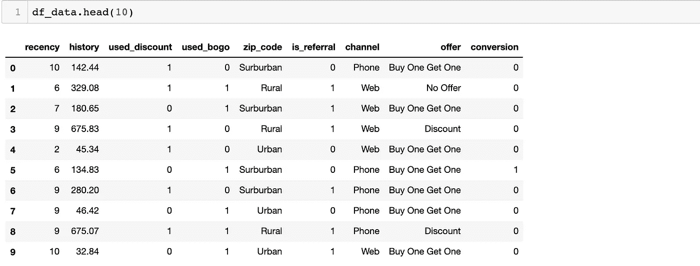

# 市场反应模型

> 原文：<https://towardsdatascience.com/market-response-models-baf9f9913298?source=collection_archive---------3----------------------->


## [使用 Python 实现数据驱动的增长](https://towardsdatascience.com/tagged/data-driven-growth)

## 预测促销活动的增量收益

这一系列文章旨在解释如何以一种简单的方式使用 Python，通过将预测方法应用于您的所有行动来推动您公司的发展。它将是编程、数据分析和机器学习的结合。

我将在以下九篇文章中讨论所有主题:

1- [了解你的衡量标准](/data-driven-growth-with-python-part-1-know-your-metrics-812781e66a5b)

2- [客户细分](/data-driven-growth-with-python-part-2-customer-segmentation-5c019d150444)

3- [客户终身价值预测](/data-driven-growth-with-python-part-3-customer-lifetime-value-prediction-6017802f2e0f)

4- [流失预测](/churn-prediction-3a4a36c2129a)

[5-预测下一个购买日](/predicting-next-purchase-day-15fae5548027)

[6-预测销售额](/predicting-sales-611cb5a252de)

**7-市场反应模型**

[8-隆起建模](/uplift-modeling-e38f96b1ef60)

[9- A/B 测试设计和执行](/a-b-testing-design-execution-6cf9e27c6559)

文章将有自己的代码片段，使您可以轻松地应用它们。如果你是编程的超级新手，你可以在这里很好地介绍一下 [Python](https://www.kaggle.com/learn/python) 和 [Pandas](https://www.kaggle.com/learn/pandas) (一个我们将在任何事情上使用的著名库)。但是仍然没有编码介绍，您可以学习概念，如何使用您的数据并开始从中产生价值:

> 有时候你必须先跑，然后才能走——托尼·斯塔克

作为先决条件，确保你的电脑上安装了 J [upyter Notebook](https://jupyter.readthedocs.io/en/latest/install.html) 和 P [ython](https://www.python.org/downloads/) 。代码片段只能在 Jupyter 笔记本上运行。

好吧，我们开始吧。

# 第 7 部分:市场反应模型

通过使用我们在以前的文章中建立的模型，我们可以轻松地[细分客户](/data-driven-growth-with-python-part-2-customer-segmentation-5c019d150444)和[预测他们的终身价值](/data-driven-growth-with-python-part-3-customer-lifetime-value-prediction-6017802f2e0f) (LTV)以达到目标。顺便提一下，我们也知道[我们的销售数字](/predicting-sales-611cb5a252de)会是多少。但是我们怎样才能增加销售额呢？如果我们今天打折，预计会有多少增量交易？

细分客户和进行 A/B 测试使我们能够尝试许多不同的想法来增加销售额。这是增长黑客技术的基石之一。你需要不断地思考和实验来寻找成长的机会。

将我们要向其发送产品的客户分为测试组和对照组，有助于我们计算增量收益。

让我们看看下面的例子:


在此设置中，目标群体被分为三组，以寻找以下问题的答案:

1-提供报价会增加转化率吗？

2-如果是，什么样的报价表现最好？打折还是买一送一？

假设结果具有统计学意义，折扣(A 组)看起来最好，因为它比对照组增加了 3%的转化率，比买一送一多带来了 1%的转化率。

当然，在现实世界中，事情要复杂得多。一些优惠在特定的细分市场表现更好。因此，您需要为选定的细分市场创建一个产品组合。而且，不能指望转化是成功的唯一标准。总会有成本的权衡。一般来说，当转换率上升时，成本也会增加。这就是为什么有时你需要选择一个成本友好但转化较少的报价。

现在，通过实验，我们知道了哪个报价比其他报价表现得更好。但是预测呢？如果我们预测给出一个报价的效果，我们可以很容易地最大化我们的交易，并对成本有一个预测。市场反应模型帮助我们建立这个框架。但是做这件事的方法不止一种。我们可以把它们分成两类:

1-如果你没有一个控制组(想象你对每个人做了一次公开推广，并在社交媒体上公布)，那么你就无法计算增量。对于这种情况，最好建立一个预测整体销售的回归模型。之前的假设是，该模型将为促销日提供更高的销售数字。

为了建立这种模型，您的数据集应该包括促销和非促销日销售数字，以便机器学习模型可以计算增量。

2-如果您有一个控制组，您可以基于细分或个人级别建立响应模型。对他们两人来说，假设是一样的。给出要约应该会增加转化的概率。个人转化概率的上升会给我们带来增量转化。

让我们开始编码，看看我们如何建立一个个体水平的反应模型。在本例中，我们将在这里使用营销数据集[和](https://blog.minethatdata.com/2008/03/minethatdata-e-mail-analytics-and-data.html)。但是我做了一些修改，使它与我们的案例更相关(你可以在这里找到[](https://gist.github.com/karamanbk/ef1a118592e2f7954e5bb582e09bdde3)****)。**)**

**让我们导入我们需要的库并导入我们的数据:**

**我们数据的前 10 行:**

****

**我们的前 8 列提供个人级别的数据，转换列**是我们预测的标签:****

*   **最近:自上次购买以来的月数**
*   **历史:历史采购的价值**
*   **used_discount/used_bogo:指示客户是否使用了折扣或先买一送一**
*   **zip_code:邮政编码的分类，如郊区/城市/农村**
*   **is_referral:指示客户是否是从推荐渠道获得的**
*   **渠道:客户使用的渠道，电话/网络/多渠道**
*   **报价:发送给客户的报价，折扣/买一送一/无报价**

**我们将建立一个二元分类模型，对所有客户的转换概率进行评分。为此，我们将遵循以下步骤:**

*   **构建提升公式**
*   **探索性数据分析(EDA)和特征工程**
*   **对转换概率进行评分**
*   **观察测试集上的结果**

## ****隆起公式****

**首先，我们需要构建一个函数来计算我们的提升。为了简单起见，我们假设每次转换意味着 1 个订单，平均订单价值为 25 美元。**

**我们将计算三种类型的抬升:**

> **转化率提升:试验组转化率-对照组转化率**
> 
> **订单提升:转换提升* #测试组中已转换的客户**
> 
> **收入增加:订单增加*平均订单金额**

**让我们构建我们的**calc _ upgrade**函数:**

```
def calc_uplift(df):
    #assigning 25$ to the average order value
    avg_order_value = 25

    #calculate conversions for each offer type
    base_conv = df[df.offer == 'No Offer']['conversion'].mean()
    disc_conv = df[df.offer == 'Discount']['conversion'].mean()
    bogo_conv = df[df.offer == 'Buy One Get One']['conversion'].mean()

    #calculate conversion uplift for discount and bogo
    disc_conv_uplift = disc_conv - base_conv
    bogo_conv_uplift = bogo_conv - base_conv

    #calculate order uplift
    disc_order_uplift = disc_conv_uplift * len(df[df.offer == 'Discount']['conversion'])
    bogo_order_uplift = bogo_conv_uplift * len(df[df.offer == 'Buy One Get One']['conversion'])

    #calculate revenue uplift
    disc_rev_uplift = disc_order_uplift * avg_order_value
    bogo_rev_uplift = bogo_order_uplift * avg_order_value

    print('Discount Conversion Uplift: {0}%'.format(np.round(disc_conv_uplift*100,2)))
    print('Discount Order Uplift: {0}'.format(np.round(disc_order_uplift,2)))
    print('Discount Revenue Uplift: ${0}\n'.format(np.round(disc_rev_uplift,2)))

    print('-------------- \n')print('BOGO Conversion Uplift: {0}%'.format(np.round(bogo_conv_uplift*100,2)))
    print('BOGO Order Uplift: {0}'.format(np.round(bogo_order_uplift,2)))
    print('BOGO Revenue Uplift: ${0}'.format(np.round(bogo_rev_uplift,2)))
```

**如果我们将这个函数应用到我们的数据帧，我们将看到下面的结果:**

****

**如果我们想获得更多的转化率，折扣似乎是一个更好的选择。与没有收到任何优惠的客户相比，这带来了 7.6%的增长。BOGO(买一送一)也上涨了 4.5%。**

**让我们开始探索哪些因素是这种增量变化的驱动因素。**

## **EDA 和特征工程**

**我们逐一检查每个特性，找出它们对转化率的影响**

****1-新近度****

**理想情况下，转换率应该下降，而新近度上升，因为不活跃的客户不太可能再次购买:**

```
df_plot = df_data.groupby('recency').conversion.mean().reset_index()
plot_data = [
    go.Bar(
        x=df_plot['recency'],
        y=df_plot['conversion'],
    )
]plot_layout = go.Layout(
        xaxis={"type": "category"},
        title='Recency vs Conversion',
        plot_bgcolor  = 'rgb(243,243,243)',
        paper_bgcolor  = 'rgb(243,243,243)',
    )
fig = go.Figure(data=plot_data, layout=plot_layout)
pyoff.iplot(fig)
```

****

**直到最近 11 个月，一切都如预期的那样。然后就增加了。这可能是由于许多原因，如在这些桶中的客户数量较少或给定优惠的影响。**

****2-历史记录****

**我们将创建一个历史集群并观察其影响。让我们应用 k 均值聚类来定义历史上的重要群体:**

```
kmeans = KMeans(n_clusters=5)
kmeans.fit(df_data[['history']])
df_data['history_cluster'] = kmeans.predict(df_data[['history']])#order the cluster numbers 
df_data = order_cluster('history_cluster', 'history',df_data,True)#print how the clusters look like
df_data.groupby('history_cluster').agg({'history':['mean','min','max'], 'conversion':['count', 'mean']})#plot the conversion by each cluster
df_plot = df_data.groupby('history_cluster').conversion.mean().reset_index()
plot_data = [
    go.Bar(
        x=df_plot['history_cluster'],
        y=df_plot['conversion'],
    )
]plot_layout = go.Layout(
        xaxis={"type": "category"},
        title='History vs Conversion',
        plot_bgcolor  = 'rgb(243,243,243)',
        paper_bgcolor  = 'rgb(243,243,243)',
    )
fig = go.Figure(data=plot_data, layout=plot_layout)
pyoff.iplot(fig)
```

**聚类和图与转换的概述:**

********

**历史价值较高的客户更有可能转化。**

****3-二手折扣& BOGO****

**我们将结合下面的代码行来检查这两个特性:**

```
df_data.groupby(['used_discount','used_bogo','offer']).agg({'conversion':'mean'})
```

**输出:**

****

**之前使用过这两种产品的客户拥有最高的转化率。**

****4-邮政编码****

**与其他地区相比，农村地区的转化率更高:**

```
df_plot = df_data.groupby('zip_code').conversion.mean().reset_index()
plot_data = [
    go.Bar(
        x=df_plot['zip_code'],
        y=df_plot['conversion'],
        marker=dict(
        color=['green', 'blue', 'orange'])
    )
]plot_layout = go.Layout(
        xaxis={"type": "category"},
        title='Zip Code vs Conversion',
        plot_bgcolor  = 'rgb(243,243,243)',
        paper_bgcolor  = 'rgb(243,243,243)',
    )
fig = go.Figure(data=plot_data, layout=plot_layout)
pyoff.iplot(fig)
```

****

****5-转介****

**如下所示，来自推荐渠道的客户转化率较低:**

****

**它们显示出几乎少了 5%的转化率。**

****6 通道****

****

**正如我们预期的那样，多通道显示了更高的转化率。使用多个渠道是高参与度的标志。**

****7-报价类型****

****

**获得折扣优惠的客户显示出约 18%的转化率，而 BOGO 的转化率为约 15%。如果客户没有得到优惠，他们的转化率下降约 4%。**

**这些数据的特征工程将非常简单。我们将应用**。get_dummies()** 将分类列转换为数字列:**

```
df_model = df_data.copy()
df_model = pd.get_dummies(df_model)
```

**是时候建立我们的机器学习模型来评估转换概率了。**

## **评分转换概率**

**为了构建我们的模型，我们需要遵循我们在文章前面提到的步骤。**

**让我们从分割特征和标签开始:**

```
#create feature set and labels
X = df_model.drop(['conversion'],axis=1)
y = df_model.conversion
```

**创建训练集和测试集:**

```
X_train, X_test, y_train, y_test = train_test_split(X, y, test_size=0.2, random_state=56)
```

**我们将拟合模型并得到转换概率。**我们模型的 predit_proba()** 函数为每一行分配概率:**

```
xgb_model = xgb.XGBClassifier().fit(X_train, y_train)
X_test['proba'] = xgb_model.predict_proba(X_test)[:,1]
```

**让我们看看概率栏是什么样子的:**

****

**从上面可以看出，我们的模型为每个客户分配了转换概率(从 0 到 1)。**

**最后，我们需要了解我们的模型是否运行良好。**

## **测试集的结果**

**现在我们假设，折现概率、bogo 和控制组的差异应该类似于它们之间的转换差异。**

**我们需要使用我们的测试集来找出答案。**

**让我们计算折扣的预测和实际订单增长:**

```
real_disc_uptick = len(X_test)*(X_test[X_test['offer_Discount'] == 1].conversion.mean() - X_test[X_test['offer_No Offer'] == 1].conversion.mean())pred_disc_uptick = len(X_test)*(X_test[X_test['offer_Discount'] == 1].proba.mean() - X_test[X_test['offer_No Offer'] == 1].proba.mean())
```

**对于实际上涨计算，我们使用了**转换**列。对于预测的那个，我们换成了 **proba** 。**

****

**结果相当不错。真正的订单上升是 **966** ，模型预测为 **948** (1.8%误差)**。****

**收入上涨预测对比: **24150** vs **23700。****

**我们需要检查结果是否对 BOGO 有利:**

```
real_bogo_uptick = len(X_test)*(X_test[X_test['offer_Buy One Get One'] == 1].conversion.mean() - X_test[X_test['offer_No Offer'] == 1].conversion.mean())pred_bogo_uptick = len(X_test)*(X_test[X_test['offer_Buy One Get One'] == 1].proba.mean() - X_test[X_test['offer_No Offer'] == 1].proba.mean())
```

****

**BOGO 有希望的结果:**

**订单上升-实际与预测: **563** 与 **595****

**收入增长—实际与预测: **14075** 对 **14875****

**误差率在 5.6%左右。该模型可以受益于提高对 BOGO 要约类型的预测分数。**

**计算转换概率在不同领域对我们也有很大帮助。我们已经预测了不同类型优惠的回报，但它也可以帮助我们找到最大限度提升的目标客户。在下一篇文章中，我们将构建自己的[提升模型](/uplift-modeling-e38f96b1ef60)。**

**你可以在这里找到这篇文章的 Jupyter 笔记本。**

**需要帮助来发展你的公司吗？点击此处与我预约免费课程[。](https://app.growthmentor.com/mentors/baris-karaman)**