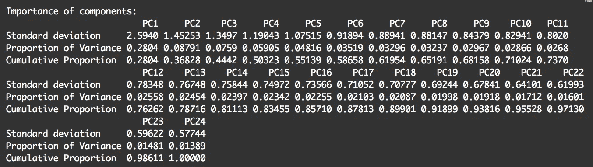

# R (PCA & K-means 聚类)市场细分—第 1 部分

> 原文：<https://towardsdatascience.com/market-segmentation-with-r-pca-k-means-clustering-part-1-d2c338b1dd0b?source=collection_archive---------2----------------------->

## 已经存在了几十年的市场研究方法的数据科学方法

## 什么是市场细分？

对于那些营销领域的新手，这里有一个方便的维基百科式的解释:市场细分是营销中使用的一个过程，根据客户的特征(人口统计、购物行为、偏好等)将客户分为不同的群体(也称为细分)。)同一细分市场的顾客往往对营销策略的反应相似。因此，细分过程可以帮助公司了解其客户群体，锁定正确的群体，并为不同的目标群体量身定制有效的营销策略。

## 个案研究

本文将通过使用 r 的样本调查数据集演示数据科学方法进行市场细分的过程。在本例中，便携式手机充电器制造商 ABC company 希望了解其细分市场，因此它通过调查研究从便携式充电器用户那里收集数据。调查问题包括四种类型:1)态度 2)人口统计 3)购买过程和使用行为 4)品牌认知。在这种情况下，我们将只使用态度数据进行细分。在现实中，决策者选择不同类型的输入变量(人口统计、地理、行为等。)基于它们的个别情况进行分段。尽管如此，无论您选择哪种输入，想法都是一样的！

(注:Thomas W. Miller 在他的书*营销数据科学:用 R 和 Python 进行预测分析的建模技术中提出了一个关于使用销售交易数据作为细分输入的很好的观点。*简而言之，他警告不要用销售交易数据进行细分，因为销售信息只对当前客户可用。当你有一个新客户时，如果没有他/她的销售数据，你很难利用你获得的洞察力。)

在我们深入研究方法和模型之前，请记住，作为一名负责任的数据分析师，首先要了解您的数据！

## 检查数据

```
# Importing and checking Dataraw <- read.csv(“Chargers.csv”)
str(raw)
head(raw)
```


Data Structure


A snippet of the data

我们数据中的每一行代表一个回答者，每一列代表他/她对相应调查问题的回答。共有 2500 名受访者和 24 个态度问题。所有这些都是评级问题，询问受访者对某一陈述的看法。答案在 1-5 的范围内。这里有一个例子:

> 请指出您对以下陈述的同意或不同意程度(1 =完全不同意，5 =完全同意)。
> 
> 在购买便携式手机充电器时，我最看重款式。
> 
> …

理解了问题的本质，我们接下来可以验证数据集中的数据。编写一个简单的函数有时会有用:

```
# Verifying Data describe(raw)
colSums(is.na(raw)) #Checking NAs 
table(unlist(raw[,]) %in% 1:5) #Simple Test
```

R 中的 [validate](https://cran.r-project.org/web/packages/validate/vignettes/introduction.html) 包也是一个方便的数据验证工具。它允许您根据自己创建的一组规则来测试数据。然而，我发现在处理大型数据集时，它并不是最方便的。我仍在寻找有效验证数据质量的替代方法(最好是系统)。我将非常感谢任何建议。

现在我们已经验证了我们的数据，我们对它们有信心，让我们继续更有趣的东西！

## 主成分分析

“维度缩减”这个术语曾经让我感到恐惧。然而，它并不像听起来那么复杂:它只是从无数数据中提取本质的过程，因此新的、更小的数据集可以表示原始数据的独特特征，而不会丢失太多有用的信息。可以把它想象成毕加索的立体主义绘画，他用几条线和几个形状优雅地抓住了一个物体的本质，忽略了许多细节。对我来说，我总是喜欢想起他的*吉他。*如果你有其他的作品，请评论！！


Guitar 1914 by Pablo Picasso

PCA 是一种降维形式。StatQuest 的这个[视频](https://www.youtube.com/watch?v=_UVHneBUBW0)(大声说出我最喜欢的统计/数据科学视频频道)非常直观地解释了这个概念。如果这是你第一次听说 PCA，我强烈建议你观看这个视频。简而言之，PCA 允许您获取具有大量维度的数据集，并将其压缩为具有较少维度的数据集，这仍然可以捕获原始数据中的大多数差异。

你会问，为什么 PCA 有助于将客户分成不同的群体？假设您需要根据客户对这些调查问题的回答来区分他们。您遇到的第一个问题是如何根据它们对 24 个变量的输入来区分它们。当然，你可以试着想出几个主要的主题来总结这些问题，并为每个主题给每个回答者分配一个“分数”，然后根据分数将他们分组。但是你怎么能确定你提出的主题在划分人方面是真正有效的呢？你如何决定每个问题的权重？再者，如果你有 5000 个变量而不是 24 个，你会怎么做？人脑根本无法在短时间内处理这么多信息。至少我的大脑肯定不能。


Photo by ME.ME on Facebook

这就是 PCA 可以介入并为您完成任务的地方。对我们的数据执行 PCA，R 可以将相关的 24 个变量转换成更少的不相关变量，称为主成分。有了更小的压缩变量集，我们可以轻松地执行进一步的计算，并且可以研究数据中一些最初难以发现的隐藏模式。

当有大量的文献/视频/文章提供了关于五氯苯甲醚的详尽解释时，我希望为那些认为这些材料过于专业的人提供一些关于五氯苯甲醚的高层次观点:

*   可变性使数据变得有用。想象一个有 10，000 个统一值的数据集。它没有告诉你太多，而且很无聊。😑
*   同样，主成分分析的功能是创建一个更小的变量子集(主成分)，以捕捉原始的、大得多的数据集中的可变性。
*   每个主成分是初始变量的线性组合。
*   每个主成分彼此具有正交关系。这意味着它们不相关。
*   第一个主成分(PC1)捕获数据中最大的可变性**。第二主成分(PC2)抓住了第二多的**。第三主成分(PC3)抓住了**第三最**……等等****

**此外，如果您计划为您的项目运行 PCA，您应该知道以下几个术语:**

*   ****加载**描述了原**变量**和新主成分之间的关系。具体来说，它描述了在计算新的主成分时赋予原始变量的**权重**。**
*   ****分数**描述了原始**数据**和新生成的轴之间的关系。换句话说，score 是主成分空间中数据行的新值。**
*   ****方差比例**表示每个主成分占总数据可变性的份额。它通常与**累积比例**一起使用，以评估主成分的有用性。**
*   ****累计比例**代表**累计**由**连续**主成分解释的方差比例。所有主成分解释的累积比例等于 1(解释了 100%的数据可变性)。**

## **在 R 中运行 PCA**

**在运行 PCA 之前，您应该查看一下您的数据相关性。如果您的数据不是高度相关的，您可能根本不需要 PCA！**

```
# Creating a correlation plot library(ggpcorrplot)
cormat <- round(cor(raw), 2)
ggcorrplot(cormat, hc.order = TRUE, type = “lower”, outline.color = “white”)
```

****

**Correlation Plot**

**如图所示，我们的变量非常相关。我们可以愉快地前往✌.的 PCA️**

```
# PCA
pr_out <-prcomp(raw, center = TRUE, scale = TRUE) #Scaling data before PCA is usually advisable! 
summary(pr_out)
```

****

**PCA Summary**

**有 24 个新的主成分，因为我们首先有 24 个变量。第一个主成分占数据方差的 28%。第二主成分占 8.8%。第三种占 7.6%…我们可以用一个 scree 图来形象化这一点:**

```
# Screeplot
pr_var <-  pr_out$sdev ^ 2
pve <- pr_var / sum(pr_var)
plot(pve, xlab = "Principal Component", ylab = "Proportion of Variance Explained", ylim = c(0,1), type = 'b')
```

****

**Scree plot**

**x 轴描述主成分的数量，y 轴描述每个主成分解释的方差(PVE)的比例。解释的方差在 PC2 后急剧下降。这个点通常被称为拐点，表示应该用于分析的 PC 数量。**

```
# Cumulative PVE plot
plot(cumsum(pve), xlab = "Principal Component", ylab = "Cumulative Proportion of Variance Explained", ylim =c(0,1), type = 'b')
```

****

**Cumulative Proportion of Variance**

**如果我们只选择 2 个主成分，它们将产生不到 40%的数据总方差。这个数字也许不够。**

**选择 PC 数量的另一个规则是选择特征值大于 1 的 PC。这被称为凯泽规则，这是有争议的。你可以在网上找到很多关于这个话题的辩论。**

**基本上，没有单一的最佳方法来决定电脑的最佳数量。人们出于不同的目的使用 PCA，在做出决定之前，考虑您想从 PCA 分析中获得什么总是很重要的。在我们的案例中，由于我们使用 PCA 来确定**有意义且可行的市场细分**，我们应该明确考虑的一个标准是我们决定的电脑在现实世界和商业环境中是否有意义。**

## **解释结果**

**现在让我们挑选前 5 台电脑，因为 5 个组件并不太难处理，而且它遵循凯泽法则。**

**接下来，我们想让这些电脑有意义。还记得在计算新的主成分时，负荷描述了每个原始变量的权重吗？它们是帮助我们解释 PCA 结果的关键。当直接处理主成分分析负荷可能会很棘手和混乱时，我们可以轮换这些负荷以使解释更容易。**

**有多种旋转方法，我们将使用一种称为“varimax”的方法。(注意，这一步旋转不是 PCA 的一部分。它只是有助于解释我们的结果。[这里的](https://stats.stackexchange.com/questions/612/is-pca-followed-by-a-rotation-such-as-varimax-still-pca)是一个很好的话题。)**

```
# Rotate loadings
rot_loading <- varimax(pr_out$rotation[, 1:5])
rot_loading
```

****

**Varimax-rotated loadings up to Q12**

**这是截至 Q12 的 varimax 旋转负载的不完整部分。表中的数字对应于我们的问题(原始变量)和所选组件之间的关系。如果数字为正，则变量对分量的贡献为正。如果是负的，那么它们是负相关的。数字越大，关系越密切。**

**有了这些数据，我们可以参考我们的调查问卷，了解每台电脑的功能。例如，我们来看看 PC1。我注意到 Q10、Q3 和 Q7 对 PC1 有负面影响。另一方面，我发现 Q8 和 Q11 对 PC1 有积极的贡献。查看问卷，我意识到 Q10、Q3 和 Q7 是与充电器的**风格**相关的问题，而 Q8 & Q11 关注的是产品的**功能**。因此，我们可以暂时得出结论，PC1 描述了人们对产品功能的偏好。更看重功能的人可能不太在乎风格，这是有道理的。**

**然后，您可以转到 PC2，按照相同的步骤解释每台 PC。我不会在这里介绍完整的过程，我希望你已经明白了。一旦你检查了所有的个人电脑，感觉每一台都描述了独特的、逻辑上连贯的特征，并且你相信它们具有商业意义，你就可以进行下一步了。但是，如果您觉得 PCs 中缺少或重复了一些信息，您可以考虑返回并包含更多的 PCs，或者您可以删除一些。您可能需要经历几次迭代，直到获得满意的结果。**

## **我们完了！！**

**开玩笑的。但是你已经成功了一半。您已经完成了将大型数据集压缩为较小数据集的过程，其中包含一些变量，可以帮助您使用 PCA 识别不同的客户群。在下一篇文章中，我将介绍如何使用聚类方法，根据我们获得的 PC 对我们的客户进行细分。**

**最后，祝所有了不起的女超人#国际快乐👯👧 💁 👭！**

***感谢阅读！💚随时和我联系*[*Linkedin*](https://www.linkedin.com/in/rebeccayiu/)*！***